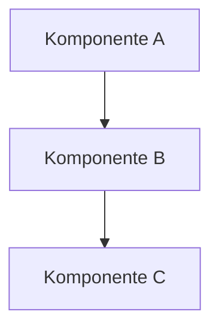

# Frontmatter-Referenz — hnsstrk.de Blog

Diese Datei definiert das Hugo-Frontmatter für Blog-Artikel auf hnsstrk.de.

## Standard-Frontmatter

```yaml
---
title: "Titel des Artikels"
date: YYYY-MM-DD
draft: true
description: "Kurzbeschreibung für SEO und Social Media (max. 160 Zeichen)"
tags: ["tag1", "tag2"]
featured_image: ""
---
```

## Erweitert (bei Longreads)

```yaml
---
title: "Titel des Artikels"
date: YYYY-MM-DD
draft: true
description: "Kurzbeschreibung für SEO und Social Media (max. 160 Zeichen)"
tags: ["tag1", "tag2"]
toc: true
---
```

## Feld-Referenz

| Feld | Pflicht | Beschreibung | Regeln |
|------|---------|-------------|--------|
| `title` | Ja | Artikeltitel | Deutsch, prägnant, kein Clickbait, in Anführungszeichen |
| `date` | Ja | Veröffentlichungsdatum | ISO-Format: `YYYY-MM-DD` |
| `draft` | Ja | Entwurfsstatus | Immer `true` bei Erstanlage, User setzt auf `false` |
| `description` | Ja | SEO-Beschreibung | Max. 160 Zeichen, aussagekräftig, in Anführungszeichen |
| `tags` | Ja | Taxonomie-Tags | Array, lowercase, Bindestriche für Mehrwort-Tags, 3–8 Stück |
| `toc` | Nein | Inhaltsverzeichnis | `true` bei Artikeln > 1.500 Wörter |
| `featured_image` | Nein | Dateiname des Cover-Bilds | Im gleichen Ordner wie index.md, WebP bevorzugt |

## Tag-Konventionen

- Lowercase: `hugo`, `rust`, `ollama`
- Bindestriche für Mehrwort: `static-site-generator`, `split-flap`
- Deutsch für nicht-technische Tags: `projekt`, `erfahrungsbericht`
- Englisch für technische Tags: `rust`, `svelte`, `ci-cd`
- Keine Einzahl/Mehrzahl-Mischung — konsistent Einzahl: `tag`, nicht `tags`
- Maximal 8 Tags pro Artikel

## Dateiname-Konventionen

- Englisch, lowercase, Bindestriche: `rss-reader-ai-pipeline`
- Keine Umlaute im Dateinamen
- Keine Sonderzeichen: nur `a-z`, `0-9`, `-`
- Beschreibend, aber kurz: 3–5 Wörter
- Pfad: `content/blog/<ordnername>/index.md`
- Ordnername: englisch, lowercase, Bindestriche
- Bilder: im gleichen Ordner, WebP bevorzugt

## Content-Marker

### Vorschau-Marker (<!--more-->)
```markdown
Einstiegsabsatz — 1-3 Sätze die als Vorschau auf der Blog-Übersicht erscheinen.

<!--more-->

## Erste Überschrift im Content
```

Pflicht bei allen Blog-Posts. Der Text VOR dem Marker wird als `.Summary` in der Blog-Karten-Vorschau angezeigt.
- 30-50 Wörter, vollständige Sätze
- Kein Shortcode, kein Heading, kein Code-Block vor dem Marker
- Die `description` im Frontmatter bleibt separat für SEO/Meta

## Hugo-Shortcodes und Features

### TL;DR-Shortcode
```markdown

Kernaussage in 2–4 Sätzen. Was ist das Thema, was ist das Ergebnis?

```
Pflicht bei Longreads > 2.000 Wörter. Kommt direkt nach dem Einstiegsabsatz.

### Callout-Shortcodes
```markdown

Ergänzende Information.



Wichtige Warnung oder Stolperstein.



Zeitsparender Hinweis oder Alternative.



Zusätzlicher Kontext.

```
Sparsam einsetzen: maximal 2–3 pro Artikel. Deutsche Titel verwenden.

### Mermaid-Diagramme
````markdown

````
Einsetzen bei: Pipeline-Beschreibungen, Architekturüberblicken, Workflow-Darstellungen.

### Syntax-Highlighting
````markdown
```bash
hugo server -D
```

```toml
[markup.highlight]
  noClasses = false
```

```rust
fn main() {
    println!("Hello");
}
```
````
Immer Sprachangabe verwenden. Unterstützte Sprachen: bash, toml, yaml, json, rust, go, python, javascript, typescript, html, css, sql, diff, markdown.

### Diff-Blöcke
````markdown
```diff
- old_value = "vorher"
+ new_value = "nachher"
```
````
Einsetzen bei: Konfigurationsänderungen, Vorher/Nachher-Vergleiche.

### Bilder mit Figcaption
```markdown

```
Standard-Markdown mit Title-Attribut — Hugo rendert automatisch `<figure>` mit `<figcaption>`.

### Externe Links
Externe Links öffnen automatisch in neuem Tab (durch Render-Hook im Theme konfiguriert). Keine zusätzlichen Attribute nötig:
```markdown
[Link-Text](https://example.com)
```
