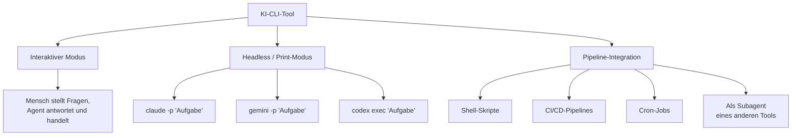
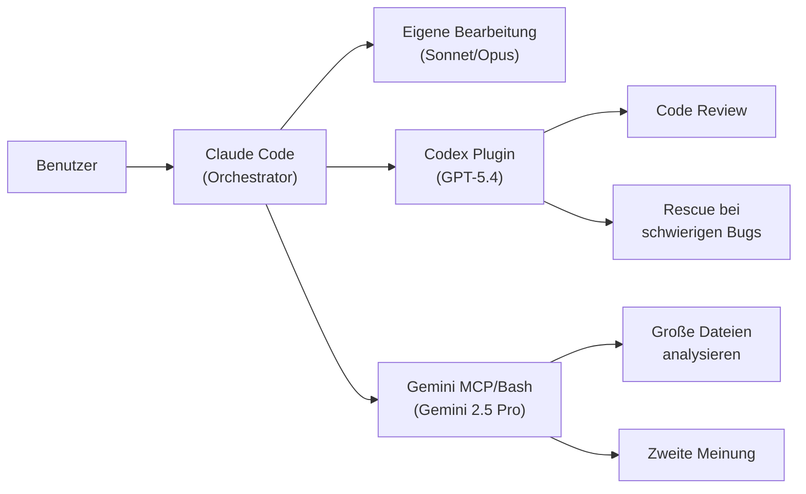
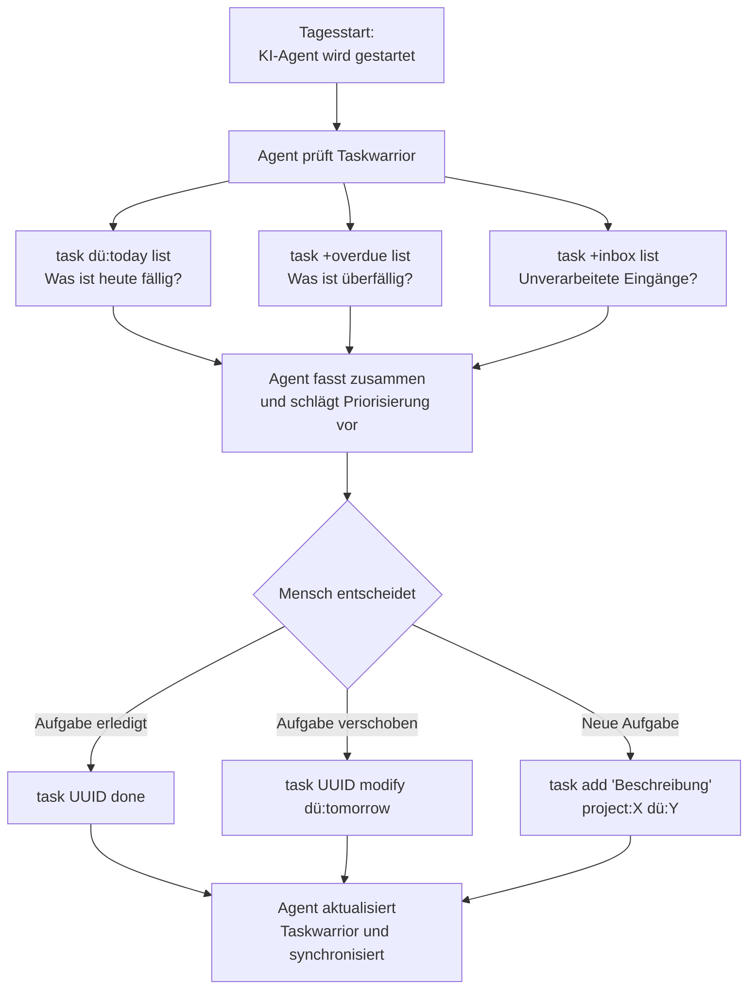
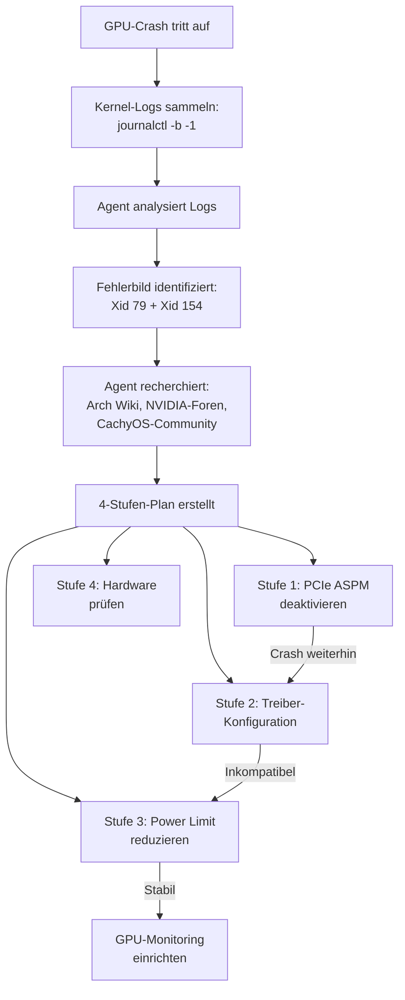

Wer Software entwickelt, Systeme administriert oder viel in der Kommandozeile arbeitet, kennt den üblichen Ablauf: Editor öffnen, Code schreiben, in den Browser wechseln, eine KI-Chat-Oberfläche befragen, zurück zum Editor, Antwort einarbeiten. Seit 2025 gibt es dafür eine deutlich direktere Alternative: KI-Assistenten, die direkt im Terminal laufen, Dateien lesen, Code schreiben, Befehle ausführen und den Arbeitsfluss nicht ständig unterbrechen.

Dieser Artikel stellt die drei derzeit wichtigsten Vertreter vor — Claude Code, Gemini CLI und Codex CLI — und zeigt Schritt für Schritt, was sie können, was sie kosten und für wen welches Tool sinnvoll ist.

<!--more-->

## Was sind KI-CLI-Tools und warum im Terminal?

Ein KI-CLI-Tool (CLI steht für "Command Line Interface", also Kommandozeile) ist ein Programm, das direkt im Terminal läuft und mit einem großen Sprachmodell (LLM) verbunden ist. Im Unterschied zu Chat-Oberflächen im Browser kann ein solches Tool auf das lokale Dateisystem zugreifen, Shell-Befehle ausführen und Änderungen an Dateien vornehmen — es arbeitet also dort, wo auch der Mensch arbeitet.

Der Vorteil gegenüber Browser-basierten KI-Chats:

- **Kein Kontextwechsel:** Wer im Terminal arbeitet, bleibt im Terminal. Kein Copy-Paste zwischen Browser und Editor.
- **Dateizugriff:** Das Tool kann Projektdateien direkt lesen und bearbeiten, statt dass man Code manuell in ein Chat-Fenster kopiert.
- **Befehlsausführung:** Tests laufen lassen, Build-Prozesse starten, Git-Operationen durchführen — alles aus derselben Sitzung.
- **Automatisierung:** Die Tools lassen sich in Shell-Skripte, CI/CD-Pipelines und andere automatisierte Abläufe einbinden.

Drei Anbieter haben sich in diesem Bereich etabliert: **Claude Code** (Anthropic), **Gemini CLI** (Google) und **Codex CLI** (OpenAI). Alle drei verfolgen denselben Grundgedanken, unterscheiden sich aber erheblich in Philosophie, Preismodell und Ökosystem.

## Installation und erste Schritte

### Claude Code

```bash
# Installation via npm
npm install -g @anthropic-ai/claude-code

# Erster Start — öffnet interaktive Sitzung
claude

# Einzelne Frage stellen
claude "Erkläre mir die Dateistruktur dieses Projekts"
```

Claude Code benötigt einen Anthropic-Account. Beim ersten Start erfolgt eine Authentifizierung über den Browser.

### Gemini CLI

```bash
# Installation via npm
npm install -g @google/gemini-cli

# Oder direkt über npx (ohne Installation)
npx @google/gemini-cli

# Erster Start
gemini

# Einzelne Frage stellen
gemini "Fasse diese Log-Datei zusammen"
```

Gemini CLI benötigt nur einen Google-Account. Die kostenlose Gemini Code Assist Lizenz wird automatisch aktiviert.

### Codex CLI

```bash
# Installation via npm
npm install -g @openai/codex

# Erster Start
codex

# Einzelne Aufgabe ausführen
codex "Schreibe Unit-Tests für die Datei utils.py"
```

Codex CLI ist Open Source (in Rust geschrieben) und benötigt einen OpenAI-Account. Seit Anfang 2026 ist auch die Anmeldung mit einem ChatGPT-Konto möglich, ohne manuell API-Schlüssel generieren zu müssen.

## Claude Code: Das konfigurierbare Ökosystem

### Modelle

Claude Code bietet Zugang zu drei Modellfamilien (Stand April 2026):

| Modell | Stärke | Kontextfenster | API-Preis (Input/Output) |
|--------|---------|----------------|--------------------------|
| **Opus 4.6** | Höchste Qualität, komplexe Aufgaben | 1M Tokens | $15 / $75 pro MTok |
| **Sonnet 4.6** | Bestes Preis-Leistungs-Verhältnis | 1M Tokens | $3 / $15 pro MTok |
| **Haiku 4.5** | Schnell, günstig, einfache Aufgaben | 200K Tokens | $1 / $5 pro MTok |

MTok steht für "Millionen Tokens" — ein Token entspricht ungefähr einem Wortfragment. Ein typischer Blog-Artikel verbraucht etwa 1.000-2.000 Tokens.

Sonnet 4.6 erreicht auf dem SWE-bench (einem Benchmark für Programmieraufgaben) 79,6 % — nur 1,2 Prozentpunkte hinter Opus 4.6 (80,8 %), bei einem Fünftel der Kosten. Für die meisten Aufgaben ist Sonnet daher die empfehlenswerte Wahl.

### Preismodell

Es gibt zwei Wege, Claude Code zu nutzen:

- **Pro-Abo ($20/Monat):** Zugang zu Sonnet und Haiku, moderates Nutzungslimit.
- **Max-Abo ($100 oder $200/Monat):** 5x bzw. 20x das Pro-Limit, Zugang zu Opus, Priorität bei hoher Auslastung.
- **API (Pay-as-you-go):** Abrechnung pro Token, volle Kontrolle über Kosten, aber kein fester Deckel.

Wer intensiv arbeitet, sollte den Verbrauch im Blick behalten. Eine längere Arbeitssitzung mit Opus kann schnell zweistellige Beträge kosten.

### Das Ökosystem: Skills, Hooks und MCP

Was Claude Code von den anderen Tools unterscheidet, ist das Erweiterungssystem. Drei Konzepte sind zentral:

**Skills** sind wiederverwendbare Aufgaben-Beschreibungen in Markdown-Dateien. Sie aktivieren sich automatisch, wenn bestimmte Schlüsselwörter in der Anfrage vorkommen. Ein Taskwarrior-Skill reagiert beispielsweise auf Wörter wie "Task", "Todo" oder "Deadline" und stellt Claude alle nötigen Informationen zur Verfügung, um korrekt mit der Aufgabenverwaltung zu arbeiten — welche Befehle es gibt, welche Konventionen gelten, welche Fehler zu vermeiden sind.

**Hooks** sind automatische Aktionen, die vor oder nach bestimmten Ereignissen ausgeführt werden. Ein Hook kann beispielsweise nach jedem Commit automatisch eine Aktion auslösen oder vor der Ausführung eines Befehls eine Sicherheitsprüfung durchführen.

**MCP-Server** (Model Context Protocol) sind standardisierte Schnittstellen zu externen Diensten. Über MCP kann Claude Code auf Kalender, E-Mail, Datenbanken oder beliebige andere APIs zugreifen — ohne dass dafür eigener Code geschrieben werden muss. Das Protokoll ist offen spezifiziert und wird auch von anderen Tools unterstützt.

### Subagenten und Agent Teams

Claude Code kann Aufgaben an spezialisierte Unteragenten delegieren. Bei komplexen Projekten lässt sich ein Team aus mehreren Agenten zusammenstellen, die parallel und unabhängig arbeiten: Einer analysiert die Codebasis, ein anderer schreibt Tests, ein dritter überprüft die Ergebnisse. Das setzt allerdings ein gewisses Maß an Konfigurationsbereitschaft voraus.

## Gemini CLI: Leistung ohne Einstiegskosten

### Modelle

Gemini CLI bietet Zugang zu mehreren Modellen:

| Modell | Einsatz | Kontextfenster |
|--------|---------|----------------|
| **Gemini 2.5 Flash** | Einfache Anfragen (automatisch gewählt) | 1M Tokens |
| **Gemini 2.5 Pro** | Komplexe Anfragen | 1M Tokens |
| **Gemini 3 Pro** | Neuestes Modell (optional aktivierbar) | 1M Tokens |

### Preismodell

Der größte Vorteil von Gemini CLI ist der kostenlose Zugang: Mit einem persönlichen Google-Account stehen 60 Anfragen pro Minute und 1.000 Anfragen pro Tag kostenfrei zur Verfügung. Wer darüber hinausgeht oder höhere Rate-Limits benötigt, kann auf kostenpflichtige API-Zugänge über Google Cloud umsteigen.

Für alle, die KI-CLI-Tools kennenlernen möchten, ohne sofort Geld auszugeben, ist das ein starkes Argument.

### Erweiterbarkeit

Gemini CLI unterstützt MCP-Server und bietet eingebaute Extensions. Das Ökosystem ist allerdings deutlich schlanker als bei Claude Code: Vergleichbare Skill- oder Hook-Mechanismen fehlen. Als Open-Source-Projekt (auf GitHub verfügbar) steht der Quellcode offen zur Einsicht, und die Community trägt aktiv zur Entwicklung bei.

Der Full-Auto-Modus wird mit `--yolo` aktiviert — eine Benennung, die zumindest für Klarheit sorgt, was dabei in Kauf genommen wird.

## Codex CLI: Transparenz und Sandbox-Sicherheit

### Modelle

| Modell | Einsatz | Besonderheit |
|--------|---------|--------------|
| **GPT-5.4** | Standard für die meisten Aufgaben | Empfohlenes Hauptmodell |
| **GPT-5.3-Codex-Spark** | Besonders schnelle Aufgaben | Nur für ChatGPT Pro Abonnenten |

### Preismodell

Codex CLI setzt einen OpenAI-Account voraus. Die Abrechnung erfolgt über die OpenAI-API (Pay-as-you-go) oder über ein ChatGPT-Abonnement.

### Der Sandbox-Ansatz

Was Codex CLI besonders auszeichnet, ist der sicherheitsorientierte Ansatz: Der Agent arbeitet standardmäßig in einer Sandbox — er kann im eigenen Verzeichnis lesen und schreiben, aber nicht beliebige Systembefehle ausführen. Das macht Codex besonders geeignet für Szenarien, in denen unsicherer oder fremder Code analysiert werden soll.

Der Sandbox-Schutz lässt sich schrittweise aufweichen: `--full-auto` gibt dem Agenten mehr Freiheiten, während `--sandbox danger-full-access` den Schutz vollständig aufhebt. Die Namen machen deutlich, was dabei in Kauf genommen wird.

### Open Source und Transparenz

Codex CLI ist vollständig Open Source und in Rust geschrieben. Wer grundsätzliche Bedenken gegenüber Closed-Source-KI-Tools hat, findet hier eine überprüfbare Alternative. Der Code ist auf GitHub einsehbar, und die Community kann Fehler melden und Verbesserungen beitragen.

## Nutzungsmodi: Interaktiv, Headless und in Pipelines

Alle drei Tools bieten mehr als nur den interaktiven Chat-Modus. Das folgende Diagramm zeigt die verschiedenen Einsatzmöglichkeiten:



### Interaktiver Modus

Der Standard: Man startet das Tool, stellt Fragen, bestätigt vorgeschlagene Änderungen und arbeitet im Dialog. Alle drei Tools bieten diesen Modus.

### Headless / Print-Modus

Für nicht-interaktive Nutzung — etwa in Skripten oder Automatisierungen:

```bash
# Claude Code: -p für Print-Modus
claude -p "Fasse die letzten 5 Git-Commits zusammen"

# Gemini CLI: -p für Prompt-Modus
gemini -p "Prüfe diese Datei auf Sicherheitslücken" < app.py

# Codex CLI: exec für Headless-Ausführung
codex exec "Erstelle eine Zusammenfassung der Änderungen"
```

Im Headless-Modus verarbeitet das Tool die Aufgabe, gibt das Ergebnis auf der Standardausgabe aus und beendet sich — ohne auf Benutzereingaben zu warten. Die Ausgabe lässt sich bei allen drei Tools als JSON formatieren, was die maschinelle Weiterverarbeitung erleichtert.

### Pipeline-Integration

Ein entscheidender Vorteil gegenüber Browser-basierten KI-Chats: Die Tools lassen sich in bestehende Arbeitsabläufe einbinden.

```bash
# Eingabe pipen: Log-Datei analysieren lassen
cat server.log | gemini -p "Was ist hier schiefgelaufen?"

# Ausgabe weiterverarbeiten
claude -p "Liste alle TODO-Kommentare in diesem Projekt" | grep "CRITICAL"

# In einem Git-Hook: Commit-Nachricht prüfen lassen
claude -p "Prüfe, ob diese Commit-Message den Conventional-Commits-Standard einhält: $(git log -1 --pretty=%B)"
```

### CI/CD-Integration

Alle drei Tools lassen sich in automatisierte Build- und Deployment-Pipelines einbinden:

```bash
# In einer GitHub Action: Automatisches Code Review
claude -p "Prüfe die Änderungen in diesem Pull Request auf Fehler" \
  --allowedTools "Bash(git diff)" "Read"

# Codex in einer Pipeline
CODEX_API_KEY=$SECRET codex exec "Analysiere den Code auf Sicherheitslücken"
```

## Integration: Tools kombinieren

Ein bemerkenswerter Trend: Die drei Tools lassen sich nicht nur einzeln nutzen, sondern miteinander kombinieren. Claude Code dient dabei häufig als Orchestrator, der die anderen Tools als spezialisierte Helfer einbindet.

### Codex als Plugin in Claude Code

OpenAI hat im März 2026 ein offizielles Plugin veröffentlicht, das Codex direkt in Claude Code integriert. Damit kann Claude Aufgaben an Codex delegieren — etwa für Code Reviews, Fehlersuche oder eine zweite Meinung von einem grundlegend anderen Modell.



Das Plugin stellt mehrere Befehle bereit: `/codex:review` für Code-Reviews, `/codex:rescue` für die Übergabe schwieriger Probleme an Codex, und `/codex:adversarial-review` für eine kritische Prüfung, die gezielt nach Schwachstellen und fragwürdigen Designentscheidungen sucht.

Besonders interessant: Claude kann Codex auch eigenständig als Subagent einsetzen, wenn es bei einer Aufgabe nicht weiterkommt — ohne dass der Mensch den Befehl explizit gibt.

### Gemini CLI unter Claude Code

Gemini CLI lässt sich auf zwei Wegen in Claude Code einbinden:

1. **Als MCP-Server:** Verschiedene Open-Source-Projekte stellen MCP-Server bereit, die Geminis 1M-Token-Kontextfenster über eine standardisierte Schnittstelle zugänglich machen. Claude Code kann damit große Dateien oder ganze Codebasen an Gemini zur Analyse übergeben.

2. **Per Bash-Integration:** Im einfachsten Fall ruft Claude Code Gemini CLI im Headless-Modus über die Shell auf:

```bash
# Claude Code kann diesen Befehl in einer Bash-Sitzung ausführen
gemini -p "Analysiere diese Datei auf Performance-Probleme" < large_file.py
```

Da Gemini CLI kostenlos nutzbar ist, entstehen für solche Aufrufe keine zusätzlichen Kosten — ein praktischer Weg, teure Opus-Tokens für Aufgaben zu sparen, bei denen ein großes Kontextfenster wichtiger ist als höchste Modellqualität.

## Praxisbeispiel 1: Aufgabenverwaltung mit GTD-Methodik

Ein konkretes Beispiel für den Nutzen eines KI-CLI-Tools über reines Programmieren hinaus: die Integration in ein persönliches Aufgabenmanagement-System.

### Das Szenario

Wer nach der GTD-Methodik (Getting Things Done) arbeitet, kennt den täglichen Ablauf: Aufgaben erfassen, priorisieren, Projekte überprüfen, überfällige Deadlines bearbeiten. Mit einem Kommandozeilen-Tool wie Taskwarrior lassen sich diese Schritte effizient abbilden — aber die regelmäßige Durchsicht erfordert Disziplin und Zeit.

Ein KI-CLI-Tool kann diesen Prozess unterstützen: Es kennt die Taskwarrior-Befehle, versteht die GTD-Terminologie und kann den täglichen Review strukturiert durchführen.

### Der Workflow



### Wie das in der Praxis aussieht

Durch einen entsprechenden Skill wird dem KI-Agenten beigebracht, wie Taskwarrior funktioniert: welche Befehle zur Verfügung stehen, dass UUIDs statt numerischer IDs verwendet werden sollen (da sich IDs bei Änderungen verschieben können) und welche GTD-Konventionen gelten — etwa dass `+inbox` für unverarbeitete Eingänge steht, `+next` für die nächste Aktion und `+someday` für "Irgendwann/Vielleicht".

Eine typische Morgenroutine könnte dann so aussehen:

```bash
# Der Agent prüft den Tagesstand
claude "Mach einen kurzen Tagesstart-Review meiner Tasks"
```

Der Agent führt daraufhin selbstständig die nötigen Taskwarrior-Befehle aus, fasst die Ergebnisse zusammen und schlägt eine Priorisierung vor. Überfällige Aufgaben werden hervorgehoben, Projekte ohne definierte nächste Aktion werden identifiziert. Der Mensch entscheidet, der Agent führt aus.

Das spart pro Tag wenige Minuten — aber die Regelmäßigkeit macht den Unterschied. Wer dazu neigt, den täglichen Review zu überspringen, profitiert davon, dass der Agent die Struktur vorgibt und die nötigen Abfragen selbstständig durchführt.

## Praxisbeispiel 2: Hardware-Debugging mit KI-Unterstützung

Ein zweites Beispiel zeigt, dass KI-CLI-Tools auch außerhalb der Softwareentwicklung nützlich sein können: bei der systematischen Fehlersuche an Hardware.

### Das Szenario

Eine NVIDIA RTX 3080 Ti stürzt wiederholt mit einem kryptischen Fehler ab: "Xid 79 — GPU has fallen off the bus". Die Grafikkarte verliert die Verbindung zum Mainboard über den PCIe-Bus, ein Neustart ist erforderlich. Der Fehler tritt sowohl beim Spielen als auch bei KI-Inferenz (Berechnungen mit lokalen Sprachmodellen) auf.

### Wie ein KI-Agent bei der Analyse hilft



Der Agent übernimmt dabei mehrere Rollen:

1. **Log-Analyse:** Kernel-Logs auswerten, relevante Fehlermeldungen extrahieren und interpretieren. Bei hunderten Zeilen Systemlog die entscheidenden Einträge zu finden, ist mühsam — der Agent filtert gezielt nach den relevanten Mustern.

2. **Recherche und Synthese:** Informationen aus verschiedenen Quellen zusammenführen — Arch Wiki, NVIDIA-Foren, distributionsspezifische Foren — und einen strukturierten Lösungsplan erstellen.

3. **Befehle vorbereiten:** Die konkreten Befehle für jeden Lösungsschritt formulieren, einschließlich Kernel-Parameter, Systemd-Services und Monitoring-Kommandos.

4. **Dokumentation:** Jeden Schritt und sein Ergebnis festhalten, damit der Verlauf nachvollziehbar bleibt.

Im konkreten Fall führte dieser Ansatz über drei Stufen zum Ergebnis: Die Deaktivierung des PCIe-Powermanagements (Stufe 1) half nicht, ein alternativer Treiber war mit dem aktuellen Kernel inkompatibel (Stufe 2), aber die Reduzierung des Power Limits von 400W auf 350W (Stufe 3) stabilisierte die GPU. Das anschließende Monitoring per `nvidia-smi` bestätigte, dass die GPU zuvor thermische Grenzen erreicht hatte — 85 Grad Celsius bei 100 % Lüfterdrehzahl. Die Ursache war also keine Software, sondern eine Kombination aus Wärmeentwicklung und elektrischer Belastung.

Ohne den KI-Agenten wäre der gleiche Prozess möglich gewesen — aber die systematische Aufbereitung der Logs, die Recherche in mehreren Quellen und die strukturierte Dokumentation hätten deutlich mehr Zeit gekostet.

## Übersichtstabelle: Wann welches Tool

| Kriterium | Claude Code | Gemini CLI | Codex CLI |
|-----------|-------------|------------|-----------|
| **Preis** | Ab $20/Monat oder API | Kostenlos (1.000 Anfragen/Tag) | API oder ChatGPT-Abo |
| **Modelle** | Opus 4.6, Sonnet 4.6, Haiku 4.5 | Gemini 2.5 Pro/Flash, Gemini 3 Pro | GPT-5.4, GPT-5.3-Codex-Spark |
| **Kontextfenster** | Bis 1M Tokens | 1M Tokens | Variiert nach Modell |
| **Open Source** | Nein | Ja | Ja (Rust) |
| **Erweiterungen** | Skills, Hooks, MCP, Subagenten | MCP, Extensions | Sandbox-Policies |
| **Sandbox** | Sicherheitsabfragen | `--yolo` für Full-Auto | Sandbox standardmäßig aktiv |
| **Headless-Modus** | `claude -p` | `gemini -p` | `codex exec` |
| **Beste Eignung** | Komplexe Workflows, Automatisierung | Einstieg, kostenlose Nutzung | Sicherheit, Code-Analyse |

### Empfehlung nach Anwendungsfall

**Zum Ausprobieren und Lernen** eignet sich Gemini CLI am besten: kein Abo nötig, starkes Modell, unkomplizierte Einrichtung. Wer herausfinden möchte, ob KI-CLI-Tools zum eigenen Arbeitsstil passen, kann hier ohne Risiko starten.

**Für den täglichen Einsatz mit komplexen Workflows** bietet Claude Code das ausgereifteste Ökosystem. Skills, Hooks, MCP-Server und Subagenten ermöglichen eine tiefe Integration in individuelle Arbeitsabläufe — vorausgesetzt, man ist bereit, Zeit in die Konfiguration zu investieren.

**Für sicherheitssensible Umgebungen und Code-Analyse** empfiehlt sich Codex CLI. Der Sandbox-Ansatz, die Open-Source-Transparenz und die Möglichkeit, den Agenten gezielt einzuschränken, machen es zur bevorzugten Wahl, wenn kontrollierbarer Zugriff Priorität hat.

**Für die Kombination** spricht, dass sich die Tools nicht gegenseitig ausschließen. Claude Code als Orchestrator mit Codex für Reviews und Gemini für große Kontextfenster ist ein Ansatz, der die Stärken aller drei Plattformen nutzt.

## Fazit

Claude Code, Gemini CLI und Codex CLI verfolgen denselben Grundgedanken — KI-Unterstützung dort, wo die eigentliche Arbeit stattfindet. Die Umsetzung unterscheidet sich jedoch erheblich: Claude Code setzt auf ein konfigurierbares Ökosystem mit Erweiterungen, Gemini CLI auf kostenlosen Zugang zu leistungsfähigen Modellen, Codex CLI auf Transparenz und Sicherheit.

Alle drei Anbieter entwickeln ihre Tools aktiv weiter, und die Grenzen zwischen ihnen verschwimmen: MCP wird zum gemeinsamen Standard für Tool-Integration, Headless-Modi ermöglichen die gegenseitige Einbindung, und die Modellqualität nähert sich bei allen drei Anbietern einander an.

Wer ernsthaft mit KI-Assistenten im Terminal arbeiten möchte, profitiert davon, zumindest zwei der Tools auszuprobieren — nicht um einen Sieger zu küren, sondern um die Unterschiede im eigenen Arbeitskontext zu erfahren. Der Einstieg mit Gemini CLI ist kostenlos, und von dort lässt sich bei Bedarf zu Claude Code oder Codex CLI erweitern.
