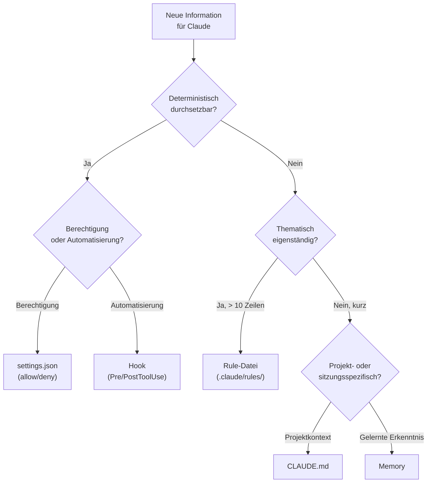
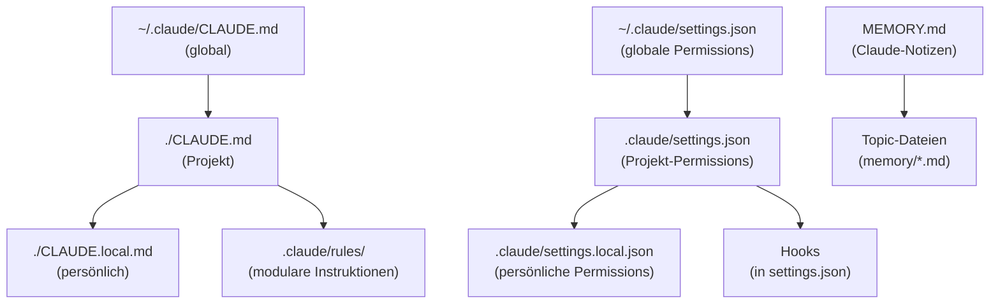

Die `CLAUDE.md` ist weder Bedienungsanleitung noch Dokumentation noch Ablage für projektbezogene Notizen. Sie ist ein präzises Werkzeug — und funktioniert nur, wenn man sie auch so behandelt. Wer Claude Code wirksam konfigurieren will, profitiert von ein paar klaren Grundprinzipien.

Die `CLAUDE.md` allein erzählt allerdings nur die halbe Geschichte. Seit Anfang 2026 bietet Claude Code ein ganzes Ökosystem aus Konfigurationsdateien, von dem die `CLAUDE.md` nur eine Ebene ist: Rules-Dateien für modulare Instruktionen, `settings.json` für technische Berechtigungen, Hooks für deterministische Automatisierung und ein Memory-System für lernende Kontexte. Wer alles in eine einzige Datei packt, verschenkt nicht nur Übersicht, sondern auch Wirksamkeit.

<!--more-->

## Was ist CLAUDE.md?

Die `CLAUDE.md` ist die zentrale Konfigurationsdatei für Claude Code. Sie wird zu Beginn jeder Sitzung gelesen und steuert, wie Claude sich in einem Projekt verhält. Es gibt sie auf mehreren Ebenen:

- `~/.claude/CLAUDE.md` — gilt global für alle Projekte, wird nicht ins Git eingecheckt
- `./CLAUDE.md` im Projekt-Root — projektspezifisch, kann versioniert werden
- `CLAUDE.md` in Unterordnern — wird bei Bedarf nachgeladen, ideal für Monorepos
- `./CLAUDE.local.md` — lokal, gitignored, für persönliche Anpassungen

Zusätzlich können Dateien per `@path/to/datei`-Syntax importiert werden — ein bewährtes Muster für ausgelagerte Rules und spezifische Anleitungen.

Ein entscheidender technischer Aspekt: Die `CLAUDE.md` wird als User-Message nach dem System-Prompt injiziert. Das bedeutet, Claude *interpretiert* den Inhalt — und kann Teile davon als weniger relevant einstufen und überspringen, wenn der Kontext zu lang oder zu generisch wird. Im Gegensatz dazu sind `settings.json`-Regeln harte Grenzen, die Claude nicht interpretieren, sondern nur befolgen kann.

## Die goldenen Regeln

Die Community ist sich in einem Punkt erstaunlich einig: **Kürze ist Tugend.**

Forschungsergebnisse zeigen, dass Claude konsistent etwa 150 bis 200 Instruktionen befolgen kann. Claudes eigener System-Prompt verbraucht davon bereits rund 50. Jede weitere Zeile in der `CLAUDE.md` konkurriert mit allen anderen um Aufmerksamkeit — und die Befolgungsrate sinkt gleichmäßig mit jeder Zeile, die hinzukommt.

Eine bewährte Faustregel: **Unter 60 Zeilen für die Root-Datei, maximal 300 Zeilen insgesamt.** Für jede Zeile lohnt sich die Frage: *Würde Claude ohne diese Zeile einen Fehler machen?* Wenn nicht, gehört sie gestrichen.

Ausführlichere Anleitungen — Projektstruktur, Build-Prozesse, Konventionen — lassen sich in separate Dateien auslagern und per Import referenzieren. Das hält die Hauptdatei schlank und trotzdem vollständig.

## Struktur: Was, Warum, Wie

Eine gute `CLAUDE.md` beantwortet drei Fragen:

**Was** — Techstack, Framework-Versionen, Projektstruktur. Claude soll sofort wissen, womit es arbeitet. Ein konkretes Beispiel: Hugo 0.159.1 extended, Vanilla CSS, kein JavaScript-Framework.

**Warum** — Zweck des Projekts, Funktion der Komponenten. Nicht ausschweifend, aber genug Kontext, damit Claude keine falschen Annahmen trifft. *"Persönliche Hobbyseite, kein beruflicher Bezug, kein kommerzieller Zweck"* — das verhindert eine ganze Klasse von unnötigen Vorschlägen.

**Wie** — Workflows, Build-Befehle, Test-Instruktionen. Konkret und überprüfbar: `hugo server` für lokale Entwicklung, `hugo --minify` für den Produktions-Build. Keine abstrakten Prozessbeschreibungen.

## Was NICHT reingehört

Die größte Versuchung besteht darin, alles hineinzuschreiben, damit Claude ja nichts falsch macht. Das ist kontraproduktiv.

**Code-Style-Regeln haben in der `CLAUDE.md` nichts verloren.** Die Community bringt es auf den Punkt: *"Never send an LLM to do a linter's job."* Alles, was ein Linter oder Formatter deterministisch erledigen kann, gehört in die entsprechende Konfigurationsdatei — `.editorconfig`, `.prettierrc`, `stylelint.config.js`. Claude sollte sich auf das konzentrieren, was Tools nicht können.

Ebenfalls raus:

- Erschöpfende Befehlslisten, die niemand je vollständig liest
- Veraltete Code-Snippets — stattdessen Dateiverweise (`src/stores/index.ts:42`)
- "Hotfix"-Instruktionen für einmalige Probleme, die längst gelöst sind
- Alles, was ein Hook deterministisch regeln kann
- Berechtigungen und Sicherheitsregeln — die gehören in die `settings.json`
- Wiederholte Korrekturen, die Claude sich selbst merken sollte — dafür gibt es das Memory-System

Eine `CLAUDE.md`, die nach jedem aufgetretenen Problem mit einem weiteren Absatz wächst, endet schnell bei 400 Zeilen — und wird von Claude zuverlässig nicht mehr vollständig berücksichtigt, weil das Instruktionsbudget schlicht erschöpft ist.

## Rules-Dateien: Modulare Instruktionen

Seit 2025 unterstützt Claude Code ein eigenes Rules-System, das es erlaubt, Instruktionen in eigenständige Markdown-Dateien auszulagern. Statt alles in eine monolithische `CLAUDE.md` zu pressen, lassen sich thematisch abgegrenzte Regeln in einzelne Dateien aufteilen.

### Wo Rules liegen

| Ort | Geltungsbereich | Versionierbar |
|:----|:----------------|:--------------|
| `~/.claude/rules/` | Global, alle Projekte | Nein |
| `.claude/rules/` im Projekt | Einzelnes Projekt | Ja, per Git |

Jede Markdown-Datei in diesen Verzeichnissen wird automatisch beim Sitzungsstart geladen — mit derselben Priorität wie die `CLAUDE.md` selbst. Unterordner zur thematischen Gruppierung sind möglich (z.B. `rules/frontend/`, `rules/testing/`).

### Wann Rule-Datei, wann CLAUDE.md?

Die Faustregel: Wenn eine Instruktion **thematisch eigenständig** ist und **länger als 10 Zeilen**, gehört sie in eine eigene Rule-Datei. Die `CLAUDE.md` verweist dann per `@`-Import darauf:

```markdown
## Rules

@rules/commit-conventions.md
@rules/testing-standards.md
@rules/api-design.md
```

Die `CLAUDE.md` bleibt dadurch ein schlankes Inhaltsverzeichnis, während die Details modular daneben liegen. Das hat einen weiteren Vorteil: Einzelne Rules lassen sich unabhängig aktualisieren, ohne die Hauptdatei anzufassen.

### Pfadbasierte Rules

Eine besonders nützliche Funktion sind pfadbasierte Rules — Instruktionen, die nur geladen werden, wenn Claude mit bestimmten Dateitypen arbeitet. Die Steuerung erfolgt über YAML-Frontmatter:

```markdown
---
paths:
  - "src/api/**/*.ts"
  - "lib/api/**/*.ts"
---

# API-Konventionen

- Alle Endpoints verwenden REST-Verben
- Fehler-Responses folgen dem RFC 7807 Schema
- Validierung via Zod-Schemas, keine manuellen Checks
```

Diese Rule wird nur aktiv, wenn Claude Dateien in den passenden Verzeichnissen liest. Für eine React-Komponente in `src/components/` bleibt sie unsichtbar. Das spart Kontext und hält die relevanten Instruktionen scharf.

### Beispiel einer Rule-Datei

Eine typische Rule-Datei für Commit-Konventionen:

```markdown
# Commit-Konventionen

## Format

Konventionelle Commits: `typ: beschreibung`

Erlaubte Typen: feat, fix, docs, style, refactor, test, chore

## Sprache

- Commit-Messages: Deutsch
- Branch-Namen: Englisch, kebab-case

## Regeln

- Kein `--force-push` auf main
- Commits atomar: eine logische Änderung pro Commit
- Keine generierten Dateien committen (build/, dist/)
```

22 Zeilen, ein klar abgegrenztes Thema. In der `CLAUDE.md` braucht es dafür nur eine einzige Zeile: `@rules/commit-conventions.md`.

## settings.json — die andere Hälfte der Konfiguration

Während die `CLAUDE.md` Claude erklärt, *was* es tun soll, definiert die `settings.json`, *was es darf*. Der Unterschied ist fundamental: CLAUDE.md-Anweisungen sind Empfehlungen, die Claude interpretiert. Settings-Regeln sind harte Grenzen, die technisch durchgesetzt werden.

### Dateiorte

| Datei | Geltungsbereich |
|:------|:----------------|
| `~/.claude/settings.json` | Global, alle Projekte |
| `.claude/settings.json` | Einzelnes Projekt, versionierbar |
| `.claude/settings.local.json` | Einzelnes Projekt, gitignored |

Bei identischen Einträgen in mehreren Dateien werden Array-Werte zusammengeführt und dedupliziert — nicht überschrieben.

### Was gehört in settings.json statt CLAUDE.md?

**Berechtigungen** — welche Tools Claude automatisch nutzen darf, welche eine Rückfrage erfordern, welche blockiert sind. Eine `CLAUDE.md`-Zeile wie *"Lösche niemals Dateien ohne Rückfrage"* ist eine Bitte. Eine Deny-Regel in `settings.json` ist ein Fakt.

**Umgebungsvariablen** — Feature-Flags, Telemetrie-Einstellungen, experimentelle Funktionen.

**Hook-Definitionen** — automatisierte Aktionen im Claude-Lifecycle (dazu mehr im nächsten Abschnitt).

### Beispiel-Konfiguration

```json
{
  "permissions": {
    "defaultMode": "acceptEdits",
    "allow": [
      "Read", "Glob", "Grep",
      "Bash(git status)", "Bash(git diff *)",
      "Bash(git log *)", "Bash(npm run *)"
    ],
    "deny": [
      "Bash(rm *)", "Bash(sudo *)",
      "Bash(curl *)", "Bash(wget *)",
      "Read(**/.env*)", "Read(**/*.key)"
    ]
  }
}
```

Dieses Setup erlaubt lesende Operationen ohne Rückfrage, blockiert destruktive Befehle und Secrets-Zugriff grundsätzlich, und akzeptiert Datei-Edits automatisch. Claude kann `rm -rf` nicht ausführen — nicht weil eine Instruktion es verbietet, sondern weil die Berechtigung technisch fehlt.

### Wildcard-Syntax

Ein Detail, das leicht übersehen wird: Die Wildcard-Syntax in Bash-Regeln ist präzise.

| Muster | Matcht | Matcht nicht |
|:-------|:-------|:-------------|
| `Bash(npm run *)` | Alles mit `npm run ` Prefix | `npm install` |
| `Bash(ls *)` (mit Leerzeichen) | `ls -la` | `lsof` |
| `Bash(ls*)` (ohne Leerzeichen) | `ls -la` und `lsof` | — |

Wichtig: Claude Code erkennt Shell-Operatoren. `Bash(safe-cmd *)` erlaubt nicht `safe-cmd && rm -rf /`.

## Hooks — Automatisierung ohne Instruktionen

Hooks sind Shell-Befehle, die automatisch an bestimmten Punkten im Claude-Code-Lifecycle ausgeführt werden. Im Gegensatz zu CLAUDE.md-Anweisungen, die Claude *interpretiert*, sind Hooks *deterministisch* — sie laufen zuverlässig jedes Mal, ohne dass Claude sich entscheiden kann, sie zu ignorieren.

### Verfügbare Events

| Event | Wann | Blockierbar |
|:------|:-----|:------------|
| `PreToolUse` | Vor einer Tool-Ausführung | Ja |
| `PostToolUse` | Nach erfolgreicher Tool-Ausführung | Nein |
| `SessionStart` | Sitzung beginnt oder wird fortgesetzt | Nein |
| `Notification` | Bei Benachrichtigung | Nein |
| `Stop` | Claude beendet seine Antwort | Ja |
| `PreCompact` | Vor Kontext-Kompaktierung | Nein |

Das ist nur eine Auswahl — insgesamt stehen über 15 Events zur Verfügung, darunter `UserPromptSubmit`, `SubagentStart`, `FileChanged` und `TaskCreated`.

### Wie Hooks die CLAUDE.md entlasten

Statt in die `CLAUDE.md` zu schreiben: *"Führe nach jedem Edit Prettier aus"*, lässt sich das als PostToolUse-Hook implementieren:

```json
{
  "hooks": {
    "PostToolUse": [
      {
        "matcher": "Edit|Write",
        "hooks": [
          {
            "type": "command",
            "command": "jq -r '.tool_input.file_path' | xargs prettier --write"
          }
        ]
      }
    ]
  }
}
```

Dieser Hook formatiert jede bearbeitete Datei automatisch. Kein Instruktionsbudget verbraucht, kein Risiko, dass Claude die Anweisung übersieht.

### Praxisbeispiel: Destruktive Befehle blockieren

Ein PreToolUse-Hook, der `rm -rf` abfängt und `trash` vorschlägt:

```json
{
  "hooks": {
    "PreToolUse": [
      {
        "matcher": "Bash",
        "hooks": [
          {
            "type": "command",
            "command": "bash -c 'CMD=$(cat | jq -r .tool_input.command); if echo \"$CMD\" | grep -q \"rm -rf\"; then echo \"Bitte trash statt rm -rf verwenden\" >&2; exit 2; fi'"
          }
        ]
      }
    ]
  }
}
```

Exit-Code 2 blockiert die Aktion und gibt Claude ein Feedback, warum. Claude kann dann den Befehl anpassen. Exit-Code 0 bedeutet "alles in Ordnung", andere Codes erzeugen Warnungen, blockieren aber nicht.

### Handler-Typen

Neben Shell-Befehlen (`command`) gibt es drei weitere Handler:

- **`http`** — POST-Request an eine URL, etwa für Webhooks oder CI/CD-Integration
- **`prompt`** — Einmalige LLM-Auswertung durch ein kleineres Modell (Haiku), nützlich für Code-Review-Checks
- **`agent`** — Subagent mit eigenem Tool-Zugriff für mehrstufige Verifikation

Hooks werden in denselben `settings.json`-Dateien definiert wie die Berechtigungen — sie lassen sich also global oder projektspezifisch konfigurieren.

## Das Memory-System

Neben der `CLAUDE.md` (menschlich geschrieben) gibt es das Memory-System: Notizen, die *Claude selbst* über ein Projekt anlegt. Es ist Claudes Notizbuch — Erkenntnisse aus vergangenen Sitzungen, die sonst mit dem Kontextfenster verschwinden würden.

### Wie Memory funktioniert

Wenn Claude während einer Sitzung etwas Relevantes lernt — einen Build-Befehl, eine Architekturentscheidung, eine Korrektur — kann es diese Information in einer Memory-Datei speichern. Die `MEMORY.md` dient als Index, der auf thematische Einzeldateien verweist. Beim nächsten Sitzungsstart werden die ersten 200 Zeilen der `MEMORY.md` automatisch geladen.

Memory-Dateien liegen unter `~/.claude/projects/<projektpfad>/memory/` und sind reines Markdown — lesbar, editierbar, löschbar.

### CLAUDE.md vs. Memory: Wann was?

| Merkmal | CLAUDE.md | Memory |
|:--------|:----------|:-------|
| Autor | Mensch | Claude |
| Zweck | Instruktionen, Kontext | Gelernte Erkenntnisse |
| Persistenz | Manuell gepflegt | Automatisch ergänzt |
| Beispiel | "Verwende konventionelle Commits" | "Build schlägt fehl ohne `--legacy-peer-deps`" |

Memory ergänzt die `CLAUDE.md` — es ersetzt sie nicht. Instruktionen und Projektziele gehören in die `CLAUDE.md`. Debugging-Erkenntnisse, entdeckte Eigenheiten und session-übergreifende Notizen gehören ins Memory.

### AutoDream: Automatische Konsolidierung

Seit Anfang 2026 gibt es AutoDream — einen Hintergrundprozess, der periodisch Memory-Dateien aufräumt: veraltete Einträge entfernen, relative Daten in absolute umwandeln, Widersprüche auflösen. Das Feature ist noch experimentell und nicht für alle Nutzer verfügbar. Wer manuell gepflegte Memory-Strukturen hat, sollte AutoDream mit Vorsicht behandeln — es gibt bisher kein Changelog, das zeigt, was geändert wurde.

## Konkretes Beispiel: Eine gut strukturierte CLAUDE.md

```markdown
# CLAUDE.md — mein-projekt

## Projekt

Web-App für interne Zeiterfassung.
Kein öffentliches Produkt, keine externen Nutzer.

## Techstack

- Frontend: React 19, TypeScript 5.7, Tailwind CSS 4
- Backend: Fastify 5, Drizzle ORM, PostgreSQL 16
- Tests: Vitest, React Testing Library
- Monorepo: Turborepo

## Befehle

- `pnpm dev` — Lokaler Entwicklungsserver
- `pnpm test` — Unit-Tests
- `pnpm build` — Produktions-Build
- `pnpm lint` — ESLint + Prettier

## Architektur

- State Management via Zustand (siehe src/stores/)
- API-Routes folgen REST-Konventionen
- Validierung: Zod-Schemas in src/schemas/

## Konventionen

- Sprache: Code + Commits auf Englisch
- Commits: Conventional Commits (feat/fix/docs/refactor)
- Neue Komponenten brauchen Tests

## Rules

@rules/api-design.md
@rules/testing-standards.md
```

38 Zeilen. Alles, was Claude für den Einstieg braucht, steht hier. Die Details zu API-Design und Testing-Standards liegen in ausgelagerten Rule-Dateien — zwei `@`-Imports statt 60 zusätzliche Zeilen.

## Anti-Patterns: Vorher und Nachher

### Die aufgeblähte CLAUDE.md

**Vorher** — 160 Zeilen, alles in einer Datei:

```markdown
# CLAUDE.md

## Projekt
Web-App für Zeiterfassung...
(15 Zeilen Projektbeschreibung)

## Code Style
- Verwende 2 Spaces für Einrückung
- Semikolons am Zeilenende
- Single Quotes statt Double Quotes
- Maximale Zeilenlänge: 100 Zeichen
- Funktionen alphabetisch sortieren
- Imports gruppiert: externe zuerst, dann interne
(weitere 25 Zeilen Formatierungsregeln)

## Sicherheit
- Lösche niemals Dateien ohne Rückfrage
- Führe keine curl-Befehle aus
- Greife nicht auf .env-Dateien zu
(weitere 10 Zeilen)

## Hooks-Verhalten
- Nach jedem Edit: Prettier ausführen
- Vor jedem Commit: Tests laufen lassen
(weitere 8 Zeilen)

## Vergangene Probleme
- Am 15.01. war der Build kaputt wegen fehlender
  Dependency — immer --legacy-peer-deps verwenden
- Am 22.01. hat Claude die Testdatenbank gelöscht
- Am 03.02. wurden falsche Imports generiert
(weitere 20 Zeilen Hotfix-Historie)
```

**Nachher** — 38 Zeilen in der Hauptdatei:

Die Code-Style-Regeln wandern in `.prettierrc` und `.eslintrc` (wo sie vom Linter durchgesetzt werden, nicht von Claude interpretiert). Die Sicherheitsregeln wandern in `settings.json` (wo sie technisch erzwungen werden). Die Formatting-Anweisungen werden zu einem PostToolUse-Hook. Die Hotfix-Historie wird gelöscht — was noch relevant ist, steht in den Memory-Dateien.

### Der Hotfix-Friedhof

Ein zweites Anti-Pattern: Die `CLAUDE.md`, die nach jedem Bug einen neuen Absatz bekommt.

```markdown
## WICHTIG: Bekannte Probleme
- NIEMALS dayjs ohne locale importieren (Bug vom 12.01.)
- Die Funktion calculateTotal() MUSS mit BigDecimal rechnen (Bug vom 18.01.)
- ACHTUNG: Der Redis-Cache hat ein TTL von 3600s (Bug vom 25.01.)
- KRITISCH: Immer await vor database.query() (Bug vom 02.02.)
- ...
(42 weitere Einträge)
```

Jeder dieser Einträge war einmal relevant — vor Wochen oder Monaten. Inzwischen ist die Hälfte durch Codeänderungen obsolet, ein Viertel durch Linter-Regeln abgedeckt, und der Rest gehört in Tests, die den Fehler abfangen. Diese 50 Zeilen verbrauchen Instruktionsbudget, ohne aktuellen Nutzen zu bieten.

Die Lösung: Regelmäßig aufräumen. Alles, was durch Tests, Linter oder Code-Änderungen abgedeckt ist, streichen. Was noch relevant ist und Claude nicht selbst erkennen kann, bleibt — aber knapp formuliert.

## Wo gehört was hin? Ein Entscheidungsbaum



Die Kurzfassung:

- **Berechtigung?** → `settings.json`
- **Automatisierung?** → Hook
- **Eigenständiges Regelwerk?** → Rule-Datei
- **Projektkontext und Instruktionen?** → `CLAUDE.md`
- **Gelernte Erkenntnis aus einer Sitzung?** → Memory

## Die Hierarchie der Konfigurationsdateien



Die drei Säulen: **Instruktionen** steuern, was Claude wissen soll. **Berechtigungen** steuern, was Claude darf. **Memory** speichert, was Claude gelernt hat. Jede Säule hat ihre eigene Vererbungskette von global nach lokal.

## Fazit

Eine effektive `CLAUDE.md` enthält genau das, was Claude wissen muss — und nichts darüber hinaus. Kurz, strukturiert, regelmäßig aufgeräumt. Code-Style gehört zum Linter, Berechtigungen in die `settings.json`, Automatisierungen in Hooks, thematische Regelwerke in Rule-Dateien, und gelernte Erkenntnisse ins Memory.

Was übrig bleibt, ist das, was Claude wirklich braucht: Kontext über das Projekt, Kontext über den Workflow, und ein klares Bild davon, wie die Zusammenarbeit aussehen soll.

Martin Fowler hat den Begriff *Context Engineering* geprägt — die Disziplin, den richtigen Kontext für KI-Werkzeuge zusammenzustellen. Die `CLAUDE.md` ist das Fundament dieses Kontexts. Aber ein Fundament trägt nur, wenn man nicht versucht, das ganze Haus hineinzupressen.

Wer seine Konfiguration optimieren möchte, beginnt am besten damit, die bestehende `CLAUDE.md` zu kürzen — und zu beobachten, ob Claude danach schlechter oder besser arbeitet. Die Antwort überrascht oft.
