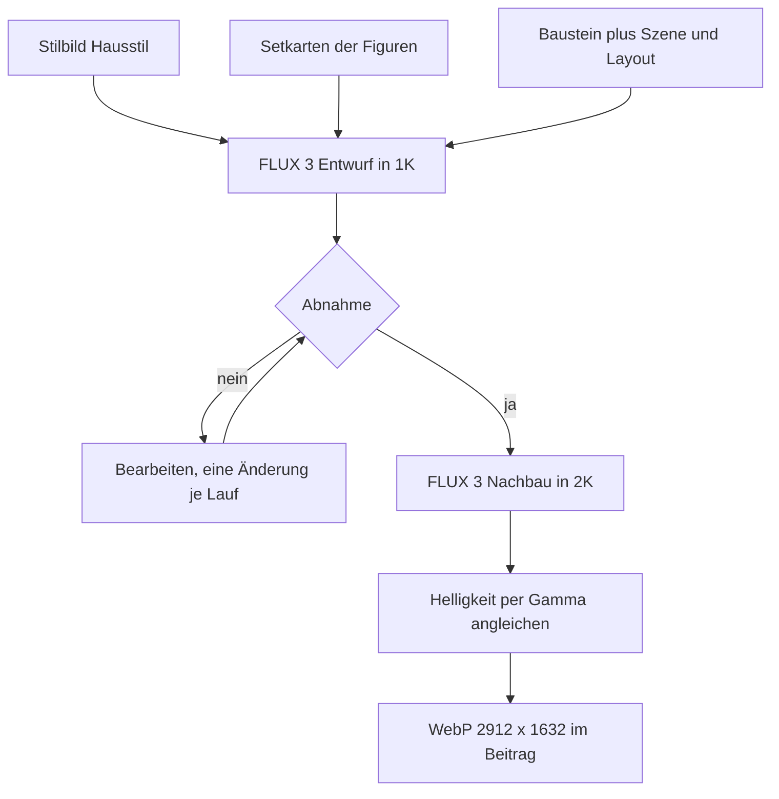
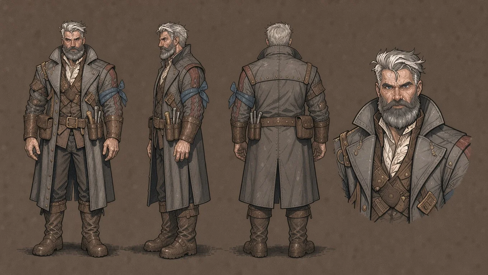
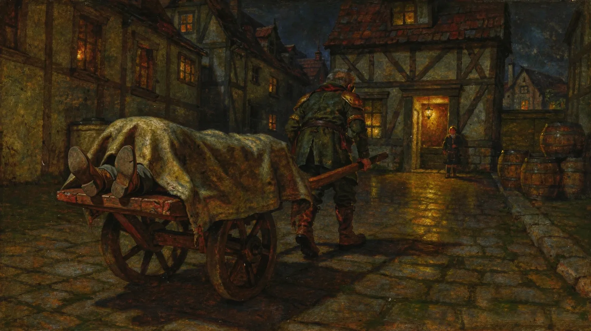
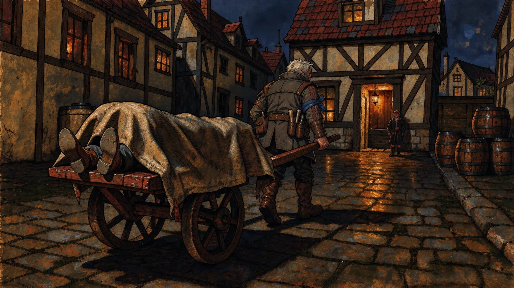

Die Titelbilder meiner Rollenspiel-Seite [online-resources.de](https://online-resources.de) stammten bis heute Morgen aus zwei Bildmodellen und mehreren Fassungen derselben Stilbeschreibung. So sahen sie auch aus. Seit heute Nachmittag sind es fünfzehn Bilder von einem einzigen Zeichner — den es nicht gibt und der trotzdem einen sehr festen Strich hat.

<!--more-->

## Siebzehn Läufe für eine Tür

Im August habe ich hier [unter dem Titel „Heimarbeit“ über die lokale Bilderzeugung geschrieben](/blog/ai-services-local-first/): Die Cover entstehen lokal, mit [ComfyUI](https://github.com/Comfy-Org/ComfyUI) und Flux.2 Klein auf Ganymed, und für den Rest standen [OpenRouter](https://openrouter.ai/) und die Schnittstelle von [Black Forest Labs](https://bfl.ai/) auf der Liste. Die Liste ist inzwischen abgearbeitet, nur anders als gedacht.

Ende August kam der Weg über OpenRouter dazu, mit FLUX.2 pro. Am 3. Oktober habe ich OpenRouter zum Regelfall erklärt und das lokale Modell zur Ausnahme. Das hielt gut eine Stunde.

Vorausgegangen waren an diesem Abend zwei Cover. Das erste zeigt meinen Schmied Edric, der nachts einen Toten auf einem Handwagen durch die Gasse zieht. Black Forest Labs prüft jeden Auftrag auf Gewalt, und „a dead man wrapped in a canvas shroud“ kam mit dem Vermerk „flagged for graphic violence“ zurück. Diese Beanstandungen sind ein großes Problem, wenn man Grafiken für Rollenspielrunden erstellen möchte. Die Fassung mit „a long load under a canvas tarpaulin“ lief dreimal ohne Beanstandung durch. Man lernt also, Leichen zu umschreiben.

Danach folgten ein Wagen, der erst auf eine Achse gebracht werden musste, eine gemalte Signatur unten rechts, die immer wiederkam, ein Edric mit zu kurzen Beinen und Boote an Land. Zwölf bezahlte Läufe und 0,915 US-Dollar später war das Bild fertig, zusammengesetzt aus Cloud-Läufen, lokalen Ausschnitten und einer Gammakorrektur, also einer nachträglichen Angleichung der Helligkeit an ein Vorbild.

Das zweite Cover zeigt Edric, der ein Verhörzimmer verlässt. Fünfzehn bezahlte Läufe ohne brauchbares Ergebnis, weil ich fünfmal an demselben Bildaufbau geflickt habe — Wand frontal, Figur links, Öffnung rechts, keine Raumtiefe. In einer Fassung führte in der Zelle eine Treppe zu einem Fenster. Erst ein Neuanfang mit anderem Aufbau brachte das Bild, nach siebzehn Läufen und 1,26 US-Dollar.

Das Geld ist dabei das kleinere Problem. Ein ganzer Abend für zwei Bilder ist das größere.

## Direkt bei Black Forest Labs

In derselben Nacht ging es um [FLUX 3 Image](https://bfl.ai/models/flux-3-image), das Black Forest Labs seit dem 1. Oktober anbietet. [Claude Code](https://code.claude.com/docs/en/overview) hat den Skill `flux-cover` — das ist die Anleitung samt Skript, nach der bei mir die Cover entstehen — erst auf FLUX 3 über OpenRouter umgebaut. Kurz darauf habe ich entschieden, das Modell direkt bei Black Forest Labs anzusprechen. Der Grund: Die direkte Schnittstelle kostet je Bild dasselbe und gibt zwei Dinge her, die über OpenRouter fehlen.

| Frage | OpenRouter | direkt bei Black Forest Labs |
|---|---|---|
| Websuche des Modells an- und abschalten (FLUX 3 kann vor dem Rendern im Netz nachschlagen) | nein | ja |
| Vom Modell erweiterter Prompt in der Antwort | nein | ja |

Den Ausschlag gab der erweiterte Prompt. FLUX 3 erweitert den Prompt, bevor es malt, und auf dem direkten Weg bekommt man diese Fassung zurück. Man sieht dann, was das Modell verstanden hat, statt es am Bild zu erraten.

OpenRouter bleibt als Ausweichweg erhalten. Der Aufruf für einen Entwurf sieht seitdem so aus:

```bash
S=.claude/skills/flux-cover/scripts

# Entwurf in 1K (1360 × 768 Pixel): erst das Stilbild, dann je Figur eine Setkarte,
# ein Bild der Figur in vier Ansichten. --weg bfl geht direkt an Black Forest Labs.
python3 $S/cover.py --prompt-datei motiv.txt --layout motiv.layout.json \
  --weg bfl --aufloesung 1K \
  --referenz $S/../stilbilder/hausstil-illustration.webp \
  --referenz $S/../figuren/dnd5e/edric-stonepath.jpg \
  --ziel entwurf-1.webp
```

Neu an FLUX 3 ist das Layout: eine Liste von Bildelementen mit Rahmen in einem Raster von 0 bis 1000. Der erste bezahlte Lauf hat alle sechs Rahmen getroffen — schmale einflügelige Tür, die Figur passt hindurch. Und er sah aus wie ein digitales Rendering. Der Stil der Reihe war komplett verfehlt.

## Computergrafik aus den Neunzigern

Der Vormittag gehörte dem Stil. Die ersten drei Versuche habe ich neben vier vorhandene Cover gelegt und messen lassen: Den neuen Bildern fehlte Farbsättigung (Mittelwert 48 bis 77 gegen 97 bis 139 bei der Reihe), und sie waren zu hell (Median der Helligkeit 30 bis 48 gegen 12 beim Vorbild). Zwei weitere Entwürfe mit ausgeschriebenem Licht und den Farbwerten der Reihe lagen bei der Sättigung im Bereich der Reihe.

Mein Urteil dazu lautete: Computergrafik aus den Neunzigern.

Gemessen richtig, angeschaut falsch. Danach haben wir drei Wege probiert. Den Entwurf von FLUX.2 pro neu malen lassen — das Modell stellte die Figur aus dem Stilbild in den Vordergrund. Den Entwurf vom lokalen Klein-Modell neu malen lassen — Farbe und Hell-Dunkel stimmten, das Bild war bei dieser Aufgabe aber eher zu dunkel und im falschen Format. Sieben Entwürfe in gezeichneten Stilen, Graphic Novel, europäischer Comic, Manga. Die gelingen FLUX 3 ohne Vorlage, ich habe sie trotzdem verworfen.

Weitergebracht hat ein Satz. Man gibt dem Modell ein fertiges Bild als erste Vorlage, also als mitgeschicktes Referenzbild, und beauftragt es, dieses Bild als andere Szene neu zu malen: Technik behalten, Inhalt komplett ersetzen. Kerkergang und Hafen trugen danach beide die Malweise des Vorbilds.

Dann wollte ich es doch gezeichneter haben. Drei Entwürfe mit geändertem Stiltext bei gleichem Stilbild zeigten kaum einen Unterschied zum Ölbild. Also wurde das Stilbild selbst umgezeichnet, in Tusche und Gouache, einer deckenden Wasserfarbe, und das hat gewirkt.

Die Lehre daraus steht jetzt im Skill, und sie ist schlicht: Die Vorlage bestimmt das Medium, der Text kommt dagegen nicht an.

## Ein Stilbild und ein Absatz

Der Hausstil besteht aus zwei Teilen, die in jeden Lauf gehören. Ein festes Stilbild von 1360 × 768 Pixeln, das immer als erste Vorlage mitgeht. Und ein Auftrags-Baustein, der wörtlich am Anfang jedes Prompts steht:

```text
Redraw image 1 as a different scene: a fantasy illustration in ink and opaque
watercolour by the same illustrator, with the palette and the light of image 1.
A visible line drawing in dark brown ink defines every figure, stone and plank
with lines of varying weight; the forms are filled with opaque gouache in clear,
slightly simplified shapes of light and shadow, a little hatching in the darkest
shadows, the paper texture faintly visible; colours of slate blue-grey, olive,
ochre and umber, deep warm brown shadows, and one warm golden light with a soft
edge. Take only the drawing technique, the palette and the light from image 1:
none of its people, clothes, furniture or walls. Replace the content of the
picture completely:
```

Nach dem Doppelpunkt folgt die Szene. Der Baustein wird nicht umformuliert, und ein fertiges Cover dient nie als Stilbild — sonst verändert sich der Stil von Bild zu Bild.

Der vorletzte Satz steht da aus Erfahrung. Ohne ihn erscheint die Kleidung der Figur aus dem Stilbild auch in der neuen Szene.



## Fünf Figuren, fünf Zeichner

Ein Stil reicht nicht, wenn Edric in jedem Bild anders aussieht. Für wiederkehrende Figuren braucht das Modell einen Figurenbogen als Vorlage: dieselbe Figur von vorn, von der Seite, von hinten und als Brustbild. Die fertige Fassung eines solchen Bogens heißt bei mir Setkarte.

Für die fünf Figuren der D&D-Runde gab es Porträts, allerdings aus fünf verschiedenen Stilen. Die Bogen daraus sahen entsprechend aus. Drei Verfahren später wusste ich, was alles nicht geht:

1. Stilbild plus vorhandener Bogen als Vorlagen: Die Bogen kamen fast unverändert zurück. Eine Vorlage der Figur bringt ihren Stil mit.
2. Nur die Beschreibung, dazu der Bogen des Zwergs Himgi aus einer anderen Reihe als Stilvorlage: einheitlicher Stil, aber Himgi ging in die Figuren über. Die Bardin Thyra wurde ein männlicher Zwerg.
3. Drei Figuren aus der Beschreibung, mit den Bogen der beiden anderen als Stilvorlage: fünf Bogen in einem Stil, nur wirkten drei Figuren älter als auf ihren Porträts, und Lysa trug die Gesichtszeichnung von Celestina.

Dreizehn Läufe, 0,312 US-Dollar, und die einheitliche Fassung habe ich verworfen, weil die Figuren ihre Merkmale verloren hatten.

Was dann geholfen hat, kostete einen einzigen Lauf: alle fünf in ein gemeinsames Bild, nebeneinander vor leerem Hintergrund, mit dem Zusatz „all five drawn by the same hand“. In einem gemeinsamen Bild gleicht das Modell die Machart an. In Einzelbogen übernimmt es den Stil der jeweiligen Vorlage.


Zwei Figuren brauchten Nacharbeit. Gregor sah noch nach Rendering aus und ließ sich mit einer Bearbeiten-Anweisung angleichen, ohne dass die anderen sich änderten. Lysa blieb über zwei Bearbeitungen hinweg eine Comicfigur, weil ihr Ausgangsbild eine Pixelgrafik im Anime-Stil war. Sie bekam ein neues Ausgangsbild aus der Beschreibung und wurde dann im Gruppenbild ersetzt.

Aus dem Gruppenbild entstand je Figur ein Ausschnitt und daraus die Setkarte. Zwei Ausschnitte waren schmaler als 256 Pixel und wurden von der Schnittstelle abgewiesen — kostenlos, immerhin. In der ersten Runde war das Brustbild rechts mal angeschnitten und mal frei, also bekamen alle fünf dieselben Rahmen (Auszug):

```json
[
  {"id": "front_1", "bbox": [90, 40, 940, 235],
   "desc": "The character standing, full body from head to feet, seen from the front."},
  {"id": "side_1", "bbox": [90, 255, 940, 440],
   "desc": "The same character standing, full body, seen from the side in profile."},
  {"id": "back_1", "bbox": [90, 460, 940, 650],
   "desc": "The same character standing, full body, seen from behind."}
]
```



Bis zu den ersten Setkarten haben die D&D-Figuren rund 0,75 US-Dollar gekostet, die Neufassung mit einheitlichen Rahmen weitere 0,12.

## Elf Bilder umzeichnen

Mit Stilbild und Setkarten standen dann die elf vorhandenen Cover der Reihe an. Die Motive gab es schon, also wurde nichts neu erfunden: Das alte Cover geht als erste Vorlage in den Lauf, der Auftrag heißt umzeichnen, und Aufbau, Blickpunkt, Ort, Gegenstände, Farben und Licht bleiben, wie sie sind. Wo eine Figur im Bild steht, kommt ihre Setkarte als zweite Vorlage dazu.





Sechzehn Läufe in der Stufe 1K, 0,384 US-Dollar. Fünf davon waren Nachläufe: Drei Bilder kamen im ersten Lauf kaum umgezeichnet zurück, zwei hatten einen gezeichneten Papierrand bekommen. Die vier Cover für meine GURPS-Beiträge von 2006 und 2007 waren am Vormittag schon im selben Stil entstanden — eines davon ist das Titelbild dieses Beitrags.

## Was schiefging

Am frühen Nachmittag waren die elf Cover veröffentlicht. Zwanzig Minuten später wollte ich sie in 2K. Drei Dinge gingen schief.

Erstens die Auflösung. Die Stufe 1K liefert 1360 × 768 Pixel. Das Theme zeigt das Cover über die ganze Fensterbreite, und die Dateien waren auf 2912 × 1632 hochgerechnet. Also alle fünfzehn noch einmal, diesmal in 2K: Der abgenommene Entwurf geht als einzige Vorlage zurück ans Modell, mit dem Auftrag, ihn genau so in höherer Auflösung wiederzugeben. Fünfzehn Läufe zu je 0,05 US-Dollar, zusammen 0,75. Aufbau, Figuren und Einzelheiten blieben erhalten. Im Skill steht seitdem: kein Cover aus einem hochskalierten 1K-Entwurf.

Zweitens die Helligkeit. FLUX 3 liefert jede Szene heller als bestellt, und weder ein dunkles Stilbild noch Sätze wie `dark and low-key` (dunkel, mit wenig Licht) halten es davon ab. Jedes Bild wird deshalb nach dem Rendern ohne Modell abgedunkelt:

```bash
python3 nachbearbeiten.py gamma entwurf.webp vorbild.webp entwurf-dunkel.webp
```

Drittens ist Edric auf seiner Setkarte über fünfzig. Er ist vierzig und früh ergraut. Zwei Bearbeitungsläufe sollten ihn verjüngen; der erste hat das Gesicht etwas geglättet und die Brauen gedunkelt, der zweite hat gar nichts mehr bewirkt. Die leicht verjüngte Fassung ist jetzt die gültige.

## Stand am Abend

Alle fünfzehn Cover sind in 2K online, elf zu D&D, vier zu GURPS. Für meine DSA-Reihe gibt es ein eigenes Stil-Set in Gouache und Tusche; neue Cover für die bestehenden Beiträge dort habe ich nicht in Auftrag gegeben.

Ein Hinweis zum Preis: Er gilt nur befristet. Abgerechnet wurden in der Stufe 1K 0,024 US-Dollar je Bild und in 2K 0,05. Das ist ein Einführungsrabatt von 50 Prozent, der bis zum 8. Oktober gilt; die Listenpreise sind 0,048 und 0,100 US-Dollar. Die sind mir auch recht (Stand Oktober 2026).

Offen ist, ob der Stil hält, wenn das nächste Motiv nicht umgezeichnet wird, sondern neu entsteht. Die GURPS-Bilder sprechen dafür. Das nächste Cover für Edrics Notizen wird es zeigen — und ich bin gespannt, wie viele Läufe die nächste Tür braucht …
