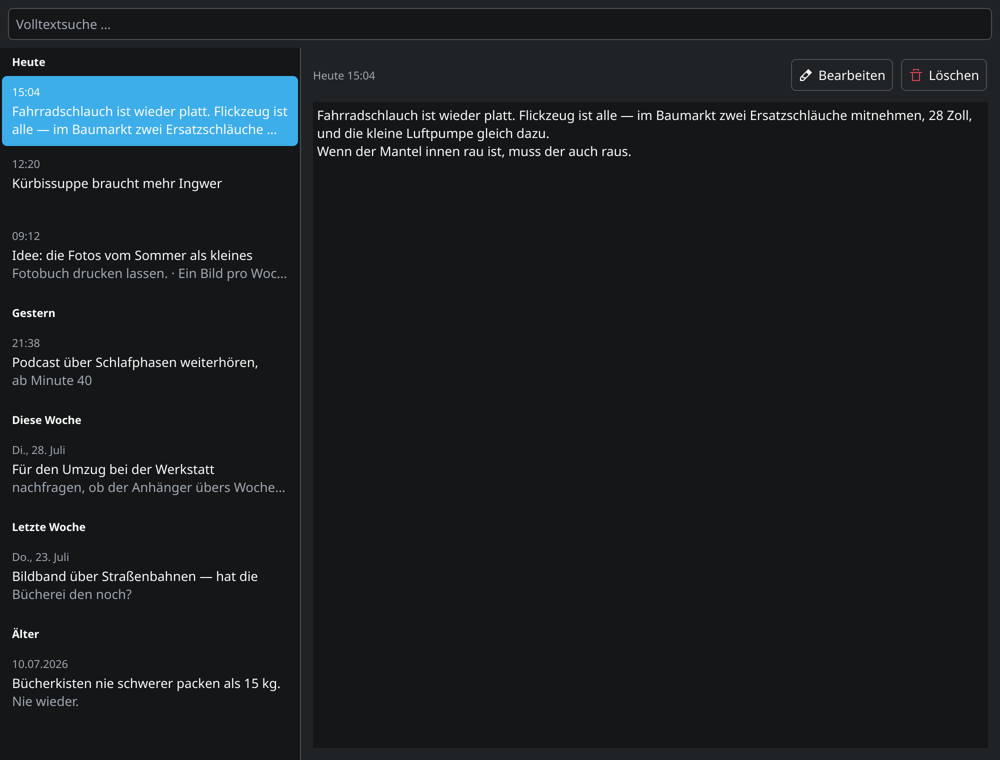

Im Deutschen ist ein Denkzettel etwas, das man verpasst bekommt: eine Lehre, die sitzen soll, damit man sie ja nicht vergisst. Mein [Denkzettel](https://github.com/hnsstrk/denkzettel) dreht den Spieß um — ein Zettel, den ich mir selbst verpasse, damit ich vergessen darf.

<!--more-->

Der Anlass ist immer derselbe: Mitten in der Arbeit fällt mir etwas ein, das woanders hingehört — eine Idee, eine offene Frage, ein Kommandozeilen-Fund. Klar könnte ich einen Editor öffnen und es hineintippen. Nur: Erst startet die Anwendung, dann tippe ich, und dann kommt der eigentliche Denksport. Wohin damit? Neue Datei? Welcher Name, welcher Ordner? Bis das entschieden ist, bin ich raus aus dem, was ich eigentlich tun wollte.

Denkzettel kürzt das auf drei Handgriffe ab: `Meta+N` drücken, tippen, `Strg+Enter`. Die Notiz ist gespeichert, das Fenster ist verschwunden, der Kopf ist wieder frei. Kein Dateiname, kein Speicherort, keine Entscheidung — die ist auf später vertagt, und später soll sie mir sogar jemand abnehmen. Dazu gleich mehr.

## Was es heute kann

Hinter dem Erfassungsfenster sitzt eine Bibliothek, die alle Zettel nach Tagen sortiert wie einen Posteingang. Die Volltextsuche verzeiht Umlaute und halbe Wörter — „bucher" findet „Bücher", „grafieren" findet „fotografieren". Bearbeitet wird mit Rückfrage, gelöscht mit Rückgängig-Möglichkeit.

Der Rest ist Plasma-Bürgerpflicht: Das Programm sitzt im Systemabschnitt der Kontrollleiste, startet mit der Sitzung, übernimmt Farbschema und Fensterhülle vom Desktop-Theme und lässt sich über D-Bus skripten. Alle Notizen liegen lokal in einer SQLite-Datei; nichts verlässt den Rechner.

## Wohin die Reise geht

Damit steht Denkzettel quer zu fast allem, was die Notiz-Branche gerade baut. Zettelkasten, Second Brain, Mind Garden — überall soll Wissen auf Dauer wachsen, verzweigen, gepflegt werden. So ein Archiv habe ich längst, es heißt Obsidian-Vault, und es macht seine Sache gut. Was fehlte, war das Gegenteil: ein Ort, an dem Zettel verschwinden dürfen.

Denkzettel ist deshalb als Durchgangslager gedacht, nicht als Archiv. Der Zettel ist der Anfang einer Reise, und die nächsten Ausbaustufen sollen den Rest des Weges übernehmen.

Zuerst kommen Sprachnotizen mit Transkription — den Gedanken aussprechen statt tippen, für die Momente, in denen nicht einmal `Meta+N` schnell genug ist.

Der eigentliche Plan ist aber die KI-gestützte Triage. Eine KI sichtet den angesammelten Stapel und macht Vorschläge: Das hier ist eine Aufgabe und gehört nach Taskwarrior. Das ist Wissen und gehört in den Obsidian-Vault — oder in welches Archiv auch immer. Das da war nur für den Moment wichtig und kann weg. Ich bestätige noch, statt selbst zu sortieren — genau die Entscheidung, die ich beim Erfassen nicht treffen wollte, nimmt mir das System später ab. Die Ablage auf Dauer haben andere Werkzeuge; Denkzettel liefert nur ordentlich aus. Der Export nach Obsidian und Taskwarrior bildet dafür den Unterbau; was gerade ansteht, steht in den [Issues](https://github.com/hnsstrk/denkzettel/issues).

Wenn das steht, ist der Zettelkasten das, was ein Zettelkasten sein sollte: morgens voll, abends leer.

## Wer das eigentlich baut

Zum Schluss noch die Besonderheit dieses Projekts: Den Code schreibe ich nicht selbst. Denkzettel wird von einem Team aus Claude-Code-Agenten entwickelt — Product Owner, Entwickler, UX, Scrum Master, jeder mit fester Rolle. Ich bin der Kunde: Ich wünsche mir Dinge, das Team baut sie, am Ende jedes Sprints nehme ich per Sichtprüfung ab. In der ersten Woche kamen so 293 Commits und acht Sprints zusammen; der komplette Prozess liegt offen im Repository.

Seit dieser Woche trägt das Ganze die Versionsnummer 0.2.0. Fertige Pakete gibt es noch keine — wer es ausprobieren will, baut aus dem Quelltext; die Anleitung steht im README, der Überblick auf der [Projektseite](/projects/denkzettel/).

Das Team hat also weiter zu tun. Der Kunde ist anspruchsvoll …
