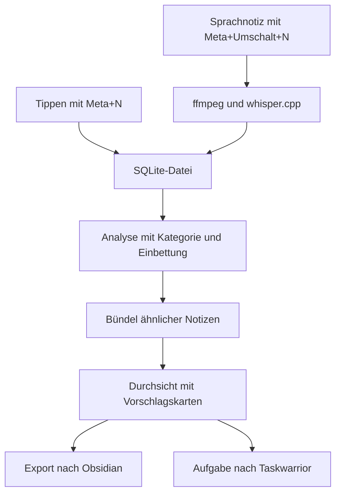

Als ich hier zuletzt über Denkzettel schrieb, hatte ich gerade [den Scrum Master entlassen](/blog/denkzettel-prozess-rueckbau/), und das Programm stand bei Version 0.3.0. Heute, am 18. September, sind 55 Commits nach GitHub gegangen, die seit Anfang September fertig auf meinem Rechner lagen. Die Version heißt 0.7.0. Gemeint war 1.0.0.

<!--more-->

Wer Denkzettel noch nicht kennt: Es ist ein [Notizfenster für KDE Plasma](/blog/denkzettel-kde-scratchpad/), das auf `Meta+N` aufgeht und nach `Strg+Enter` wieder verschwindet. Den Code schreibt Claude Code, ich wünsche mir Dinge und sehe sie mir an. Was in den fünf Wochen seit dem Papierkrieg passiert ist, steht hier.

## Der Rest vom Papierkrieg

Der letzte Beitrag endete mit dem Satz, der nächste Sprint fange ohne Protokoll an. Das tat er, noch am selben Abend. Und bei der Abnahme habe ich gleich weitergestrichen:

> Die Tests sind zu viel. Es reicht, wenn ich mir das anschaue. Das ist ein kleines Tool und keine Raketensteuerung.

Daraus wurde eine Regel: Ein Test bleibt nur, wo das Auge nicht hinkommt. Farben, Abstände und Linien prüfe ich am laufenden Programm selbst. Nach zwei Tagen standen noch 121 von 195 Testfällen, das Testverzeichnis war von 10.720 auf 4.560 Zeilen geschrumpft, und von fünf Programmen, die Bilder für die Prüfung erzeugten, war eines übrig.

Zwölf der gestrichenen Testfälle hatten echte Fehler bewacht. Die meisten dieser Fehler hatte ich allerdings ohnehin durch Hinsehen gefunden.

Beim Aufräumen fiel ein Absturz auf, den vorher niemand gesucht hatte: Das Erfassungsfenster starb, wenn die Plasma-Konfiguration ein Desktop-Theme nannte, dessen Paket nicht mehr installiert war. Die Spezifikation sicherte ausdrücklich das Gegenteil zu. Die Ursache lag in einer KDE-Bibliothek. Sie legt ihren Zustand unter dem Theme-Namen ab, den sie bekommt, räumt ihn aber unter dem Namen ab, auf den sie ihn auflöst — weshalb erst das zweite Fenster abstürzte und nicht das erste. Denkzettel fängt den Fall jetzt ab, bevor die Bibliothek den Namen sieht.

Am 20. August sind dann auch die letzten Rollen entfallen. Die Agenten für Entwicklung und UX wurden gelöscht, und der Product Owner — das war die Hauptsitzung von Claude Code — heißt seitdem nicht mehr so. Was die beiden Agenten an Erfahrung trugen, steht seitdem in einer einzigen Anweisungsdatei. Eine Kleinigkeit dabei hat mir gefallen: Überall, wo „PO-Entscheidung“ stand, steht jetzt „Entwurfsentscheidung“. Der Product Owner war ja nie ich.

## Englisch für alle

Am selben Tag wurde das Projekt englisch. Die Quellsprache der Oberfläche ist seitdem Englisch, die deutsche Fassung lebt als Übersetzungskatalog weiter — wortgleich, alle 51 Zeichenketten. Spezifikation, Changelog, die 54 offenen Issues und das README zogen mit; ein deutsches README liegt daneben.

Die Umstellung hat einen Fehler ans Licht gebracht, den ein deutscher Nutzer nie gesehen hätte. Die Datumsformate waren fest auf die deutsche Anordnung verdrahtet. Wer sein System auf Englisch stellte, bekam „Tue, 28. July“ zu lesen — ein Format, das es in keinem Land gibt.

Vier Prüfläufe über die 2.442 geänderten Zeilen fanden 18 Mängel, darunter ein Kommentar, in dem aus „Symbole an den Schaltflächen“ ein „an den buttons“ geworden war.

Seit dem 23. August läuft außerdem das Plugin ponytail mit. Es hält Claude Code vor jedem neuen Code eine feste Reihe von Fragen vor — muss das überhaupt existieren, kann die Standardbibliothek das, reicht ein Einzeiler? Für Denkzettel hieß das vor allem: Die drei Stellen im Code, die absichtlich eine Abkürzung nehmen, tragen jetzt einen Kommentar mit Messwert und Ausbauplan. Die Suche bei Begriffen unter drei Zeichen etwa geht einen einfacheren Weg als der Volltextindex, und daneben steht, dass der bei 20.000 Notizen 3 Millisekunden braucht.

## Was dazugekommen ist

Im ersten Beitrag standen Sprachnotizen und die KI-gestützte Sortierung unter „Wohin die Reise geht“. Beides ist inzwischen gebaut. Für die Sortierung bekommt jede Notiz eine Kategorie und eine Einbettung, also einen Zahlenvektor, der ihren Inhalt beschreibt; Notizen mit ähnlichen Vektoren werden gebündelt. So läuft ein Zettel heute durch das Programm:



Die wichtigsten Entscheidungen auf dem Weg:

| Komponente | Technologie | Begründung |
|---|---|---|
| Transkription | whisper.cpp aus dem Arch-Paket, Vulkan-Backend | Vulkan und ROCm sind zwei Wege, die Grafikkarte rechnen zu lassen. Vulkan: 371 Millisekunden und 52 MB, ROCm: 409 Millisekunden und 1,2 GB |
| Tonaufbereitung | ffmpeg vor der Transkription | whisper.cpp liest Opus in OGG nicht |
| Kategorie und Einbettung | Ollama als Vorgabe, OpenRouter und OpenAI als Option | Fremdanbieter für Rechner, denen die Leistung fehlt, oder für stärkere Modelle |
| Bündelung | Kosinus-Ähnlichkeit der Einbettungen | Gebündelt wird ab einer Ähnlichkeit von 0,60 |
| Paket | PKGBUILD im Repository | 18 Abhängigkeiten |

Die Versionen dazu, in der Reihenfolge ihres Erscheinens:

- **0.4.0** am 11. August — vier Fehler behoben, der Testbestand halbiert.
- **0.5.0** am 24. August — die mehrsprachige Oberfläche.
- **0.6.0** am selben Abend — der Absturz mit dem fehlenden Theme, volle Zeitstempel auf jeder Notiz, Schriftwechsel ohne Neustart. Zehn von elf geplanten Punkten; der elfte war auf dem beschlossenen Weg nicht baubar.
- **0.7.0** am 28. August — die Aufnahme für Sprachnotizen, ein Info-Dialog, eine neue Anwendungskennung. Dazu ein Fund aus einer Messung: Die Bibliothek las eine Konfigurationsdatei einmal pro Zeile ein. Nach der Korrektur brauchte sie 131 statt 3.721 Millisekunden.

Die Versionsnummer hinkt dem Programm seitdem hinterher. In der Nacht nach der 0.7.0 wurden die Wiedergabe der Sprachnotizen und die Warteschlange für die Transkription fertig, am Nachmittag darauf neun weitere Bausteine: der Einstellungsdialog, die Klassifizierung, die Einbettung, die Kategorie-Spalte in der Bibliothek. Ein Transkriptionslauf wird nach fünf Minuten abgebrochen — es sind kurze Notizen, kein Audiorekorder.


Im ersten Beitrag stand, nichts verlasse den Rechner. Das stimmt seit dem Einbau von OpenRouter und OpenAI nur noch, solange Ollama eingestellt bleibt. Wer einen Fremdanbieter wählt, schickt Notiztext dorthin. Die READMEs sind korrigiert.


## Was schiefging

Reichlich.

### Drei Knöpfe ohne Wirkung

Am 29. August habe ich den installierten Stand benutzt und zu fünf Bildschirmfotos eine Liste von Beobachtungen abgeliefert. Daraus wurden neun Issues. Der schwerste Fund stand gar nicht auf meiner Liste: Die Einstellungsseite bot drei Knöpfe für drei KI-Anbieter, schrieb meine Wahl brav in die Konfiguration — und keine Stelle im Programm las sie je wieder. Ein Versehen war das nicht einmal. Im Code stand es als Entscheidung, weil zu dem Zeitpunkt nur Ollama gebaut war.

Das erklärte auf einen Schlag, warum unter „OpenAI“ eine Ollama-Adresse stand.

### Der Datenverlust, der keiner war

Am selben Abend erschien auf meinem Bildschirm eine Benachrichtigung von Denkzettel, die ich für einen echten Datenverlust gehalten habe. Es war ein Testlauf. Einer der Tests für das Erfassungsfenster löst absichtlich eine Benachrichtigung aus, und die landete im echten Benachrichtigungsdienst meiner Sitzung, weil der Testlauf davon nicht getrennt war.

Verloren ging nichts. Am nächsten Tag war der Test von meiner Sitzung getrennt.

### Ein Tastendruck, drei Ursachen

`Meta+Umschalt+N`, das Kürzel für die Sprachnotiz, tat eines Tages nichts mehr. Die Suche begann mit einer Stunde Messung an den D-Bus-Signalen des Kürzeldienstes von KDE — und die sendet der Dienst für ein installiertes Programm gar nicht. Er startet stattdessen die gleichnamige Aktion aus der Desktop-Datei. Das stand seit dem 1. August in der Spezifikation. Mein Satz dazu steht im Protokoll:

> Wir haben die Doku doch, damit du sie auch nutzt.

Danach fanden sich nacheinander drei Ursachen, und jede von ihnen hätte den Fehler allein vollständig erklärt. Erstens trugen beide Aktionen in der Desktop-Datei dieselbe Startzeile, das Programm konnte sie also nicht unterscheiden. Zweitens hält der laufende Fenstermanager die Desktop-Datei im Stand der Anmeldung, eine korrigierte Datei erreicht ihn erst in der nächsten Sitzung. Drittens stand in der Kürzeldatei ein gespeichertes `none` für diese Aktion, und das schlägt die Voreinstellung.

Zwei Tage später waren beide Kürzel tot, auch `Meta+N`, und KDE zeigte bei jedem Start für beide eine Meldung. Mein Verdacht fiel auf OpenWhispr, eine Diktier-Anwendung, die ich kurz vorher installiert hatte. Die Kürzeldatei war in derselben Minute geschrieben worden, in der OpenWhispr gestartet war. Das sah eindeutig aus.

Es war Denkzettel selbst. Die Sicherung meines Rechners zeigte den kaputten Eintrag schon drei Stunden und neunzehn Minuten vor der Installation von OpenWhispr. Die Änderungszeit einer Datei, in die mehrere Programme schreiben, nennt eben den letzten Schreiber und nicht den des Wertes, den man gerade liest.

Die Reparatur sind zwei Zeilen in der Desktop-Datei:

```diff
 [Desktop Action show-capture]
+X-KDE-Shortcuts=Meta+N

 [Desktop Action show-recorder]
+X-KDE-Shortcuts=Meta+Shift+N
```

Ohne diesen Schlüssel kennt der Kürzeldienst von KDE für eine solche Aktion keine Vorgabetaste. Die aktive Taste blieb deshalb leer, während das Programm selbst eine Vorgabe anmeldete. Diese Abweichung trug der Dienst als `none` in seine Datei ein, also „keine Taste“, und die nächste Sitzung las das zurück. Deshalb verfiel auch jede Reparatur über die Einstellungsseite beim nächsten Anmelden. Schlampig repariert hatte ich also nicht. Derselbe Fehler kam bei jedem Anmelden von vorn.

### Hundert Prozent auf allen Kernen

Für den Durchlauf zur 1.0.0 arbeitete wieder ein ganzes Team von Agenten. Einer davon, ein Prüfer, startete testweise 24 Endlosschleifen als Lastgenerator. Aufräumen sollte am Ende diese Zeile:

```bash
kill $(jobs -p)
```

Sie lief in einer nicht-interaktiven Shell, und die führt keine Job-Tabelle. `jobs -p` lieferte nichts, `kill` traf niemanden, und die 24 Schleifen liefen rund eine Stunde weiter. Mein Rechner stand bei einem Lastdurchschnitt von 194 und 8 GB im Auslagerungsspeicher, bis ich es gemerkt habe.

Beschlossen wurde danach: keine Lastmessungen mehr und höchstens drei Agenten, die gleichzeitig bauen.

### Und der Rest

Zweimal haben sich Agenten im gemeinsamen Arbeitsverzeichnis gegenseitig den Branch weggezogen. Beim zweiten Mal landete eine komplette Aufgabe ungeprüft auf dem Hauptzweig, und kein Werkzeug meldete etwas. Aufgefallen ist es, weil der betroffene Agent der Lagebeschreibung seiner Projektleitung widersprach und es belegen konnte. Seitdem bekommt jeder Agent ein eigenes Arbeitsverzeichnis.

Einmal hat ein zu breit gefasster Befehl meinen laufenden Denkzettel-Dienst mit beendet, für etwa zehn Sekunden. Daten waren nicht betroffen.

## Der Durchlauf zur 1.0.0

Am 30. August habe ich das Ziel gesetzt: alle offenen Issues, die nicht als Feature Request markiert sind. Zu dem Zeitpunkt waren das 28.

Dafür kam zurück, was ich im August in zwei Schritten abgeschafft hatte, den letzten erst zehn Tage vorher — ein Team mit Rollen. Projektleitung, UX, Product Owner, dazu je Aufgabe ein Umsetzer und ein Prüfer, der die Arbeit in frischem Kontext nachmisst. Zugegeben, das sieht nach Rückfall aus. Sprint-Protokolle und Vollzugsvermerke sind allerdings nicht zurückgekommen; der Prüfer misst den Commit, und was er dabei belegt, liegt in meinen Notizen statt im Repository.

Am ersten Tag gingen 18 Issues in den Hauptzweig. Der zweite Anlauf am 3. September begann mit dem billigsten Schritt des ganzen Projekts: Sechzehn Issues standen offen, deren Arbeit längst erledigt war. Die Branches waren zusammengeführt, nur zugemacht hatte sie niemand. Neun davon wurden nach einer Prüfung noch am selben Tag geschlossen, ohne eine Zeile Code. Am Ende des Tages standen 16 statt 30 Issues im Umfang offen. Gezählt sind dabei immer die offenen Issues ohne Feature Requests, und aus den Prüfungen kommen laufend neue dazu — deshalb gehen die Zahlen nicht glatt auf.

Dann fiel die API aus, über die die Agenten ihr Modell erreichen. Über eine Stunde lang endete ein Start nach dem anderen mit dem Fehler HTTP 529, rund zehn Abbrüche insgesamt. Ich habe den Durchlauf pausiert.

Der 4. September lief besser. Acht Issues geschlossen, fünf neue angelegt, zwei weitere fertig und in der Schlussprüfung — darunter die Aufgabenkarten, mit denen der Weg nach Taskwarrior seinen ersten Aufrufer bekommt. Sechsmal hat an diesem Tag ein Prüfer einen Umsetzer widerlegt, jedes Mal durch eine Messung. Dreimal ging es um die Behauptung, etwas lasse sich nicht testen. Dreimal ließ es sich testen. Einer der Widerlegten schrieb zurück:

> Der Beleg gegen mich war mein eigener Probenlauf.

Am Abend habe ich wieder pausiert. Dabei ist es bis heute, zwei Wochen später, geblieben.

## Wo es steht

Stand September 2026 gibt es keine Version 1.0.0. Beim letzten Zählen am 4. September waren es 497 Commits, 19 offene Issues und davon 14 im Umfang der 1.0.0. Die Versionsnummer ist seit dem 28. August dieselbe.

Eine Zahl habe ich mir bis zum Schluss aufgehoben. In der Anweisungsdatei für Claude Code steht eine Liste von Prüfläufen, die wie ein Beleg aussahen und keiner waren — etwa ein Befehl, dessen Fehlermeldung ein nachgeschalteter Filter verschluckt, sodass ein Fehlschlag aussieht wie ein leeres Ergebnis. Am 20. August hatte sie zehn Einträge. Am 4. September waren es 92.

Jeder Eintrag geht auf einen echten Messfehler zurück. Dasselbe habe ich allerdings über die 25 Beschlüsse der Retrospektiven geschrieben, kurz bevor ich sie abgeschafft habe. Die Liste wächst gerade genauso, wie damals die Beschlüsse gewachsen sind …
