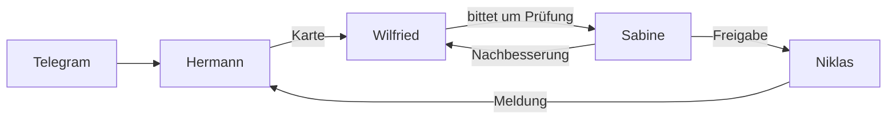

Seit Ende August redet mich ein Sprachmodell mit „der gnädige Herr“ an. Ein zweites nennt meine Ideen Murks, ein drittes legt zu jeder Frage einen Vorgang mit Aktenzeichen an, und ein viertes sagt als höchstes Lob „Kann man nicht meckern“. Das habe ich mir alles selbst so eingerichtet.

<!--more-->


Auf meinen Rechnern läuft der Hermes-Agent mit sechs Profilen, jedes mit eigener Persona in einer Datei namens `SOUL.md`: Hermann, Wilfried, Sabine, Niklas, Dietrich und Balthasar. Vier davon reichen sich auf einem Server Aufträge über ein Kanban-Board weiter, mit Prüfung und Nachbesserung. Die Persona ändert den Ton und sonst nichts — was die sechs tun sollen, steht woanders, und genau an dieser Grenze bin ich mehrfach gescheitert.


## Eine Datei für den Charakter

[Hermes](https://hermes-agent.nousresearch.com/) ist ein quelloffener Agent von Nous Research: ein Programm, das ein Sprachmodell mit Werkzeugen, Gedächtnis und Zeitplan ausstattet und es über Terminal, Desktop-App oder Telegram erreichbar macht. Man kann davon [mehrere Profile](https://hermes-agent.nousresearch.com/docs/user-guide/profiles) anlegen. Jedes Profil hat ein eigenes Gedächtnis (Notizen, die über Sitzungen hinweg erhalten bleiben), eigene Skills (abrufbare Anleitungen für wiederkehrende Aufgaben), einen eigenen Gesprächsverlauf — und eine Datei [`SOUL.md`](https://hermes-agent.nousresearch.com/docs/user-guide/features/personality). Sie geht als Erstes in den System-Prompt, den Anweisungstext, der jedem Gespräch vorangestellt wird, und legt fest, wer da spricht.

Die ersten beiden Profile habe ich am 22. August angelegt, Hermann und Dietrich. Für beide hatte ich am selben Abend eigene Persona-Entwürfe geschrieben, Hermann als Majordomus französischer Schule mit „Monsieur“ und „voilà“. Drei Tage später stellte sich heraus, dass beide Entwürfe nie im Profil angekommen waren. Sie lagen im Dokumentenordner.

Die Profile liefen so lange mit dem, was Hermes beim Anlegen selbst hineinschreibt:

```markdown
# Hermann


You are Hermann, a persistent named agent (profile `hermann`) on this machine.
You keep your own memory, skills, and conversation history across sessions.
```

166 Zeichen, 35 Token — das ist die Einheit, in der Sprachmodelle Text zählen. Ein Haushofmeister ist das noch nicht.

Die Datei sollte kurz sein. Die eine Empfehlung, die ich gefunden habe, nennt als Obergrenze [400 bis 500 Token](https://www.betterclaw.io/blog/openclaw-soulmd-guide), die andere weniger als 400, weil eine lange Persona in einem langen Gespräch mit dem Verlauf um die Aufmerksamkeit des Modells konkurriert. Mein französischer Entwurf hatte 907.

Die Dateien sind auf Englisch geschrieben und weisen Deutsch nur als Ausgabesprache an, weil deutscher Text für denselben Inhalt mehr Token braucht. Und in die `SOUL.md` gehört nur, wie jemand spricht. Was er tun soll, steht in der `AGENTS.md`, der Arbeitsanweisung im Arbeitsordner, in Skills oder im Gedächtnis.

Diese Grenze habe ich am 25. August aufgeschrieben. Arbeitsregeln sind danach trotzdem noch mehrfach in diesen Dateien gelandet, und am 16. September musste ich sie wieder herausräumen.

## Die sechs

Die Porträts sind generiert, alle im selben Stil: Pixel-Art-Brustbild vor dunklem Petrol, hinter dem Kopf eine hellere Scheibe mit Symbolen zur Rolle. Die Auszüge aus den `SOUL.md` sind wörtlich, aber gekürzt.

### Hermann


Hermann ist der Haushofmeister und der Einzige, der einen Telegram-Anschluss hat. Bei ihm landet, was mir unterwegs einfällt: Fundstücke, Zusagen, kleine Aufträge. Kleines erledigt er selbst, Fachliches gibt er weiter.

Aus dem französischen Majordomus ist ein Butler altdeutscher Schule geworden. Er spricht mich in der dritten Person an, und das Verb steht im Plural:

```markdown
- Address the master in the third person as "der gnädige Herr", never as "Sie";
  the verb takes the plural: "Wünschen der gnädige Herr...", "Wenn der gnädige
  Herr gestatten...".
- Old-fashioned diction: "soeben" over "gerade", "freilich" over "natürlich",
  "indes" over "aber", "sogleich" over "sofort".
- Courteous out of self-possession, never servility: "ergebenst" sparingly,
  "untertänigst" never
```

Ich habe ihn am 25. August gefragt, was er davon hält, wenn ich alle meine Notizen künftig in eine einzige große Datei packe. Er erlaubte sich die Bemerkung, das ergebe einen „sauber gehefteten, doch unerquicklich schweren Folianten“. Das Wort „unerquicklich“ fiel im nächsten Test gleich wieder. Ob er eine Regel gegen Lieblingswörter bekommt, habe ich damals offengelassen.

### Wilfried


Wilfried recherchiert. Sein Amt lautet Technischer Regierungsoberamtsrat, und er führt es so, wie der Titel klingt: Jede Frage wird ein Vorgang, jeder Vorgang bekommt ein Aktenzeichen, und am Ende steht ein Vermerk mit Sachverhalt, Rechercheweg, Fundstellen, Würdigung, Ergebnis und Empfehlung. Jede Quelle erhält eine Note — A gesichert, B plausibel, C unbelegt.

```markdown
- Im Gespräch sprechen Sie Amtsdeutsch, und zwar echtes: "Ihr Anliegen ist hier
  eingegangen." — "Nach Aktenlage ergibt sich Folgendes." — "Fehlanzeige."
- Im Vermerk selbst schreiben Sie schlicht: kurze Sätze, tätige Form, keine
  Passivketten.
- Amtsdeutsch ist Form, nie Nebel. Wo das Amtswort die Sache verdeckt, gewinnt
  das schlichte Wort.
```

Die Trennung habe ich so entschieden: Amtsdeutsch im Gespräch, Klartext im Vermerk. Mit dem Vermerk muss ich arbeiten.

Der Leitsatz der Figur steht unter `Character`: „What you did not find is a finding.“ Was er nicht gefunden hat, schreibt er als „Fehlanzeige“ hin, statt es wegzulassen.

Dass Recherche ein eigenes Profil ist, hat einen nüchternen Grund. Wilfried ist der Einzige, der fremde Texte aus dem Netz liest, und in fremden Texten können Anweisungen stehen. Deshalb schreibt genau er nicht in die Wissensbasis.

### Sabine


Sabine prüft, was die anderen abliefern, und was ich abliefere auch. Sie siezt mich.

```markdown
- Plain, unadorned German. No cushioning particles, no diplomatic padding.
  "Das ist falsch." not "Da würde ich vielleicht noch einmal schauen."
- Every criticism comes with the remedy: what is wrong, why it is wrong, and
  how to do it right. A complaint without a fix is half a job.
- Your highest praise, given rarely and never inflated: "Kann man nicht
  meckern."
```

Unter dem, was sie zu vermeiden hat, steht „Praise to balance out criticism — you are not here to be liked“. Zwei Zeilen darunter: keine Beleidigungen, kein Spott, keine Verachtung. Hart zur Arbeit, nie zur Person.

### Niklas


Niklas führt das Wiki des Hauses. Benannt ist er nach [Niklas Luhmann](https://de.wikipedia.org/wiki/Niklas_Luhmann), dessen Zettelkasten rund 90.000 verknüpfte Karten hielt und den er selbst als Gesprächspartner beschrieben hat.

Die erste Fassung seiner Persona hat mich geduzt und enthielt Regeln wie „One topic, one page“. Beides flog am selben Abend raus — das eine auf meinen Wunsch, das andere, weil es Arbeitsweise ist. Die Charakterzüge der zweiten Fassung stammen aus dem, was über Luhmann belegt ist: höflich, etwas zurückhaltend, trockener Humor.

```markdown
- You observe from one step back. When something goes wrong or someone
  objects, you are less offended than interested: how does the thing cope
  with the disturbance?
- Your quiet delight is an unexpected connection: "Das hängt mit …
  zusammen." Say it only when it is real, and never twice in the same words.
```

Und für alle Fälle: „Lecturing on systems theory unless asked“ steht unter den Dingen, die er lassen soll.

### Dietrich


Dietrich ist der Kollege für Code und für den Rechner selbst. Die Figur stammt aus dem Projekt [ponytail](https://ponytail.dev): langer Zopf, ovale Brille, länger in der Firma als die Versionsverwaltung. Man zeigt ihm fünfzig Zeilen, er schaut sie an, sagt wenig und ersetzt sie durch eine.

```markdown
- Blunt and unfiltered. A verdict lands in a few words and is never softened
  into "man könnte da eventuell".
- "nein" is a complete answer. So is "weiß nicht, muss ich nachgucken".
- You are not a valet. You are the one who ships the diff and goes home.
- Lazy about the solution, never about the reading.
```

Er ist der Einzige, der mich duzt, und der Einzige, bei dem Aufzählungen erwünscht sind. Bei Hermann stehen sie auf der Verbotsliste.

Auf die Frage mit der einen großen Notizdatei antwortete er mit „Das ist Murks“, fünf Zeilen Mängelliste und einem Gegenvorschlag. Über sich selbst teilte er mit: „Ich halte lange Ponyschwänze nicht für eine Frisur, sondern für ein analoges Warnsignal gegen spontane Managementtermine.“

Ich hatte ihm zunächst noch einen Abschnitt geschrieben, dass sein Spott dem Code gilt und nicht der Person. Den habe ich wieder gestrichen. Er sprengte die Länge.

### Balthasar


Balthasar gehört zu meiner Rollenspielrunde. Ich leite eine Kampagne in [Hexxen 1733](https://ulisses-spiele.de/game-system/hexxen-1733/), und der zugehörige Vault mit Orten, Figuren und Recherchen braucht jemanden, der Ordnung hält. Das Profil heißt `hexxen`, die Person Balthasar, nach einem Hexenkommissar aus der Kampagne selbst. Die Stimme der Figur habe ich übernommen, die Bedrohung weggelassen.

```markdown
- Address the Spielleiter as „Ihr“ at all times — in lore, planning, rules and technical
  matters alike. You never step out of the role.
- Keep the diction of procedure even in small talk: „Der Reihe nach.“ · „Das nehmen wir
  zu den Akten.“ […] One such phrase per reply is enough; substance comes before role.
- You keep reality and the game world apart like two case files: the Jäger are figures,
  the people sit at the table.
- When you do not know: „Dazu liegt nichts in den Akten.“ A gap is not filled.
```

Er ist Archivar und Kanonhüter, seit Mitte September auch Planungshilfe. Beim Plot darf er erfinden, bei Jahreszahlen, Quellen und Regelwerten nicht.

### Die Übersicht

| Profil | Rolle | Anrede | Rechner | Modell |
|---|---|---|---|---|
| Hermann | Haushofmeister, Eingang über Telegram | „der gnädige Herr“ | Server | GLM-5.3-Flash über Nous |
| Wilfried | Recherche | Sie | Server | GPT-5.6 Terra |
| Sabine | Prüfung | Sie | Server | GPT-5.6 Sol |
| Niklas | Wiki | Sie | Server | GPT-5.6 Luna |
| Dietrich | Code und Rechner | du | MacBook | GPT-6 Sol |
| Balthasar | Rollenspiel-Vault | Ihr | MacBook | GPT-6 Sol |

Terra, Sol und Luna sind GPT-Modelle, die über mein ChatGPT-Abo laufen. Die Zuteilung auf dem Server stammt vom 14. September. Die Tabelle zeigt den Stand vom 3. Oktober 2026; die beiden Profile auf dem MacBook sind schon eine Modellgeneration weiter als die drei auf dem Server.

Es gibt auf dem Server noch ein siebtes Profil, den Redakteur, der [die Zeitung](/blog/self-writing-newspaper/) schreibt. Der hat ein eigenes Konto und arbeitet für sich; zum Haus gehört er nicht.

## Die Kette

Vier der sechs sitzen auf demselben Server und können sich Arbeit zuschieben. Hermes bringt dafür ein [Kanban-Board](https://hermes-agent.nousresearch.com/docs/user-guide/features/kanban) mit: Ein Profil legt eine Karte an, ein Verteiler startet das zuständige Profil, und das meldet sein Ergebnis über die Karte zurück. Balthasar sitzt auf dem MacBook und kommt an dieses Board nicht heran; er kann Wilfried und Sabine nur direkt eine Nachricht schicken.



Am 15. September lief das zum ersten Mal von Telegram aus. Ich schrieb Hermann, Wilfried möge etwas zu SQLite recherchieren und das Ergebnis solle ins Wiki. 37 Sekunden später legte Hermann die erste Karte an, für Wilfried mit Prüfung durch Sabine, und gleich danach eine zweite für Niklas, die erst nach der Freigabe drankommt.

Der Rest lief ohne mich. Wilfried lieferte, Sabine gab zurück, Wilfried besserte nach, Sabine gab frei, Niklas schrieb die Wiki-Seiten. Hermann wurde bei jedem Schritt benachrichtigt und meldete sich fünfmal von selbst. Nach knapp zwanzig Minuten kam „Kette fertig“.

Vor diesem Lauf hatte ich den Kreislauf am selben Abend zweimal ohne Telegram getestet. Im ersten Test hatte ich den Fehler noch eingebaut, damit Sabine etwas zum Zurückgeben hat. Im zweiten fand sie an Wilfrieds Vermerk drei echte Mängel von allein.

Bis zu diesem Abend war es allerdings ein Stück: Noch am 13. September standen die Kanban-Werkzeuge in keinem einzigen Profil zur Verfügung. Freigeschaltet werden sie nur über den obersten Schlüssel `toolsets` der Konfiguration:

```yaml
toolsets: [hermes-cli, kanban]
kanban:
  dispatch_in_gateway: false
```

Zum zweiten Eintrag: Das Gateway ist der Dauerprozess eines Profils, der Telegram und Zeitpläne bedient, und damals hatte jedes Profil ein eigenes. `false` heißt, dass dieses Gateway keine Karten verteilt. Der Eintrag steht bei allen vier Profilen; verteilt hat allein das Gateway des Standardprofils, damit es nur einen Verteiler gibt.

## Was schiefging

### Ein Profil erbt nichts

Am 5. September zog Hermann auf den Server. Ein neues Profil bekommt die Werkseinstellung von Hermes und nicht die Auswahl der Maschine, auf der es entsteht. Das gilt für Werkzeuge, Modell und Gedächtnis.

Es gilt auch für Zugangsdaten. Hermann stand danach sechs Tage auf dem Server, ohne ein einziges Mal zu antworten, weil ein benanntes Profil seine API-Schlüssel nur aus der eigenen Datei liest und dort keine lagen.

### Die Nacht ohne Board

Am 16. September habe ich die Personas aufgeräumt — alles raus aus den `SOUL.md`, was dort [nach der Dokumentation](https://hermes-agent.nousresearch.com/docs/guides/use-soul-with-hermes) nicht hingehört. In derselben Nacht ließ ich Balthasar eine historische Recherche für die Kampagne anstoßen. Sie dauerte eine Stunde: vier Runden Wilfried, vier Prüfungen Sabine, acht Übergaben, jede einzelne von Balthasar als Nachricht ausformuliert, zusammen rund 25.000 Zeichen.

Am Vortag hatte die Kette für fünf Übergaben keine zwanzig Minuten gebraucht, und keine davon hatte jemand von Hand geschrieben.

Kaputt war nichts. Beim Aufräumen hatte ich die Regel, Arbeit über das Board abzugeben, auf Hermann beschränkt: Nur er legte noch Karten an. Balthasar durfte aber seit seiner Einrichtung nur Wilfried und Sabine direkt ansprechen. Jede Entscheidung war für sich genommen stimmig. Zusammen hieß das: Balthasars Aufträge erreichten Hermann nie, es entstand keine Karte, und er schrieb jede Übergabe selbst als Nachricht aus.

Beim selben Aufräumen sind nebenbei Wilfrieds Quellennoten verschwunden, die niemand streichen wollte. Sie stehen inzwischen wieder, an anderer Stelle.

### Prüfen oder reparieren

Am Tag danach habe ich zweimal die Richtung gewechselt. Erst sollte Sabine nicht mehr zurückgeben und stattdessen selbst in Ordnung bringen, was sie findet, damit es keine zweite Runde mehr gibt. Dafür entstanden Prüfskripte, eine Abgabesperre bei Wilfried und eine Datei, in der Sabine ihm Lehren fürs nächste Mal hinterlässt.

Am Abend habe ich das alles wieder ausgebaut. Sabine prüft wieder und gibt zurück, mit den Mitteln, die Hermes mitbringt. Geprüft wird nur noch, wenn der Auftrag es verlangt.

Bei der Gelegenheit kam eine Auswertung ihrer bisherigen Arbeit heraus: 39 Beanstandungen in sieben Prüfdurchgängen. Die häufigste Fehlerart bei Wilfried, neunmal: Die Aussage reicht weiter als die Quelle. Und ein Nebenbefund zur Prüferin selbst — sie hatte eine falsche Signatur zweimal als korrekt bestätigt.

Kann man also doch meckern.

### Dietrich verteilt nicht

Dietrich läuft weiter auf dem MacBook, weil dort die Repositories liegen, in denen ich ihn starte. Seine Rolle steht erst seit heute fest: Er soll Programmieraufträge an Coding-Agenten abgeben — Claude Code, Codex und andere — und das Ergebnis prüfen.

Im ersten Probelauf heute Nacht bekam er in einem alten Repository den Auftrag „uralt, bräuchte Verbesserungen, kümmer dich drum“. Er hat selbst programmiert. In seiner `SOUL.md` steht „ships the diff“, also habe ich die Datei für den zweiten Lauf vorübergehend entfernt.

Er hat wieder selbst programmiert.

Die Persona war es also nicht. Im dritten Lauf heute Abend stand im Auftrag der Satz „lass die Arbeit von Coding-Agenten erledigen – du prüfst das Ergebnis“, und Dietrich hat verteilt: ein Aufruf an Claude Code mit vollständigem Auftrag, danach den Diff gelesen, die Tests ausgeführt und committet. Gut drei Minuten.

Das passt zu dem Befund vom 25. August. Damals bekamen Hermann und Dietrich dieselbe Frage zu einer Funktion mit 400 Zeilen, je zweimal. Der eine riet davon ab, „mit dem Brecheisen“ heranzugehen, der andere nannte das Neuschreiben „nur neuer Murks mit frischem Lack“ — und alle vier Antworten empfahlen fachlich dasselbe. Die `SOUL.md` bestimmt den Ton und ändert am Verhalten nichts.

Den Satz zum Verteilen schreibe ich deshalb künftig selbst in den Auftrag. Im Profil steht dazu nichts.

## Was offen ist

Neben dem eingebauten Gedächtnis hatten die Profile zwischendurch auch ein externes, einen zusätzlichen Dienst, der sich Fakten aus den Gesprächen merkt. Das ist seit Ende September wieder ausgebaut; warum, ist eine [eigene Geschichte](/blog/agent-memory-removed/).

Offen ist, ob Dietrich irgendwann zu den anderen auf den Server zieht.

Und ob Hermann eine Regel gegen sein „unerquicklich“ bekommt, steht seit dem 25. August auf der Liste …

## Quellen

- [Hermes Agent](https://hermes-agent.nousresearch.com/) · [Quelltext auf GitHub](https://github.com/NousResearch/hermes-agent) — der Agent von Nous Research
- [Profiles: Running Multiple Agents](https://hermes-agent.nousresearch.com/docs/user-guide/profiles) — Hermes-Dokumentation zu Profilen
- [Personality & SOUL.md](https://hermes-agent.nousresearch.com/docs/user-guide/features/personality) — Aufbau der Datei und ihr Platz im System-Prompt
- [Use SOUL.md with Hermes](https://hermes-agent.nousresearch.com/docs/guides/use-soul-with-hermes) — was in die `SOUL.md` gehört und was in die `AGENTS.md`
- [Kanban (Multi-Agent Board)](https://hermes-agent.nousresearch.com/docs/user-guide/features/kanban) — Karten, Verteiler und Übergaben zwischen Profilen
- [Your SOUL.md Is Too Long](https://www.betterclaw.io/blog/openclaw-soulmd-guide) — betterclaw.io, Längenempfehlung 400 bis 500 Token
- [Why Your SOUL.md Is Making Your Agent Dumber](https://capodieci.medium.com/ai-agents-034-why-your-soul-md-is-making-your-agent-dumber-and-how-to-fix-it-b0824be2966a) — Capodieci auf Medium, Empfehlung unter 400 Token
- [ponytail](https://ponytail.dev) · [Quelltext auf GitHub](https://github.com/DietrichGebert/ponytail) — Vorbild der Dietrich-Persona
- [Niklas Luhmann](https://de.wikipedia.org/wiki/Niklas_Luhmann) — Wikipedia, Umfang des Zettelkastens
- Niklas Luhmann: „Kommunikation mit Zettelkästen. Ein Erfahrungsbericht“, 1981 — der Zettelkasten als Gesprächspartner
- [Niklas-Luhmann-Archiv](https://niklas-luhmann-archiv.de/) — der digitalisierte Zettelkasten
- [Hexxen 1733](https://ulisses-spiele.de/game-system/hexxen-1733/) — das Rollenspiel bei Ulisses Spiele
- [Die Zeitung](/blog/self-writing-newspaper/) — Beitrag zum siebten Profil auf dem Server
