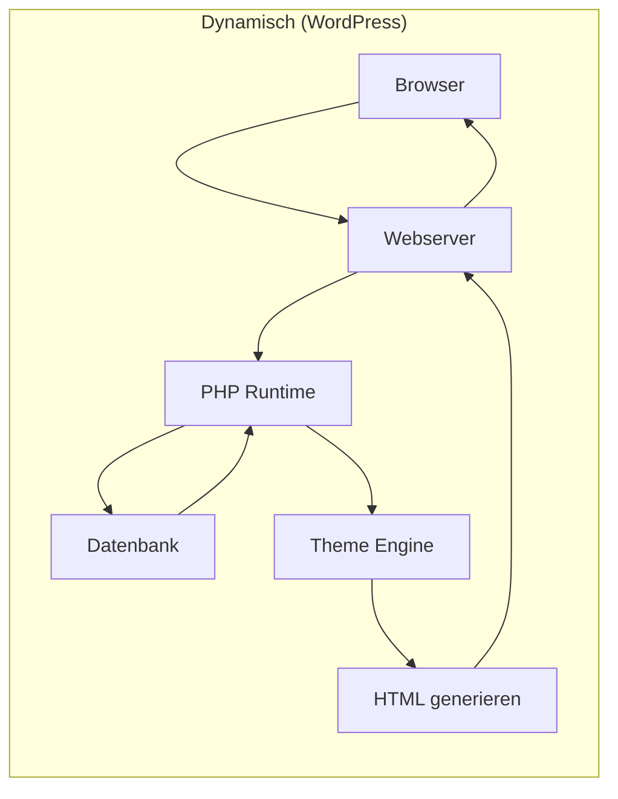
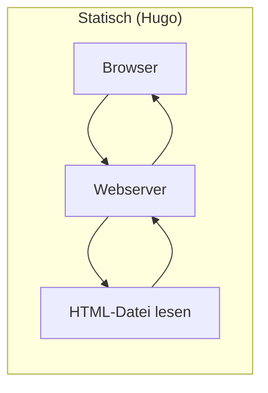
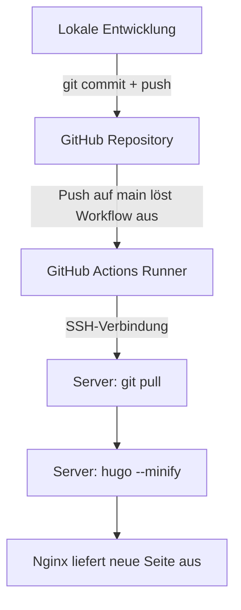
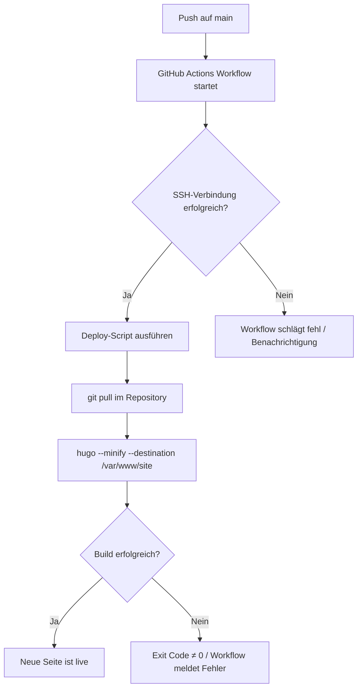

Wer heute eine Website aufsetzen möchte, steht schnell vor einer Grundsatzfrage: ein dynamisches CMS wie WordPress oder ein Static Site Generator wie Hugo? Beide Ansätze haben ihre Berechtigung. Dieser Artikel beleuchtet die technischen Unterschiede, erklärt die Vorteile statischer Seiten und beschreibt ein konkretes Self-Hosting-Setup mit Hugo, Nginx und einer CI/CD-Pipeline über GitHub Actions.

<!--more-->

## Statische Seiten vs. dynamische Systeme

WordPress betreibt rund 40 Prozent aller Websites im Internet. Es ist flexibel, gut dokumentiert und hat ein riesiges Plugin-Ökosystem. Gleichzeitig bringt es eine erhebliche Komplexität mit sich: eine Datenbank, eine PHP-Laufzeitumgebung, regelmäßige Updates für Core, Themes und Plugins — und eine Angriffsfläche, die mit jeder zusätzlichen Komponente wächst.

Ein Static Site Generator wie Hugo verfolgt einen anderen Ansatz. Der gesamte Content wird als Markdown-Dateien im Repository verwaltet. Beim Build-Prozess erzeugt Hugo daraus fertige HTML-, CSS- und JavaScript-Dateien. Der Webserver liefert diese Dateien direkt aus — ohne Datenbank, ohne serverseitige Logik, ohne Laufzeitabhängigkeiten.

### Der Unterschied im Request-Handling

Der zentrale Unterschied wird beim Betrachten eines einzelnen Seitenaufrufs deutlich:





Bei einem dynamischen CMS durchläuft jeder Request eine Kette aus PHP-Verarbeitung, Datenbankabfragen und Template-Rendering. Bei einer statischen Seite liest der Webserver eine fertige Datei von der Festplatte und liefert sie aus. Kein Interpretieren, kein Zusammenbauen, kein Warten auf die Datenbank.

### Vorteile eines Static Site Generators

**Sicherheit:** Ohne Datenbank, PHP und Login-Bereich gibt es keine SQL-Injection, keine Plugin-Schwachstellen und keinen Admin-Zugang, den man absichern muss. Die Angriffsfläche reduziert sich auf den Webserver selbst.

**Performance:** Nginx liefert statische Dateien mit minimaler Latenz aus. Unter 100 ms TTFB ist problemlos erreichbar. Es gibt keine Caching-Schichten, die man konfigurieren und invalidieren muss — die Dateien *sind* der Cache.

**Wartung:** Kein Datenbank-Backup, keine PHP-Version, die mit Plugins kollidiert, keine Sicherheitsupdates für dutzende Abhängigkeiten. Die gesamte Seite liegt als Quellcode im Git-Repository.

**Kosten:** Ein Static Site Generator benötigt keine leistungsstarke Serverinfrastruktur. Ein günstiger VPS reicht aus — die CPU-Last beim Ausliefern statischer Dateien ist vernachlässigbar.

**Versionierung:** Jede Änderung an Content, Templates und Konfiguration wird über Git nachvollziehbar dokumentiert. Rollbacks sind trivial.

### Wann ein CMS die bessere Wahl ist

Statische Seiten sind kein Allheilmittel. Wer Redakteure ohne technische Kenntnisse einbinden muss, häufig strukturierte Inhalte über ein Web-Interface pflegt oder komplexe serverseitige Logik benötigt, ist mit einem CMS oder einem Headless-CMS besser bedient. Für persönliche Seiten, Blogs und Dokumentation sind Static Site Generators hingegen eine technisch saubere Lösung.

## Managed Hosting vs. eigener Server

Wer sich für Hugo entschieden hat, steht vor der nächsten Frage: Wohin mit der fertigen Seite? Plattformen wie Netlify, Vercel oder Cloudflare Pages bieten kostenloses Hosting, automatische Deploys und eine einfache Einrichtung. Die kostenlosen Tarife haben allerdings Grenzen: Bandbreitenlimits, Build-Minuten-Budgets und eine Abhängigkeit von der Infrastruktur und den Produktentscheidungen des jeweiligen Anbieters.

Ein eigener Server bietet mehr Kontrolle — über Konfiguration, Abhängigkeiten und Laufzeit. Dieser Kontrollgewinn kommt mit entsprechendem Verwaltungsaufwand. Wer ohnehin schon andere Dienste auf einem VPS betreibt, kann die Website dort mithosten; der Zusatzaufwand bleibt dann überschaubar.

## Ein mögliches Setup: VPS + Hugo + Nginx

Ein verbreitetes Setup für das Self-Hosting statischer Seiten besteht aus:

- **Ein VPS** (etwa von Hetzner, Contabo oder einem anderen Anbieter) als Hosting-Plattform — ab etwa 4–8 Euro pro Monat
- **Hugo extended** für den Build — schnell, zuverlässig, keine Laufzeitabhängigkeiten
- **Nginx** für die Auslieferung der statischen Dateien

Nginx ist für statische Dateien sehr schnell. Mit aktiviertem Gzip und HTTP/2 lassen sich gute Ladezeiten erzielen — unter 100 ms TTFB aus Deutschland ist problemlos erreichbar. Für eine persönliche Seite, die hauptsächlich von Menschen in der DACH-Region besucht wird, ist ein globales Edge-Netzwerk in der Regel nicht notwendig.

### Hugo Pipes: Asset-Verarbeitung ohne externe Tools

Hugo bringt mit Hugo Pipes eine eigene Asset-Pipeline mit. CSS- und JavaScript-Dateien werden nicht einfach kopiert, sondern können beim Build verarbeitet werden:

- **Fingerprinting:** Hugo berechnet einen Hash über den Dateiinhalt und hängt ihn an den Dateinamen an (`style.abc123.css`). Ändert sich der Inhalt, ändert sich der Dateiname — Browser laden automatisch die neue Version.
- **Minification:** CSS und JS werden komprimiert, um die Dateigröße zu reduzieren.
- **Bundling:** Mehrere CSS- oder JS-Dateien können zu einer einzigen zusammengefasst werden.

Durch das Fingerprinting können Nginx-Cache-Header für Assets aggressiv gesetzt werden — ein Jahr Caching für CSS und JS, während HTML-Seiten immer frisch geladen werden. Die Kombination aus Hugo Pipes und Nginx macht externe Build-Tools wie Webpack oder PostCSS für viele Anwendungsfälle überflüssig.

## Der Gesamtworkflow: Vom Editor bis zur Live-Seite

Bevor es um die technischen Details der CI/CD-Pipeline geht, lohnt ein Blick auf den Gesamtworkflow. Vom Schreiben eines Artikels bis zur Veröffentlichung durchläuft eine Änderung mehrere Stationen:



**Lokale Entwicklung:** Content wird als Markdown geschrieben, Templates und CSS lokal angepasst. Mit `hugo server` lässt sich die Seite lokal in Echtzeit begutachten — Hugo baut bei jeder Dateiänderung in Millisekunden neu.

**Git Push:** Ein `git push` auf den `main`-Branch löst den gesamten Deploy-Prozess aus. Es gibt keinen manuellen Deploy-Schritt, kein FTP, kein Hochladen einzelner Dateien.

**GitHub Actions:** Der CI/CD-Runner stellt eine SSH-Verbindung zum Server her und führt dort ein Deploy-Script aus.

**Server-Build:** Hugo baut die Seite direkt auf dem Server. Nginx liefert die neuen Dateien sofort aus.

**Rollback:** Da die gesamte Seite im Git-Repository liegt, ist ein Rollback ein `git revert` gefolgt von einem Push. Der gleiche Pipeline-Prozess baut die vorherige Version und stellt sie bereit. Kein Datenbank-Restore, kein Snapshot-Management — nur Git.

## CI/CD mit GitHub Actions

### Warum der Build auf dem Server stattfindet

Eine gängige Praxis bei CI/CD-Pipelines ist es, den Build auf dem Runner durchzuführen und das fertige Ergebnis per `rsync` oder `scp` auf den Server zu übertragen. Für eine Hugo-Seite gibt es einen einfacheren Ansatz: den Build direkt auf dem Server.

Die Gründe dafür:

- **Kein Artefakt-Transfer:** Ein fertiges `public/`-Verzeichnis muss nicht über das Netz übertragen werden. Bei einer Seite mit vielen Bildern spart das Zeit und Bandbreite.
- **Hugo ist bereits installiert:** Wenn der Server ohnehin Hugo vorhält, ist ein `hugo --minify` in unter einer Sekunde abgeschlossen.
- **Weniger Angriffsfläche auf dem Runner:** Der Runner führt keine Build-Tools aus, installiert keine Abhängigkeiten und checkt kein Repository aus. Er ist nur ein Trigger.

### Warum keine Third-Party Actions

Der GitHub Actions Marketplace bietet zahlreiche vorgefertigte Actions für SSH-Deploys, Hugo-Builds und vieles mehr. Der Einsatz solcher Actions birgt ein Supply-Chain-Risiko: Eine kompromittierte oder veränderte Third-Party-Action kann beliebigen Code auf dem Runner ausführen — mit Zugriff auf alle Secrets des Workflows.

Wer auf Third-Party-Actions verzichtet und ausschließlich eigene SSH-Befehle nutzt, reduziert diese Angriffsfläche erheblich. Der YAML-Workflow enthält dann nur eine SSH-Verbindung und einen Script-Aufruf — kein fremder Code, keine externen Abhängigkeiten.

### Der Workflow im Detail



Die Credentials für den SSH-Zugang — Host, Benutzername und privater Schlüssel — werden als GitHub Secrets hinterlegt. Der Deploy-User auf dem Server erhält minimale Rechte und kann per SSH ausschließlich das Deploy-Script ausführen.

### Ein vereinfachtes YAML-Beispiel

```yaml
name: Deploy

on:
  push:
    branches: [main]

jobs:
  deploy:
    runs-on: ubuntu-latest
    steps:
      - name: Deploy via SSH
        env:
          SSH_KEY: ${{ secrets.SSH_PRIVATE_KEY }}
          SSH_HOST: ${{ secrets.SSH_HOST }}
          SSH_USER: ${{ secrets.SSH_USER }}
        run: |
          mkdir -p ~/.ssh
          echo "$SSH_KEY" > ~/.ssh/deploy_key
          chmod 600 ~/.ssh/deploy_key
          ssh -o StrictHostKeyChecking=accept-new \
              -i ~/.ssh/deploy_key \
              "${SSH_USER}@${SSH_HOST}" \
              "/opt/deploy/build-site.sh"
```

Das Deploy-Script auf dem Server (`build-site.sh`) übernimmt den Rest: `git pull`, `hugo --minify` mit dem Zielverzeichnis, optional eine Prüfung des Exit-Codes. Bei einem Fehler im Build bleibt die vorherige Version bestehen — Hugo schreibt erst in das Zielverzeichnis, wenn der Build erfolgreich abgeschlossen ist.

## Unterstützung durch KI-Werkzeuge

Beim Aufbau der CI/CD-Pipeline, der Nginx-Konfiguration und der Deploy-Skripte können KI-gestützte Coding-Assistenten nützlich sein. Die Nginx-Konfiguration mit korrekten Cache-Headern, Security-Headers und CSP-Direktiven ist fehleranfällig und zeitraubend — eine generierte Ausgangsbasis lässt sich schneller anpassen als ein leeres Editor-Fenster zu füllen.

Auch das Durchdenken der CI/CD-Strategie eignet sich gut für das Gespräch mit einem Sprachmodell. Entscheidungen wie die Verlagerung des Builds auf den Server statt auf den Runner lassen sich im Dialog strukturiert durchdenken und begründen.

Sinnvoll eingesetzt sind solche Werkzeuge: als Gesprächspartner und Generator von Ausgangsmaterial, nicht als Autopilot.

## Abwägung: Kontrolle und Aufwand

Self-Hosting bedeutet: mehr Kontrolle, mehr Verständnis der eigenen Infrastruktur, aber auch mehr Eigenverantwortung. Die gesamte Konfiguration liegt als Code im Repository. Updates müssen selbst eingespielt, der Server muss gewartet werden.

Die laufenden Kosten — rund 60–80 Euro im Jahr für Server und Domain — sind überschaubar. Dem steht ein Setup gegenüber, das vollständig nachvollziehbar, versioniert und unabhängig von Plattformentscheidungen Dritter ist.

Für Menschen, die ohnehin Interesse an Infrastruktur und vollständiger Kontrolle über ihren Stack haben, ist Self-Hosting mit Hugo und Nginx ein solides Setup. Wer einfach nur schnell online gehen möchte, ist mit einer Plattformlösung wahrscheinlich besser bedient.
