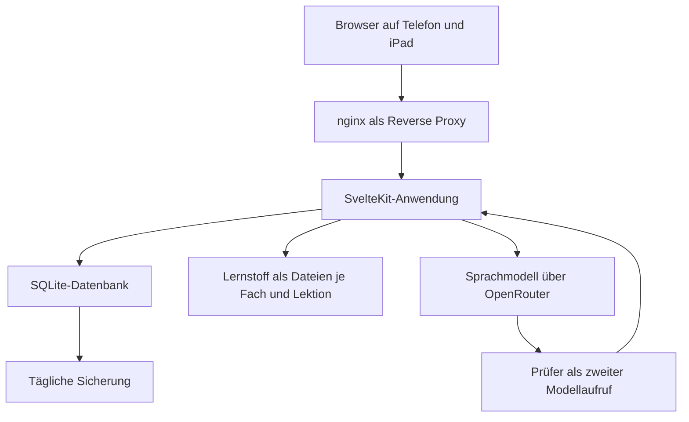

Am Freitagabend hatte ich zwei Töchter, die Französisch lernen wollten. Heute, fünf Tage später, steht daraus eine Lernseite bei Version 1.9, und in ihr wohnen zwei Drachen. Dazwischen hat die Seite Korrekturen verschluckt, Erfolg gemeldet, wo keiner war, und einen der beiden Drachen zwei Tage zu spät schlüpfen lassen.

<!--more-->

## Warum ein Drache

Vokabeln lernt niemand freiwillig, auch nicht mit einer hübschen Oberfläche. Also bekommt jeder, der auf der Seite lernt, ein Ei. Wer übt, bringt es zum Schlüpfen, und was herauskommt, wächst mit jeder Lerneinheit weiter.

Vor dem ersten Code stand eine Recherche zur Gamification, und ihr Kernbefund war ernüchternd: Die Spielschicht wirkt auf die Motivation, kaum auf das Können. Das Lernverfahren trägt die Leistung, der Drache nur das Dranbleiben. Für die Vokabeln ist das Verfahren deshalb ein altes — Karteikästen nach Leitner, bei denen ein gewusstes Wort ins nächste Fach wandert und seltener wiederkommt.

Der Drache gehört dabei dem, der lernt, und nicht der Lektion. Er wächst an vier Lernarten — Begriffe, Regeln, Wissen, Anwenden —, und jedes Fach bildet seine Übungen darauf ab. Ein zweites Fach ist dann ein weiterer Ordner und kein zweiter Drache.

## Der Aufbau



Der Lernstoff liegt als Markdown und JSON in Ordnern, die Anwendung liest ihn als Daten ein. Das Sprachmodell kam erst am dritten Tag dazu. Was es an Hinweisen und im Chat schreibt, liest inzwischen ein zweiter Aufruf gegen.

| Komponente | Technologie | Anmerkung |
|---|---|---|
| Anwendung | SvelteKit 2 mit Svelte 5 | läuft als systemd-Dienst hinter nginx |
| Daten | SQLite mit Drizzle | Sicherung mit `VACUUM INTO`, weil `cp` im WAL-Modus kein konsistentes Abbild liefert |
| Anmeldung | Better Auth | eigene Konten, Rollen seit Version 1.5 |
| Gestaltung | Catppuccin, seit 1.5 mit Tailwind | der erste Entwurf in Schwarz-Gelb fiel als „Industrielook“ durch |
| Wiederholung | Leitner-Verfahren | Abstände auf sieben Tage gedeckelt |
| Sprachmodell | OpenRouter, seit 1.3 `openai/gpt-6-luna` | Denkstufe `medium`, nach Proben an echten Eingaben gewählt |

Gebaut hat das ein Team aus Claude-Code-Agenten, am ersten Abend siebzehn Stück. Später kam ein Projektleiter dazu, der die Arbeit der anderen abnimmt oder zurückschickt. Wer [den Rückbau bei Denkzettel](/blog/denkzettel-prozess-rueckbau/) gelesen hat, darf an dieser Stelle die Augenbraue heben.

## Der erste Abend

Am Anfang standen rund 11.000 Wörter Markdown: vier Kapitel Erzähltext, die Vokabelliste, drei Tafelbilder und ein Arbeitsblatt zur Grammatik.

Noch am selben Abend gab es den ersten Commit, kurz darauf lief die Seite auf dem Server: Erklärtexte, ein Vokabeltrainer mit 225 Wörtern in beide Richtungen, ein Nest mit Ei. Im Lauf des Abends kamen 142 Übungsaufgaben dazu.

Bei 39 von 41 Auswahlaufgaben stand die richtige Antwort an erster Stelle.

Seitdem mischt der Server die Antworten. Und noch am selben Abend flog der Termin aus der Anwendung, auf den hin gelernt wurde — er stand in der Datenbank, auf der Startseite und an zwanzig Stellen in den Texten. Mein Einwand dagegen war kurz: „Sie sollen Freude am Lernen haben.“ Wo vorher stand, dass die Akzente am Stichtag mitzählen, steht jetzt: „ein Wort ohne Akzent ist ein anderes Wort“. Das stimmt auch ohne Datum.

## Belohnt wird das Lernen

Der Drache wuchs in Segmenten, und an den Segmenten hing eine Schwelle: 70 Prozent richtige Antworten. Das klang am Freitag vernünftig.

Am Montag habe ich in die Datenbank geschaut. Eines der beiden Konten hatte nach 89 Antworten zwei Segmente, das andere sechs — und geschlüpft wird bei sechs. Da hatte also jemand zwei Tage lang geübt und saß immer noch vor einem Ei.

Die Regel, die daraus wurde, steht seither als erster Satz in der Anweisungsdatei des Projekts: Belohnt wird das Lernen, nicht die Richtigkeit. Ob eine Antwort stimmt, entscheidet nur noch, was als Nächstes geübt wird. Version 1.1 rechnete die Segmente neu, aus zwei wurden sechs, und der frisch geschlüpfte Drache entschuldigte sich zur Begrüßung.

Wenige Minuten nach der Auslieferung fiel auf, dass der neue Changelog auf der Anmeldeseite vom „Drachen“ sprach. Die Anmeldeseite sieht jeder, auch wer noch vor seinem Ei sitzt und nicht wissen soll, was darin steckt. Dort heißt er jetzt „dein Kumpel“.

## Der Prüfer und sein Prüfer

Die erste Beschwerde aus dem Betrieb betraf den Vokabeltrainer. Er hatte „eine Art, eine Gattung“ abgelehnt, weil er Antworten Zeichen für Zeichen mit festen Varianten verglich. Eine Auswertung ergab: 95 von 226 aktiven Vokabeln waren betroffen, und von 82 Testfällen wurden 45 unfair bewertet.

Der neue Prüfer kennt drei Urteile — richtig, fast, falsch. Ein fehlender Artikel oder ein Tippfehler ist „fast“ und bekommt einen zweiten Versuch. Dazu kam der Knopf „Das war richtig“: Wer sich ungerecht behandelt fühlt, meldet die eigene Antwort, und ein Sprachmodell entscheidet.

Die erste Probe gegen das echte Modell brachte bei 200 Tokens vier leere Antworten von zwölf. Das Modell dachte nach, das Nachdenken ließ sich nicht abschalten, und das Kontingent war aufgebraucht, bevor ein Urteil kam. Mit 1.000 Tokens kam es an. Außerdem zitierte es gern mit Anführungszeichen und zerlegte damit das eigene JSON.

Ursprünglich galt, dass Hinweise beim Lernen nie durch ein Sprachmodell gehen. Das hat drei Tage gehalten. Seit Version 1.3 schreibt das Modell Hinweise zu Inhaltsfragen, und ein zweiter Aufruf gibt sie nur frei, wenn sie stimmen und die Lösung nicht verraten. Der Vorgänger dieses Prüfers hatte in der Probe 9 von 78 verratenden Hinweisen durchgelassen, der neue ließ von 46 falschen keinen durch. Beim Meldeknopf nahm das neue Modell von 60 falschen Eingaben keine an und lehnte 5 von 60 richtigen ab; mit dem ersten waren es 12.

Für eine Richtung musste ich mich entscheiden: Eine gelegentlich verratene Lösung ist hinnehmbar, ein falscher Hinweis nicht.

## Der Drache redet mit

Seit dem dritten Tag spricht der Drache im Nest, ab Stufe 2 kann man mit ihm schreiben. Seit Version 1.8 weiß er dabei, welche Aufgabe gerade auf dem Schirm steht, samt Lösung. Damit er sie nicht herausgibt, las wieder ein Prüfer mit.

Dann habe ich die Regel am selben Abend umgedreht: Der Drache darf die Lösung nennen, dafür zählt der nächste Versuch an dieser Aufgabe nicht. Version 1.8.1 war noch in der Nacht fertig, vom Projektleiter abgenommen — und fiel in zwei Reviews mit frischem Kontext durch.

Die Wortliste, die eine genannte Lösung erkennen sollte, schlug bei Vokabeln auf Hinweise mit „sich“, „durch“ und „hier“ an. Eine Erklärung zu einer längst angezeigten Lösung kostete einen Versuch. Und gebaut war „der ganze Tag zählt nicht“, bestellt war „der nächste Versuch“. Nach zwei Korrekturrunden gilt jetzt: Die Lösung gibt es nur auf ausdrückliche Bitte, und ob sie genannt wurde, entscheidet allein der Prüfer.

## Was schiefging

Noch am ersten Abend haben drei Prüfer mit frischem Kontext über den Code gelesen. Sie brachten acht schwerwiegende Befunde mit, und einer davon hätte die halbe Nacht entwertet. Die Anwendung las Aufgaben und Vokabeln nur ein, solange die Tabellen leer waren. Sämtliche Korrekturen des Abends wären auf dem Server nie angekommen, ohne jede Fehlermeldung.

Das Skript zum Aufspielen passte dazu. Der Neustart des Dienstes schlug fehl, das Skript lief trotzdem weiter und meldete am Ende „HTTP 200“ — von der alten Fassung. Jetzt bricht es ab, wenn der Neustart scheitert.

[Erfolg ohne Wirkung](/blog/rgb-beleuchtung/) hatte ich im August schon einmal als Überschrift. Ich hätte sie mir aufheben sollen.

Am Samstag antwortete die Seite nach einer Auslieferung zwei Minuten lang mit 502. Auf dem Rechner, der gebaut hatte, steht die `umask` auf 077, `rsync -a` übertrug die engen Rechte mit, und der Dienst durfte seine eigenen Dateien nicht lesen. Sieben Neustarts später stand die Ursache im Protokoll.

Am knappsten war es am Montag. Vor Version 1.2 habe ich die Schemaänderung an einer Kopie der echten Datenbank ausprobiert, und `drizzle-kit push` hätte dort wegen einer neuen Spalte mit Vorgabewert die Tabelle mit dem Wachstum der Drachen geleert. Seitdem läuft jede Schemaänderung erst an einer Kopie. Bei Version 1.7 meldete die Probe genau drei Änderungen, bei 1.212 Zeilen vorher wie nachher:

```text
ALTER TABLE drachen_chat ADD uebung text
CREATE INDEX aufgabe_lektion_idx
CREATE INDEX vokabel_lektion_idx
```

Eine Panne gehört den Agenten und damit mir. Einer von ihnen änderte nach meinem Commit noch vier Dateien, von denen eine im Build landete. Agenten hält man vor dem Commit an, nicht danach.

Ein Prüfbericht von außen brachte am Dienstag 32 Befunde. Fünf Prüfer haben sie nachgeprüft: Fünf Befunde waren falsch, darunter Tabellen, die es nicht gibt. Elf widersprachen Entscheidungen, die dokumentiert waren, sechs trafen nur halb zu und hatten keine Wirkung. Was übrig blieb, ging in Version 1.7 ein — und die Anweisungsdatei schrumpfte bei der Gelegenheit von 807 auf 398 Zeilen.

## Von Segmenten zu XP

Heute Nachmittag habe ich nachgerechnet, was eine Lernminute wert ist. Ein Segment waren zehn gezählte Antworten, gleich in welcher Übung. Mit Vokabeln kamen so zwölf Segmente in der Stunde zusammen, mit dem Schreiben eigener Texte drei. Lesen brachte gar nichts.

Die schwerste Übung war also die am schlechtesten bezahlte. Dazu griffen neun Regeln ineinander, darunter eine Mindestzeit von 1,5 Sekunden je Antwort gegen bloßes Durchklicken. Wer ein Wort sofort wusste, war dafür zu schnell.

Die neue Regel passt in einen Satz: Jede Minute Üben bringt etwa zehn Erfahrungspunkte, kurz XP. Wie viele das je Antwort sind, habe ich an einer Kopie der Datenbank gemessen statt geschätzt. Zwischen zwei Antworten liegen im Median 30 Sekunden bei Vokabeln, 8 bei Inhaltsfragen und 81 bei geschriebenen Sätzen.

Der Entwurf hatte mit 6 XP je Antwort gerechnet, gemessen waren es 3,4. Die Mindestzeit hatte in fünf Tagen übrigens zwei Antworten gekostet. Sie ist trotzdem weg.

Lesen zählt jetzt nach der Zeit, die ein Abschnitt im sichtbaren Tab stand, gedeckelt auf die geschätzte Lesezeit. Geschlüpft wird bei 200 XP, die höchste Stufe liegt bei 5.500 — das sind 550 Lernminuten. Dahinter stehen zwölf Notizen zu Lernforschung und Gamification, die zwei Agenten nebenher zusammengetragen haben. Eine davon betrifft eine Auswertung von 128 Studien aus dem Jahr 1999: Erwartete Belohnungen schwächen die innere Motivation, positive Rückmeldung stärkt sie. Die Punkte sollen deshalb zeigen, was das Üben bewirkt hat, und nie wie eine Bezahlung klingen.

## Stand am 30. September

Version 1.9 läuft seit heute Abend. Die Umrechnung hat aus den Antwortprotokollen 819 und 740 XP gemacht, beide Drachen stehen auf Stufe 5. Meine erste Schätzung vom Nachmittag hatte die Reihenfolge der beiden noch andersherum gesehen. Sie war unvollständig.

Das Repository hat 56 Commits und 1.084 Tests; am Sonntag waren es 149. Dazwischen liegen ein Merkzettel mit Textmarker, eine Kontoverwaltung und ein Prüfstand, die hier keinen eigenen Absatz bekommen haben.

Offen ist einiges. In Safari auf iPhone und iPad hat das Markieren noch niemand geprüft, und genau dort wird gelernt. Die Version von heute Abend hat auf einem echten Gerät noch keiner gesehen. Und von der Lektüre stehen vier Kapitel auf der Seite, die Kapitel fünf bis sieben fehlen.

Ob ein Drache am Ende beim Französisch hilft, weiß ich nach fünf Tagen nicht. Die Recherche sagt, er hilft höchstens beim Dranbleiben. Mal sehen, was er dazu sagt, wenn Kapitel fünf dran ist …
