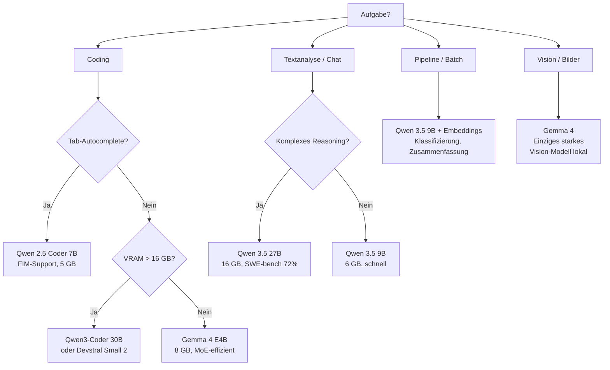
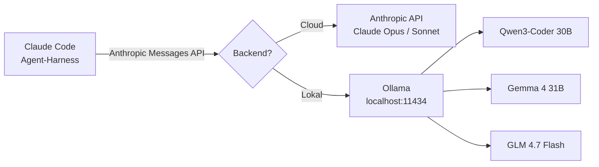
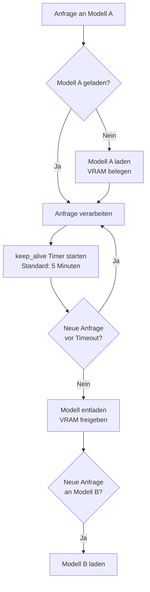

Lokale KI-Modelle haben sich von einem Nischenprojekt zu einer ernst zu nehmenden Alternative zu Cloud-Diensten entwickelt. [Ollama](https://ollama.com/) macht den Einstieg niedrigschwellig — ein einzelner Befehl genügt, um ein Sprachmodell auf der eigenen Hardware zu starten. Was in den meisten YouTube-Tutorials fehlt, ist eine ehrliche Einordnung der Grenzen. Dieser Artikel verbindet beides: einen praktischen Einstieg und eine nüchterne Perspektive.

<!--more-->

## Warum lokale KI?

Der wichtigste Vorteil ist Datenkontrolle. Code-Ausschnitte, persönliche Notizen, Projekt-Ideen — mit Ollama verbleiben diese Daten auf der eigenen Hardware. Kein Cloud-Account, keine API-Keys, keine Nutzungsbedingungen, die sich über Nacht ändern können.

Dazu kommt der Kostenfaktor. Wer regelmäßig mit KI arbeitet, kennt das Problem: API-Kosten summieren sich schnell, besonders bei längeren Kontexten oder häufigen Anfragen. Lokal laufende Modelle verursachen nach der initialen Hardware-Investition nur noch Stromkosten.

Und dann ist da die Latenz. Bei bestimmten Aufgaben — Tab-Autocomplete beim Coding, schnelle Textanalysen — ist der Unterschied zwischen einer sofortigen lokalen Antwort und einem Roundtrip übers Netzwerk deutlich spürbar.

Diese Vorteile haben allerdings ihren Preis: erhebliche Einschränkungen, die in der YouTube-Euphorie regelmäßig untergehen. Dazu später mehr.

## Hardware: Was wirklich zählt

Der wichtigste Faktor für lokale KI ist nicht die CPU-Geschwindigkeit, sondern der verfügbare Arbeitsspeicher — genauer: der Speicher, der CPU und GPU gemeinsam zur Verfügung steht.

### Zwei Welten: Apple Silicon vs. dedizierte GPU

Ein **MacBook Pro mit Apple M4 Pro und 48 GB Unified Memory** hat einen strukturellen Vorteil: Das Unified Memory steht CPU und GPU gemeinsam zur Verfügung. Modelle mit 27B oder 35B Parametern laufen hier noch flüssig, obwohl sie auf einer dedizierten GPU mit 12 GB VRAM schlicht nicht passen würden. Ollama nutzt Apples Metal-Framework für GPU-Beschleunigung — die Inferenzgeschwindigkeit ist bei passender Modellgröße überraschend hoch.

Ein **Linux-Desktop mit dedizierter GPU** — etwa ein Ryzen 9 5900X mit 32 GB RAM und einer RTX 3080 Ti (12 GB VRAM) — hat andere Stärken. Die GPU-Beschleunigung über CUDA ist schnell, aber der VRAM setzt harte Grenzen. Was nicht in den VRAM passt, wird auf die CPU ausgelagert (CPU-Offload) — und verliert dabei massiv an Geschwindigkeit. Die RTX 3080 Ti eignet sich hervorragend für Modelle bis 12B Parameter, darüber hinaus wird es ein Kompromiss.

### VRAM: Der harte Bottleneck

Die Faustformel: Ein quantisiertes Modell (Q4_K_M) benötigt etwa 0,5–1 GB pro Milliarde Parameter für die Gewichte allein. Dazu kommt der KV-Cache, der linear mit der Kontextlänge wächst.

| Modellgröße | Gewichte (Q4) | + KV-Cache (8K) | + KV-Cache (32K) | + KV-Cache (128K) |
|---|---|---|---|---|
| 8B | ~5 GB | ~5,3 GB | ~8 GB | ~25 GB |
| 14B | ~9 GB | ~9,5 GB | ~13 GB | ~30 GB |
| 27B | ~16 GB | ~17 GB | ~22 GB | ~40 GB |
| 32B | ~20 GB | ~21 GB | ~27 GB | ~48 GB |

Diese Zahlen sind Näherungswerte — der tatsächliche Bedarf variiert je nach Architektur. Die entscheidende Erkenntnis: **Nicht das Modell allein frisst den Speicher, sondern die Kombination aus Modell und Kontextlänge.**

Wer ein 27B-Modell mit 32K Kontext nutzen möchte, braucht mindestens 24 GB verfügbaren Speicher. Auf einer RTX 3080 Ti mit 12 GB VRAM ist das bereits unmöglich — es sei denn, man akzeptiert CPU-Offload und die damit verbundene Geschwindigkeitseinbuße.

## Die Modelle: Aktuelle Empfehlungen (Stand April 2026)

Die Open-Source-Modelllandschaft entwickelt sich schnell. Was vor sechs Monaten die beste Wahl war, ist heute möglicherweise überholt. Hier ein Überblick über die aktuell relevantesten Modelle für Ollama.

### Modellübersicht

| Modell | Parameter | Architektur | Kontextfenster | VRAM (Q4) | Stärken |
|---|---|---|---|---|---|
| Qwen 2.5 Coder 7B | 7B | Dense | 32K | ~5 GB | FIM, Tab-Autocomplete, kompakt |
| Gemma 4 E4B | 8B total / 4B aktiv | MoE | 128K | ~8 GB | Vision, multimodal, effizient |
| Qwen 3.5 9B | 9B | Dense | 256K | ~6 GB | Schnell, gutes Allround-Modell |
| Qwen 3.5 27B | 27B | Dense | 256K | ~16 GB | SWE-bench 72%, starkes Reasoning |
| Qwen3-Coder 30B | 30B | Dense | 256K | ~19 GB | Coding-Spezialist, Tool Calling |
| Gemma 4 31B | 31B (4B aktiv) | MoE | 128K | ~8 GB | Nur 4B aktive Parameter, Vision |
| Devstral Small 2 | 24B | Dense | 128K | ~15 GB | SWE-bench 68%, Agentic Coding |
| GLM 4.7 Flash | 10B aktiv | MoE | 128K | ~12 GB | Gutes Tool Calling, schnell |

**Wichtig zu MoE-Modellen:** Mixture-of-Experts-Architekturen wie Gemma 4 haben zwar viele Gesamtparameter, aktivieren aber nur einen Bruchteil davon pro Anfrage. Gemma 4 mit 31B Gesamtparametern nutzt pro Token nur etwa 4B aktive Parameter — das erklärt den niedrigen VRAM-Bedarf bei vergleichsweise hoher Qualität.

### Entscheidungsbaum: Welches Modell für welche Aufgabe?



### Lessons Learned aus der Praxis

Nicht jedes Modell hält, was Benchmarks versprechen. **Phi 4 (14B)** und **Llama 3.1 (8B)** haben sich in der Praxis nicht dauerhaft bewährt. Phi 4 bot kaum Vorteile gegenüber den Qwen-Modellen bei ähnlichem Speicherbedarf, Llama 3.1 wirkte im direkten Vergleich veraltet.

**DeepSeek R1 32B** lief eine Weile als großes Reasoning-Modell. Als **Gemma 4** erschien — ein MoE-Modell mit nur 4B aktiven Parametern — war der Tausch schnell gemacht: schneller bei vergleichbarer Qualität, drastisch weniger Speicherbedarf.

Die Erkenntnis: Modellgröße korreliert nicht linear mit Qualität. Ein spezialisiertes 8B-Modell übertrifft ein generisches 14B-Modell in der Praxis oft deutlich. Und: Die Bereinigung nicht genutzter Modelle ist genauso wichtig wie das Ausprobieren neuer — jedes heruntergeladene Modell belegt Festplattenspeicher, und bei 15+ Modellen summiert sich das auf 100+ GB.

## Kontextfenster: Theorie vs. Realität

YouTube-Tutorials werben gerne mit den maximalen Kontextfenstergrößen der Modelle: "256K Kontext!" klingt beeindruckend. Die Praxis sieht anders aus.

### Was Kontextfenster bedeuten

Das Kontextfenster bestimmt, wie viel Text ein Modell gleichzeitig "sehen" kann — Input und Output zusammen. Ein 32K-Fenster entspricht grob 24.000 Wörtern oder etwa 50 Seiten Text.

| Kontextgröße | Entspricht ungefähr | Typischer Einsatz |
|---|---|---|
| 4K | 3.000 Wörter / 6 Seiten | Einfache Fragen, kurze Code-Snippets |
| 8K | 6.000 Wörter / 12 Seiten | Standard-Chat, moderate Code-Aufgaben |
| 32K | 24.000 Wörter / 50 Seiten | Dokumentenanalyse, größere Codebases |
| 128K | 96.000 Wörter / 200 Seiten | Sehr lange Dokumente, umfangreiche Projekte |

### Das Kontextfenster-Problem

Ollama setzt den Standard-Kontext (`num_ctx`) auf 2048 Token — unabhängig davon, was das Modell theoretisch unterstützt. Wer diese Einstellung nicht manuell anpasst, nutzt nur einen Bruchteil der Modellkapazität.

Aber auch das manuelle Hochsetzen hat Grenzen:

1. **Speicherbedarf:** Der KV-Cache wächst linear mit der Kontextlänge. Ein 8B-Modell bei 128K Kontext braucht allein für den Cache ~20 GB — zusätzlich zu den Modellgewichten.

2. **Qualitätsdegradation:** Selbst wenn ein Modell nominell 256K Token unterstützt: Die Antwortqualität fällt bei lokalen Modellen ab etwa 32K Token auf Consumer-Hardware messbar ab. Das liegt an der begrenzten Trainingstiefe für lange Kontexte und an Quantisierungseffekten.

3. **Ollamas Default ist zu niedrig:** Der sinnvolle Mittelweg liegt je nach Hardware bei 8K bis 32K — nicht bei 2K (zu wenig) und nicht bei 128K (zu viel für die meisten Setups).

### Kontext korrekt konfigurieren

```bash
# Modelfile erstellen
cat > Modelfile << 'EOF'
FROM qwen3.5:27b
PARAMETER num_ctx 32768
EOF

# Modell mit angepasstem Kontext erstellen
ollama create qwen3.5-27b-32k -f Modelfile
```

Alternativ direkt beim Start:

```bash
ollama run qwen3.5:27b --num-ctx 32768
```

## Claude Code + Ollama: Der Agent-Harness

Ein besonders interessanter Anwendungsfall ist die Kombination von [Claude Code](https://docs.anthropic.com/en/docs/claude-code/overview) mit Ollama. Claude Code ist Anthropics Agent-CLI — ein Werkzeug, das Dateien liest, Code schreibt, Git-Operationen durchführt und komplexe Aufgaben in mehreren Schritten löst. Der entscheidende Punkt: Das Agent-Framework ("Harness") ist vom Modell-Backend entkoppelt.

### Wie funktioniert das?

Claude Code besteht aus zwei Schichten:

- **Agent-Harness:** Die Ausführungsschicht — liest Dateien, führt Befehle aus, interagiert mit Git, plant Arbeitsschritte. Diese Logik ist fest eingebaut und modelunabhängig.
- **Modell-Backend:** Die Reasoning-Schicht — entscheidet, welchen Code zu schreiben, wie ein Problem zu lösen ist. Diese Schicht ist austauschbar.

Seit Ollama v0.14 unterstützt Ollama die Anthropic Messages API nativ. Das bedeutet: Claude Code kann lokal laufende Modelle als Backend nutzen, als wären es Anthropic-Modelle.



### Einrichtung

**Methode 1: `ollama launch claude` (empfohlen)**

Der einfachste Weg — Ollama konfiguriert die Umgebungsvariablen automatisch:

```bash
# Modell vorab herunterladen
ollama pull qwen3-coder:30b

# Claude Code über Ollama starten
ollama launch claude

# Mit Modellwahl-Dialog
ollama launch claude --config

# Bestimmtes Modell direkt angeben
ollama launch claude --model qwen3-coder:30b
```

**Methode 2: Umgebungsvariablen (flexibler)**

Für mehr Kontrolle oder Netzwerk-Setups (z.B. Ollama auf einem anderen Rechner):

```bash
ANTHROPIC_BASE_URL=http://localhost:11434 \
ANTHROPIC_API_KEY=ollama \
claude
```

**Methode 3: Konfigurationsdatei (`.claude/settings.local.json`)**

Für dauerhafte Konfiguration oder OpenRouter-Integration:

```json
{
  "env": {
    "ANTHROPIC_BASE_URL": "http://localhost:11434",
    "ANTHROPIC_AUTH_TOKEN": "ollama",
    "ANTHROPIC_API_KEY": "",
    "CLAUDE_MODEL": "qwen3-coder:30b",
    "CLAUDE_SMALL_MODEL": "qwen3.5:9b",
    "CLAUDE_HAIKU_MODEL": "qwen3.5:9b"
  }
}
```

**Kritischer Fallstrick:** Alle drei Modellvariablen (`CLAUDE_MODEL`, `CLAUDE_SMALL_MODEL`, `CLAUDE_HAIKU_MODEL`) müssen gesetzt werden. Fehlt eine, fallen interne Tool-Calls auf kostenpflichtige Anthropic-Modelle zurück — die dann fehlschlagen oder unerwartete Kosten verursachen.

### Was funktioniert — und was nicht

Alle Claude-Code-Features sind prinzipiell verfügbar: Slash-Commands, Skills, MCP-Server, Sub-Agents, Plan-Mode, Edit-Mode. Das Agent-Harness ist vollständig vom Modell-Backend entkoppelt.

Aber: **Die Qualität hängt komplett vom lokalen Modell ab.** Claude Code wurde für Frontier-Modelle wie Claude Opus und Sonnet entwickelt. Lokale Modelle mit 8B–30B Parametern erreichen diese Qualität nicht. Konkret:

- **Tool Calling** ist bei vielen Open-Source-Modellen unzuverlässig. Nicht alle sind auf Claude Codes JSON-Protokoll trainiert, was zu Silent Failures führt — das Modell plant eine Dateioperation, führt sie aber nicht korrekt aus.
- **Komplexe Multi-Step-Aufgaben** (Refactoring über mehrere Dateien, komplexe Git-Workflows) überfordern kleinere Modelle regelmäßig.
- **Kontextmanagement:** Claude Code füllt den Kontext schnell mit Dateiinhalten, Fehlermeldungen und Planungsschritten. Bei Modellen mit effektiv nutzbarem Kontext unter 32K wird das zum Engpass.

### Wann lohnt sich ein lokales Modell statt der API?

| Aufgabe | Lokales Modell sinnvoll? | Empfehlung |
|---|---|---|
| Einfache Datei-Bearbeitungen | Ja | Qwen3-Coder, Gemma 4 |
| Scaffolding, Boilerplate | Ja | Jedes 8B+ Modell |
| Zusammenfassungen, Textarbeit | Ja | Qwen 3.5 9B/27B |
| Komplexes Refactoring | Eingeschränkt | Besser Cloud-API |
| Multi-File-Debugging | Nein | Claude Sonnet/Opus |
| Architekturentscheidungen | Nein | Cloud-Frontier-Modelle |
| Vertrauliche Daten | Ja (Pflicht) | Bestes verfügbares lokales Modell |

Die pragmatische Strategie: Lokale Modelle für Aufgaben mit niedrigem Risiko und hohem Volumen, Cloud-APIs für kritische Aufgaben, die maximale Qualität erfordern.

## VRAM-Management: Modellwechsel und keep_alive

Wer mehrere Modelle nutzt, muss verstehen, wie Ollama mit dem Speicher umgeht.

### Wie Ollama Modelle verwaltet

Ollama lädt ein Modell beim ersten Aufruf in den Speicher und startet einen Countdown-Timer. Nach Ablauf der `keep_alive`-Zeit ohne neue Anfragen wird das Modell entladen, um Speicher für andere Modelle freizugeben.



### Konfigurationsoptionen

```bash
# Modell dauerhaft geladen halten (kein Timeout)
OLLAMA_KEEP_ALIVE=-1

# Timeout auf 30 Minuten setzen
OLLAMA_KEEP_ALIVE=30m

# Maximale gleichzeitig geladene Modelle (Standard: 3)
OLLAMA_MAX_LOADED_MODELS=2
```

**Praxisempfehlung:** Wer hauptsächlich ein Modell nutzt (z.B. Qwen 2.5 Coder für Tab-Autocomplete), profitiert von `OLLAMA_KEEP_ALIVE=-1`. Wer regelmäßig zwischen Modellen wechselt, sollte den Standard (5 Minuten) beibehalten, um Speicherkonflikte zu vermeiden.

### Parallele Anfragen und Speicher

Ein oft übersehener Punkt: Parallele Anfragen an dasselbe Modell multiplizieren den Kontextbedarf. Vier parallele Anfragen mit je 2K Kontext ergeben effektiv 8K Kontext — und den entsprechenden Speicherbedarf. Das kann auf Systemen mit knappem VRAM zu unerwartetem Swapping führen.

## Was YouTube verschweigt: Die ehrliche Limitierungs-Liste

Die meisten Tutorials zu lokaler KI malen ein zu rosiges Bild. Hier die Einschränkungen, über die selten gesprochen wird.

### 1. Qualitätsgefälle: Lokal vs. Cloud

Das Qualitätsgefälle zwischen einem lokalen 8B-Modell und einem Cloud-Frontier-Modell wie Claude Opus oder GPT-5 ist nicht marginal — es ist fundamental. Cloud-Modelle übertreffen jedes lokale Open-Source-Modell auf Standard-Benchmarks um 5–15 % bei komplexem Reasoning. In der Praxis bedeutet das: Wo Claude Opus eine korrekte Lösung beim ersten Versuch liefert, braucht ein 8B-Modell oft mehrere Anläufe oder scheitert ganz.

Selbst die besten lokalen Modelle (Qwen 3.5 27B, Gemma 4 31B) erreichen bestenfalls Sonnet-Niveau — und auch das nur bei spezifischen Aufgabentypen, nicht durchgängig.

### 2. VRAM als harter Bottleneck

Nicht jeder hat ein MacBook mit 48 GB Unified Memory. Die Realität für viele Nutzer:

- **8 GB VRAM** (GTX 1070, RTX 3060): Nur 7B-Modelle mit kurzem Kontext
- **12 GB VRAM** (RTX 3080 Ti, RTX 4070 Ti): 8B–14B Modelle, MoE-Modelle bis 31B
- **16 GB VRAM** (RTX 4080): Komfortabler Betrieb bis 14B, 27B mit Einschränkungen
- **24 GB VRAM** (RTX 4090): Die meisten Modelle bis 32B bei moderatem Kontext

Wer auf YouTube-Thumbnails "Run GPT-5 locally!" liest, sollte das Kleingedruckte prüfen: Gemeint ist typischerweise ein stark quantisiertes 8B-Destillat, das mit dem eigentlichen Frontier-Modell wenig gemeinsam hat.

### 3. Quantisierung: Was man verliert

Quantisierung komprimiert Modellgewichte von 16-Bit-Gleitkommazahlen auf 4, 3 oder sogar 2 Bit. Das spart Speicher, kostet aber Qualität:

| Quantisierung | Speicher vs. FP16 | Qualitätsverlust (MMLU) | Praxisrelevanz |
|---|---|---|---|
| Q8_0 | ~50 % | < 1 % | Kaum spürbar |
| Q4_K_M | ~25 % | 1–3 % | Standard-Empfehlung, guter Kompromiss |
| Q3_K_S | ~19 % | 5–10 % | Spürbar bei Reasoning und Mathematik |
| Q2_K | ~12 % | 10–20 % | Nur als Notlösung bei extremen Speichergrenzen |

**Q4_K_M ist der De-facto-Standard** — ein guter Kompromiss zwischen Speicher und Qualität. Wer unter Q4 quantisiert, zahlt einen überproportionalen Preis in der Antwortqualität, besonders bei mathematischen und logischen Aufgaben.

Die verlockende Rechnung "Ich nehme ein 70B-Modell in Q2, dann passt es in meinen VRAM" geht selten auf: Ein 70B-Q2-Modell ist in der Praxis oft schlechter als ein 27B-Q4-Modell.

### 4. Halluzinationen bei kleineren Modellen

Forschungsergebnisse (EMNLP 2025) belegen: Kleinere Modelle halluzinieren deutlich häufiger als größere. Das betrifft besonders:

- Faktenbasierte Antworten (falsche Datumsangaben, erfundene Quellen)
- Code-Generierung (syntaktisch korrekt, aber logisch falsch)
- Instruktionsbefolgung (Ignorieren von Einschränkungen im Prompt)

Frontier-Modelle halluzinieren ebenfalls — aber die Frequenz bei einem 8B-Modell liegt messbar höher. Wer lokale Modelle für Code-Generierung einsetzt, sollte die Ausgabe grundsätzlich reviewen. Blindes Vertrauen in lokal generierte Antworten ist riskanter als bei Cloud-Modellen.

### 5. Fehlende Guardrails

Cloud-Dienste wie Claude, GPT und Gemini haben umfangreiche Sicherheitsmechanismen: Content-Filter, Refusal-Training, Monitoring. Lokale Modelle haben davon wenig bis nichts — je nach Modell und Quantisierung können Guardrails komplett fehlen oder unzuverlässig sein.

Für den persönlichen Einsatz ist das meist kein Problem. Wer lokale Modelle aber in Workflows einbindet, die von anderen genutzt werden (Team, Familie, öffentliche Dienste), muss sich über fehlende Sicherheitsmechanismen im Klaren sein.

### 6. Tool-Calling-Probleme

Agentenbasierte Workflows (Claude Code, OpenCode, Continue.dev) brauchen zuverlässiges Tool Calling — das Modell muss strukturierte JSON-Aufrufe generieren, um Dateien zu lesen, Befehle auszuführen oder Suchanfragen zu stellen.

Stand April 2026 haben selbst aktuelle Modelle damit Probleme in Ollama:

- **Gemma 4:** JSON-Escaping-Bugs im Tool-Call-Parser, Streaming verliert Tool-Calls im Reasoning-Modus
- **Qwen 3.5:** Falsches Tool-Calling-Format (XML statt JSON), Multi-Turn-Tool-Calling instabil

Diese Probleme sind dokumentiert und werden aktiv bearbeitet, aber sie machen den produktiven Einsatz für agentenbasierte Workflows unzuverlässig. Wer sich auf lokale Modelle für Claude Code verlässt, muss mit gelegentlichen Silent Failures rechnen.

### 7. Context-Window-Degradation

Das vielleicht am meisten verschwiegene Problem: Die Antwortqualität lokaler Modelle degradiert bei langen Kontexten deutlich schneller als bei Cloud-Modellen. Ein Modell, das bei 8K Kontext exzellente Antworten liefert, kann bei 64K merklich schlechter werden — obwohl es nominell 256K unterstützt.

Auf Consumer-Hardware ist bei den meisten Modellen ab 32K Token mit spürbarer Qualitätsdegradation zu rechnen. Das bedeutet: Das beworbene "256K-Kontextfenster" ist auf Consumer-Hardware nicht nutzbar, ohne Qualitätseinbußen hinzunehmen.

### 8. Update-Aufwand

Lokale KI ist kein "Set and forget". Der laufende Wartungsaufwand wird unterschätzt:

- **Ollama-Updates:** Regelmäßige Updates beheben Bugs und fügen Features hinzu (z.B. Tool-Calling-Fixes, KV-Cache-Quantisierung)
- **Modellaktualisierung:** Alle paar Monate erscheinen bessere Modelle — wer nicht aktualisiert, arbeitet mit veralteten Versionen
- **Festplattenspeicher:** 15+ Modelle belegen leicht 150–200 GB; regelmäßiges Aufräumen (`ollama rm`) ist notwendig
- **Konfigurationspflege:** Modelfiles, Kontextfenster-Einstellungen, keep_alive-Werte — alles muss gepflegt werden

### 9. Stromverbrauch

Ein oft ignorierter Kostenfaktor. Ein MacBook Pro unter Last verbraucht 40–80 Watt — über ein Jahr bei mehreren Stunden täglicher Nutzung summiert sich das auf einen niedrigen zweistelligen Euro-Betrag. Bei einer dedizierten GPU wie der RTX 3080 Ti (Gesamtsystem unter Last: 350–450 Watt) sieht die Rechnung anders aus. Wer einen Desktop-Rechner nur für KI-Inferenz durchlaufen lässt, sollte den Stromverbrauch in die Kostenrechnung einbeziehen.

"Kostenlos" ist lokale KI nur, wenn man die Hardware ohnehin besitzt, sie nicht permanent für Inferenz nutzt und Strom nicht mitzählt.

## Structured Outputs und JSON-Modus

Für Pipeline-Anwendungen — etwa eine intelligente RSS-Verarbeitung oder automatisches Tagging — sind strukturierte Ausgaben entscheidend. Ollama unterstützt Structured Outputs über JSON-Schema-Constraints:

```bash
curl http://localhost:11434/api/chat -d '{
  "model": "qwen3.5:9b",
  "messages": [{"role": "user", "content": "Klassifiziere diesen Artikel..."}],
  "format": {
    "type": "object",
    "properties": {
      "kategorie": {"type": "string", "enum": ["tech", "politik", "sport"]},
      "relevanz": {"type": "number", "minimum": 0, "maximum": 1}
    },
    "required": ["kategorie", "relevanz"]
  }
}'
```

**Einschränkung:** Zuverlässige Structured Outputs erfordern mindestens Q4_K_M-Quantisierung. Bei aggressiverer Quantisierung steigt die Fehlerrate bei der JSON-Generierung spürbar an.

## Embedding-Modelle für Vektorsuche

Neben Sprachmodellen bietet Ollama Embedding-Modelle für semantische Suche und RAG (Retrieval Augmented Generation):

| Modell | Dimensionen | Dateigröße | Deutsch-Support | Einsatz |
|---|---|---|---|---|
| Nomic Embed Text v1 | 768 | 274 MB | Schwach | Prototyping, englische Texte |
| Snowflake Arctic Embed 2 | 1.024 | 1,2 GB | Gut (74+ Sprachen) | Produktion, deutschsprachige Inhalte |
| Qwen3-Embedding 8B | 4.096 | 4,7 GB | Sehr gut (100+ Sprachen) | Maximale Qualität, ressourcenintensiv |

Wer mit deutschsprachigen Inhalten arbeitet, sollte **Snowflake Arctic Embed 2** als Embedding-Modell verwenden — es bietet den besten Kompromiss aus Deutsch-Unterstützung, Größe und Qualität.

## Fazit: Ein Werkzeug mit klaren Grenzen

Lokale KI mit Ollama ist ein leistungsfähiges Werkzeug — aber kein Ersatz für Cloud-Dienste. Die ehrliche Einordnung:

**Wo lokale Modelle stark sind:**
- Datenschutz und Offline-Betrieb
- Hohe Stückzahlen bei einfachen Aufgaben (Klassifizierung, Zusammenfassung, Tab-Autocomplete)
- Niedrige Latenz bei kurzen Anfragen
- Keine laufenden API-Kosten nach der Hardware-Investition

**Wo Cloud-Modelle überlegen bleiben:**
- Komplexes Reasoning und Multi-Step-Planung
- Zuverlässiges Tool Calling in Agenten-Workflows
- Lange Kontexte ohne Qualitätsdegradation
- Konsistente Qualität ohne Konfigurationsaufwand

Die YouTube-Behauptung "lokale KI ist genauso gut wie Cloud-Dienste" stimmt für einen engen Aufgabenbereich — Tab-Autocomplete, einfache Textanalysen, Klassifizierungen. Für alles darüber hinaus bleibt ein messbarer Qualitätsunterschied. Wer sich dessen bewusst ist und lokale Modelle gezielt für passende Aufgaben einsetzt, gewinnt Datenkontrolle und Kosteneffizienz — ohne sich etwas vorzumachen.

Wer ein halbwegs aktuelles MacBook mit Apple Silicon oder eine GPU mit 8+ GB VRAM besitzt, sollte Ollama ausprobieren. Der Einstieg ist einfach:

```bash
ollama pull gemma4
ollama run gemma4
```

Aber die Erwartungen sollten realistisch sein: Ein lokales 8B-Modell ist ein nützliches Werkzeug. Ein Ersatz für Claude Opus ist es nicht.
