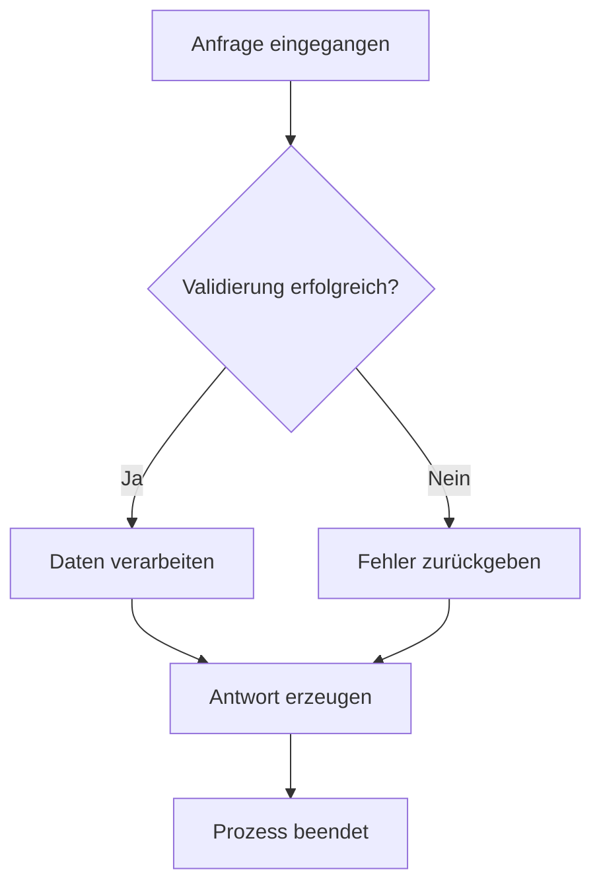
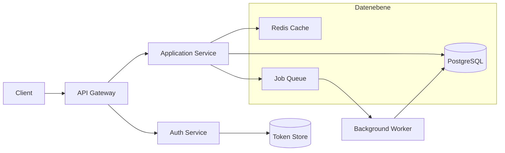
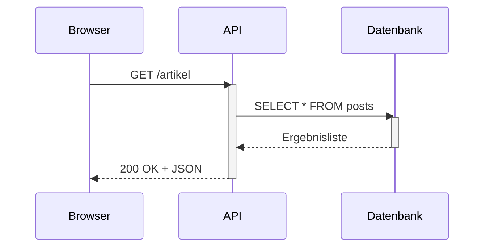
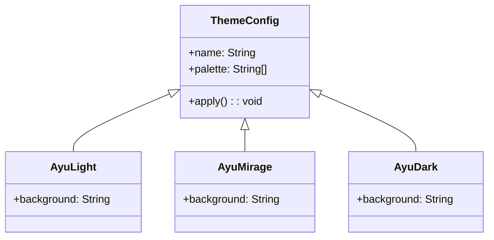
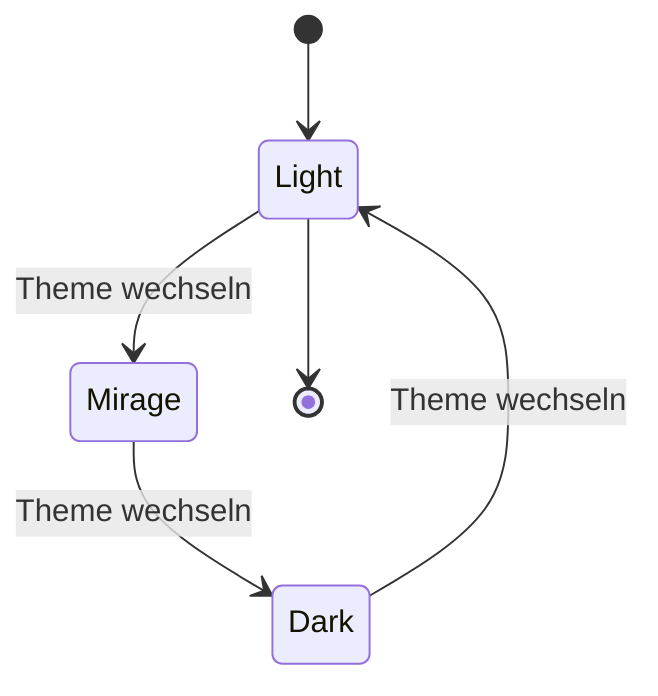
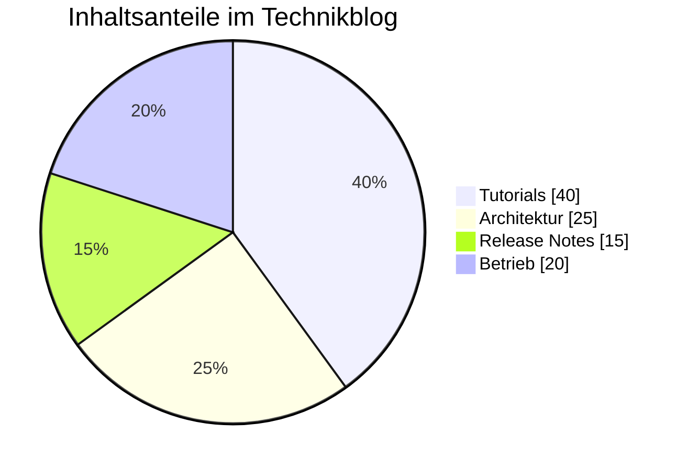
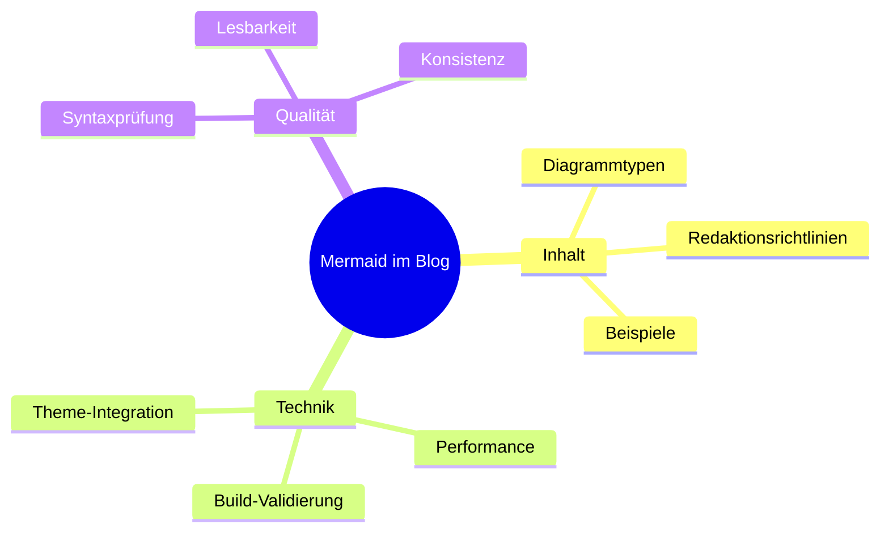
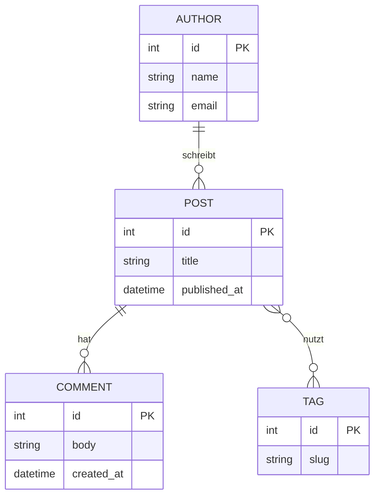
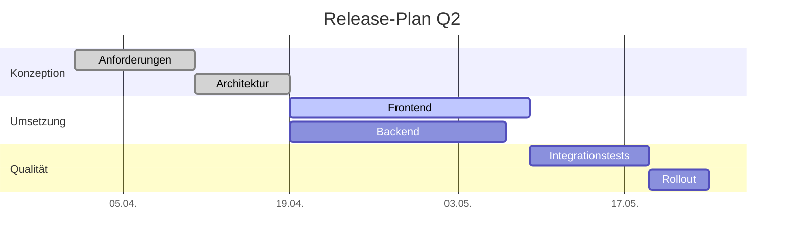

Mermaid ist eine textbasierte Diagrammsprache, mit der sich technische Zusammenhänge direkt in Markdown dokumentieren lassen. Für den Blog ist das besonders nützlich, weil Diagramme versionierbar bleiben, sich in Pull Requests prüfen lassen und im gleichen redaktionellen Workflow entstehen wie der restliche Inhalt.

<!--more-->

## Ayu-Anpassung im Projekt

Die Diagramme werden im Projekt konsequent über das Mermaid-`base`-Theme angepasst. Nur dieses Theme erlaubt eine kontrollierte Überschreibung der Farbvariablen, ohne auf hardcodierte Styles in einzelnen Diagrammen zurückzugreifen.

Die Farbskala basiert auf acht Ayu-Syntaxfarben aus dem NPM-Paket `ayu` und wird in Regenbogen-Reihenfolge auf die `cScale`-Variablen gemappt:

1. `markup` (rot)
2. `keyword` (orange)
3. `func` (gelb)
4. `string` (grün)
5. `regexp` (teal)
6. `tag` (blau)
7. `constant` (violett)
8. `operator` (rosa)

Die Node-Hintergründe verwenden die vollen Ayu-Syntaxfarben bei 100 % Sättigung. Schrift und Rahmen werden dynamisch per `darken()`-Funktion berechnet: gleicher Farbton, aber abgedunkelt (Text auf 45 %, Border auf 65 %). So entsteht ein stimmiger, monochromatischer Look pro Node, während der Kontrast über Light, Mirage und Dark hinweg konsistent bleibt.

Beim Theme-Wechsel werden Diagramme neu gerendert. Dadurch übernehmen sie unmittelbar die passenden Variablen des aktiven Ayu-Themes.

Für Gantt-Diagramme gilt zusätzlich eine feste Konfiguration: `axisFormat`, `tickInterval` und `useWidth: 960`. Diese Vorgaben sind im Frontmatter dieser Seite hinterlegt und sorgen für einheitliche Achsen und stabile Breite.

## Flowchart (einfach)

Dieses Beispiel zeigt die Grundelemente eines Flowcharts: Start, Entscheidung, verzweigte Pfade und Zusammenführung.

## Flowchart (komplex)

Der komplexere Ablauf demonstriert Subgraphs, mehrere Services und parallele Datenpfade innerhalb einer typischen Webarchitektur.

## Sequence Diagram

Das Sequenzdiagramm zeigt die zeitliche Reihenfolge zwischen Browser, API und Datenbank inklusive Aktivierungsphasen und Antwortfluss.

## Class Diagram

Hier werden Klassen, Eigenschaften, Methoden und Beziehungen modelliert. Das Beispiel bildet eine kleine Struktur für Theme-Verwaltung ab.

## State Diagram

Das Zustandsdiagramm veranschaulicht die Wechsel zwischen den drei Theme-Zuständen und den Rücksprung in den Ausgangspunkt.

## Pie Chart

Das Tortendiagramm eignet sich für einfache Verteilungen. Gezeigt wird die Aufteilung typischer Bloginhalte.

## Mindmap

Die Mindmap demonstriert hierarchische Strukturierung, etwa zur Planung einer Beitragserie rund um Dokumentation und Betrieb.

## ER-Diagramm

Das ER-Diagramm zeigt Entitäten, Attribute und Kardinalitäten für ein vereinfachtes Blog-Datenmodell.

## Gantt Chart

Das Gantt-Diagramm bildet einen realistischen Projektplan mit Abschnitten, abhängigen Aufgaben und Statusmarkierungen ab. Durch `axisFormat`, `tickInterval` und feste Breite bleibt die Darstellung über Themes und Viewports hinweg berechenbar.

## Regeln für neue Diagramme

1. Keine hardcodierten `style`-Direktiven in Mermaid-Blöcken verwenden.
2. Theme-Farben ausschließlich über das zentrale Ayu-`base`-Theme steuern.
3. Bei Gantt-Diagrammen `axisFormat`, `tickInterval` und `useWidth: 960` verbindlich setzen.
4. Mermaid-Syntax pro Diagrammtyp strikt einhalten und vor dem Merge rendern.
5. Jedes Diagramm mit kurzem Kontexttext versehen: Zweck, Aussage und gezeigte Features.
