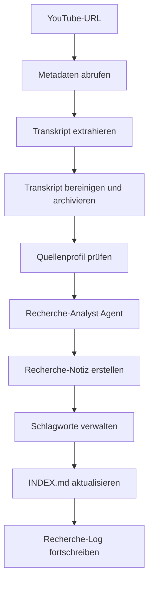
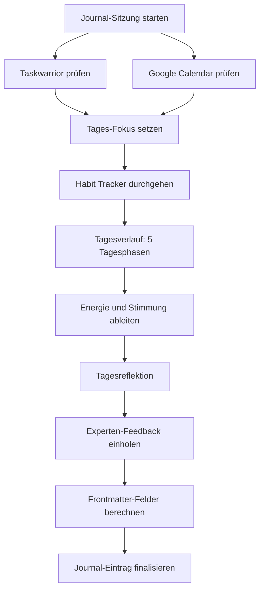

Anfang April 2026 hat Andrej Karpathy — Ex-Tesla-KI-Chef, OpenAI-Mitgründer und einer der einflussreichsten Köpfe im Machine-Learning-Bereich — eine bemerkenswerte Idee geteilt: Statt aufwendiger RAG-Pipelines einfach eine Markdown-Wiki aufbauen, die ein LLM selbst pflegt. Kein Vektorstore, keine Embedding-Pipeline, keine zusätzliche Infrastruktur. Nur Obsidian, Markdown-Dateien und ein LLM als Bibliothekar.

Sein [GitHub Gist](https://gist.github.com/karpathy/442a6bf555914893e9891c11519de94f) beschreibt einen Ansatz, der sich in ähnlicher Form auch in der Praxis bewährt hat — und der es wert ist, genauer betrachtet zu werden. Dieser Artikel zeigt, wie aus Karpathys Grundidee ein vollständig automatisiertes System werden kann: mit spezialisierten Agenten, die Recherchen verarbeiten, Journals führen, Trainingsdaten analysieren und Aufgaben verwalten.

<!--more-->

## Warum RAG nicht die ganze Antwort ist

Retrieval Augmented Generation ist das Standardrezept, wenn ein LLM auf eigenes Wissen zugreifen soll: Dokumente zerlegen, Embeddings erzeugen, in einer Vektordatenbank speichern, bei jeder Anfrage die relevantesten Chunks abrufen und in den Prompt stecken. Das funktioniert — aber es ist auch ein Stück Infrastruktur, das gewartet werden will.

Für Unternehmen mit Millionen von Dokumenten ist RAG unverzichtbar. Für eine persönliche Wissensdatenbank mit ein paar hundert Notizen ist es Overkill. Die Chunks verlieren Kontext, die Embedding-Qualität schwankt, und am Ende steckt mehr Zeit im Debugging der Pipeline als im eigentlichen Wissensabruf.

Karpathys Gegenvorschlag ist bestechend einfach: Wenn das Kontextfenster groß genug ist und die Wissensbasis klein genug bleibt, braucht man kein RAG. Man braucht Struktur.

## Karpathys Drei-Schichten-Modell

Die Architektur, die Karpathy beschreibt, hat drei Schichten:

1. **Raw Sources** — ein Staging-Ordner für rohe Materialien: Webseiten, Artikel, Notizen. Immutabel, wird nicht bearbeitet.
2. **Wiki** — LLM-generiertes Markdown. Das LLM liest die Rohmaterialien, fasst zusammen, verlinkt, strukturiert. Hier entsteht die eigentliche Wissensbasis.
3. **Schema** — eine `CLAUDE.md`-Datei, die dem LLM erklärt, wie der Vault aufgebaut ist: Ordnerstruktur, Namenskonventionen, Frontmatter-Felder, Verlinkungsregeln.

Das LLM übernimmt die redaktionelle Pflege: Index-Dateien pflegen, Cross-Referenzen setzen, Widersprüche zwischen Notizen erkennen. Kein manuelles Taggen, kein Verschlagworten — der Agent erledigt das.

## Von der Theorie zur Praxis: Obsidian und Claude Code

Wer diesen Ansatz konkret umsetzen möchte, kann auf die Kombination aus Obsidian und Claude Code setzen. Ein über Monate gewachsener Vault mit über 400 Notizen zeigt, wie das in der Praxis funktioniert. Die Notizen sind in Ordnern wie `Projekte/`, `Claude Code/`, `Recherche/` und `Notes/` organisiert — nach klaren Regeln, die in einer `CLAUDE.md` im Vault-Root dokumentiert sind.

Diese Schema-Datei ist das Herzstück des Ansatzes. Aber der eigentliche Sprung gegenüber Karpathys Grundidee liegt anderswo: in spezialisierten Skills, die nicht nur Wissen verwalten, sondern aktiv neue Inhalte erzeugen, analysieren und miteinander verknüpfen.

Claude Code bietet ein Skill-System, das sich mit Markdown-Dateien konfigurieren lässt. Jeder Skill enthält präzise Anweisungen für einen bestimmten Workflow — von der YouTube-Analyse bis zur Trainingsauswertung. Diese Skills verwandeln den Vault von einem passiven Wissensspeicher in ein aktives System, das Rohmaterial automatisch verarbeitet.

## Die Vault-Architektur im Detail

Bevor es an die einzelnen Pipelines geht, lohnt sich ein Blick auf die Struktur, die alles zusammenhält. Die Ordnerstruktur folgt einem klaren Prinzip: Jeder Bereich hat seinen Platz, und die `CLAUDE.md` im Vault-Root beschreibt exakt, was wo hingehört.

### Ordnerstruktur

```
Vault Obsidian/
├── CLAUDE.md              # Schema-Datei — das LLM liest diese zuerst
├── INDEX.md               # Navigations-Einstiegspunkt mit Wiki-Links
├── _INBOX/                # Staging für unverarbeitete Inhalte (Karpathys "raw/")
├── Journal/
│   ├── Daily/YYYY/YYYY-MM-DD.md        # Tageseinträge
│   ├── Weekly/YYYY/YYYY-Www.md        # Wochenreviews
│   ├── Monthly/YYYY/YYYY-MM.md         # Monatsrückblicke
│   ├── Quarterly/YYYY/                 # Quartals-OKR-Reviews
│   └── Yearly/                         # Jahresrückblicke
├── Notes/
│   ├── Computer/AI/       # KI-Tools, LLMs, Claude Code
│   ├── Computer/Hardware/
│   ├── Computer/Linux/
│   ├── Computer/Server/
│   ├── Computer/Software/
│   ├── Gesundheit/        # Supplements, Medikamente
│   ├── Hobby/
│   ├── Rezepte/
│   └── Ziele/             # OKRs
├── Projekte/              # Projektdokumentation mit ADRs
├── Recherche/
│   ├── Recherche *.md     # Verarbeitete Recherche-Notizen
│   ├── Schlagworte/       # Thematische Knoten-Notizen
│   ├── Quellen/           # Quellen-Profile (Kanäle, Autoren)
│   └── attachments/       # Transkripte, Rohdaten
└── Templates/             # Single Source of Truth für Journal-Formate
```

### Das Frontmatter-Schema

Jede Notiz im Vault trägt YAML-Frontmatter mit Pflichtfeldern. Das klingt nach Verwaltungsaufwand — ist es aber nicht, wenn das LLM diese Felder automatisch setzt.

```yaml
---
type: referenz | fehleranalyse | dokumentation | setup | note | projekt | journal
tags:
  - lowercase-hyphenated
created: 2026-04-05
---
```

Das `type`-Feld bestimmt den Zweck der Notiz, die `tags` ermöglichen Filterung über Dataview-Queries, und `created` sorgt für zeitliche Einordnung. Recherche-Notizen tragen zusätzliche Felder wie `quellentyp`, `source_url`, `info_shelf_life` und `fact_check_status`.

### Namenskonventionen und Präfixe

Dateien erhalten Präfixe nach ihrer Funktion: `Referenz` für Nachschlagewerke, `Fehler` für Troubleshooting, `Setup` für Anleitungen, `Vergleich` für technische Gegenüberstellungen, `Recherche` für verarbeitete Quellen. Diese Konvention macht Dateien sortierbar und gibt dem LLM einen sofortigen Hinweis auf den Inhalt.

### INDEX.md als Navigationsknoten

Die Datei `INDEX.md` im Vault-Root ist der primäre Einstiegspunkt für das LLM. Sie enthält ausschließlich explizite Wiki-Links — keine Dataview-Queries, denn die sind für das LLM unsichtbar. Jede Recherche-Notiz, jedes Dashboard und jede Schlüssel-Notiz ist hier verlinkt und kurz beschrieben.

Wenn eine neue Notiz entsteht, wird `INDEX.md` automatisch aktualisiert. Das LLM findet den passenden Abschnitt (Claude Code, Wissensmanagement, Infrastruktur, Gesundheit) und fügt den Eintrag ein. So bleibt der Index vollständig, ohne manuelle Pflege.

### Cross-Linking-Strategie

Jede Notiz endet mit zwei Standardabschnitten: `## Quellen` für externe Referenzen und `## Siehe auch` für interne Wiki-Links. Das LLM sucht beim Erstellen einer Notiz den gesamten Vault nach verwandten Inhalten und setzt die Links automatisch. Dieses automatische Vernetzen ist genau das, was Karpathy mit "Bookkeeping" meint — und es spart erheblich manuelle Arbeit.

## Die YouTube-Analyse-Pipeline

Der Workflow, der den Karpathy-Ansatz am deutlichsten zeigt, ist die Analyse von YouTube-Videos. Aus einer einzelnen URL entsteht automatisch eine vollständige Recherche-Notiz mit Metadaten, Transkript, Key Takeaways, Quellenbewertung und Vault-Verlinkung.

### Der Pipeline-Flow



### Schritt für Schritt

**Metadaten und Transkript:** Über `yt-dlp` werden Titel, Kanal, Veröffentlichungsdatum und das automatisch generierte Transkript abgerufen. Das Transkript wird bereinigt — VTT-Header, Zeitstempel und Duplikate entfernt — und als Textdatei im Vault unter `Recherche/attachments/Transkripte/` archiviert. Damit existiert immer eine Rohquelle, die nachträglich überprüft werden kann.

**Quellenprofil:** Bevor die Analyse beginnt, prüft die Pipeline, ob für den Kanal bereits ein Quellenprofil unter `Recherche/Quellen/` existiert. Dort sind Verlässlichkeitsbewertungen, thematische Schwerpunkte und Beobachtungen aus früheren Analysen hinterlegt. Ein Kanal, der in der Vergangenheit kommerziellen Bias gezeigt hat, wird entsprechend eingeordnet.

**Recherche-Analyst:** Ein spezialisierter Agent analysiert das Transkript im Kontext des bereits vorhandenen Wissens im Vault. Der Agent kennt den User-Kontext — welche Tools im Einsatz sind, welche Workflows existieren — und bewertet die Inhalte auf praktische Anwendbarkeit. Das Ergebnis sind strukturierte Abschnitte: ein `tl;dr`, Key Takeaways mit Bewertungsmarkierungen, konkrete Anwendungsschritte und eine Einordnung aus dem Trainingswissen des LLM.

**Recherche-Notiz:** Die fertige Notiz folgt einem festen Schema mit über zwanzig Feldern im Frontmatter und standardisierten Abschnitten. Besonders relevant: der Abschnitt `info_shelf_life`, der zwischen `short` (AI-News, Leaks), `medium` (Tutorials, Reviews) und `long` (Grundkonzepte, Prinzipien) unterscheidet. Bei einem späteren Vault-Lint werden Notizen mit abgelaufener Haltbarkeit markiert.

### Schlagwort-Verwaltung

Am Ende der Pipeline greift ein weiterer Mechanismus: der Schlagwort-Manager. Jede Recherche-Notiz enthält einen Abschnitt mit Schlagworten — und für jedes Schlagwort wird geprüft, ob bereits eine eigene Notiz unter `Recherche/Schlagworte/` existiert.

Fehlende Schlagwort-Notizen werden direkt aus dem Trainingswissen des LLM erstellt: 30 bis 50 Zeilen mit Definition, Überblick und Vault-Verlinkung. Der zentrale Index `Recherche/Schlagworte.md` wird alphabetisch ergänzt. So entsteht ein thematisches Netz, das mit jeder Recherche dichter wird — aktuell über 30 Schlagwort-Notizen in Kategorien wie "AI und Technologie", "Produktivität" und "Infrastruktur".

### Nicht nur YouTube

Die Pipeline ist nicht auf YouTube-Videos beschränkt. Über denselben Skill lassen sich auch Webseiten analysieren (Inhalt wird per Web-Fetch abgerufen) und themenbasierte Recherchen durchführen (Web-Suche mit anschließender Synthese der Top-Ergebnisse). Der Quellentyp wird automatisch erkannt, und die Notiz erhält die entsprechenden Metadaten.

## Das Journal-System

Neben der Wissensverarbeitung ist das Journal-System der zweite große Automatisierungsbereich. Der Vault enthält ein hierarchisches Journal-System mit täglichen, wöchentlichen, monatlichen, vierteljährlichen und jährlichen Einträgen — jeder mit einem eigenen Template.

### Das Daily Journal

Das tägliche Journal folgt einer festen Struktur, die durch ein Template definiert ist. Die Pflichtabschnitte:

- **Tages-Fokus** — die zentrale Intention für den Tag
- **Offene Aufgaben** — automatisch aus Taskwarrior befüllt (via Tasks-Plugin-Query)
- **Habit Tracker** — tägliche Gewohnheiten in zwei Kategorien (Gesundheit und Produktivität)
- **Notizen** — Raum für freie Gedanken und Beobachtungen
- **Tagesverlauf** — eine Tabelle mit fünf Tagesphasen (Morgen bis Abend), in der Energie und Stimmung auf einer Skala von 1 bis 5 erfasst werden
- **Tagesreflektion** — drei Leitfragen: Was lief gut? Was hätte besser laufen können? Wofür besteht Dankbarkeit?
- **Claude Code Protokoll** — automatische Arbeitseinträge, immer als letzter Abschnitt

Das Frontmatter jedes Daily Journals enthält quantitative Felder, die sich über Dataview aggregieren lassen:

```yaml
---
type: journal
tags: [periodic-daily]
stimmung: 3
energie: 4
schlaf_qualitaet: 3
schlaf_stunden: 7
bewegung_min: 45
sozialkontakt: true
draussen_min: 30
---
```

### Das Experten-Team

Bei jeder Journal-Sitzung fließen zwei spezialisierte Perspektiven ein:

**Gesundheits- und Fitness-Coach:** Bewertet Bewegung, Ernährung, Schlafqualität, Supplements und Herzfrequenzzonen. Vergleicht die erfassten Werte mit den Zielvorgaben aus dem Sportplan und gibt konkrete Empfehlungen. Wenn Trainingseinheiten per FIT-Datei analysiert wurden, fließen diese Daten direkt in die Bewertung ein.

**Produktivitätsexperte (GTD):** Prüft den Taskwarrior-Status, bewertet die Aufgabenlage nach Getting Things Done, erkennt Muster wie Boom-Bust-Zyklen (Tage mit extremer Produktivität gefolgt von Stillstand) und gibt Empfehlungen zur Fokussierung.

### Automatische Datenerhebung

Bevor die persönlichen Abschnitte befüllt werden, führt das System drei Pflichtprüfungen durch:

1. **Taskwarrior-Check:** Offene Aufgaben, überfällige Tasks, heutige Deadlines und Projektübersicht werden abgerufen
2. **Kalender-Check:** Alle verfügbaren Google-Kalender werden auf Termine und Deadlines geprüft
3. **Experten-Perspektiven:** Fitness-Coach und Produktivitätsexperte analysieren die Daten und geben ihre Einschätzung ab

### Der Journal-Workflow



### Das Weekly Journal

Das wöchentliche Journal ist kein Tagebuch, sondern ein reines Review-Dokument. Es enthält:

- **Wochendaten** — automatisch aggregierte Durchschnittswerte aus den Daily Journals (Stimmung, Energie, Schlaf, Bewegung) via Dataview
- **Highlights der Woche** — die drei wichtigsten Ereignisse
- **GTD Weekly Review** — der formale Getting-Things-Done-Wochenreview mit fünf Schritten:
  - Inbox und Capture: Sind alle losen Notizen in Taskwarrior überführt?
  - Projekte und Next Actions: Hat jedes Projekt einen nächsten Schritt?
  - Waiting For: Müssen delegierte oder blockierte Aufgaben nachverfolgt werden?
  - Gewohnheiten und Vorsätze: Abgleich mit den täglichen Zielvorgaben
  - Kalender-Check: Termine und Deadlines der kommenden Woche
- **Team-Analyse** — die Experten-Perspektiven auf Wochenebene: Bewegungsbilanz, Ernährungsbewertung, Aufgabenlage und Fokus-Bewertung

### Die Journal-Navigation

Das Journal folgt einem Dual-Hierarchy-System mit zwei parallelen Navigationspfaden:

Der **Kalender-Pfad** (zeitliche Übersicht) verläuft von Daily über Monthly zu Yearly. Der **Produktivitäts-Pfad** (GTD-Rhythmus) führt von Daily über Weekly zu Quarterly und Yearly. Diese Trennung stellt sicher, dass wöchentliche Reviews im GTD-Kontext stehen, während der kalendarische Überblick über die Monatssicht funktioniert.

## Fitness- und Trainingsanalyse

Ein weiterer Skill verarbeitet FIT-Dateien aus Strava-Exporten. Das FIT-Protokoll (Flexible and Interoperable Data Transfer) ist das Standardformat für Fitness-Tracker und enthält sekundengenau aufgezeichnete Daten.

### Was analysiert wird

Ein Python-Parser (`parse_fit.py`) dekodiert die Binärdaten und gibt strukturiertes JSON aus. Die Analyse ist sportartspezifisch:

| Sportart | Analysierte Kennzahlen |
|----------|----------------------|
| Walking/Hiking | Distanz, Pace, Schritte, Höhenmeter, HR-Zonen, Kalorienverbrauch |
| Running | Splits pro km, Running Dynamics (Ground Contact Time, Vertical Oscillation, Stride Length), Pace-Dekopplung, TRIMP |
| Cycling | Geschwindigkeit, Leistung (NP, TSS, IF), Kadenz, Efficiency Factor |
| Swimming | Pace pro 100m, Bahnen, Züge, SWOLF, Schwimmstil-Verteilung |
| Strength | Übungsliste mit Sets, Reps und Gewicht |

Die Herzfrequenz-Analyse teilt jede Einheit in fünf Zonen auf (Erholung, Fettverbrennung, Aerob, Anaerob, Maximum) und berechnet die prozentuale Verteilung der Trainingszeit.

### Integration ins Journal

Die Trainingsauswertung lässt sich direkt ins tägliche Journal übernehmen. Dabei wird das Frontmatter-Feld `bewegung_min` aktualisiert (addiert, nicht ersetzt — bei mehreren Einheiten pro Tag) und eine Zusammenfassung unter den Notizen eingefügt. Auf Wunsch gibt der Fitness-Coach eine Einschätzung zur Trainingsbelastung, zur Intensitätsverteilung und zu Erholungsempfehlungen.


## Taskwarrior und GTD

Die Aufgabenverwaltung läuft über Taskwarrior — ein kommandozeilenbasiertes Task-Management-Tool, das sich nahtlos in die LLM-Workflows integriert.

### GTD-Methodik im Vault

Getting Things Done nach David Allen bildet das Produktivitäts-Framework. Die fünf GTD-Schritte (Capture, Clarify, Organize, Reflect, Engage) sind in den Vault-Workflows verankert:

- **Capture:** Neue Aufgaben, die während einer Journal-Sitzung oder Recherche entstehen, werden direkt in Taskwarrior erfasst — nicht als lose Notizen im Journal
- **Clarify:** Das Inbox-Processing identifiziert Aufgaben ohne Projekt und führt sie einzeln durch: Projekt zuweisen, Tags setzen, Priorität festlegen
- **Organize:** Projekte unterstützen Hierarchie (`projekt.unterprojekt`), Prioritäten sind dreistufig (H, M, L), und Kontext-Tags (`+code`, `+docs`, `+research`) ermöglichen Filterung nach Arbeitskontext
- **Reflect:** Der GTD Weekly Review im Weekly Journal prüft systematisch alle Projekte, Warteschlangen und den Kalender
- **Engage:** Das Daily Journal zeigt über eine Tasks-Query automatisch die überfälligen und heute fälligen Aufgaben an

### Synchronisation über Maschinen

Taskwarrior synchronisiert über einen TaskChampion-Sync-Server, der auf einem Contabo VPS läuft. So stehen die gleichen Aufgaben auf dem MacBook und dem Linux-Desktop zur Verfügung — und beide Maschinen können über Claude Code darauf zugreifen.

## Das Schlagwort-Netz

Ein Aspekt, der bei Karpathys Grundidee nur angedeutet wird, ist die thematische Vernetzung. Im Vault übernimmt diese Aufgabe ein System aus Schlagwort-Notizen.

Jede Schlagwort-Notiz unter `Recherche/Schlagworte/` ist eine eigenständige Referenz: Definition, Überblick aus dem LLM-Trainingswissen und Verlinkung zu allen Vault-Notizen, die das Thema berühren. Die Übersichtsdatei `Recherche/Schlagworte.md` ordnet alle Schlagworte in Kategorien und bietet zusätzlich eine Dataview-Tabelle mit Alias, Tags und Anzahl der eingehenden Verweise.

Aktuell existieren über 30 Schlagwort-Notizen — von `Retrieval Augmented Generation` über `Model Context Protocol` bis `Lokale KI`. Mit jeder neuen Recherche wächst das Netz, und die Cross-Referenzen zwischen Recherche-Notizen und Schlagworten werden dichter.

## Quellen-Profile und Bewertung

Ein weiterer Baustein, der über Karpathys Grundmodell hinausgeht: die systematische Bewertung von Quellen. Unter `Recherche/Quellen/` liegen Profile für jeden analysierten YouTube-Kanal, Blog oder Newsletter.

Ein Quellenprofil enthält:

- Plattform und Schwerpunkt
- Verlässlichkeitsbewertung (niedrig, mittel, hoch)
- Beobachtungen aus bisherigen Analysen (erkennbarer Bias, Stärken, Schwächen)
- Eine automatische Dataview-Tabelle aller analysierten Inhalte dieser Quelle

Wenn die Recherche-Pipeline ein neues Video analysiert, wird das Quellenprofil konsultiert und gegebenenfalls aktualisiert. So entsteht über die Zeit ein differenziertes Bild jeder Informationsquelle.

## Das Skill-System

All diese Workflows werden durch Claude Code Skills orchestriert. Ein Skill ist eine Markdown-Datei mit präzisen Anweisungen, Trigger-Bedingungen und erlaubten Tools. Die wichtigsten Skills im Überblick:

| Skill | Funktion |
|-------|----------|
| `youtube-analyze` | Recherche-Pipeline für YouTube, Webseiten und Themen |
| `obsidian-vault` | Vault-Operationen, Journal-Einträge, Dokumentation |
| `journal-reflection` | Persönliche Journalführung, Retrospektiven, Trend-Analyse |
| `fit-analyze` | Trainingsauswertung von FIT-Dateien |
| `taskwarrior` | Aufgabenverwaltung via CLI |
| `schlagwort-manager` | Schlagwort-Notizen erstellen und pflegen |
| `blog-writer` | Blog-Artikel erstellen und überarbeiten |

Jeder Skill enthält Trigger-Regeln, die definieren, wann er automatisch aktiviert wird. Der `youtube-analyze`-Skill greift beispielsweise, wenn eine YouTube-URL zusammen mit einer Analyseanfrage übergeben wird. Der `journal-reflection`-Skill aktiviert sich bei Schlüsselwörtern wie "Journal", "Reflexion" oder "wie war mein Tag".

Die Skills sind zwischen Maschinen synchronisiert — sie liegen unter `~/.claude/skills/` und funktionieren auf macOS und Linux identisch, da Vault-Pfade dynamisch aufgelöst werden.

## Der Vault-Lint als Qualitätssicherung

Ein LLM-gepflegter Vault braucht Qualitätskontrolle. Dafür ist ein Lint-Protokoll in der `CLAUDE.md` definiert, das bei Bedarf oder periodisch (Quartals-Review) durchläuft:

1. **Veraltete Recherchen:** Notizen mit `info_shelf_life: short` und einem Erstellungsdatum älter als drei Monate werden markiert
2. **Orphan-Schlagworte:** Schlagwort-Notizen ohne eingehende Links aus Recherche-Notizen
3. **INDEX.md-Konsistenz:** Wiki-Links, die auf nicht existierende Dateien zeigen
4. **Frontmatter-Vollständigkeit:** Notizen ohne Pflichtfelder
5. **Fehlende Cross-Referenzen:** Recherche-Notizen ohne Schlagwort-Verlinkung
6. **Widersprüche:** Notizen mit gegensätzlichen Aussagen zum selben Thema

Das Ergebnis ist ein Bericht — keine automatische Korrektur ohne Bestätigung. Jeder Lint-Durchlauf wird im `Recherche/log.md` protokolliert.

## Erkenntnisse aus der Praxis

Nach mehreren Monaten Arbeit mit diesem Ansatz haben sich einige Erkenntnisse herauskristallisiert:

**Die Schema-Datei ist entscheidend.** Ohne eine klare `CLAUDE.md` produziert das LLM inkonsistente Ergebnisse. Mit einem durchdachten Schema ist die Qualität bemerkenswert stabil. Die aktuelle `CLAUDE.md` des Vaults umfasst über 300 Zeilen mit Konventionen, Ordnerstruktur, Frontmatter-Standard und Workflow-Beschreibungen. Die Zeit, die in die Schema-Definition fließt, zahlt sich vielfach aus.

**Skills sind der Hebel.** Der eigentliche Produktivitätsgewinn kommt nicht vom Vault allein, sondern von den spezialisierten Skills, die wiederkehrende Abläufe standardisieren. Ein YouTube-Video analysieren, eine FIT-Datei auswerten, das wöchentliche Review durchführen — das sind Workflows, die ohne Skills jedes Mal neu beschrieben werden müssten.

**Die Skalierungsgrenze ist real.** Karpathy nennt selbst circa 100 Artikel beziehungsweise rund 400.000 Wörter als Obergrenze für diesen Ansatz. Darüber hinaus wird die Navigation über Index-Dateien ineffizient, und ein echtes Retrieval-System wird nötig. Bei einem Vault mit über 400 Notizen in verschiedenen Bereichen funktioniert die Navigation noch gut — aber die Performance sollte im Blick bleiben.

**Kosten sind nicht trivial.** Der Ansatz ist nicht "essentially free", wie manche behaupten. Jeder Vault-Durchlauf kostet Tokens, und bei intensiver Nutzung summiert sich das. Aber im Vergleich zur Wartung einer RAG-Infrastruktur ist es für den persönlichen Gebrauch immer noch günstiger.

**Obsidian ist ein ideales Medium.** Markdown-Dateien, lokale Speicherung, offenes Format, Plugin-Ökosystem — Obsidian bietet eine solide Grundlage. Die Dateien gehören dem Nutzer, nicht einer Plattform. Und wer in zwei Jahren auf ein anderes Tool wechseln möchte, nimmt das Markdown einfach mit.

**Automatisierung braucht Struktur, nicht Technik.** Der eigentliche Aufwand liegt nicht in der Programmierung von Pipelines, sondern im Definieren klarer Konventionen. Welche Frontmatter-Felder gibt es? Wie heißen die Abschnitte? Wo liegt welche Datei? Wenn diese Fragen beantwortet sind, kann das LLM den Rest zuverlässig erledigen.

Das Gesamtbild: Ein LLM ist nicht nur ein Werkzeug, das man fragt — es ist ein Agent, der die Wissensbasis aktiv pflegt, Recherchen verarbeitet, Trainingseinheiten analysiert und die tägliche Reflexion begleitet. Dafür braucht man keine komplexe Infrastruktur. Man braucht gutes Markdown, klare Konventionen und Skills, die beides zusammenhalten.
