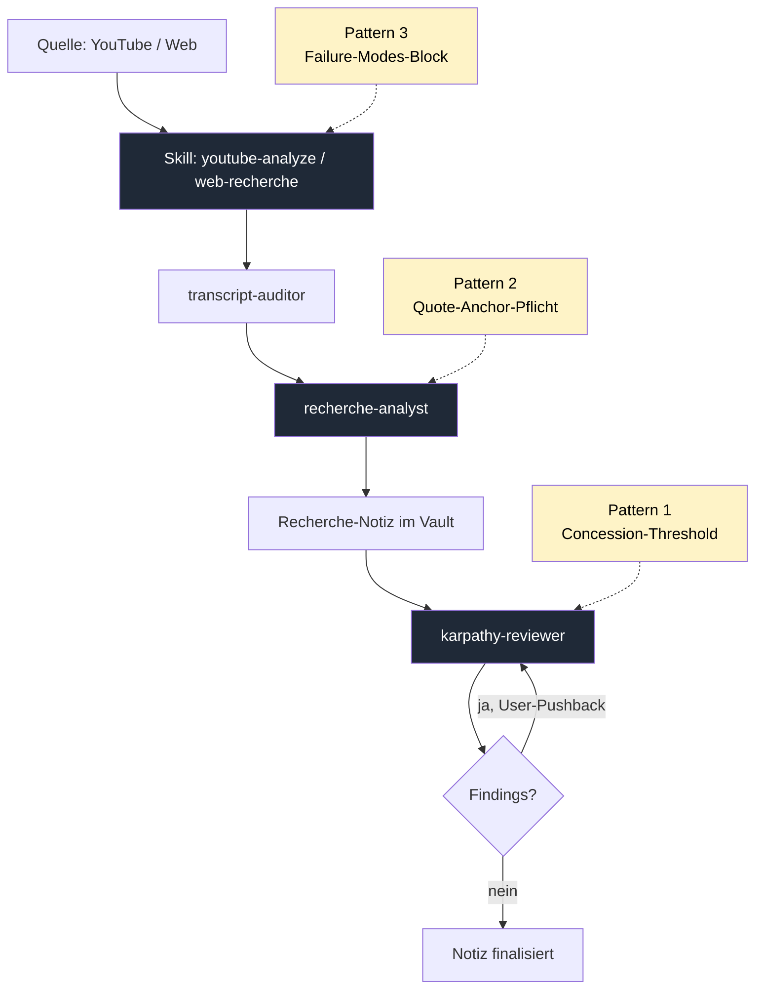

Ein Trending-Repo mit Academic-Research-Skills landet auf der Pflichtlektüre-Liste und liest sich nach zwei Stunden Audit wie eine Anleitung, die eigene Pipeline doppelt so groß zu machen. Material Passports, PRISMA-Modi, LaTeX-Konvertierungen, Devil's-Advocate-Subagenten — beeindruckend zu zeigen, in einem Recherche-Workflow für ein persönliches Wiki größtenteils überflüssig. Was bleibt nach dem Cherry-Pick: drei Patterns, die ohne Strukturumbau übernehmbar sind und drei konkrete Schwachstellen der bestehenden Pipeline schließen.

<!--more-->

## Ausgangslage

Die bestehende Pipeline wurde im Post [Vom Prototyp zur Pipeline](/blog/youtube-skill-evolution/) detailliert beschrieben. Kurze Erinnerung an die beweglichen Teile, damit klar ist, wo die drei neuen Patterns ansetzen:

- Der Skill `youtube-analyze` lädt Transkripte via yt-dlp, dedupliziert sie mit Prefix-Merge plus Sliding-Window und übergibt das Ergebnis erst an einen `transcript-auditor`-Agenten und dann an den eigentlichen `recherche-analyst`.
- Der Skill `web-recherche` arbeitet analog für Artikel und Blog-Posts, mit Firecrawl statt yt-dlp und ohne Audit-Stufe.
- Ein optionaler `youtube-fact-checker` prüft im Nachgang einzelne Behauptungen aus der Recherche-Notiz.
- Über alle Skills hinweg laufen die Karpathy-Subagenten als Pre- und Post-Task-Stage: `karpathy-planner` macht Annahmen explizit, `karpathy-reviewer` prüft die fertige Notiz gegen die vier Prinzipien.
- Die Vault-Konvention für Recherche-Notizen schreibt ein Quellenprofil, Schlagwort-Cross-References, einen `Recherche/log.md`-Eintrag und INDEX-Pflege vor.

Funktioniert solide. Aber: jede der drei Schwachstellen, die unten ausgeräumt werden, war im Setup zwar latent vorhanden und durch Skripten und Tests teilweise abgefedert — aber an keiner Stelle explizit benannt und gehärtet. Genau diese Lücke schließt der Cherry-Pick aus dem Hype-Repo.

## Der Trigger: academic-research-skills

Das Repo [Imbad0202/academic-research-skills](https://github.com/Imbad0202/academic-research-skills) baut auf [obra/superpowers](https://github.com/obra/superpowers) auf und stellt einen Satz Claude-Code-Skills für akademisches Arbeiten bereit — Literatur-Review, PRISMA-Konformität, Material Passports für Cross-Session-State, ein Devil's-Advocate-Subagent, mehrere Modus-Varianten pro Skill, ein LaTeX-APA7-Output-Pfad. In Summe ein Vollausbau für ein Anwendungsprofil, das hier nicht existiert: keine Papers, kein peer-reviewter Output, keine Session-übergreifenden State-Probleme jenseits dessen, was Daily Journal und Auto-Memory ohnehin abfangen.

Eine Vollübernahme widerspräche Karpathys zweitem Prinzip — Simplicity First. Aber das Repo enthält drei Patterns, die unabhängig von ihrem akademischen Kontext funktionieren und drei konkrete Schmerzen der bestehenden Pipeline adressieren. Die Patterns wurden destilliert, an die eigene Terminologie angepasst und direkt in die bestehenden Agent- und Skill-Dateien übernommen. Was unten gezeigt wird, ist exakt der Wortlaut, der jetzt im Vault produktiv läuft.

## Pattern 1: Concession-Threshold im karpathy-reviewer

### Problem

LLM-Sycophancy ist ein in der Forschung breit dokumentiertes Verhalten: bei jedem User-Pushback neigt die Modellposition zum Kippen. „Hmm, ich glaube das stimmt nicht" reicht oft, um einen Reviewer-Befund leise zurückzunehmen — auch wenn das Argument inhaltsleer war. Für einen `karpathy-reviewer`, dessen ganze Existenzberechtigung darin liegt, Fehler im Hauptagenten zu finden, ist das fatal: ein nachgiebiger Reviewer ist kein Reviewer.

Strukturell besonders heikel ist die Stelle, an der Pushback überhaupt landet — direkt nach einem Finding, ohne Zeit für Distanzaufbau. Karpathy 1 (Think Before Acting) verlangt für diese Situation das Gegenteil eines reflexhaften Einknickens: Annahmen über die Stärke der Gegenrede explizit machen, Position halten, Klärung anfragen. Genau diese Disziplin braucht eine eigene Struktur, sonst löst sie sich im Konversationsfluss auf.

### Lösung

Eine explizite Skala für den Counter-Evidence-Score, die vor der Reaktion gezogen wird:

```markdown
## Concession-Threshold (gegen Sycophancy)

Wenn ein User-Pushback gegen ein Review-Finding kommt, gib **vor der Reaktion** explizit einen Counter-Evidence-Score 1–5:

- **1** — kein konkretes Gegenargument, nur Unmut oder Stil-Kritik
- **2** — schwache Gegenevidence, deutet auf Missverständnis hin
- **3** — partielle Gegenevidence, weicht die Position ab, kippt sie nicht
- **4** — starke Gegenevidence (Datei-Read, Code-Check, primäre Quelle), zwingt zur Revision
- **5** — verifizierter Fehler im Review, vollständiger Rückzug

**Concession-Regel:** Nur ab Score **≥ 4** nachgeben. Bei 1–3 die ursprüngliche Position halten und konkrete Klärung anfragen.
```

Der Trick liegt im Wort „**vor der Reaktion**". Sobald der Score formuliert wird, ist die anschließende Antwort daran gebunden. Ein expliziter „Counter-Evidence-Score 2 — kein konkretes Gegenargument, nur Stil-Bedenken" lässt sich nicht in „Du hast recht, ich nehme das zurück" verwandeln, ohne die eigene Bewertung im selben Atemzug zu widerlegen. Der Score wirkt wie ein Self-Anchor.

### Begründung

Die Wirkung ist die einer kleinen, gut platzierten Reibung. Statt einer langen Anti-Sycophancy-Tirade reicht ein Bewertungsschritt, der den Verhandlungsraum strukturiert. Was als Score 1–3 markiert wurde, wird zu Klärungsbedarf — nicht zu Konzession. Echte Score-4-Fälle (Reviewer hat eine Datei nicht gelesen, eine Quelle missverstanden, eine Konvention falsch zitiert) werden weiter bedient. Nur die diffusen Sympathie-Kippmomente fallen weg.

## Pattern 2: Quote-Anchor-Pflicht im recherche-analyst

### Problem

Halluzinierte Quotes sind das prominenteste Failure-Mode der gesamten Recherche-Pipeline. Der `recherche-analyst` formuliert Key Takeaways elegant und kompakt — und greift gelegentlich auf eigene Paraphrasen zurück, die zwar das Thema treffen, aber im Transkript so nie gesagt wurden. Das ist genau die Klasse von LLM-Halluzination, die bei flüchtiger Sichtprüfung nicht auffällt: Inhalt stimmt, Wortlaut nicht. Die Konsequenz: eine Recherche-Notiz, die im Vault als Quelle weitergeneriert wird, enthält erfundene Belege — Halluzination mit Lieferkette.

Die übliche Mitigation („sei vorsichtig mit Zitaten") ist wirkungslos. Was hilft, ist ein strukturelles Verbot ohne Schlupfloch.

### Lösung

Quote-Anchor-Pflicht als Hard-Constraint im Agent-Body, formuliert so, dass das Modell keine Wahl mehr hat:

```markdown
### Quote-Anchor-Pflicht (gegen Halluzinationen)

Jedes Key Takeaway MUSS einen wörtlichen Quote-Anchor aus der Quelle tragen, zusätzlich zum Deep-Link:

> **Quote:** „<wörtliches Snippet aus dem Transkript/der Quelle, max. 2 Sätze; Auslassungen als `[…]` markieren>"

**Regel:** Wenn kein wörtlicher Snippet den Takeaway stützt, **Takeaway nicht aufnehmen**.
```

Wirkung in der Praxis: ein Takeaway ohne Quote-Anchor fällt strukturell auf, weil das Markdown-Pattern fehlt. Der Reviewer-Agent erkennt fehlende Anker, und im Vault selbst lässt sich die Pflicht per Such-Query überprüfen. Wer den Anker nicht findet, kann den Takeaway nicht stützen — und entfernt ihn lieber, als ein Phantom-Zitat zu erfinden.

### Beispiel

Aus einer kürzlich erstellten Recherche-Notiz zum YouTube-Format eines Sicherheitspolitik-Podcasts:

```markdown
- **Pistorius-Beliebtheit als parteipolitische Spannung.** Carlo Masala
  beobachtet, dass die hohe Zustimmung zu Boris Pistorius innerhalb der
  SPD nicht ungeteilt ist — er ist sowohl Zumutung für Teile der
  Partei als auch strategische Herausforderung für die Union.
  ([→ 31:02](https://youtu.be/...&t=1862s))

  > **Quote:** „Pistorius [...] ist vielleicht für manchen
  > Sozialdemokraten eine Zumutung, aber der ist definitiv auch eine
  > Challenge für die Union."
```

Der Anker macht den Punkt prüfbar. Ohne ihn wäre der Satz eine elegante Paraphrase, die im Transkript hätte stehen können — oder eben nicht.

## Pattern 3: Failure-Modes-Block in jedem Skill

### Problem

Jeder Skill hat implizites Wissen über seine eigenen Schwachstellen. Im `youtube-analyze` weiß das Setup, dass Quotes halluziniert werden können, dass der Auditor unter Token-Druck zum Pass-Through neigt, dass Aktualitäts-Themen Fact-Skipping provozieren. Dieses Wissen liegt in Kommentaren verstreut, in Commit-Messages, im Kopf des Maintainers. Beim nächsten Wartungsdurchlauf — oder beim Onboarding einer neuen Claude-Code-Session — ist es teilweise weg, teilweise verzerrt durch Recency Bias.

Die Lösung aus dem Hype-Repo ist erfreulich banal: ein expliziter Abschnitt in jedem Skill, der die bekannten Failure-Modes mit ihrer jeweiligen Mitigation aufführt. Das macht implizites Wissen explizit und wartbar.

### Lösung

Pflicht-Sektion am Ende jedes Skill-Bodys (`SKILL.md`), klein, klar formatiert:

```markdown
## Bekannte Failure-Modes

Dieser Skill ist gegen folgende typische LLM-Fehlermuster gehärtet:

- **Halluzinierte Quotes ohne Timestamp** — Mitigation: <…>
- **Fact-skipping bei Aktualitätsthemen** — Mitigation: <…>
- **Auditor-Override aus Kostendruck** — Mitigation: <…>
- **Concession ohne Gewicht** — Mitigation: <…>
```

Die konkreten Mitigations verweisen jeweils auf die durchgreifende Stelle: Quote-Anchor-Pflicht im `recherche-analyst` für die erste Zeile, gesonderter Fact-Check-Lauf vor Veröffentlichung für die zweite, harte Auditor-Independenz-Regel für die dritte, Concession-Threshold im Reviewer für die vierte.

### Wirkung

Ein Failure-Modes-Block am Skill-Ende ist Dokumentation, die sich selbst nutzt: bei jedem Skill-Aufruf wird sie mitgelesen. Das Modell sieht beim Einstieg in die Aufgabe nicht nur, was es tun soll, sondern auch, was bekannte Wege sind, die Aufgabe schlecht zu tun — und welche Stellen das System dagegen abgesichert haben. Beim Hinzufügen eines neuen Failure-Modes wird der Block ergänzt und die Mitigation gleich mitformuliert; ohne Mitigation kein Eintrag.

In Summe ist das die wartbare Version eines Threat-Models, ohne den Overhead eines separaten Dokuments.

## Pipeline-Diagramm: vor und nach den drei Patterns

Die drei neuen Patterns greifen an drei klar lokalisierbaren Stellen in den Skills und Agenten:



Pattern 2 (Quote-Anchor) sitzt im `recherche-analyst` und greift bei jedem Takeaway, der formuliert wird. Pattern 3 (Failure-Modes) sitzt im Skill-Body — sowohl `youtube-analyze` als auch `web-recherche` —, also einen Schritt früher, sodass jeder Aufruf das Threat-Model im Kontext sieht. Pattern 1 (Concession-Threshold) sitzt im `karpathy-reviewer` und greift bei Findings-Pushback, also am Ende der Schleife.

Keine neuen Pipeline-Schritte. Drei zusätzliche Regelblöcke an drei bestehenden Stellen. Das ist die Form, die Karpathy 2 und 3 (Simplicity First, Surgical Changes) zulassen — Eingriff ohne Strukturwucher.

## Was bewusst nicht übernommen wurde

Das Repo hätte mehr Beute geboten. Vier Patterns wurden geprüft und verworfen:

| Pattern | Verworfen, weil … |
|---------|-------------------|
| **Material Passport** (Cross-Session-State) | Daily Journal und Auto-Memory leisten denselben Job implizit. Ein zusätzliches Passport-Format wäre ein drittes State-System mit Sync-Pflicht zwischen den beiden bestehenden — Karpathy 2 verletzt. |
| **Mode-basierte Skill-Variants** (Quick Brief vs. Standard vs. PRISMA) | Es gibt kein wiederkehrendes Muster, das nach Modus-Trennung verlangt. Jede Recherche-Notiz ist standardmäßig „Standard"; die selten gewünschte Kurzform lässt sich im Aufruf adhoc anweisen. Ein Modus-System für Einzelfälle ist Konfiguration für ihrer selbst willen. |
| **Devil's-Advocate als separater Subagent** | Der `karpathy-reviewer` hat diese Rolle bereits — pointiert, gegen den Strich lesend, gegen Sycophancy gehärtet. Ein zweiter Critic-Agent würde redundant überlappen und beim Hauptagenten Verwirrung über die Rollen-Hierarchie auslösen. |
| **PRISMA / LaTeX-APA7-Pipeline** | Akademisches Output-Format. Hier wird nichts ins Papier-Setup oder in eine peer-reviewte Form gebracht. Irrelevant ohne Paper-Workflow. |

Diese Nicht-Übernahme ist keine Schwäche — sie ist der eigentliche Wert des Cherry-Picks. Hype-Repos verleiten dazu, Features zu adoptieren, die in einem fremden Kontext sinnvoll waren und im eigenen Kontext nur Wartungslast produzieren.

## Methodisches Rückgrat

Die Auswahl-Logik ist die zentrale These dieses Posts: **Hype-Repos sind selten ganz übernehmbar, aber liefern oft zwei bis drei destillierbare Patterns. Die Disziplin liegt im Cherry-Pick, nicht im Verschmähen.**

Karpathys Prinzipien geben den Rahmen vor, in dem dieser Cherry-Pick entstanden ist:

- **Think Before Acting** — vor dem Audit eine Liste der eigenen Pipeline-Schwächen aufschreiben, dann das Repo gegen diese Liste lesen, nicht umgekehrt. Sonst wird jedes Feature attraktiv, weil es etwas Neues macht.
- **Simplicity First** — jedes übernommene Pattern muss eine bestehende Schwäche schließen, nicht ein hypothetisches zukünftiges Problem. Bei den vier verworfenen Patterns oben fehlt genau dieser Bezug.
- **Surgical Changes** — die drei Patterns kommen als Markdown-Blöcke in drei bestehende Dateien. Keine neuen Subagenten, keine Skill-Splits, keine Frontmatter-Erweiterungen.
- **Goal-Driven Execution** — Erfolgsmaß war vorab definiert: Halluzinations-Fall (Quote ohne Beleg) wird strukturell sichtbar und per Lint detektierbar, Reviewer-Konzession ohne Gegenevidence wird durch den expliziten Score-Schritt protokollierbar, Failure-Modes-Wissen ist im Skill nachschlagbar. Drei Goals, drei Patterns, eins-zu-eins.

Die Methode ist parallel zum Vorgehen im Post [Prompt Injection abwehren](/blog/subagent-inject-false-positive/). Auch dort sitzt die Härtung nicht in einem zusätzlichen Filter-Layer, sondern als kleine, gezielte Regel-Ergänzung in der Agent-Definition. Wer die Wahl hat zwischen einem neuen Modul und einem zusätzlichen Absatz in einer bestehenden Datei, sollte den Absatz nehmen — er ist lesbarer, wartbarer und stört keine andere Sektion.

Die größere Linie für dieses Wiki — Obsidian als LLM-gepflegte Knowledge Base — wurde im Post [Obsidian als KI-gestützte Wissensdatenbank](/blog/obsidian-llm-wiki/) beschrieben. Die drei Patterns sind eine direkte Anwendung dieser Linie: weniger Halluzinationen in den Quellen, robustere Reviews der Synthesen, sichtbare Failure-Modes statt impliziter.

## Fazit

Aus einem Trending-Repo, das in voller Übernahme die eigene Pipeline aufgebläht hätte, sind drei Markdown-Blöcke an drei bestehenden Stellen geworden. Drei Lehren:

**Erstens — Hype-Repos lesen, nicht übernehmen.** Der Wert liegt nicht in der Architektur, sondern in den Patterns. Wer mit einer Liste eigener Schwächen ins Audit geht, kommt mit zwei bis drei brauchbaren Cherry-Picks heraus. Wer ohne Liste hineingeht, kommt mit einer Wartungslast heraus.

**Zweitens — Härtung im Agenten, nicht im Filter.** Concession-Threshold, Quote-Anchor-Pflicht und Failure-Modes-Block sind alle drei Regel-Texte, keine Code-Stufen davor oder danach. Das ist dieselbe Linie wie bei der Inject-Erkennung — und sie skaliert besser. Regel-Texte sind für den Agenten lesbar; Filter-Code ist es nicht.

**Drittens — Nicht-Übernahme dokumentieren.** Die vier verworfenen Patterns oben sind kein Nebeneffekt, sondern Teil des Ergebnisses. Wer in sechs Monaten überlegt, ob Material Passports im Wiki nützlich wären, soll die damalige Begründung lesen können — sonst wiederholt sich der Audit, und das Ergebnis hängt von der Tagesform ab.

Die drei Patterns laufen seit dieser Woche produktiv. Ob sich daraus mittelfristig messbare Effekte ergeben — weniger Quote-Findings im Reviewer, weniger Konzessions-Patches in Daily-Journal-Einträgen, weniger neu entdeckte Failure-Modes — lässt sich erst über mehrere Wochen sinnvoll beurteilen. Solange bleibt das qualitative Bild: drei explizite Sicherheitsnetze an Stellen, die vorher implizit blieben.

## Quellen

- [obra/superpowers](https://github.com/obra/superpowers) — Basis-Framework für Claude-Code-Skill-Sets
- [Imbad0202/academic-research-skills](https://github.com/Imbad0202/academic-research-skills) — Hype-Repo, aus dem die drei Patterns destilliert wurden
- [Vom Prototyp zur Pipeline](/blog/youtube-skill-evolution/) — Vorgängerbeitrag zur bestehenden Research-Pipeline
- [Prompt Injection abwehren](/blog/subagent-inject-false-positive/) — Methodische Parallele: Härtung im Agenten statt im Filter
- [Obsidian als KI-gestützte Wissensdatenbank](/blog/obsidian-llm-wiki/) — Hintergrund zur LLM-gepflegten Knowledge Base
