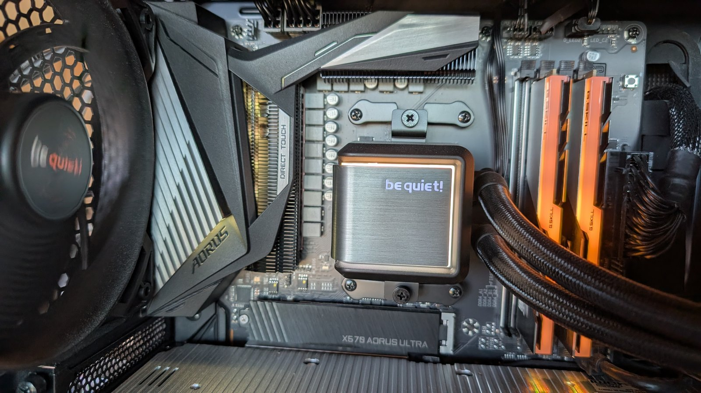

In meinem Rechner leuchtet seit Jahren allerhand vor sich hin. Zwei RAM-Riegel, ein Ring um die Pumpe der Wasserkühlung, irgendwo am Mainboard noch eine Lampe hinter der Anschlussblende. Gesteuert hat das nie jemand — die Sachen leuchteten einfach in der Farbe, die ihnen ab Werk eingefallen war.

<!--more-->

Das Stream Deck hatte noch Platz. Zwölf Tasten später schaltet eine Reihe vier Farbthemen, die andere die Grundfarben, und ein Knopf holt sich die Farben aus dem Desktop-Hintergrund. Dazwischen lagen zwei Stunden, in denen ich gelernt habe, wie viele Arten es gibt, an einer Sache vorbeizusuchen.

## Zwei Drähte und ein USB

Das Programm dafür heißt OpenRGB, und es findet auf meinem Rechner drei Geräte. Die beiden RAM-Riegel hängen am SMBus — das ist die interne Dienstbotenleitung des Mainboards, zwei Drähte für Temperaturfühler und Spannungswandler. Auf jedem Riegel sitzt seit jeher ein Chip, der dem BIOS beim Start verrät, was für ein Modul das ist. Als RGB-RAM aufkam, haben die Hersteller dem Beleuchtungscontroller einfach eine Adresse daneben gegeben. Sparsam, und es funktioniert seit dem ersten Versuch.

Das Mainboard geht einen völlig anderen Weg: Es meldet sich als USB-Gerät und wird angesprochen wie eine Tastatur.

Zwei Systeme, die nichts miteinander zu tun haben. Dass die Riegel gehorchen, sagt also nichts darüber, ob das Board überhaupt zuhört — eine Erkenntnis, die ich mir gemerkt habe, nachdem ich eine halbe Stunde lang zufriedene Riegel für einen Beleg gehalten hatte.

## Der Kühler stellt sich tot

Das Board bietet sechs Zonen an, und eine davon heißt `LED_CPU`. Naheliegend, oder? Da hängt der Prozessorkühler dran.

Da hängt gar nichts dran.

`LED_CPU` ist ein Anschluss in der Nähe des Sockels, an dem in meinem Fall nichts steckt. Die Pumpe hängt am zweiten adressierbaren Header, zehn Positionen weit, auf der Platine irgendwo zwischen dem Arbeitsspeicher und der oberen Kante beschriftet. Das steht nirgends. Man findet es, indem man eine Zone kräftig einfärbt und ins Gehäuse schaut.

Ich habe erst die falsche Zone gefärbt, dann alle sechs nacheinander, dann verdächtigt, das Programm bräuchte einen Hintergrunddienst, dann einen anderen Betriebsmodus. Der Kühler blieb bei seinem freundlichen Rot-Blau und ließ sich von alldem nicht beeindrucken.

## Erfolg ohne Wirkung

Der Fehler war ein anderer, und er war hausgemacht.

OpenRGB geht bei jedem Aufruf eintausendneunhundertdreiundfünfzig Gerätetreiber durch, um meine drei Geräte zu finden. Das dauert 5,7 Sekunden — zu lang für einen Tastendruck. Also habe ich eine eigene, abgespeckte Konfiguration angelegt, in der nur die zwei benötigten Treiber aktiv sind. Damit sind es 1,8 Sekunden, und das ist auch der Grund, warum die Sache ganz ohne Hintergrunddienst auskommt.

Beim Beschneiden habe ich eine Datei vergessen. In der stehen die Angaben, wie viele Lämpchen an einem Anschluss hängen. Ohne sie meldet das Programm die Zone weiterhin — nur eben mit null Lämpchen. Und ein Farbbefehl an eine Zone ohne Lämpchen wird klaglos entgegengenommen, ordentlich abgearbeitet und mit Erfolg quittiert.

Nichts passiert. Alles in Ordnung. Rückgabewert null.

Genau dieselbe Falle war mir schon einmal untergekommen, bei der Fernsteuerung meines Audio-Programms: Ein Tippfehler im Befehl liefert dort ebenfalls brav ein „alles gut“ und tut nichts. Ich hatte die Lehre sogar aufgeschrieben — und dann prompt auf den eigenen Umbau nicht angewandt. Die Antwort stand die ganze Zeit in der Geräteliste, eine Zeile unter der, die ich geprüft hatte.

## Bilder lügen über sich selbst

Der Knopf, an dem ich die meiste Freude habe, nimmt sich die Farben aus dem aktuellen Desktop-Hintergrund und legt sie aufs Blech. Die kräftigste auf die Riegel, die zweite auf die Blende, und über die zehn Positionen des Pumpenrings läuft ein Verlauf durch alle drei.

Was ich dabei nicht erwartet hatte: Hintergrundbilder sind sehr viel dunkler, als sie aussehen. Auf meinem aktuellen steht ein Bonsai auf einem Holztisch, und dieser Tisch sieht kräftig braun aus. Gemessen liegt er bei einem Helligkeitswert von 0,07 — praktisch schwarz. Im ganzen Bild überschreitet genau eine Farbe den Wert 0,5.

Die häufigste Farbe eines solchen Bildes ist also Schwarz, und Schwarz auf einer Leuchtdiode heißt aus. Der Knopf hätte tadellos gearbeitet und dabei ausgesehen wie kaputt.

Die Farben werden deshalb nach Fläche mal Farbigkeit gewichtet und anschließend aufgehellt. Bei den vier Themen war das nicht nötig — die heißen Io, Europa, Amalthea und Aurora, nach dem System, in dem auch meine Rechner ihre Namen herhaben. Amalthea ist übrigens der röteste Körper des Sonnensystems, und Ganymed der einzige Mond mit eigenen Polarlichtern. Man lernt ja nie aus, wenn man nur lang genug nach Farbnamen sucht.

Zwölf Tasten für Licht, das niemand braucht. Aber wenn der Bonsai grün ist, ist jetzt auch der Rechner grün, und das ist mehr Ordnung, als ich vorher hatte.
