**fuckupRSS** ist ein RSS-Aggregator mit einer 8-stufigen KI-Analyse-Pipeline, die vollständig lokal läuft — gebaut mit Rust, Svelte und Ollama, ohne Cloud, ohne API-Keys, ohne geteilte Daten. Der Ansatz: das klassische RSS-Problem mit lokaler KI spürbar zu entschärfen.

<!--more-->

## Warum noch ein RSS-Reader?

Das klassische RSS-Problem ist bekannt: zu viele Quellen, zu wenig Zeit, zu viel Rauschen. Wer viele Feeds abonniert, verbringt oft mehr Zeit damit, Artikel wegzuklicken, als sie tatsächlich zu lesen. Bestehende Lösungen entschärfen dieses Problem entweder kaum oder setzen auf Cloud-Dienste — was bedeutet, dass Lesegewohnheiten und Interessen auf fremden Servern landen.

Die Idee hinter fuckupRSS: Jeder Artikel durchläuft automatisch eine mehrstufige Analyse. Am Ende steht ein tägliches Briefing, das die relevantesten Themen aus dutzenden Quellen zusammenfasst — ohne dass dafür Daten das lokale System verlassen müssen.

## Der Name: F.U.C.K.U.P.

Der Name ist eine Referenz auf die *Illuminatus!*-Trilogie von Robert Shea und Robert Anton Wilson. Dort taucht **F.U.C.K.U.P.** auf — *First Universal Cybernetic-Kinetic Ultra-micro Programmer* — ein Computer, der alle Verschwörungstheorien der Welt verarbeitet und miteinander verknüpft. Die Analogie zu einem Programm, das täglich hunderte Artikel aus dutzenden Quellen analysiert, Muster erkennt und politische Schlagseite aufdeckt, liegt nahe.

Die Illuminatus!-Terminologie zieht sich konsequent durch die gesamte Anwendung:

| Begriff | Bedeutung | Herkunft |
|---------|-----------|----------|
| **Fnord** | Artikel | Das unsichtbare Wort, das Angst erzeugt |
| **Pentacle** | Feed-Quelle | Das magische Fünfeck |
| **Sephiroth** | Kategorie | Die 10 Emanationen der Kabbala |
| **Immanentize** | Schlagwort/Tag | "Immanentize the Eschaton" |
| **Hagbard's Retrieval** | Volltext-Abruf | Hagbard Celine, der Kapitän |
| **Discordian Analysis** | KI-Zusammenfassung | Der Diskordianismus |
| **Greyface Alert** | Bias-Warnung | Der Feind des Chaos |

Was auf den ersten Blick wie ein Gag wirkt, erweist sich als überraschend praktisch: Eindeutige Bezeichnungen, die sich nicht mit generischen Begriffen überschneiden. Kein Verwechslungsrisiko zwischen einem "Artikel" im Datenmodell und einem "Artikel" im Fließtext.


## Die Pipeline im Überblick

Das Herzstück ist eine achtgliedrige Verarbeitungspipeline. Jeder neue Artikel durchläuft diese Stufen automatisch nach dem Feed-Sync:

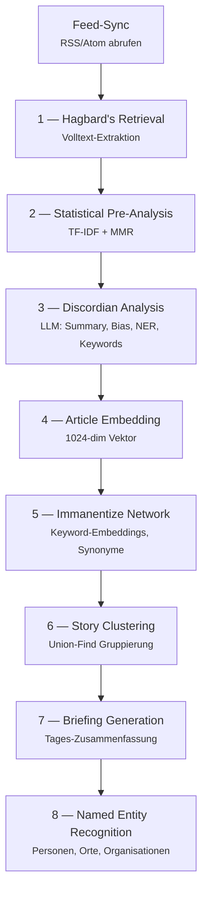

Die Stufen lassen sich in drei Kategorien einteilen: **rein statistische Verarbeitung** (Stufe 1-2, kein Modell nötig), **LLM-basierte Analyse** (Stufe 3, 7 — Textgenerierung) und **Embedding-basierte Operationen** (Stufe 4-6 — Vektorähnlichkeit). Diese Unterscheidung ist wichtig, weil sie das VRAM-Management und die Reihenfolge der Verarbeitung bestimmt.

## Stufe 1 — Volltext-Extraktion

RSS-Feeds liefern in der Regel nur Titel, einen kurzen Teaser und einen Link. Für eine sinnvolle Analyse reicht das nicht. Deshalb ruft die erste Stufe den Volltext jedes Artikels über eine Readability-Implementierung ab — die gleiche Technik, die auch der Lesemodus im Browser nutzt.

Die Extraktion beschränkt sich auf frei zugängliche Inhalte. Paywalls werden nicht umgangen.

## Stufe 2 — Statistische Voranalyse: TF-IDF vor dem LLM

Bevor ein Sprachmodell ins Spiel kommt, läuft eine klassische statistische Analyse: **TF-IDF** (Term Frequency-Inverse Document Frequency) mit **Maximal Marginal Relevance** (MMR).

**Warum diesen Schritt vorschalten?**

Ein LLM-Call kostet Zeit — auf einer GPU mit 12 GB VRAM etwa 1,5 bis 3 Sekunden pro Artikel. Bei 200 neuen Artikeln pro Tag summiert sich das. Die statistische Voranalyse läuft dagegen in Millisekunden, rein auf der CPU, ohne Modell.

TF-IDF extrahiert die statistisch signifikanten Begriffe eines Artikels: Wörter, die in diesem Artikel häufig vorkommen, aber im Gesamtkorpus selten sind. MMR sorgt dafür, dass die extrahierten Keywords möglichst divers sind — nicht fünf Varianten desselben Begriffs. Diese statistischen Keywords dienen als Vorfilter und Kontext für die spätere LLM-Analyse: Das Sprachmodell bekommt nicht nur den Rohtext, sondern auch die statistisch relevanten Begriffe als Orientierungshilfe.

**Das Prinzip dahinter:** zuerst die günstigen, schnellen Methoden. Teure Methoden (LLM) nur dort, wo sie tatsächlich Mehrwert liefern. Die statistische Voranalyse reduziert die Last in den nachfolgenden Stufen, ohne selbst eine GPU zu benötigen.

## Stufe 3 — Discordian Analysis: Ein LLM-Call für alles

Die zentrale Analysestufe ist bewusst als **ein einziger LLM-Call** konzipiert. Ein Artikel geht rein, ein strukturiertes JSON-Objekt kommt heraus — mit Zusammenfassung, Bias-Bewertung, Sachlichkeitsscore, Keywords, Kategorie, Artikeltyp und Named Entities.

### Warum ein Call statt vieler?

In einer früheren Version hatte jede Aufgabe ihren eigenen Prompt: Zusammenfassung separat, Bias-Erkennung separat, Keyword-Extraktion separat, Kategorisierung separat. Das Ergebnis waren sieben LLM-Calls pro Artikel — mit allen Nachteilen:

- **Latenz:** 7 x 2 Sekunden = 14 Sekunden pro Artikel statt 2 Sekunden
- **Inkohärenz:** Die Zusammenfassung kannte die Keywords nicht, die Bias-Bewertung nicht die Kategorie. Jeder Call arbeitete isoliert.
- **Fehlerfläche:** Jeder einzelne Call konnte fehlschlagen oder unerwartete Ausgaben liefern

Der konsolidierte Ansatz löst alle drei Probleme: Das Modell sieht den Artikel einmal, analysiert ihn ganzheitlich und liefert ein konsistentes Ergebnis.

### Structured Outputs: Kein spekulatives Parsing

Die Zuverlässigkeit steht und fällt mit der Ausgabequalität des LLM. Frei generierter Text lässt sich nicht zuverlässig parsen — weder mit Regex noch mit heuristischen Parsern. Ein Sprachmodell kann "Keywords:" schreiben oder "Schlüsselwörter:", kann Felder vergessen oder halluzinierte Felder hinzufügen.

**Structured Outputs** lösen dieses Problem grundlegend. Statt dem Modell zu sagen "gib JSON aus", wird ein **vollständiges JSON-Schema** mitgeschickt. Ollama (ab Version 0.5.0) validiert die Ausgabe direkt während der Generierung gegen dieses Schema. Das Ergebnis ist garantiert schema-konform — fehlerhafte Strukturen können nicht entstehen.

Ein vereinfachtes Beispiel des Schemas:

```json
{
  "type": "object",
  "properties": {
    "summary": { "type": "string" },
    "political_bias": {
      "type": "integer",
      "description": "-2 (stark links) bis +2 (stark rechts)"
    },
    "sachlichkeit": {
      "type": "integer",
      "description": "1 (unsachlich) bis 5 (sehr sachlich)"
    },
    "article_type": {
      "type": "string",
      "enum": ["news", "analysis", "opinion", "satire", "ad", "unknown"]
    },
    "keywords": {
      "type": "array",
      "items": { "type": "string" }
    },
    "categories": {
      "type": "array",
      "items": { "type": "integer" }
    },
    "entities": {
      "type": "array",
      "items": {
        "type": "object",
        "properties": {
          "name": { "type": "string" },
          "type": {
            "type": "string",
            "enum": ["person", "organization", "location", "event"]
          },
          "mentions": { "type": "integer" }
        },
        "required": ["name", "type", "mentions"]
      }
    }
  },
  "required": ["summary", "political_bias", "sachlichkeit",
               "article_type", "keywords", "categories", "entities"]
}
```

Dieses Schema beschreibt exakt, welche Felder in welchem Typ erwartet werden. Das Modell kann nicht "vielleicht" ein Feld zurückgeben — es muss. Enum-Felder wie `article_type` beschränken die möglichen Werte auf eine definierte Menge. Das Ergebnis: Die nachgelagerte Verarbeitung kann sich auf die Struktur verlassen, ohne defensives Parsing.

### Modellwahl und Arbeitsgeschwindigkeit

Als Standardmodell kommt **Ministral 3** (Mistral AI) zum Einsatz — ein europäisches Modell mit guter Deutsch-Unterstützung und zuverlässigem Structured-Output-Verhalten. Auf einer RTX 3080 Ti mit 12 GB VRAM bei `num_ctx=4096` verarbeitet es einen Artikel in etwa 1,7 Sekunden.

Für anspruchsvollere Aufgaben wie Briefings steht optional ein **Reasoning-Modell** (DeepSeek-R1) zur Verfügung, das analytisches Denken mit Thinking-Chain bietet — dazu später mehr.

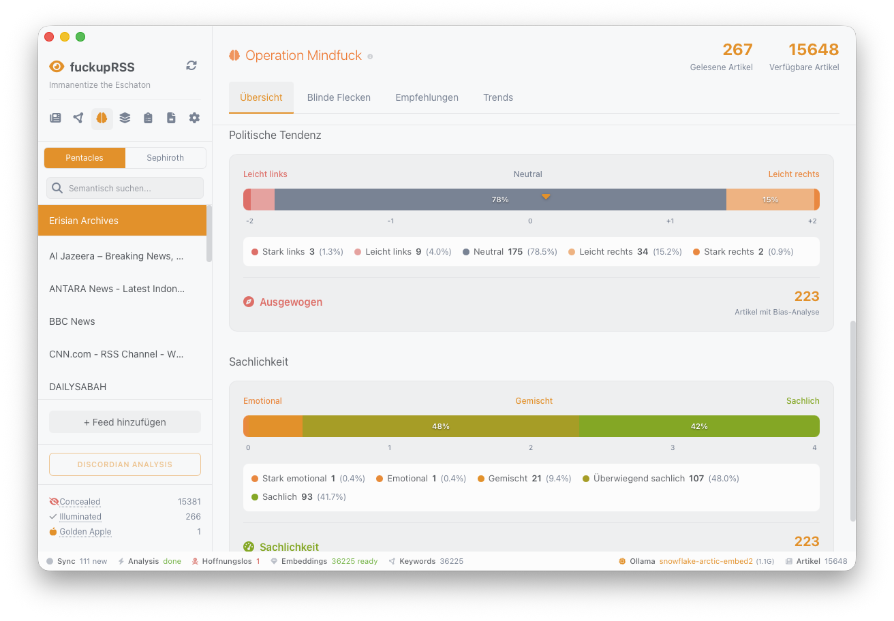

## Stufe 4 — Embeddings: Artikel als Vektoren

Jeder Artikel wird in einen **1024-dimensionalen Vektor** umgewandelt. Dieser Vektor repräsentiert den semantischen Gehalt — nicht die Wörter, sondern die Bedeutung. Zwei Artikel über dasselbe Ereignis haben ähnliche Vektoren, auch wenn sie völlig unterschiedliche Formulierungen verwenden.

### Kontext-Aufbereitung

Das Embedding-Modell (`snowflake-arctic-embed2`, bis zu 8.192 Tokens) bekommt nicht nur den Titel, sondern einen zusammengesetzten Text:

1. **Titel** — die prägnanteste Zusammenfassung
2. **Zusammenfassung** aus der Discordian Analysis — das semantische Destillat
3. **Volltext** bis zu 4.000 Zeichen — der inhaltliche Kontext

Diese Kombination nutzt den großen Kontext des Modells gezielt aus und liefert reichhaltigere Vektoren als ein Embedding, das nur auf dem Titel basiert.

### Warum SQLite mit sqlite-vec statt einer dedizierten Vektor-Datenbank?

Die Vektoren landen in der gleichen SQLite-Datenbank wie alle anderen Daten — möglich durch die `sqlite-vec`-Erweiterung, die KNN-Suche (K-Nearest Neighbors) mit O(log n)-Komplexität direkt in SQLite bereitstellt.

Dedizierte Vektor-Datenbanken wie Qdrant, Milvus oder Pinecone wären eine Alternative. Sie bringen allerdings Nachteile mit:

- **Betriebsaufwand:** Ein separater Datenbankserver muss laufen, konfiguriert und aktualisiert werden
- **Datenfragmentierung:** Artikel-Metadaten in SQLite, Vektoren in einer separaten Datenbank — Joins zwischen beiden erfordern Anwendungslogik
- **Deployment-Komplexität:** Statt einer einzigen Datei (SQLite im WAL-Modus) sind zwei Systeme zu pflegen

Für den Anwendungsfall — einige zehntausend Artikel mit 1024-dimensionalen Vektoren — ist sqlite-vec völlig ausreichend. Die Suche dauert Millisekunden. Erst bei Millionen von Vektoren würde eine dedizierte Lösung Vorteile bringen.

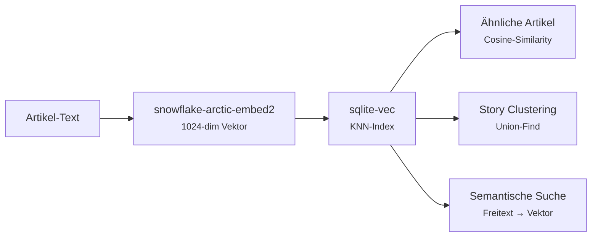

## Stufe 5 — Immanentize Network: Schlagwort-Intelligenz

Keywords allein sind dumm. "KI" und "Künstliche Intelligenz" sind für eine einfache Textsuche zwei verschiedene Begriffe. Das Immanentize Network löst dieses Problem, indem jedes Keyword ein eigenes Embedding erhält.

Über die Vektorähnlichkeit erkennt das System automatisch **Synonyme** und verwandte Begriffe. Keywords werden in einem Netzwerk gespeichert, das Nachbarschaftsbeziehungen abbildet. Das ermöglicht:

- **Synonym-Erkennung:** "USA" und "Vereinigte Staaten" werden als verwandt erkannt
- **Trending-Erkennung:** Keywords mit steigender Häufigkeit über Zeitreihen (`immanentize_daily`) identifizieren
- **Thematische Navigation:** Von einem Keyword zu verwandten Begriffen und deren Artikeln navigieren

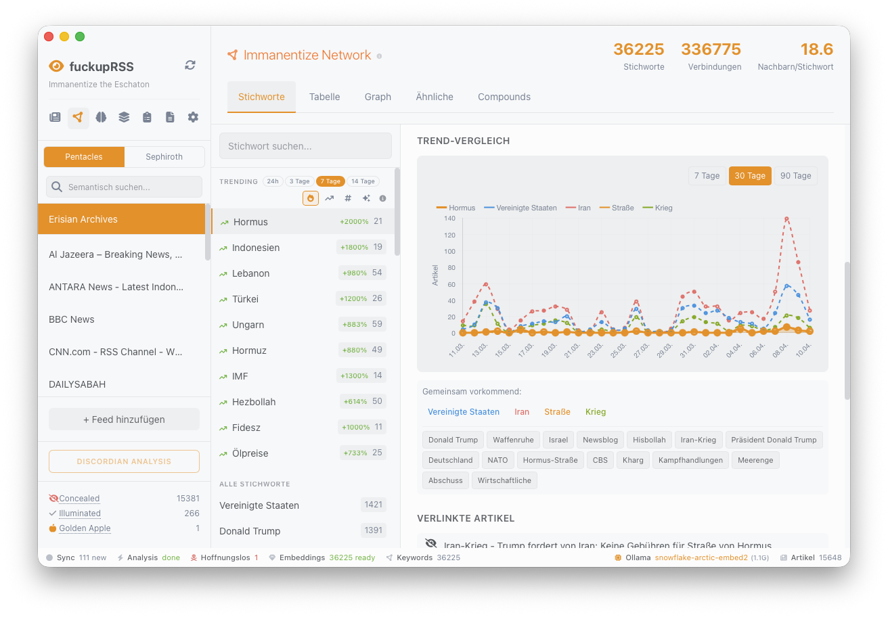

## Stufe 6 — Story Clustering: Union-Find für transitive Verknüpfung

Wenn dasselbe Ereignis in zwölf verschiedenen Quellen erscheint, sollen alle zwölf Artikel als zusammengehörig erkannt werden. Das ist das Problem des Story Clustering.

### Warum Union-Find?

Der naive Ansatz wäre, alle Artikelpaare zu vergleichen und eine Adjazenzmatrix aufzubauen. Bei 10.000 Artikeln sind das 50 Millionen Vergleiche — unpraktisch.

**Union-Find** (auch Disjoint-Set Union) ist ein Algorithmus aus der Graphentheorie, der Elemente effizient in Gruppen zusammenführt. Der entscheidende Vorteil: **Transitive Verknüpfung**.

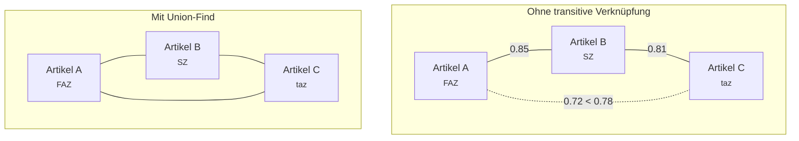

Wenn Artikel A und B ähnlich sind (Cosine-Similarity > 0,78) und Artikel B und C ebenfalls, dann gehören A, B und C zum selben Cluster — auch wenn A und C direkt verglichen unter dem Schwellwert liegen. Union-Find erkennt diese Ketten automatisch.

### Der Schwellwert 0,78

Der Wert wurde empirisch ermittelt:

- **Unter 0,75:** Zu viele falsch-positive Zuordnungen — thematisch verschiedene Artikel landen im selben Cluster
- **Über 0,82:** Zu wenige Cluster — nur nahezu identische Artikel werden gruppiert
- **0,78:** Ein guter Kompromiss zwischen Recall (möglichst alle zusammengehörigen Artikel finden) und Precision (keine falschen Zuordnungen)

### Was Story Cluster ermöglichen

Das eigentliche Ziel ist nicht die Gruppierung selbst, sondern der **Perspektivenvergleich**. Wenn zehn Quellen über dasselbe Ereignis berichten, stellt sich die Frage: Wo unterscheiden sich die Darstellungen? Welche Aspekte betont die eine Quelle, die eine andere weglässt? Optional kann ein LLM einen Vergleich der verschiedenen Perspektiven generieren.

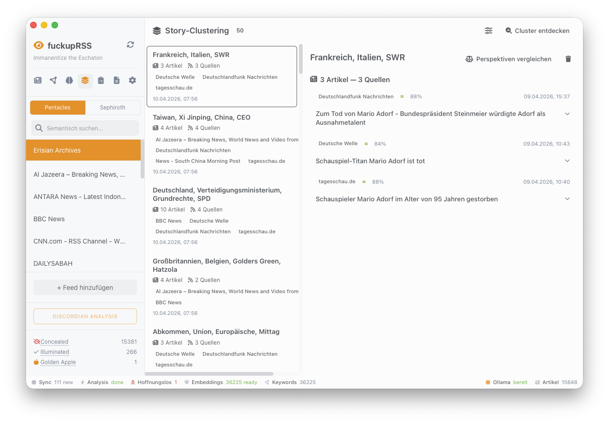

## Stufe 7 — Briefing Generation: Die Synthese

Das tägliche Briefing ist das zentrale Ergebnis der gesamten Pipeline. Statt hunderte Artikel einzeln zu prüfen, liefert das System eine kurierte Zusammenfassung der relevantesten Themen.

### Hybrid-Scoring: Welche Artikel sind relevant?

Nicht jeder Artikel gehört ins Briefing. Die Auswahl basiert auf einem **Hybrid-Score**, der mehrere Signale kombiniert:

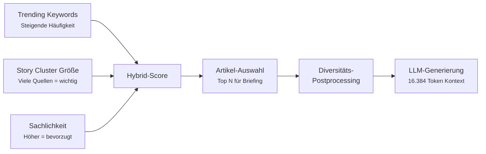

- **Trending Keywords:** Artikel zu Themen mit steigender Häufigkeit werden bevorzugt — Frühindikator für aufkommende Themen
- **Story-Cluster-Größe:** Je mehr Quellen über ein Thema berichten, desto relevanter ist es vermutlich
- **Sachlichkeit:** Artikel mit höherem Sachlichkeitsscore werden bevorzugt — Meinungsstücke und Satire werden nicht ausgeschlossen, aber nachrangig behandelt

### Diversitäts-Postprocessing

Ein reines Ranking nach Score würde dazu führen, dass ein dominantes Thema alle Plätze im Briefing belegt. Das Diversitäts-Postprocessing stellt sicher, dass nicht alle Artikel aus derselben Quelle stammen und dass verschiedene Themenbereiche vertreten sind.

### Reasoning-Modelle für bessere Briefings

Für die Briefing-Generierung kann optional ein **Reasoning-Modell** (z.B. DeepSeek-R1) eingesetzt werden, das analytisches Denken mit einer Thinking-Chain verbindet. Im Unterschied zur schnellen Analyse in Stufe 3, bei der Geschwindigkeit wichtiger ist als Tiefe, profitieren Briefings von der Fähigkeit, Zusammenhänge zwischen Artikeln zu erkennen und Widersprüche herauszuarbeiten.

Die Anwendung unterstützt dafür eine **Zwei-Modell-Strategie** mit Task-Routing:

| Task-Typ | Modell | Eigenschaft |
|----------|--------|-------------|
| **Schnelle Analyse** (Stufe 3) | Ministral 3 | Geschwindigkeit, `/no_think` |
| **Tiefenanalyse** (Stufe 7) | DeepSeek-R1 | Reasoning, Thinking-Chain |

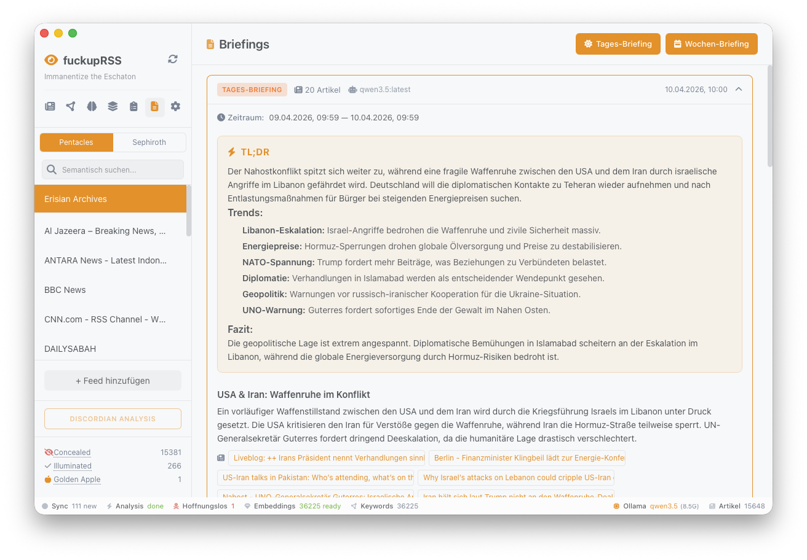


## Stufe 8 — Named Entity Recognition

Personen, Organisationen, Orte und Ereignisse werden aus jedem Artikel extrahiert und in einer separaten Datenstruktur gespeichert. Die Extraktion erfolgt als Teil der Discordian Analysis (Stufe 3) — kein zusätzlicher LLM-Call nötig.

Die Entitäten ermöglichen einen **Entity Explorer**: Alle Artikel über eine bestimmte Person, alle Erwähnungen einer Organisation in einem Zeitraum. In Kombination mit den Trending-Daten aus dem Immanentize Network lässt sich erkennen, welche Akteure gerade an Präsenz gewinnen oder verlieren.

## VRAM-Management: Der Modellwechsel

Ein zentrales Infrastrukturproblem lokaler KI-Pipelines: Textmodelle und Embedding-Modelle teilen sich den GPU-Speicher. Auf einer Karte mit 12 GB VRAM passen nicht beide gleichzeitig.

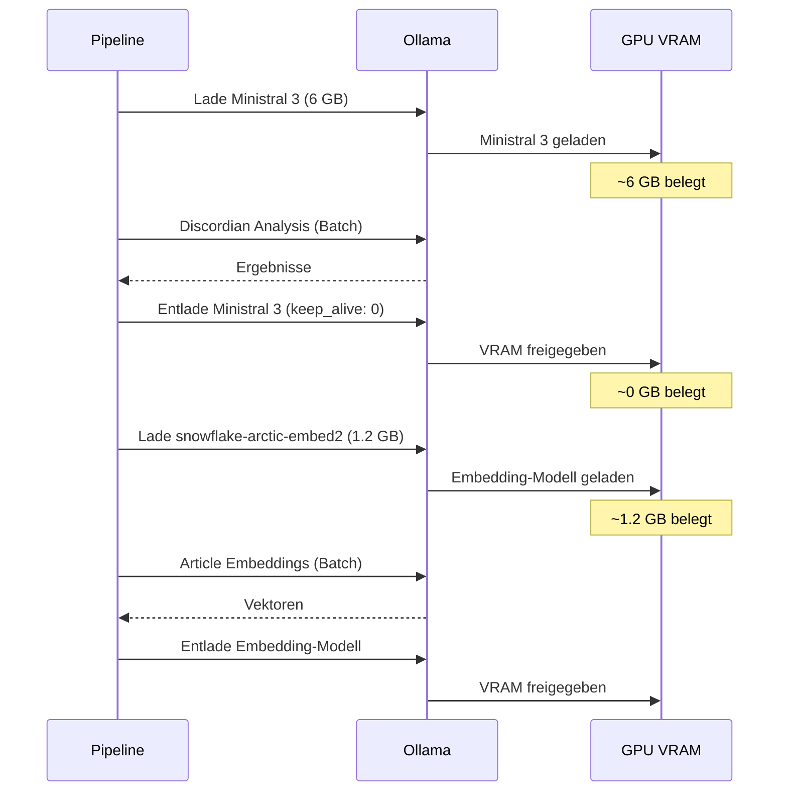

Die Lösung: Explizites **Modell-Entladen** über Ollamas `keep_alive`-Parameter. Nach der Textanalyse wird das LLM mit `keep_alive: 0` aus dem VRAM entfernt, bevor das Embedding-Modell geladen wird. Ohne dieses Management würden VRAM-Konflikte zu Abstürzen oder extrem langsamer CPU-Auslagerung führen.

Auf Systemen mit mehr Speicher — etwa einem Apple-Silicon-Mac mit 48 GB Unified Memory — können beide Modelle gleichzeitig geladen bleiben. Die Ollama-Umgebungsvariable `OLLAMA_MAX_LOADED_MODELS` steuert dieses Verhalten.

## Das Datenmodell

Die gesamte Datenhaltung liegt in einer einzigen SQLite-Datei im WAL-Modus (Write-Ahead Logging). Kein externer Datenbankserver, kein Konfigurationsaufwand.

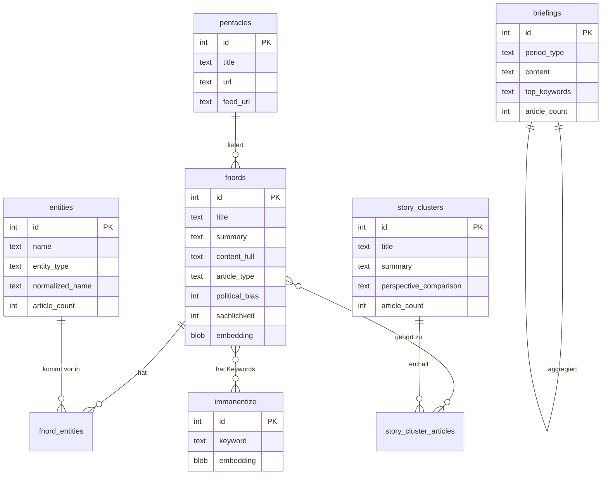

Die Illuminatus!-Terminologie im Datenmodell — Fnords für Artikel, Pentacles für Quellen, Sephiroth für Kategorien — sorgt dafür, dass jede Tabelle und jede Beziehung einen eindeutigen, unverwechselbaren Namen trägt.

## Der Datenfluss: Vom Feed zum Briefing

Wie hängen die einzelnen Stufen zusammen? Der folgende Datenfluss zeigt den Weg eines Artikels durch das Gesamtsystem:

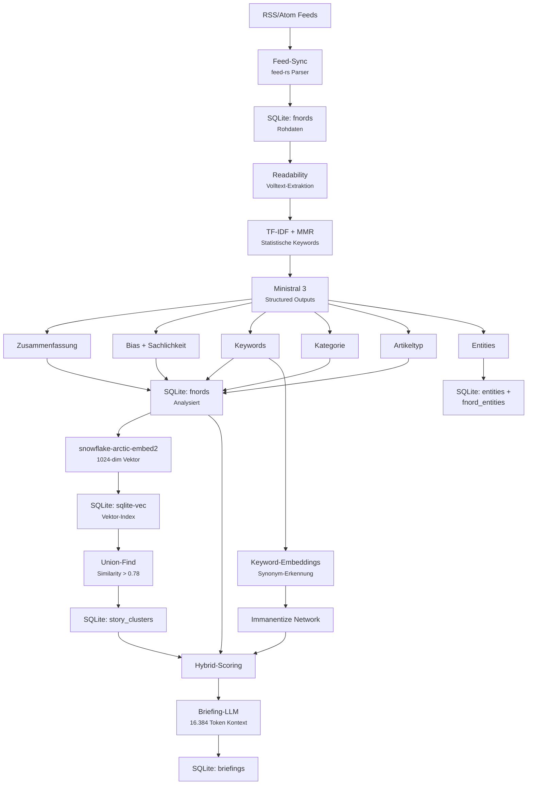

## Tech-Stack: Rust, Svelte, Tauri

Das Backend ist in **Rust** geschrieben. Die Entscheidung gegen Python oder Node.js fiel bewusst: Rust bietet echte Parallelverarbeitung ohne GIL-Probleme, und der Speicherverbrauch liegt erheblich unter dem vergleichbarer Anwendungen mit Garbage Collection.

Das Frontend nutzt **Svelte 5** mit dem neuen Runes-System (`$state`, `$derived`, `$effect`). Das reaktive State-Management ist dadurch deutlich expliziter als im alten Svelte-Stores-Modell — besonders bei komplexen Zuständen wie dem Pipeline-Status ein spürbarer Vorteil.

Als Desktop-Framework kommt **Tauri 2.x** zum Einsatz. Frontend und Backend kommunizieren über typsichere IPC-Commands (`invoke()`). Das Ergebnis ist eine native Desktop-App, die auf Linux und macOS läuft.

### Warum kein Webserver?

Eine Webanwendung wäre die naheliegende Alternative gewesen. Der Grund für eine Desktop-App: Die Integration mit der lokalen Ollama-Instanz und der lokalen SQLite-Datei ist erheblich einfacher, wenn kein HTTP-Server dazwischensteht. Tauri-Commands rufen Rust-Funktionen direkt auf — ohne Serialisierung über REST, ohne CORS-Probleme, ohne Port-Konflikte.

## Provider-Architektur: Lokal und Cloud

Die KI-Integration ist bewusst nicht auf Ollama beschränkt. Ein **Provider-System** abstrahiert den Zugriff auf verschiedene Backends:

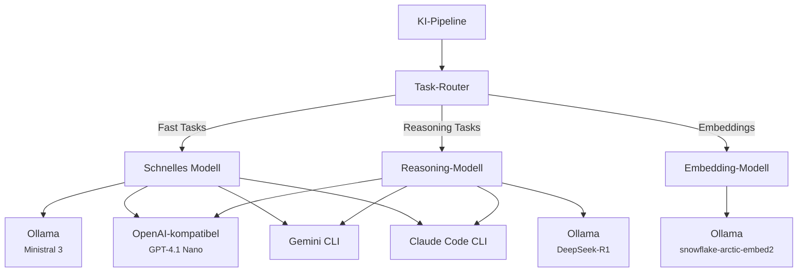

Embeddings laufen immer lokal über Ollama — sie enthalten den semantischen Fingerabdruck des Leseverhaltens und gehören nicht auf fremde Server. Bei der Textgenerierung besteht die Wahl: Wer vollständigen Datenschutz möchte, nutzt Ollama. Wer schnellere Verarbeitung oder bessere Modelle bevorzugt, kann OpenAI-kompatible APIs, Gemini CLI oder Claude Code CLI als Provider wählen.

## Plattformspezifische Eigenheiten

Die Anwendung läuft auf Linux und macOS. Dabei gibt es einen bemerkenswerten Unterschied: macOS Tahoe hat eine **Local Network Privacy Policy** eingeführt, die ad-hoc-signierten Binaries den Zugriff auf LAN-IPs verweigert. Da Ollama häufig auf einem separaten Rechner im lokalen Netzwerk läuft, war ein integrierter **LAN-Proxy** in der App nötig — ein Workaround, der nicht geplant war, sich aber als stabil erwiesen hat.

Auf dem Mac mit **Apple Silicon und 48 GB Unified Memory** ergibt sich ein weiterer Vorteil: Der große gemeinsame Speicher erlaubt Modelle jenseits der 30-Milliarden-Parameter-Marke und macht das VRAM-Management zwischen Text- und Embedding-Modell weniger kritisch. Beide Modelle können gleichzeitig geladen bleiben.

## Qualitätssicherung

Das Projekt umfasst über **625 automatisierte Tests**. Pre-Commit-Hooks prüfen mit ESLint, Prettier, `cargo fmt` und `clippy`. Pre-Push-Hooks führen Vitest und `cargo test` aus. Eine CI-Pipeline auf Gitea Actions führt Security-Scans mit Semgrep, `npm audit` und `cargo audit` durch und erzeugt CycloneDX-SBOMs (Software Bill of Materials) bei jedem Push.

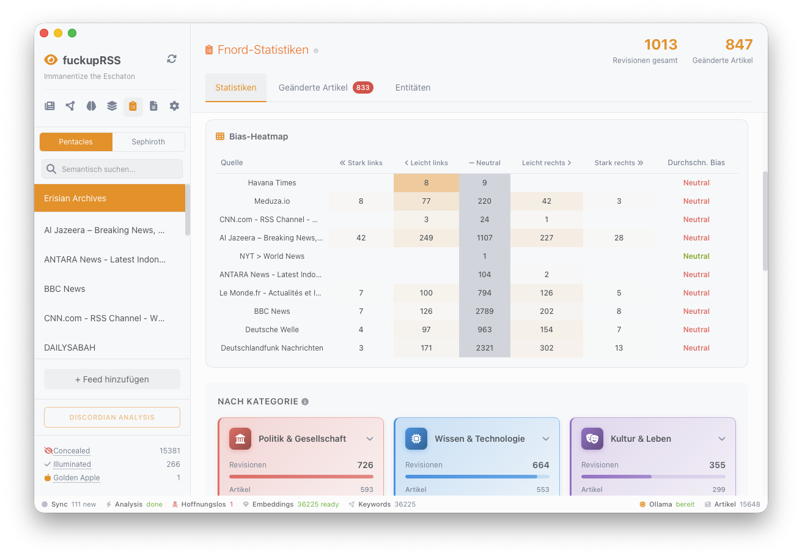

## Zusammenfassung der Architekturentscheidungen

| Entscheidung | Begründung |
|--------------|-------------|
| TF-IDF vor dem LLM | Günstig und schnell — reduziert Last für teure LLM-Calls |
| Ein LLM-Call statt sieben | Latenz, Kohärenz, weniger Fehlerfläche |
| Structured Outputs (JSON Schema) | Garantiert schema-konforme Ausgaben, kein spekulatives Parsing |
| Union-Find für Clustering | Nahezu lineare Skalierung, transitive Verknüpfung ohne Vorgabe der Cluster-Anzahl |
| SQLite + sqlite-vec | Eine Datei, kein Server, KNN-Suche ausreichend für den Anwendungsfall |
| VRAM-Management (keep_alive) | Unvermeidlich bei begrenztem GPU-Speicher und zwei Modelltypen |
| Hybrid-Scoring für Briefings | Kombiniert statistische Signale (Trending), strukturelle Signale (Cluster) und qualitative Signale (Sachlichkeit) |
| Zwei-Modell-Strategie | Schnelle Modelle für Batch-Analyse, Reasoning-Modelle für Synthese |

## Ausblick

fuckupRSS ist noch nicht veröffentlicht. Ein Release ist geplant, das Repository liegt derzeit auf einer privaten Gitea-Instanz. Die Pipeline ist funktionsfähig und im täglichen Einsatz.

Offene Möglichkeiten für die Zukunft: **Argumentationsanalyse** (Pro/Contra aus Meinungsartikeln extrahieren), **Bias-Drift-Erkennung** (politische Verschiebung einzelner Quellen über Monate), **RAG-basierte Artikelsuche** ("Frag deine Artikel" — die Embedding-Infrastruktur dafür existiert bereits) und **Bild-Analyse** mit Vision-Modellen. Die modulare Pipeline-Architektur ist darauf ausgelegt, solche Erweiterungen als zusätzliche Stufen einzufügen.
