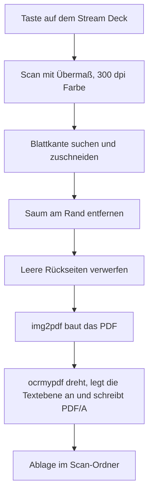

Eigentlich wollte ich nur ein Blatt im Format A6 scannen. Das Scanprogramm bot dafür keinen Scanbereich an, und statt nach dem Grund zu fragen und es dabei zu belassen, habe ich dem Scanner eine eigene Seite auf dem Stream Deck gebaut. Angefangen habe ich am Abend, fertig war ich in der Nacht.

<!--more-->

Das Deck war hier schon dreimal Thema — erst kam das [Kontext-Layout](/blog/streamdeck-kontext-layout/), dann der [Deckausbau](/blog/streamdeck-follow-up/), zuletzt die [Beleuchtung](/blog/rgb-beleuchtung/). Jetzt also der Scanner. Gebaut habe ich das wie die anderen Seiten zusammen mit Claude Code, und wenn im Folgenden „wir“ steht, dann sind damit wir beide gemeint. Die Fehlschlüsse auch.

## Ein Scanner ohne Vorschau

Der Scanner ist ein alter Fujitsu ScanSnap iX500 in der Evernote Edition. Diese Sonderauflage in Grau und Grün kam im Herbst 2013 heraus und war in Deutschland ab Sommer 2014 über den Evernote Market zu haben. Den Laden hat Evernote im Februar 2016 wieder geschlossen. Das Gerät dürfte also zehn bis zwölf Jahre alt sein.

Es ist ein reiner Einzugsscanner. Kein Flachbett, kein Deckel, oben Papier rein, unten Papier raus, beide Seiten in einem Durchlauf.

Damit war die Ausgangsfrage schnell geklärt. Skanpage, das Scanprogramm von KDE, lässt den Scanbereich als Rechteck in einem Vorschaubild aufziehen. Ein Einzugsscanner liefert kein Vorschaubild — das Blatt ist ja schon durch, wenn man es sehen könnte. Kein Bild, kein Rechteck, kein A6.

Auf der Kommandozeile geht es dagegen, und was auf der Kommandozeile geht, passt auf eine Taste. Der Wrapper bekommt Format, Seitenmodus und Tastennummer und zieht alles ein, was im Einzug liegt:

```bash
sd-scan.sh a6 duplex 10 sammel
```

Vier Formate — A4, A5, A6 und Auto —, jeweils einseitig und beidseitig, später noch einmal dasselbe mit einem PDF je Blatt statt einem für den ganzen Stapel. Sechzehn Scan-Tasten, als Raster sortiert: die Spalte ist das Format, die Reihe der Modus. A4 ist blau, A5 grün, A6 orange, Auto violett.

Der erste Testlauf erkannte ein quer eingelegtes A6-Blatt, drehte es und legte ein PDF mit 88 Wörtern Text ab. Ein leerer Einzug meldete sauber „Kein Papier im Einzug“. Damit hätte es gut sein können.

## Anlauf eins: genau aufs Maß

Die Scans verloren oben Rand. An sechs A4-Seiten gemessen stimmte die Geometrie exakt, 210 mal 297 Millimeter, aber am unteren Rand stand ein schwarzer Balken: 20,3 Millimeter, dann 7,9, dann 16,3. Was oben fehlte, hing unten als Schwarz dran.

Ein Betrag, der von Blatt zu Blatt schwankt, kann keine falsch eingestellte Seitenlänge sein. Es ist der Startversatz des Einzugs — je nachdem, wie weit das Blatt beim Einlegen vorsteht, beginnt die Erfassung früher oder später im Papier.

Dazu kam die Rückseite eines beidseitig gescannten Blattes mit 1,59 Grad Kantenneigung. Die Vorderseite sah tadellos aus. Das Blatt hatte aber bei beiden Sensoren gleich schief gelegen, man sah es nur dort, wo Hintergrund im Bild war.

Der Treiber hat für beides Optionen, `swcrop` für den Zuschnitt und `swdeskew` fürs Geraderücken. Die Manpage beschreibt sie als Erkennung des Blattes „within the larger image“ — und ich hatte exakt auf Blattmaß gescannt. Wo kein Rand um das Blatt im Bild liegt, gibt es keine Kante zu finden, und dann wird eben nichts geschnitten und nichts gedreht.

Ohne Fehlermeldung, versteht sich. Das Muster kannte ich vom [Kühler](/blog/rgb-beleuchtung/).

## Anlauf zwei: der Treiber schneidet

Also das Gegenteil: volle Sensorbreite, 20 Millimeter Längenreserve, `--overscan=On`, damit die Erfassung vor dem Papier beginnt. Die Formattaste begrenzt nur noch die Länge. Der Testlauf lieferte zwei randlos zugeschnittene A6-Seiten, 106,2 mal 148,3 und 106,9 mal 148,3 Millimeter, der Aufdruck waagerecht.

Blieb eine dunkle Haarlinie am Blattrand, 0,4 bis 0,5 Millimeter breit. Dafür gab es ein kleines Skript, und dieses Skript hat mich zwei Dinge gelehrt.

Erstens: Der Mittelwert einer Randzeile ist ein schlechtes Kriterium. Ein grau hinterlegter Briefkopf kam auf denselben Wert wie der Saum und wäre um zwei Millimeter gekürzt worden. Jetzt entscheidet die Tiefe — der Saum endet nach fünf bis sechs Pixeln, ein Briefkopf läuft weiter.

Zweitens: Ein beschnittenes Bild, das beim Speichern seine dpi-Angabe verliert, bekommt eine neue geschätzt. Tesseract schätzte 478 und legte die Seite mit 458 mal 634 Millimetern ins PDF. Aus einem A6-Blatt war ein Plakat geworden.

Dann kam die Messreihe über acht Seiten, und die hat den Treiber-Zuschnitt erledigt. Fünf Seiten korrekt auf A6. Zwei zu groß stehen geblieben. Und eine fast leere Rückseite, zusammengeschnitten auf 100 mal 45 Millimeter — der Treiber hatte keine Blattkante gefunden und stattdessen den Rand des Aufdrucks genommen.

Das ist Datenverlust, und er fällt erst auf, wenn das Papier schon im Altpapier liegt.

Der Grund liegt im Gerät. Der Transporthintergrund hinter dem Blatt ist hellgrau, das Papier ist hell, und der Kantenerkennung fehlt der Kontrast. Die Option `--bgcolor Black` wird vom Treiber angeboten und vom Scanner nicht umgesetzt. Ein Gegenversuch ohne `swcrop` zeigte nebenbei, dass `swdeskew` allein auch nichts tut: zwei Seiten mit 5,67 und 4,48 Grad Schieflage.

## Anlauf drei: einfach die Mitte nehmen

Die Entscheidung war danach kurz: kein `swcrop` mehr. Lieber ein Rand zu viel als ein Schnipsel.

Der Einzug zentriert das Papier, also wird mittig auf die Sollbreite zugeschnitten, plus acht Millimeter Rand je Seite. Das ist grob, aber auf die Mitte ist bei diesem Gerät Verlass. Im ersten Versuch steckte trotzdem ein Rechenfehler: Die Umrechnung von Millimetern in Pixel braucht bei 300 dpi den Faktor 11,81, und im Skript stand 1,18.

Bei der Gelegenheit zog `ocrmypdf` in die Kette ein, Version 17.10.0, Stand August 2026. Es dreht die Seiten, legt die Textebene an und schreibt PDF/A:

```bash
ocrmypdf --rotate-pages --output-type pdfa --language deu eingang.pdf ausgang.pdf
```

Dieselbe Textseite schrumpfte von 7,9 Megabyte auf 309 Kilobyte, bei unveränderten 114 erkannten Wörtern. Das Geraderücken von `ocrmypdf` habe ich auch gemessen. An einer unbedruckten schiefen Rückseite wirkt es nicht, weil kein Text zum Ausrichten da ist, und an einer um fünf Grad verdrehten Textseite korrigierte es erst mit erzwungener Neuerkennung, und dann nur die Hälfte. Schiefe Seiten bleiben also schief.

Den Testlauf der neuen Kette habe ich dann mit der A4-Taste gestartet, während im Einzug A6-Blätter lagen. Vier Seiten mit viel leerem Rand. Sechzehn farbcodierte Tasten, und ich treffe die falsche.

## Anlauf vier: der Mittelwert

Wir hatten die Blattkante zu diesem Zeitpunkt für nicht auffindbar erklärt. Weiß auf Hellgrau, einzelne Pixel trennen das nicht.

Für einzelne Pixel stimmt das auch. Für den Mittelwert einer ganzen Bildzeile stimmt es nicht: Der Hintergrund liegt bei 238 bis 243 von 255, das Papier bei 248 bis 250, und dazwischen sitzt an der Blattkante eine Schattenlinie, die bis auf 214 fällt. Zehn Punkte Unterschied, in denen das Rauschen der einzelnen Pixel untergeht.

Aus 215,9 mal 302,0 Millimetern wurden 209,2 mal 297,3. A4, auf gut einen Millimeter genau.

Der Abend hätte hier enden können.

## Anlauf fünf: Papier, das nicht weiß ist

Das nächste A6-Blatt kam mit 215,9 mal 152,9 Millimetern aus der Kette. Unbeschnitten.

Es war getöntes, dünnes Formularpapier, und das liegt bei 240 — der Hintergrund bei 243. Wer nach „wird heller“ sucht, findet da nichts. Was auch auf diesem Papier steht, ist die Schattenlinie: ein Tal bei 202, also 33 bis 38 Punkte unter dem Hintergrund. Die Suche prüft seither beide Merkmale, und die äußere Fundstelle gewinnt. Sonst nimmt die Schattensuche die erste gedruckte Kastenlinie des Formulars für die Blattkante, 11,6 statt 5 Millimeter.

Im alten Code steckten bei der Gelegenheit drei Fehler. Einer davon: Eine Wächterprüfung war länger als das Profil, das sie prüfen sollte, und jeder Aufruf kam sofort mit null zurück. Ein anderer hielt die Beleuchtung für eine Kante — der Hintergrund wird nach innen gleichmäßig heller, von 232 auf 238 über 44 Millimeter, und ein Vergleich gegen den Bildrand schnitt deshalb 36,4 Millimeter sauberen Hintergrund weg.

Geprüft habe ich die neue Fassung gegen zwanzig gespeicherte Testbilder. Dann am Gerät, und dort fehlte links ein Stück Blatt.

Das hatte der Scanner nie erfasst. Der Einzug beginnt 4,5 bis 5,5 Millimeter hinter dem Bildanfang, und die Reserve hatte ich im vierten Anlauf von 20 auf 5 Millimeter gesenkt, weil 20 sichtbaren Rand erzeugten. Ein 148-Millimeter-Blatt endete damit genau an der Bildkante.

```diff
- RESERVE=5
+ RESERVE=15
```

Der zweite gemeldete Mangel war keiner. Rechts sah man einen hellen Streifen, der aussah wie Scannerhintergrund. Es ist die überstrahlte Vorderkante des Blattes: Der Streifen tritt nur über der Blattbreite auf, daneben bleibt alles konstant. Eine Erkennung, die ihn übersprang, war da schon eingebaut und hätte drei bis vier Millimeter echtes Papier gekostet. Sie ist wieder draußen, und im Code steht ein Kommentar, damit sie niemand ein zweites Mal einbaut.

## Anlauf sechs: die eigene Sicherung

Drei Blätter, sechs Seiten, 149,9 mal 105,2 Millimeter. „Das sitzt“, hieß es. Angesehen worden war Seite eins von drei.

Auf einem Blatt mit dunklem Briefkopf saß es nicht. Die rechte Kante wurde gar nicht gefunden, 53 Millimeter Hintergrund blieben stehen. Das Schattental war da, aber die Regel verlangte, dass der Wert dahinter wieder auf Hintergrundniveau steigt — und dieses Papier ist dunkler als der Hintergrund. Die Rückkehr kam nie. Gesucht wird jetzt der Wiederanstieg gegenüber dem Talgrund.

Die obere Kante lag bei 14,2 statt 5 Millimetern, mitten im Briefkopf. Die Zeilen wurden über die mittleren 70 Prozent der Bildbreite gemittelt, und bei einem 105 Millimeter breiten Blatt in einem 216 Millimeter breiten Fenster ist das zur Hälfte Hintergrund. Jetzt kommen erst die Seitenkanten, dann wird nur noch über die Blattbreite gemittelt.

Blieb A4. Der erste Lauf war 10,6 Millimeter zu lang, und schuld war eine Sicherung, die wir selbst eingebaut hatten: Sie prüft, ob der Bildrand glatt genug ist, um Hintergrund zu sein, und schneidet sonst gar nicht. Gerechnet wurde über drei Millimeter. Unten bleiben bei langen Vorlagen aber nur rund zwei, dahinter beginnt schon die Schattenlinie. Über zwei Millimeter reichte es knapp nicht, über anderthalb trennt es sauber.

Und die Vorlage war gar kein A4. Es war ein Ausdruck auf 12-Zoll-Endlospapier, 304,8 Millimeter lang. Gemessen: 210,9 mal 304,0.

Dabei fiel noch etwas heraus. Dass A4 im vierten Anlauf so gut ausgesehen hatte, war Zufall — bei der damaligen Scanlänge endete das Blatt fast an der Bildkante, unten gab es nichts zu finden. Die Unterkante war bis zu diesem Moment nie erkannt worden.

## Was jetzt durchläuft



Denselben Stapel habe ich sechzehn Minuten später noch einmal durch die Taste geschickt, ohne Änderung am Code. Die größte Abweichung an einer Kante lag bei 0,3 Millimetern. Die Schieflage habe ich bei der Gelegenheit auch einmal vermessen, statt weiter darüber zu reden: 0,11 und 0,08 Grad. Das ist über die Blattbreite ein halber Millimeter.

Zum Schluss der Leerseiten-Filter. Er zählte dunkle Pixel und warf alles unter 0,3 Prozent weg. Eine Seite mit einer einzigen Textzeile kommt auf 0,15.

Über die Menge lässt sich das nicht trennen, denn leere Rückseiten mit durchscheinender Vorderseite erreichen bis zu 0,18 Prozent. Was trennt, ist die Dunkelheit. Durchscheinen liegt knapp unter einem Grauwert von 200, gedruckter Text weit darunter:

| Seiteninhalt | Pixel unter 200 | Pixel unter 160 |
|---|---|---|
| leere Rückseite | 0,02 % | 0,00 % |
| eine Textzeile | 0,15 % | 0,09 % |
| Anrede und eine Zeile | 0,28 % | 0,18 % |
| nur eine Unterschrift | 0,73 % | 0,62 % |
| volle Textseite | 5,78 % | 4,91 % |

Gezählt wird jetzt unter 160, verworfen unter 0,05 Prozent. An vierzehn Vorlagen gegengeprüft fliegen nur die beiden echten Leerseiten raus. Die neue Schwelle wäre im echten Lauf übrigens nie angekommen, weil der Wrapper noch die alte als Vorgabe übergab. Zwei Stellen für denselben Wert, und es gewinnt die, an die man nicht denkt.

## Was offen ist

A5 ist mit der neuen Scanlänge noch nicht am Gerät gelaufen. Die Leerseiten-Schwelle ist bisher nur über den direkten Aufruf geprüft und nicht über die Taste. Und eine Taste, die geprüfte Scans ans Dokumentenarchiv übergibt, gibt es zwar, sie hat aber noch kein echtes Dokument gesehen.

Eine Sache bleibt mit Absicht, wie sie ist: Leere Rückseiten fallen bei beidseitigen Scans um 1,3 Millimeter zu knapp aus. Die Korrektur hätte jede andere Vorlage ein bis drei Millimeter Hintergrundrand gekostet.

A6-Blätter habe ich an diesem Abend jedenfalls genug gescannt …
