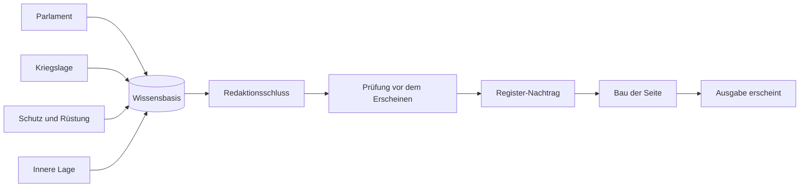

Heute Morgen erschien meine selbstschreibende Zeitung, die „Lage am Morgen“, zwei Minuten zu spät, weil eine Datei zu groß geworden war — und zwar an einer Grenze, die ich zwei Wochen vorher schon einmal gefunden hatte. Seit dem letzten Bericht ist die Zeitung zweimal umgezogen, aus einem Lauf sind sechs geworden, und ich habe zum ersten Mal nachgezählt.

<!--more-->


Die Erzeugung der Zeitung läuft seit dem 5. September auf einem eigenen Server im Rechenzentrum und seit dem 12. September unter einem eigenen Unix-Konto. Statt eines Laufs schreiben vier Zuarbeiter, ein fünfter setzt danach die Ausgabe zusammen, ein sechster pflegt das Register. Eine Vorsortierung durch ein kleines Bewertungsmodell entscheidet, welche der rund 250 Meldungen am Tag überhaupt gelesen werden. Am 6. Oktober wurde gezählt: 105 Ausgaben, 1.205 Einzelpunkte, 224 Berichtigungsfälle — und geschätzt 5,40 US-Dollar je Tag zum Listenpreis.


## Wo wir stehen geblieben waren

Im Juli habe ich hier beschrieben, wie [eine Zeitung sich selbst schreibt](/blog/self-writing-newspaper/), und zwei Wochen später, wie sie [sich selbst prüft](/blog/self-checking-newspaper/). Der zweite Teil endete mit einer offenen Frage: ob die Texte wirklich besser geworden sind oder nur sorgfältiger abgesichert.

Die Frage ist noch offen. Dafür weiß ich inzwischen, wo die Fehler herkommen, und das ist auch schon etwas.

Der August brachte zwei Befunde, die ich nicht bestellt hatte. Der erste: Die tägliche Belegprüfung meldete ihre Funde an mich, und ich sah sie einmal in der Woche durch. Über jeder Seite der Zeitung steht aber *Non manu hominis* — nicht von Menschenhand. Seit dem 13. August urteilt ein zweites Modell über jede Beanstandung und trägt Berechtigtes selbst ein, mit Vermerk an der Ausgabe. Geändert werden darf nur, was sich genau einmal wörtlich im Text findet. Die Zeitung nennt das [die letzte Handarbeit](https://news.hnsstrk.de/technik/2026-08-13-die-letzte-handarbeit/).

Bei der Abnahme fiel auf, dass dieselbe Prüfung desselben Textes zweimal zu verschiedenen Ergebnissen kommt. Beide Befunde des zweiten Durchgangs waren berechtigt, und beide hatte der erste übersehen.

Der zweite Befund war unangenehmer. Am 14. August wollte ich wissen, warum der Morgenlauf so viel Kontext verbraucht. Dabei kam heraus, dass das Agenten-Werkzeug lange Ausgaben über 100.000 Zeichen kappt und die Mitte herausschneidet. Mindestens 75 Fälle zwischen dem 6. Juli und dem 14. August, 66 davon nicht mehr aufklärbar, weil die Beweisdateien nach sieben Tagen gelöscht waren.

Die Redaktion hatte also seit Wochen Quellen gelesen, in denen ein Stück fehlte. Einen der Fälle konnte ich bis in die Zeitung verfolgen: Die Meldung erschien mit einer falschen Aussage, die Belegprüfung fand sie, die Nachlese berichtigte sie. Der Fehler war beim Lesen entstanden, nicht beim Schreiben. Die Einzelheiten stehen unter [Die Grenze, die sich nicht meldet](https://news.hnsstrk.de/technik/2026-08-14-die-grenze-die-sich-nicht-meldet/).

## Raus aus dem Wohnzimmer

Von Anfang an teilten sich zwei Rechner die Arbeit. Einer im Rechenzentrum liefert die fertige Seite aus und sammelt seit dem Umbau im Juli auch die Meldungen. Der andere stand bei mir zu Hause, und auf ihm lief der Agent, der jeden Morgen schreibt.

Das war nie eine Entscheidung. Der Heimserver war da, er hatte Leistung übrig, und die Zeitung war ein Versuch.

Wie sehr sich alle damit arrangiert hatten, stand im Deploy-Skript. Es hatte einen eigenen Absatz für den Fall, dass der Heimserver nicht erreichbar ist — und behandelte diesen Fall als den normalen. Am Abend des 5. September ist die Erzeugung auf einen zweiten Server im Rechenzentrum gezogen, am 6. September entstand dort die erste Ausgabe.

Der Umzug war ein Test für die Pipeline. In den Regelwerken, Skills und Skripten standen 65 fest eingetragene Pfade in 18 Dateien, die alle stillschweigend annahmen, dass es genau diesen einen Rechner gibt. Eine Wache — so heißen hier die automatischen Kontrollläufe — suchte nach dem Umbau der Pfade den Code am falschen Ort, fand nichts und meldete als letzte Aktualisierung den 1. Januar 1970. Vor dem Umschalten lief ein Probelauf im Trockenmodus. Der zeigte diese Stelle, bevor es zählte.

Verloren hat die Zeitung dabei drei Quellen. Die Transkripte von drei Video- und Podcastkanälen lassen sich vom neuen Server aus nicht beziehen, und den Heimserver nur dafür zu behalten hätte genau die Abhängigkeit zurückgebracht, die weg sollte. Mehr dazu in [Die Zeitung, die nicht mehr zu Hause wohnt](https://news.hnsstrk.de/technik/2026-09-05-die-zeitung-die-nicht-mehr-zu-hause-wohnt/).

Innerhalb von drei Tagen habe ich das Modell gewechselt. Dreimal.

Am 5. September ging es von GPT-5.6 Sol auf GPT-6 Astra, weil ich ein Kontextfenster von 1.050.000 Token erwartet hatte. Das ist die Herstellerangabe für einen anderen Zugangsweg — über meinen liefern alle acht Modelle 272.000, auch Astra. Am 6. September ging es zurück auf Sol, weil Astra je Aufruf das Doppelte vom Kontingent nimmt. Am 7. September dann auf GPT-5.6 Terra, das nach der Recherche vom selben Tag rund zweieinhalbmal günstiger ist als GPT-5.6 Sol. Dort ist es geblieben.

Eine Woche später folgte der zweite Umzug, diesmal innerhalb desselben Servers. Die Zeitung teilte sich ein Unix-Konto mit meinen übrigen Agenten, und ein Update des Agenten-Frameworks dort hätte sie jedes Mal mit erwischt. Seit dem 12. September hat sie ein eigenes Unix-Konto. Der Planprüfer gab die Freigabe mit acht Auflagen, zwei davon betriebsgefährdend — und die Erhebung davor hatte ergeben, dass ein Schritt, der im Plan als erledigt stand, gar nicht erledigt war.

## Sechs Läufe statt einem

Bis zum 11. September tat am Morgen ein einziger Lauf alles: Kandidaten sichten, Volltexte lesen, auswählen, schreiben, einordnen, das Register pflegen, prüfen, veröffentlichen. Das funktionierte. Es hatte nur den Haken, dass die Einordnung — der einzige Teil der Zeitung, der werten soll — genau dann entstand, wenn der Lauf am vollsten war.

Dazu kam ein Befund vom 7. September, den ich mir hätte denken können. Über 30 Ausgaben gezählt, entfielen 62 Prozent auf Kriegsschauplätze und 25 Prozent auf Deutschland. Ich wollte es andersherum.

Also wurde der Lauf zerlegt. Vom 7. September an schrieben zwei Zuarbeiter jeden Morgen im Schatten mit, also ohne dass ihr Ergebnis in die Zeitung ging, und ein Prüflauf hielt ihr Ergebnis gegen die Ausgabe, die der alte Lauf nebenher erzeugte. Am ersten Schattentag lautete das Urteil: Mängel, noch nicht umschaltreif. Die Prüfung fand in den ersten Tagen jedes Mal etwas anderes, und jedes davon war eine Regel, die fehlte — der alte Lauf hatte diese Fragen jeden Morgen für sich beantwortet, ohne dass es jemand sah.

Ausgemacht war, erst umzuschalten, wenn die Prüfung zweimal in Folge „umschaltreif“ meldet. Am 11. September meldete sie es zum ersten Mal.

Noch am selben Vormittag habe ich umgeschaltet.

Zwei Tage später kam die Quittung in Form einer sehr dünnen Ausgabe mit vier Punkten. An der Erfassung lag es nicht: Von 38 einschlägigen Meldungen standen 11 in der Zeitung, 14 hatte die Auswahl verworfen, eine hatte sie übersehen, 12 hatte die Vorsortierung unsichtbar gemacht. Am selben Tag bekam die Zeitung eine neue Rangfolge — Bedrohung und Schutz, Rüstung, Deutschland, Bündnis und Europa, Kriege und Konflikte — und einen weiteren Lauf für die ersten beiden Gruppen. Sein erster Probelauf fiel durch, der zweite bestand.

Der jüngste Lauf ist der für das Parlament. Den Zugang zur DIP-Schnittstelle des Bundestages, dem Dokumentations- und Informationssystem für Parlamentsmaterialien, habe ich am 10. September beantragt, am 15. September lag der Schlüssel vor. Ein Abgleich von 395 Drucksachen aus der Zeit vom 16. August bis 14. September zeigte, warum sich das lohnt: Antworten der Bundesregierung tauchten im Pressedienst des Bundestages im Median sieben Tage später auf, und von 17 Beschlussempfehlungen keine einzige.

Bis zum ersten Regellauf am 5. Oktober vergingen trotzdem knapp drei Wochen. Die Antworten sind lang — in 21 Tagen 102 Stück mit im Mittel 25.479 Zeichen, am 29. September allein 17 mit zusammen 458.017. Der Lauf liest deshalb höchstens acht davon im Wortlaut und sagt dem Redaktionsschluss, was ungelesen blieb. Wie er das entscheidet, steht in [Ein eigener Lauf für das Parlament](https://news.hnsstrk.de/technik/2026-10-06-ein-eigener-lauf-fuer-das-parlament/).

So sieht der Morgen jetzt aus:

```text
1  Parlament
2  Kriegslage
3  Schutz und Rüstung
4  Innere Lage
5  Redaktionsschluss
6  Register-Nachtrag
7  Ausgabe erscheint zur festen Zeit
```

Die vier Zuarbeiter recherchieren und schreiben, jeder nur für sein Gebiet. Der Redaktionsschluss recherchiert nicht mehr. Er liest die vier Zuarbeiten, streicht Doppelungen, schreibt Schlagzeile und Einordnung und übergibt an die Prüfung.



Übergeben wird über die Wissensbasis, nicht über Dateien. Jede Zuarbeit steht dort als Zeile mit einer Statusspalte, und eine Wache auf dem anderen Server sieht kurz vor dem Redaktionsschluss nach, ob alle fertig sind. Steht der Erzeugungsrechner, schweigen seine eigenen Wachen mit ihm. Diese eine nicht.

Seit dem 5. Oktober gehört außerdem die innere Sicherheit zum Themenumfang, also Terrorismus, Extremismus und politisch motivierte Gewalt. Ausgerollt habe ich das am Vorabend, gegen die Empfehlung des Projektleiter-Agenten im Team. Das Review danach fand zwölf Befunde, elf davon bestätigt. Den nächsten Morgen gefährdete keiner.

## Ein Register, das vergaß

Am Fuß jeder Ausgabe stand von Anfang an ein Anhang, der die Namen des Tages erklärt. Im September ist daraus ein richtiges Register geworden. Am 21. September wuchs es von 671 auf 1.868 Einträge, und seit demselben Abend öffnet ein Klick auf einen Namen im Text eine Karte mit der Erklärung, ohne dass man die Ausgabe verlässt.

Am Morgen darauf stellte sich heraus, dass das Register jeden Tag ein bisschen vergaß.

Der Lauf, der neue Einträge anlegt, ersetzte bei bestehenden Einträgen alle Felder. Seit dem ersten Tag. Was jemand von Hand geprüft und verbessert hatte, war am nächsten Morgen wieder die Meldung des Tages. Allein am 22. September waren es 53 überschriebene Einträge; 30 hatten Schreibweisen verloren, darunter „Moskau“ bei Russland. Wiederhergestellt wurden sie aus der Versionsgeschichte des Registers, und seitdem ergänzt ein Lauf nur noch, was fehlt. Nachzulesen unter [Das Register vergaß jeden Morgen](https://news.hnsstrk.de/technik/2026-09-22-das-register-vergass-jeden-morgen/).

Vollständig ist das Register nicht. Eine tägliche Prüfung hält alle erkannten Namen im Text gegen die Einträge, und am 6. Oktober hatten 18,4 Prozent davon einen eigenen.

## Die Vorsortierung

Aus den Quellen kommen rund 250 Meldungen am Tag, in einer Ausgabe stehen im Schnitt elf Einzelpunkte. Dazwischen sitzt eine Vorsortierung, und die arbeitete bis Anfang Oktober mit Wortlisten und Ähnlichkeitsmaßen. Die dünne Ausgabe vom 13. September hatte gezeigt, was das heißt: Zwölf einschlägige Meldungen hat sie den Läufen gar nicht erst gezeigt.

Am 15. September veröffentlichte [TypeSafe AI](https://typesafe.ai/) ein kleines Modell namens [Jev](https://typesafe.ai/blog/introducing-system-one-models-and-jev), das keinen Text schreibt. Es beantwortet Ja-Nein-Fragen und gibt zu jeder Antwort an, wie sicher es ist. Ist diese Meldung für die Sicherheitspolitik von Belang? Zu welchem Themenfeld gehört sie?

Gemessen habe ich in drei Schritten, bevor es irgendetwas entscheiden durfte. Zuerst an 215 von Hand bewerteten Meldungen: allein zu schwach, als Veto über der alten Entscheidung brauchbar. Dann an allen 5.760 Nachrichtenmeldungen der 30 Tage vor dem 23. September — das dauerte 6 Minuten 36 Sekunden und kostete 2,29 US-Dollar. Dann lief Jev vom 23. September an im Schatten mit und bewertete jede neue Meldung, ohne dass sein Urteil zählte.

Die Auswertung war für den 7. Oktober geplant. Ich habe sie auf den 2. Oktober vorgezogen, was niemanden überraschen dürfte, der bis hierher gelesen hat.

| Vorsortierung | Präzision | Recall |
|---|---|---|
| bisher (Wortlisten und Ähnlichkeitsmaße) | 0,616 | 0,904 |
| Jev, Schwelle 0,2 | 0,689 | 1,000 |
| Jev, Schwelle 0,3 | 0,806 | 0,956 |

Gemessen an 1.675 Meldungen vom 23. September bis 2. Oktober, bewertet an einer Stichprobe von 181 Meldungen. Die Schwelle ist der Wert, den Jevs Sicherheit mindestens erreichen muss, damit eine Meldung durchkommt. Präzision heißt: Welcher Anteil der durchgelassenen Meldungen war einschlägig? Recall heißt: Welcher Anteil der einschlägigen Meldungen kam durch? Seit dem 2. Oktober entscheidet Jev mit der Schwelle 0,3. Fällt es aus, sortieren die Wortlisten wie vorher.

Das hat einen Preis, und er ist beziffert. Bei 0,3 gingen 3 von 104 Meldungen verloren, die die Zeitung tatsächlich als Beleg genutzt hatte. Am 5. Oktober bekam Jev neue Fragen für die innere Sicherheit, und die Schwelle 0,3 wurde daran nachgemessen: an der Stichprobe vom 2. Oktober Präzision 0,840, an der älteren vom 23. September 0,668 — knapp unter der dafür festgelegten Untergrenze von 0,68. Die Schwelle bleibt bei 0,3. Gesenkt habe ich die Untergrenze, auf 0,66.

## Drei Störungen

Die Architektur aus dem ersten Teil hat gehalten. Ausgefallen ist die Zeitung trotzdem, nur nie dort, wo ich Wachen aufgestellt hatte.

Am 20. September stand die Ausgabe am Morgen pünktlich fertig da und erschien gut drei Stunden später, von Hand veröffentlicht. Vor jedem Terminal-Befehl der Redaktion prüft ein Scanner namens Tirith den Befehlstext. Seine Regel behauptet nicht, ein Befehl sei gefährlich; sie sagt nur, sie könne nicht beweisen, dass er harmlos ist. Der Veröffentlichungsbefehl begann mit einer Tilde, der Kurzform für das Benutzerverzeichnis, die erst beim Ausführen aufgelöst wird.

Im Regelwerk stand wörtlich, veröffentlicht werde „mit genau diesem Befehl“.

Der Lauf hatte also exakt getan, was ihm vorgeschrieben war. Und er hatte es schon an den drei Tagen davor getan — nur hatte er an diesen Tagen einen anderen Veröffentlichungsweg genommen, die Ausgabe erschien pünktlich, und niemand erfuhr davon. Ein Fehler, der sich selbst repariert, meldet sich nicht. Die ganze Geschichte: [Nicht gefährlich, nur ungeklärt](https://news.hnsstrk.de/technik/2026-09-20-nicht-gefaehrlich-nur-ungeklaert/).

Am 2. Oktober brachen Märkte-Seite und Tagesausgabe ab, weil den Skripten ein Python-Modul fehlte. Eine Umstellung am Vorabend hatte eine zweite Python-Installation des Agenten-Frameworks vor das Systempython geschoben. Mein Nachbau des Fehlers am Schreibtisch fand nichts, weil ihm genau diese Einträge fehlten; gezeigt hat sie erst die Messung im laufenden Job. Die Ausgabe wurde nachgeholt und erschien 46 Sekunden nach der festen Zeit.

Und dann heute. Am Morgen war die Ausgabe fertig und hochgeladen, eine Dreiviertelstunde vor der Erscheinungszeit, und der Bau der Seite brach ab:

```text
too many YAML aliases for non-scalar nodes
```

Mit YAML-Aliassen hat das nichts zu tun. Hugo bricht bei jeder YAML-Datendatei ab, die auf einer Ebene mehr als 10.000 verschachtelte Einträge führt, und nennt dabei diese Ursache. Die Registerdatei war mit der Ausgabe des Tages von 9.877 auf 10.053 Vorkommen gewachsen und lag damit über der Grenze. Ungewöhnlich groß war die Ausgabe nicht: 176 neue Vorkommen sind ein gewöhnlicher Tag, und zwei Tage vorher hatte die Datei schon einmal bei 9.957 gestanden.

Die Sofortmaßnahme war ein anderes Dateiformat:

```diff
- news-blog/data/register.yaml
+ news-blog/data/register.json
```

Derselbe Inhalt in einem Format, für das diese Grenze nicht gilt. Zwei Minuten nach der festen Erscheinungszeit war die Ausgabe ausgeliefert.

Jetzt der Teil, der mir weniger gefällt. Am 22. September war der Probebau schon einmal an genau diesem Fehlertext gescheitert, damals mit Hugo 0.166.0 an einer anderen Datei mit 10.319 Einträgen. Die Ursache wurde im Quelltext von Hugo nachgelesen und lokal nachgestellt — 10.000 laden, 10.319 nicht —, und die Datei zog aus dem Datenverzeichnis aus. Die Grenze war also bekannt. Die Registerdatei im selben Verzeichnis, die mit jeder Ausgabe wächst, lief zwei Wochen später trotzdem hinein.

Jetzt hält ein Test die Grenze fest. Den Rest erzählt die Zeitung selbst unter [Zwei Minuten nach acht](https://news.hnsstrk.de/technik/2026-10-06-zwei-minuten-nach-acht/).

## Gezählt

Am 6. Oktober habe ich zum ersten Mal alles zählen lassen. Die Zahlen stammen, wo nichts anderes steht, von diesem Tag.

| Die Zeitung | Wert | Was gezählt ist |
|---|---|---|
| Ausgaben | 105 | erschienene Tagesausgaben; die älteste trägt das Datum 21. Juni, am 24., 26. und 27. Juni fehlt je eine |
| Einzelpunkte | 1.205 | einzelne Meldungen mit Einordnung, Stand und Belegen, im Schnitt 11,5 je Ausgabe |
| Quellenverweise | 2.887 | Belege unter den Einzelpunkten |
| Wörter | 446.661 | Text aller Ausgaben samt Anhang; ohne Anhang 245.528 |
| Berichtigungsfälle | 224 | aus 417 Korrekturvermerken, gesammelt auf der [Errata-Seite](https://news.hnsstrk.de/errata/), gleiche Vermerke eines Tages einmal gezählt; 104 der 105 Ausgaben tragen einen; darunter 37 Ergänzungen fehlender Gegenstände |
| Registereinträge | 2.042 | laut Statistik der Seite: 574 Organisationen, 535 Orte und Regionen, 504 Programme und Formate, 244 Begriffe, 157 Personen, 28 Ereignisse |
| Quellen | 57 | Stand 5. Oktober: 9 Nachrichtenquellen, 26 Fachquellen, 16 Internetseiten ohne Feed, 6 Schnittstellen |
| Meldungen je Tag | 247 | Mittel aus 3.707 Meldungen der 15 Tage vom 21. September bis 5. Oktober |

Die Zahl, an der ich am längsten hängen geblieben bin, ist die fünfte. 104 von 105 Ausgaben sind nach dem Erscheinen berichtigt worden. Ein guter Teil der Fälle sind Zusammenlegungen doppelter Registereinträge und nachgetragene Gegenstände — aber eben auch verwechselte Sprecher, falsch gerechnete Tage und falsch übertragene Zahlen.

Die Wissensbasis:

| Die Wissensbasis | Wert | Was gezählt ist |
|---|---|---|
| Meldungen | 19.684 | erfasste Meldungen aus den Quellen |
| gespeicherte Änderungen | 4.114 | Fälle, in denen eine Quelle ihre Meldung nach der Veröffentlichung geändert hat |
| Parlamentsdokumente | 27.464 | Dokumente aus Bundestag und Bundesrat |
| Kurswerte | 232.507 | Tagesschlusswerte für die Markteinordnung, zurück bis Februar 2022 |
| Größe | 356 MB | Datenbank insgesamt |

Und die Arbeit dahinter:

| Die Arbeit | Wert | Was gezählt ist |
|---|---|---|
| Programmcode | 40.890 Zeilen | 31.304 Zeilen Python und 9.586 Zeilen Shell, ohne Tests |
| Tests | 54.354 Zeilen | 197 Testdateien mit 3.463 Testfunktionen |
| Regeln und Dokumentation | 30.319 Zeilen | Markdown: Statute (die Regelwerke der Zeitung), Aufträge der Läufe, Konzepte |
| Commits | 2.154 | 1.198 in der Pipeline, 686 in der Webseite, 270 im Arbeitsordner; ein Teil stammt von der täglichen Automatik |
| Arbeitstage | 96 von 112 | Tage mit mindestens einem Protokolleintrag zum Projekt seit dem ersten Auftrag am 17. Juni; 919 Einträge |
| Sitzungsstunden | 377 | Schätzung aus den Zeitstempeln des Protokolls; Laufzeit der Sitzungen mit dem Sprachmodell einschließlich Wartezeiten |
| meine eigene Zeit | 100 bis 230 Stunden | Schätzung, hochgerechnet aus den Abständen meiner Eingaben in 27 Sitzungen vom 5. September bis 6. Oktober; je nach Annahme 100, 160 oder 230 |

Es gibt also mehr Prüfcode als Programmcode. Den Code hat überwiegend ein Sprachmodell nach meinen Vorgaben geschrieben, und die 377 Stunden sind seine Zeit, nicht meine. Meine steht in der Zeile darunter, und die Spanne zeigt, wie genau ich es weiß.

## Was ein Tag kostet

Der Betrieb läuft über ein Abonnement mit Kontingent; je Token zahle ich nichts. Die folgende Rechnung ist deshalb durchweg eine Schätzung: gemessene Token der Woche vom 29. September bis 5. Oktober, multipliziert mit öffentlichen Listenpreisen vom 6. Oktober. Einen Probelauf mit anderen Modellen hat es nicht gegeben.

| Alle Modellaufrufe mit … | Minimum je Tag | wahrscheinlich je Tag | Maximum je Tag | wahrscheinlich je Monat |
|---|---|---|---|---|
| heutigen Modellen (GPT-5.6 Terra schreibt, Gemini 3.8 Flash prüft die Belege) | 3,60 USD | 5,40 USD | 27,50 USD | rund 160 USD |
| Claude Opus 5.5 | 6,90 USD | 13,00 USD | 65 USD | rund 390 USD |
| Claude Sonnet 5.5 | 4,10 USD | 7,30 USD | 33 USD | rund 220 USD |
| GPT-6 Astra | 20,50 USD | 36,70 USD | 163 USD | rund 1.100 USD |
| GPT-6.1 Sol | 3,50 USD | 6,50 USD | 33 USD | rund 200 USD |
| GLM-5.3 Flash | 0,33 USD | 0,55 USD | 2,10 USD | rund 17 USD |
| GPT-6 Luna | 0,18 USD | 0,30 USD | 1,40 USD | rund 9 USD |

Minimum ist der sparsamste Tag der Messwoche, wahrscheinlich das Mittel, Maximum der teuerste Tag ganz ohne Zwischenspeicher und mit einem Reparaturlauf. Der Zwischenspeicher ist der eigentliche Hebel: Rund 91 Prozent der Eingabe kommen heute von dort und kosten ein Zehntel. Ein Tag braucht 98 bis 132 Modellaufrufe, liest 5,4 bis 9,7 Millionen Token und schreibt 62.000 bis 88.000. Geschrieben wird also fast nichts. Gelesen wird.

GPT-6.1 Sol in der Tabelle ist ein anderes Modell als das GPT-5.6 Sol vom September; das kommt in der Rechnung nicht vor. Die Zeile mit Astra erklärt nachträglich ganz gut, warum der Ausflug vom 5. September nach einem Tag vorbei war.

Vier Dinge weiß diese Tabelle nicht. Ob der Zwischenspeicher bei den günstigen Modellen so greift wie heute, ist ungemessen, und davon hängt ein Faktor 3 bis 5 ab. Ob sie Regelwerk, Belegform und Werkzeugaufrufe überhaupt schaffen, ist ungeprüft. Die Prüfläufe nach dem Erscheinen sind mit 0,40 bis 3,20 US-Dollar am Tag nur aus Anzahl und Antwortlänge geschätzt. Und gerechnet ist mit dem Verbrauch von Terra — ein Modell auf höchster Denkstufe schreibt mehr und kostet dann mehr.

Die Vorsortierung durch Jev fällt dagegen kaum auf. Im Schattenbetrieb waren es 0,07 US-Dollar am Tag.

## Was offen ist

Die Frage aus dem zweiten Teil kann ich immer noch nicht beantworten, aber ich kann sie jetzt genauer stellen. 224 Berichtigungsfälle in 105 Ausgaben: Ist das eine Zeitung mit vielen Fehlern oder eine, die ihre Fehler findet? Vermutlich beides, und die Zahl allein sagt nicht, in welchem Verhältnis.

Voller wird es auch wieder. Heute Morgen lag die Kontextspitze, also die größte Eingabe eines einzelnen Laufs am Morgen, bei 152.545 Token, das sind 56 Prozent des Fensters, am Vortag waren es 105.766. Für den Lauf „Schutz und Rüstung“ liegt seit heute ein Vorschlag vor, ihn aufzuteilen. Aus sechs Läufen würden dann sieben, und ich erinnere mich dunkel, dass das Ganze einmal mit einem einzigen Cron-Eintrag angefangen hat.

Die Registerdatei ist 105 Ausgaben lang gewachsen, bis sie heute an der Grenze war. Und irgendwo im Datenverzeichnis liegt bestimmt noch eine Datei, die wächst …
