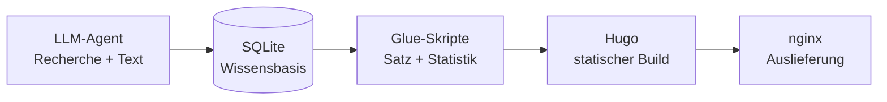

Jeden Morgen um sieben entsteht auf news.hnsstrk.de eine vollständige sicherheitspolitische Tageszeitung: recherchiert, geschrieben, gesetzt und ausgeliefert, ohne dass ein Mensch eingreift. Interessant ist daran weniger das Modell als die Mechanik drumherum — die Frage, wie man den Output eines Agenten verlässlich in eine dauerhafte, schnelle Website verwandelt.

<!--more-->


Ein LLM-Agent recherchiert per Web-Suche und Firecrawl, legt Fakten in einer SQLite-Wissensbasis ab und schreibt eine Markdown-Datei. Kleine Glue-Skripte formen daraus einen Hugo-Beitrag samt Register und Statistik; ein Push-to-Build erzeugt die statische Seite, nginx liefert sie aus. Die tragende Entscheidung: Erzeugung und Auslieferung strikt trennen.


## Ausgangslage

Die tägliche Lage entstand zunächst als Text, der über einen Messenger-Kanal verteilt wurde. Für einen flüchtigen Blick genügt das, aber es fehlt alles, was eine Publikation ausmacht: eine dauerhafte URL je Ausgabe, ein durchsuchbares Archiv, Verweise zwischen den Ausgaben, eine lesbare Typografie. Der Umbau zu einer echten, wenn auch vollautomatischen Zeitung sollte diese Lücken schließen — und dabei so wenig bewegliche Teile wie möglich dem öffentlichen Netz aussetzen.

## Architektur: Erzeugung und Auslieferung trennen

Das System läuft auf zwei getrennten Maschinen. Eine Redaktionsmaschine — ein Heimserver — beherbergt den Agenten, die Wissensbasis und das Bau-Werkzeug und leistet einmal täglich die schwere, zustandsbehaftete Arbeit. Eine zweite, kleine Auslieferungsmaschine serviert nichts als fertiges HTML. Verbunden sind beide durch einen einzigen `git push`.



Der Grund für die Teilung ist eine Frage der Angriffsfläche und der Robustheit. Erzeugung braucht ein Sprachmodell, einen Scraper, eine Datenbank und Shell-Zugriff. Auslieferung braucht nur einen Webserver. Wer beides trennt, hält die öffentliche Seite frei von Datenbank, Applikationsserver und API-Schlüsseln — und macht sie damit schnell und schwer kaputtbar. Im Abruf-Pfad liegt am Ende nur statisches HTML.

## Der Agent: ein Prompt als Programm

Der Redakteur ist ein autonomer LLM-Agent auf Basis eines großen Sprachmodells innerhalb eines Agenten-Frameworks, das dem Modell eine dauerhafte Identität, einen Werkzeuggürtel (Web-Suche, Scraper, Shell) und einen Scheduler gibt. Ein Cron-Eintrag stößt jeden Morgen genau einen Lauf an:

```cron
0 7 * * *
```

Das eigentliche Programm ist dabei nicht Code, sondern der Prompt. Er legt die Recherche-Regeln fest, ein hartes Quellen-Budget, die Ausgabestruktur und den exakten Veröffentlichungsbefehl. Um das Verhalten der Zeitung zu ändern — etwa die Art, wie Schlagzeilen gebildet werden, oder das Format des Registers —, wird keine Zeile Code angefasst, sondern der Prompt angepasst. Das ist der zentrale Perspektivwechsel gegenüber klassischer Software: Ein großer Teil der Logik steht in natürlicher Sprache.

## Recherche mit Budget

Der Agent durchsucht das offene Netz und bevorzugt Primär- und Qualitätsquellen. Viele Seiten liefern einem schlichten Abruf jedoch keinen brauchbaren Text — JavaScript-Aufbau, Werbe-Ballast, Consent-Wände. Für diese Fälle kommt [Firecrawl](https://www.firecrawl.dev/) zum Einsatz, ein Dienst, der eine URL rendert und sauberes Markdown zurückgibt. Ein Testabruf gegen die API zeigt das Prinzip:

```json
{ "success": true, "data": { "markdown": "# Example Domain\n\n..." } }
```

Betrieben wird das auf einem Tarif mit 5.000 Credits pro Monat; ein Scrape kostet ein Credit. Entscheidend ist weniger die Technik als die Selbstbeschränkung: höchstens acht bis zehn Quellen je Ausgabe. Das hält Kosten und Rauschen niedrig und erzwingt redaktionelle Auswahl statt einer bloßen Presseschau.

## Gedächtnis in SQLite

Alles, was der Agent erfährt, schreibt er in eine kleine SQLite-Datenbank. Sie ist es, die aus einem täglichen Einmal-Lauf etwas mit Gedächtnis macht. Die tragenden Tabellen:

- `entities` — Personen, Organisationen, Orte, Ereignisse; je mit Art, Aliassen, Kurzerklärung und einem Gültigkeitsfenster
- `topics` — eine Zeile je Einzelpunkt und Tag: Titel, Zusammenfassung, Einordnung, Domäne, Status
- `sources` — jede zitierte URL mit Publikation und Titel
- Verknüpfungstabellen — welche Quelle an welchem Tag welchen Punkt belegt hat

Aus diesen Daten baut der Agent das Register am Fuß jeder Ausgabe, und dieselben Daten speisen die laufende Statistik der Redaktions-Seite. Die Kontinuität wohnt damit in der Datenbank, nicht im Prompt: Jede Ausgabe steht auf dem Wissen aller früheren, ohne dass man ihr die gesamte Vorgeschichte in den Kontext laden müsste.

## Vom Rohtext zur Zeitung

Der Agent schreibt eine einzige Markdown-Datei mit fester Gestalt — Schlagzeile, Datum, Einordnung, dann die Einzelpunkte mit eingebetteten Quell-Links. Drei schlanke Skripte machen daraus einen fertigen Beitrag:

1. Das erste hängt das **Register** aus der Datenbank an, mit den Art-Bezeichnungen in Klammern und auf Deutsch.
2. Das zweite **rendert den Beitrag**: Es hebt Schlagzeile und Zusammenfassung ins Frontmatter, entfernt die dadurch überflüssige Zwischenüberschrift und übergibt den Rumpf an den Generator.
3. Das dritte **rechnet die Statistik neu** — Ausgaben, Lesezeit, Wortzahl, meistzitierte Domains, Schlagwort-Häufigkeiten.

Keines dieser Skripte erfindet Inhalt. Sie extrahieren, ordnen und zählen — mehr nicht. Diese Trennung ist Absicht: Der Agent erzeugt, die Skripte formen.

## Auslieferung: Push-to-Build

Die Veröffentlichung ist ein Git-Kniff. Die Auslieferungsmaschine hält ein bares Git-Repository; die Redaktionsmaschine pusht den fertigen Inhalt dorthin. Ein `post-receive`-Hook auf dem baren Repo lässt den Generator direkt in das Web-Verzeichnis bauen:

```bash
hugo --minify
```

Anschließend serviert nginx das Ergebnis. Es gibt keine Datenbank, keinen Applikationsserver und keinen Build-Schritt im Request-Pfad — nur statische Dateien. Eine neue Ausgabe ist Sekunden nach dem Push live, und während Leser auf der Seite sind, kann kaum etwas kaputtgehen.


Die stärkste Entscheidung im ganzen Aufbau ist die einfachste: hinter der Live-Seite läuft keine Anwendung. Das eliminiert eine ganze Klasse von Ausfällen, Sicherheitslücken und Wartungsaufwand — der Preis ist ein Build-Schritt beim Veröffentlichen.


## Was das Bauen gelehrt hat

Ein paar Beobachtungen aus dem Umbau, die sich verallgemeinern lassen:

**Zeitungsspalten sind kein Web-Layout.** Ein früher Entwurf setzte lange Artikel in zwei echte Spalten — wie eine gedruckte Zeitung. Am Bildschirm bedeutet das: erst die linke Spalte bis zum Seitenende scrollen, dann wieder ganz nach oben für die rechte. Bei einem gedruckten Blatt mit fester Seitenhöhe funktioniert das, bei einer scrollenden Seite nicht. Die Lösung war ein einspaltiger Long-Read mit angenehmer Lesebreite.

**Kleine Renderer-Details kosten Zeit.** Der Generator gab einen einzeiligen Zusammenfassungs-String zunächst ohne umschließendes `<p>` aus, direkt in ein `<div>`. Dadurch griff weder der Blocksatz noch die Initiale — die entsprechende CSS-Regel zielte auf `p`, das gar nicht existierte. Ein explizites `<p>` löste beides.

**Kontinuität gehört in eine Datenbank, nicht in den Prompt.** Der Versuch, Vorwissen über den Kontext mitzugeben, skaliert nicht und wird teuer. Eine kleine relationale Ablage, aus der der Agent gezielt zieht, ist robuster und günstiger.

## Grenzen

Die Ehrlichkeit gebietet, die Schwächen ebenso klar zu benennen wie die Mechanik. Kein Mensch prüft die Seiten, ehe sie erscheinen. Jede Ausgabe wird von der KI recherchiert, geschrieben und zusammengesetzt und automatisch veröffentlicht; einzelne Angaben können unvollständig oder fehlerhaft sein. Das Quellen-Budget begrenzt die Tiefe bewusst — eine dünne Nachrichtenlage bleibt eine dünne Ausgabe. Und die gesamte Persona des Blattes hängt an einem Prompt: Ändert sich das Modell dahinter, ändert sich potenziell der Ton.

Für ein automatisches Nachrichten-Experiment sind das vertretbare Kompromisse — solange sie offen ausgewiesen sind. Auf der Seite selbst steht das als lateinisches Motto im Titelkopf: *Non manu hominis*, nicht von Menschenhand.
