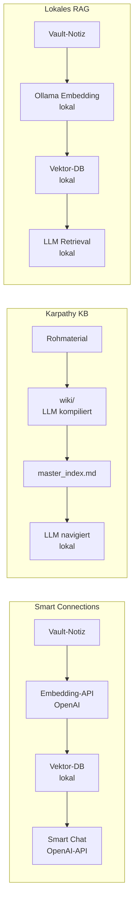

Ab einer bestimmten Vault-Größe stößt Stichwortsuche an eine Grenze: Man findet die Notiz nur, wenn man den exakten Begriff kennt, unter dem sie abgelegt wurde. Wer damals „Embedding" schrieb und heute „Vektorsuche" sucht, findet nichts. Wer Konzepte aus zwei Notizen verbinden möchte, die nie explizit verlinkt wurden, sucht vergeblich.

<!--more-->

Semantische Suche verspricht hier Abhilfe: Statt nach exakten Zeichenketten zu suchen, vergleicht sie die inhaltliche Bedeutung. Eine Frage wie „Wie lässt sich Wissen über mehrere Projekte hinweg verwalten?" findet auch Notizen, die von „PKM", „Second Brain" oder „PARA-Methode" handeln — ohne dass der Suchbegriff darin vorkommt.

Die Frage ist nicht, ob semantische Suche prinzipiell sinnvoll ist. Die Frage ist, welcher der verfügbaren Ansätze zu einem konkreten Setup passt — und zu welchem Preis in Komplexität, Kosten und Datenschutz.

Drei Ansätze sind dabei besonders relevant: **Smart Connections** als Obsidian-Plugin, die **Karpathy Knowledge Base** als strukturierter Markdown-Ansatz ohne Vektordatenbank, und **lokales RAG mit Ollama** als technisch anspruchsvollste, aber datenschutzfreundlichste Option.

## Was "semantisch" bedeutet

Bevor die drei Ansätze verglichen werden, kurz die technische Grundlage: Ein Embedding-Modell wandelt einen Text in einen Vektor — eine Liste von Zahlen — um, die die inhaltliche Bedeutung des Textes als Punkt im hochdimensionalen Raum darstellt. Ähnliche Texte landen nah beieinander; der Abstand wird mit **Cosine Similarity** gemessen (Wert 1 = identisch, 0 = orthogonal).

```text
Dokument → Embedding-Modell → Vektor [0.23, -0.71, 0.14, ...]
Suchanfrage → Embedding-Modell → Vektor [0.21, -0.68, 0.19, ...]
                                            ↓
                               Cosine Similarity: 0.97 → sehr ähnlich
```

Der Unterschied zur Stichwortsuche: Nicht die Buchstaben werden verglichen, sondern die Position im Bedeutungsraum. Das ist der Kern — alle drei Ansätze variieren nur darin, wo und wie diese Vektoren berechnet und gespeichert werden.

## Ansatz 1: Smart Connections (Obsidian-Plugin)

Smart Connections von Brian Petro ist das bekannteste Werkzeug für semantische Suche direkt in Obsidian. Die Architektur besteht aus drei Schichten:

**Discovery:** Jede Notiz wird in einen Vektor umgewandelt. Zur aktuell geöffneten Notiz erscheinen im Seitenpanel die inhaltlich ähnlichsten anderen Notizen — ohne explizite Verlinkung. Dieser Schritt hat unabhängig von KI-Funktionen einen eigenständigen Wert: Vergessene Notizen tauchen wieder auf, unerwartete Verbindungen werden sichtbar.

**Bundle (Named Contexts):** Relevante Notizen werden zu wiederverwendbaren, benannten Kontextsammlungen zusammengefasst. Die Tiefe ist konfigurierbar — von `depth 0` (nur die Notiz selbst) über `outlinks` (direkte Verlinkungen) bis `backlinks` (auch eingehende Links). Hier ist Vorsicht geboten: Im Demo-Video zieht `depth 2` bereits **35.000 Tokens** herein. Die Token-Explosion bei zunehmender Tiefe ist real und wird im Demo nicht problematisiert.

**Use (Smart Chat):** Auf Basis des gebündelten Kontexts lassen sich Fragen an einen KI-Assistenten stellen, der ausschließlich den kuratierten Kontext sieht — nicht den gesamten Vault.

### Was das Demo verschweigt

Das am häufigsten zitierte Einführungsvideo (Wanderloots, 2026) wird laut Videobeschreibung **von Brian Petro gesponsert**, dem Entwickler von Smart Connections. Das erklärt einige auffällige Lücken:

- Das gesamte Demo läuft ausschließlich mit **OpenAI/ChatGPT** als Backend. Ob Smart Chat auch mit lokalen Ollama-Endpoints funktioniert, wird nicht gezeigt und ist in der Dokumentation nicht eindeutig beschrieben.
- Der wiederholte "free"-Claim gilt nur für die Core-Plugins. Smart Chat benötigt eine OpenAI-API — und die kostet.
- Alternativen werden nicht erwähnt, Schwächen nicht benannt.

Das ist kein Vorwurf an das Plugin, aber ein Hinweis auf die Quelle: Ein gesponsertes Demo ist kein objektiver Test.


Smart Chat sendet Vault-Inhalte an externe APIs (standardmäßig OpenAI). Wer persönliche Notizen, Gesundheitsdaten oder beruflich sensible Inhalte im Vault hat, sollte das bewusst abwägen — und prüfen, ob eine lokale Endpoint-Konfiguration möglich ist.


## Ansatz 2: Karpathy Knowledge Base (Markdown-first)

Der zweite Ansatz kommt ohne Vektordatenbank und ohne Embedding-Modelle aus. Die Grundidee: Statt Dokumente in Vektoren umzuwandeln, werden sie in **strukturierte, verlinkte Markdown-Artikel** kompiliert, die ein LLM direkt navigieren kann.

Die Architektur:

```text
vault/
├── raw/          ← Staging: Web-Clips, PDFs, Rohdaten
├── wiki/         ← Kompilierte, verlinkte Wissensartikel
│   ├── master_index.md
│   └── thema/index.md, artikel.md
└── CLAUDE.md     ← Routing-Regeln für das LLM
```

Das LLM liest `raw/`, erstellt strukturierte Wiki-Artikel in `wiki/` und pflegt automatisch Indizes. Bei Fragen navigiert es über die Indizes — ähnlich wie ein Mensch, der in einer gut organisierten Wikipedia-Struktur nachschlägt.

**Vorteil:** Kein Setup-Overhead, keine externen APIs, keine Vektordatenbank. Die Struktur ist für Menschen und Maschinen gleichermaßen lesbar. Für einen Vault mit **rund 100 gut kuratierten Artikeln** liefert dieser Ansatz laut dem Konzept solide Ergebnisse — das LLM hält diesen Umfang problemlos im Kontextfenster.

**Grenze:** Ab einigen Hundert Artikeln skaliert der Ansatz nicht mehr linear. Ein Vault mit 2.000 Notizen unterschiedlicher Qualität ist kein geeignetes Anwendungsgebiet. Semantisches Retrieval — „Finde alles, was konzeptuell mit X zusammenhängt" — ist hier nicht möglich; Suche basiert auf Dateistruktur und Indizes.

Eine interessante Ergänzung: Ein **monatlicher Health-Check-Prompt** lässt das LLM den Wiki-Bestand auf Widersprüche, unbelegte Behauptungen und fehlende Verlinkungen prüfen. Das ist kein Retrieval, aber ein Qualitätssicherungsschritt, der strukturellen Verfall bremst.

Den Ansatz — inklusive Ordnerstruktur und Audit-Prompt — beschreibt der Post [Obsidian als KI-gestützte Wissensdatenbank](/blog/obsidian-llm-wiki/) ausführlicher.

## Ansatz 3: Lokales RAG mit Ollama

Der dritte Ansatz kombiniert lokale Embedding-Modelle über Ollama mit einer Vektordatenbank (z. B. ChromaDB oder Qdrant). Alle Daten bleiben auf der eigenen Hardware — kein Cloud-API, keine Datenweitergabe.

Die Grundoperation ist dieselbe wie bei Smart Connections, aber lokal:

```bash
# Embedding-Modell herunterladen
ollama pull snowflake-arctic-embed2

# Modell läuft dann über http://localhost:11434
```

### Embedding-Modelle im Vergleich

Für deutschsprachige Vault-Inhalte ist die Modellwahl entscheidend. Nomic Embed Text — das häufig zitierte Einstiegsmodell — ist laut Modell-Dokumentation primär auf englische Texte optimiert und daher für einen deutschen Vault keine erste Wahl.

| Modell | Größe | Dimensionen | Deutsch | Einsatz |
|--------|-------|-------------|---------|---------|
| `nomic-embed-text` | 274 MB | 768 | Schwach | Prototyping, englische Texte |
| `snowflake-arctic-embed2` | 1,2 GB | 1.024 | Gut (74+ Sprachen) | Produktion, deutschsprachige Inhalte |
| `qwen3-embedding:8b` | 4,7 GB | 4.096 | Sehr gut (100+ Sprachen, MTEB Nr. 1) | Maximale Qualität, ressourcenintensiv |

*Stand: Juni 2026. MTEB-Rankings und Modellparameter ändern sich regelmäßig.*

Für einen deutschsprachigen Vault ist `snowflake-arctic-embed2` der sinnvolle Kompromiss: gute Mehrsprachigkeit, moderater Speicherbedarf. `qwen3-embedding:8b` bietet höhere Qualität, belegt aber fast 5 GB und fordert entsprechend VRAM.

Mehr zu Embedding-Modellen in Ollama findet sich im Post [Lokale KI mit Ollama](/blog/local-ai-ollama/).

**Komplexität:** Lokales RAG ist der aufwändigste der drei Ansätze. Indexierung einrichten, Chunking-Strategie wählen, Vektordatenbank konfigurieren, Retrieval-Pipeline bauen — das ist kein Obsidian-Plugin-Install. Wer diesen Weg geht, betreibt de facto ein kleines Backend-System.


Lokales RAG lohnt sich, wenn der Vault groß ist (500+ Notizen), deutschsprachige Inhalte dominieren und Datenschutz nicht verhandelbar ist. Für kleinere Vaults oder gelegentliche Nutzung überwiegt der Setup-Aufwand den Nutzen.


## Vergleich: Drei Ansätze, drei Kompromisse

Die drei Ansätze unterscheiden sich vor allem darin, wo Embedding und Retrieval stattfinden — und ob externe APIs ins Spiel kommen:



| Aspekt | Smart Connections | Karpathy KB | Lokales RAG |
|--------|------------------|-------------|-------------|
| Technologie | Embeddings + Vektor-DB | Markdown-Indizes | Embeddings + lokal |
| Skalierbarkeit | tausende+ (Backend-skalierbar) | ~100 Artikel | mittel (tausende) |
| Datenschutz | ⚠️ OpenAI-API (Standard) | ✅ lokal | ✅ lokal |
| Setup-Aufwand | Gering (Plugin) | Mittel (Struktur aufbauen) | Hoch (Backend) |
| Deutsch-Support | ⚠️ modellabhängig | ✅ sprachunabhängig | ✅ mit Snowflake/Qwen3 |
| Semantisches Retrieval | ✅ | ✗ | ✅ |
| Für Menschen lesbar | ✅ | ✅ | ✅ |
| Laufende Kosten | OpenAI-API-Kosten | keine | Strom |

## Wann welcher Ansatz?

**Smart Connections** passt zu einem großen Vault (1.000+ Notizen), bei dem die Haupt-Anforderung Discovery ist — also das Wiederentdecken vergessener Notizen und das Aufdecken verborgener Querverbindungen. Wer die OpenAI-API akzeptiert und hauptsächlich englisch schreibt, erhält den niedrigschwelligsten Einstieg.

**Karpathy Knowledge Base** passt zu einem kuratierten, kleineren Vault mit klarer Struktur — und zu einer Arbeitsweise, die ohnehin auf regelmäßige Kompilierung und Pflege setzt. Der Ansatz setzt voraus, dass der Vault nicht als Ablage für Rohmaterial dient, sondern als destilliertes Wissensarchiv. Für einen deutschen Vault ohne Cloud-Abhängigkeit ist das eine valide Option — solange der Umfang überschaubar bleibt.

**Lokales RAG** passt, wenn semantische Suche über einen großen deutschsprachigen Vault benötigt wird, Datenschutz nicht verhandelbar ist und der Setup-Aufwand in Kauf genommen werden kann. Geeignet als dauerhaftes System, nicht als schneller Einstieg.

## Offene Fragen

Einige Fragen blieben nach der Recherche ungeklärt und sind für eine fundierte Entscheidung relevant:

**Smart Connections mit lokalen Endpoints:** Das Wanderloots-Demo demonstriert ausschließlich die OpenAI-Integration. Ob Smart Chat zuverlässig mit einem lokalen Ollama-Endpoint kommuniziert, müsste anhand der Plugin-Dokumentation und eigener Tests verifiziert werden — nicht anhand des gesponserten Demos.

**Initiales Indexing bei großen Vaults:** Wie lange dauert der Erstaufbau des Embedding-Index bei 1.000+ Notizen? Die Antwort hängt von Hardware, Modell und Chunk-Größe ab — und ist in keiner der gesichteten Quellen quantifiziert.

**Qualitätsdegradation bei deutschen Texten mit Nomic:** Wie stark ist der Qualitätsunterschied zwischen Nomic Embed Text und Snowflake Arctic Embed 2 bei einem überwiegend deutschen Vault in der Praxis? Benchmark-Zahlen liegen vor, praktische Tests im Vault-Kontext nicht.

## Fazit

Die Wahl des Ansatzes hängt weniger von der Frage „Was ist technisch am besten?" ab als von drei konkreten Variablen: **Vault-Größe**, **Datenschutzanforderungen** und **Bereitschaft zu Setup-Aufwand**.

Wer einen kleineren, gut strukturierten Vault betreibt und keine Cloud-APIs möchte, kann mit dem Karpathy-Ansatz weit kommen — ohne Embedding-Modelle, ohne Vektordatenbank, ohne Plugin. Wer einen großen Vault hat und Datenschutz priorisiert, ist mit lokalem RAG auf solidem Fundament, zahlt aber einen erheblichen Einrichtungsaufwand. Smart Connections bietet den schnellsten Einstieg, aber zu Konditionen (OpenAI-Abhängigkeit, Sponsoring-Bias in der Dokumentation), die vorab bekannt sein sollten.

Offen bleibt, wie sich Smart Connections mit lokalen Endpoints schlägt — das wäre der interessanteste Mittelweg und ist bisher nicht ausreichend dokumentiert.
