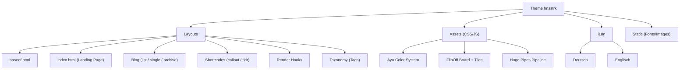
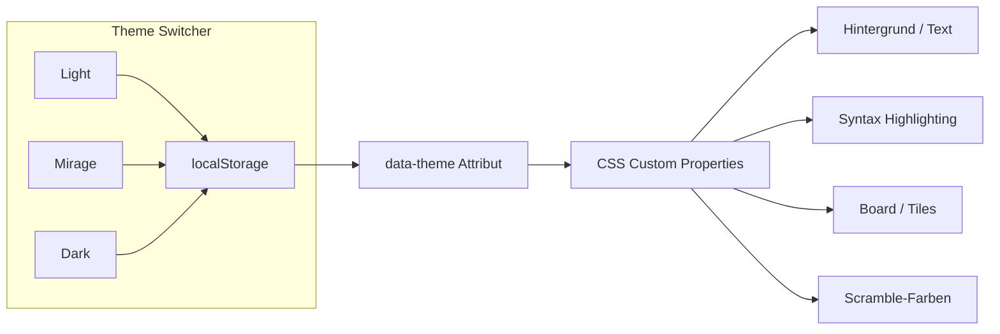
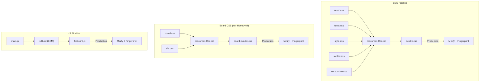
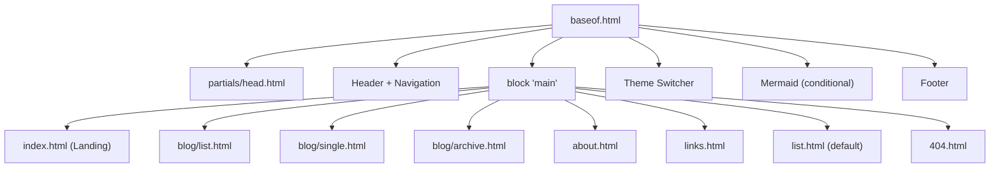

Eine persönliche Website braucht nicht zwangsläufig ein fertiges Theme von der Stange. Wenn die Vorstellungen spezifisch genug sind — eine mechanische Anzeigetafel als Startseite, ein bestimmtes Farbschema, eine durchgängige Monospace-Typografie — lohnt es sich, das Theme selbst zu bauen. So entstand parallel zur Website hnsstrk.de ein eigenständiges Hugo-Theme, das sich um ein zentrales visuelles Element dreht: ein Split-Flap-Display als Landing Page.

<!--more-->

## Ausgangslage: Warum ein eigenes Theme?

Hugo bringt ein großes Ökosystem an fertigen Themes mit. Für eine persönliche Seite, die kein berufliches Portfolio sein soll und keine Standardanforderungen hat, passt davon aber selten eines wirklich. Die Zielsetzung war von Anfang an klar: eine digitale Visitenkarte mit Charakter. Schwarzes Board, klappende Buchstaben, dazu eine Typografie, die nach Terminal riecht — und das Ganze als vollwertiges Hugo-Theme, nicht als zusammengeklebtes Einzelprojekt.

Die Entscheidung für Hugo selbst fiel früh. Der Generator war bereits von einem anderen Projekt bekannt, die Build-Zeiten sind konkurrenzlos, und es gibt keine Node.js-Abhängigkeit. Details dazu stehen in der Architekturdokumentation des Projekts (ADR-001).

## Was das Theme umfasst

Das Theme trägt den Namen `hnsstrk` und lebt als Verzeichnis unter `themes/hnsstrk/` im Repository. Es ist kein Submodul und keine externe Abhängigkeit — der gesamte Code gehört zum Projekt. Die Struktur orientiert sich an den Hugo-Konventionen, geht aber in einigen Bereichen über das hinaus, was ein minimales Theme benötigt.



### Komponenten im Überblick

- **Landing Page** mit Split-Flap-Display (FlipOff)
- **Blog-Sektion** mit Artikelliste, Einzelansicht, Archiv und Tags
- **Content-Layouts** für About, Links und generische Seiten
- **Drei Farbvarianten** (Ayu Light, Mirage, Dark) mit Theme-Switcher
- **Monaspace-Typografie** — sechs Schnitte der Superfamilie, lokal gehostet
- **Hugo Pipes** für CSS-Bundling, JS-Build, Minification und Fingerprinting
- **Shortcodes** (`callout`, `tldr`) und Render Hooks (Heading, Image, Link, Mermaid)
- **i18n** mit vollständiger Übersetzung in Deutsch und Englisch
- **Responsive Design** mit vier Breakpoints und mobiler Navigation
- **Mermaid-Integration** mit Lazy Loading

## Das Split-Flap-Display: FlipOff als Kern

### Die Bibliothek

Die technische Grundlage der Landing Page ist [FlipOff](https://github.com/magnum6actual/flipoff), eine Vanilla-JavaScript-Bibliothek ohne externe Abhängigkeiten. Kein Framework, kein Build-System — nur HTML, CSS und JS. Die Bibliothek wurde für das Projekt erheblich angepasst und erweitert, sodass ein einfaches Submodul nicht mehr in Frage kam. FlipOff lebt als Teil des Themes.

Das Board arbeitet mit einem Raster aus Tiles. Jede Tile ist eine animierte Klappe, die sich beim Zeichenwechsel dreht. Der Zeichensatz beschränkt sich auf Großbuchstaben, Ziffern und einige Sonderzeichen — wie bei echten mechanischen Tafeln. Umlaute werden zu `AE`, `OE`, `UE` transliteriert, `ß` zu `SS`. Das ist kein Kompromiss, das ist Authentizität.

### Grid und Nachrichten

Das aktuelle Grid umfasst 20 Spalten und 7 Zeilen. Ein `MessageRotator` bestückt das Board mit rotierenden Nachrichten — Name, Interessen, ein trockener Spruch. Die Klassen `Board`, `Tile`, `MessageRotator` und `KeyboardController` bilden zusammen die Steuerungsschicht. Alle Konfigurationswerte — Grid-Dimensionen, Timing, Zeichensatz, Nachrichten — sind in einer zentralen `constants.js` gebündelt.

### Einbindung in Hugo

Die Landing Page wird über `layouts/index.html` gerendert. Hugo Pipes übernimmt den JavaScript-Build:

```go-html-template
{{ $opts := dict "targetPath" "js/flipboard.js" "format" "esm" "minify" hugo.IsProduction }}
{{ with resources.Get "js/main.js" | js.Build $opts }}
  {{ if hugo.IsProduction }}
    {{ with . | resources.Fingerprint }}
      <script src="{{ .RelPermalink }}" type="module"
              integrity="{{ .Data.Integrity }}"
              crossorigin="anonymous"></script>
    {{ end }}
  {{ else }}
    <script src="{{ .RelPermalink }}" type="module"></script>
  {{ end }}
{{ end }}
```

`js.Build` verarbeitet den ES-Module-Baum (`main.js` importiert `Board.js`, `MessageRotator.js`, `KeyboardController.js`, `constants.js`) und erzeugt ein einzelnes Bundle. In der Produktion wird dieses minifiziert und mit einem Content-Hash versehen — Cache-Busting inklusive.

## Ayu: Drei Farbwelten

Das Farbschema basiert auf [Ayu](https://github.com/ayu-theme/ayu-colors), einem Farbsystem, das aus der Code-Editor-Welt stammt und drei Varianten mitbringt: **Light**, **Mirage** und **Dark**. Alle drei sind vollständig implementiert — von den Hintergrundfarben über die Syntax-Highlighting-Tokens bis zu den Board-Tiles.

Die Farbvarianten werden über CSS Custom Properties gesteuert. Die Basiswerte stehen in `:root` (Light), die Varianten in `:root[data-theme='mirage']` und `:root[data-theme='dark']`. Ein Theme-Switcher in der oberen rechten Ecke erlaubt den Wechsel. Die Auswahl wird im `localStorage` gespeichert; ohne gespeicherte Präferenz wird die Systemeinstellung (`prefers-color-scheme`) respektiert.

Jede Variante definiert über 40 Custom Properties: Primär-, Sekundär- und Tertiärfarben für Hintergründe, Textfarben in drei Abstufungen, Akzentfarben, Border- und Shadow-Werte, ein vollständiges Set an Syntax-Highlighting-Farben, sowie Board- und Tile-spezifische Farben einschließlich der Scramble-Animationsfarben.



## Monaspace: Sechs Schnitte, eine Familie

Für die Typografie fiel die Wahl auf [Monaspace](https://monaspace.githubnext.com/) von GitHub Next. Die Superfamilie besteht aus fünf Schnitten — Neon, Argon, Xenon, Radon und Krypton — die alle metrik-kompatibel zueinander sind. Das bedeutet: Schriften lassen sich innerhalb eines Absatzes mischen, ohne dass der Textfluss bricht.

Das Theme nutzt diese Eigenschaft gezielt:

| Schnitt | CSS-Variable | Einsatz |
|---|---|---|
| Krypton | `--font-display` | FlipOff-Board, Logo |
| Neon | `--font-heading`, `--font-ui` | Überschriften, Navigation, UI |
| Argon | `--font-body` | Fließtext |
| Xenon | `--font-code` | Code-Blöcke |
| Radon | `--font-handwriting` | Persönliche Akzente |

Alle Fonts liegen als Variable Fonts im `woff2`-Format lokal im Theme. Kein externer CDN-Aufruf, keine Abhängigkeit von Google Fonts. OpenType Features wie Texture Healing und kontextbezogene Ligaturen sind über `font-variant-ligatures: contextual` und `font-feature-settings` aktiviert.

## Hugo Pipes: Die Asset-Pipeline

Ein zentraler Vorteil eines eigenen Themes ist die volle Kontrolle über die Asset-Pipeline. Das Theme nutzt Hugo Pipes durchgängig — sowohl für CSS als auch für JavaScript.



Die CSS-Dateien werden in zwei Bundles aufgeteilt: Ein globales Bundle (`reset.css`, `fonts.css`, `style.css`, `syntax.css`, `responsive.css`) wird auf jeder Seite geladen. Das Board-Bundle (`board.css`, `tile.css`) wird nur auf der Startseite und der 404-Seite eingebunden — eine einfache Optimierung, die den CSS-Overhead auf Content-Seiten reduziert.

Das Theme-JavaScript (`theme.js`) wird separat im `<head>` geladen, um ein Flash of Unstyled Content (FOUC) beim Theme-Wechsel zu vermeiden. Das FlipOff-JavaScript wird als ES-Module mit `js.Build` verarbeitet.

In der Produktion durchlaufen alle Assets die Schritte Minification und Fingerprinting. Das erzeugt Dateinamen mit Content-Hash und ermöglicht aggressives Browser-Caching bei gleichzeitiger sofortiger Invalidierung bei Änderungen. Die `integrity`-Attribute auf den `<script>`- und `<link>`-Tags sorgen für Subresource Integrity.

## Blog-Sektion

Das Theme bringt eine vollständige Blog-Infrastruktur mit:

- **Artikelliste** (`blog/list.html`) — Kartenansicht mit Featured Image, Datum, Lesezeit, Excerpt und Tags
- **Einzelansicht** (`blog/single.html`) — Artikel mit Metadaten, optionalem Featured Image, automatischem Table of Contents (ab 1500 Wörtern oder per Frontmatter), Markdown-Content und verwandten Artikeln
- **Archiv** (`blog/archive.html`) — chronologische Übersicht, nach Jahren gruppiert
- **Tags** — vollständige Taxonomy-Unterstützung mit eigenen Layouts für die Tag-Übersicht und die einzelnen Tag-Seiten

Das Table of Contents ist als aufklappbares `<details>`-Element implementiert und erscheint automatisch bei längeren Artikeln. Featured Images werden über Hugo's Image Processing auf 1200px Breite und WebP-Format optimiert; Thumbnails in der Listenansicht auf 600x300px.

## Layout-Hierarchie

Die Layout-Struktur folgt dem Hugo-Standardmuster: Ein `baseof.html` als Rahmen, Section-spezifische Layouts für Blog und Taxonomien, und Render Hooks für die Markdown-Verarbeitung.



Das Base-Layout enthält den gesamten Rahmen: HTML-Head (über das `head.html`-Partial), Header mit Navigation und mobilem Hamburger-Menü, den Theme-Switcher, den Main-Block für den seitenspezifischen Inhalt, die bedingte Mermaid-Einbindung und den Footer mit Seitenlinks, Social-Links und rechtlichen Verweisen.

### Render Hooks

Vier Render Hooks greifen in die Markdown-Verarbeitung ein:

- **Headings** — erhalten automatisch eine ID und einen Anker-Link (`#`), der beim Hover sichtbar wird
- **Images** — werden in `<figure>`-Elemente mit optionaler `<figcaption>` gerendert und erhalten `loading="lazy"`
- **Links** — externe Links bekommen automatisch `target="_blank"` und `rel="noopener noreferrer"`
- **Mermaid-Codeblöcke** — werden als `<pre class="mermaid">` gerendert und setzen ein Store-Flag, das die bedingte Einbindung von Mermaid.js im Base-Layout auslöst

## Shortcodes

Zwei Shortcodes erweitern die Markdown-Möglichkeiten:

**Callout** — ein visuell hervorgehobener Hinweisblock mit vier Typen (`info`, `warning`, `tip`, `note`), jeweils mit eigenem Icon und optionalem Titel:

```go-html-template

Text des Hinweises.

```

**TL;DR** — ein kompakter Zusammenfassungsblock mit vertikalem Label:

```go-html-template

Die Kurzfassung des Artikels.

```

## Mermaid: Diagramme im Markdown

Mermaid.js ist in das Theme integriert, wird aber nur dann geladen, wenn eine Seite tatsächlich Mermaid-Blöcke enthält. Der Render Hook für Mermaid-Codeblöcke setzt ein Flag im Page Store; das Base-Layout prüft dieses Flag und bindet das Script nur bei Bedarf ein.

Die Mermaid-Initialisierung reagiert auf den aktiven Theme-Modus: Im Light-Theme wird das `base`-Theme verwendet, in Mirage und Dark das `dark`-Theme. Beim Umschalten des Farbschemas werden bestehende Diagramme automatisch neu gerendert.

## i18n: Zwei Sprachen

Alle UI-Strings des Themes — von "Zum Inhalt springen" über "Minuten Lesezeit" bis "Seite nicht gefunden" — sind in i18n-Dateien ausgelagert. Aktuell existieren Übersetzungen für Deutsch und Englisch. Die Content-Sprache der Website ist Deutsch; die englischen Strings stehen bereit, falls das Theme in anderen Projekten zum Einsatz kommt.

## Responsive Design

Das Layout passt sich über vier Breakpoints an verschiedene Viewports an:

| Breakpoint | Anpassungen |
|---|---|
| ab 2000px | Größere Tiles, breiteres Content-Frame |
| bis 1200px | Fluid Tile-Größe |
| bis 900px | Kleinere Tiles, reduziertes Padding |
| bis 768px | Mobile Navigation (Hamburger-Menü), einspaltige Footer-Grid |
| bis 600px | Minimale Tiles, Akzentleisten ausgeblendet, Callout/TOC kompakt |

Das Fluid-Type-System basiert auf `clamp()`-Funktionen mit einer Utopia-Skala. Schriftgrößen und Abstände skalieren fließend zwischen 320px und 1240px Viewport-Breite, ohne harte Sprünge an den Breakpoints.

Auf der Landing Page passen sich die Board-Tiles automatisch an: Von 65px auf 4K-Displays bis hinunter zu 18px auf Smartphones. Auf sehr kleinen Viewports werden die dekorativen Akzentleisten und der Tastatur-Hint ausgeblendet.

## 404-Seite

Auch die Fehlerseite nutzt das Split-Flap-Display. Statt einer generischen Meldung erscheint ein eigenes FlipOff-Board mit einer animierten Fehlernachricht. Darunter steht ein kurzer Hinweistext und ein Link zurück zur Startseite. Das Board-CSS wird — wie auf der Startseite — nur auf dieser Seite geladen.

## Deployment

Die Website wird auf einem Contabo Ubuntu Server mit Nginx ausgeliefert. GitHub Actions dient als Trigger: Bei jedem Push auf `main` wird per SSH ein Build-Script auf dem Server aufgerufen, das `git pull` und `hugo --minify` ausführt. Kein Drittanbieter-Hosting, keine Third-Party-Actions im Workflow — volle Kontrolle über die Pipeline.

## Ausblick

Das Theme ist funktional, aber nicht fertig. Einige Bereiche stehen noch auf der Liste:

- **Projektsektion** — eigener Content-Type mit Template für Hobby-Projekte
- **Open-Source-Veröffentlichung** — das Theme soll als eigenständiges Repository unter CC BY 4.0 veröffentlicht werden, maximal konfigurierbar über `hugo.toml`
- **Content-Ticker** — die Landing Page könnte dynamische Inhalte anzeigen (neuester Blog-Post, ein Zitat des Tages), generiert zur Build-Zeit
- **Responsive Board** — das Grid passt sich bereits per CSS an, aber eine dynamische Spaltenreduktion auf kleinen Viewports würde die Lesbarkeit verbessern

Das Projekt zeigt, dass ein eigenes Hugo-Theme kein Mammutprojekt sein muss. Mit Hugo Pipes, CSS Custom Properties und einer klaren Komponentenstruktur lässt sich in überschaubarer Zeit ein Theme bauen, das genau das tut, was es soll — und nichts, was es nicht soll.
