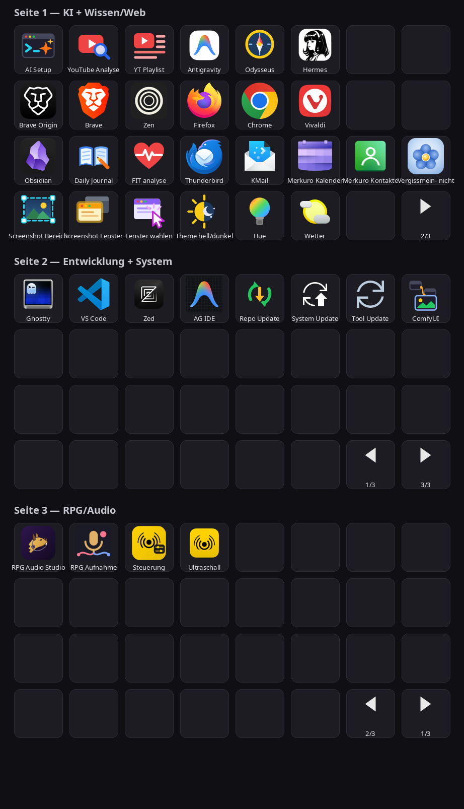
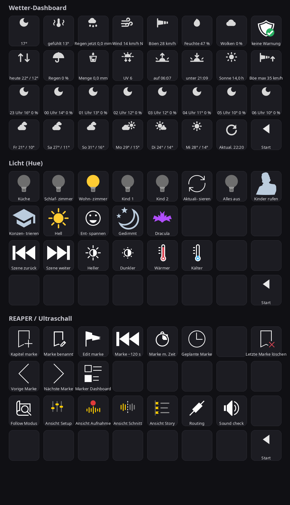

Vor vier Wochen habe ich hier den [Umbau des Stream Decks](/blog/streamdeck-kontext-layout/) beschrieben: ein Layout nach Arbeitskontexten, eigene Icons, fertig. Dachte ich. Ein Deck mit 32 Tasten ist aber offenbar wie ein leeres Regal — es füllt sich von selbst.

<!--more-->

## Die große Umverteilung

Das Kontext-Layout vom Juli hatte einen eingebauten Konstruktionsfehler: Es war eine einzige Seite, und die war rappelvoll. Anfang August wurde deshalb umverteilt. Der Alltag blieb auf der ersten Seite — die KI-Läufe oben, darunter eine ganze Browser-Reihe, der Wissens-Block mit Obsidian, Journal und Mail, unten Screenshots und System. Sogar Vergissmeinnicht, meine eigene Taskwarrior-Oberfläche, hat dort inzwischen eine Taste.

Die Entwicklung ist dagegen komplett auf die zweite Seite umgezogen, RPG und Audio haben die dritte bekommen. Dort liegt jeweils eine einzige Reihe Tasten, der Rest bleibt bewusst frei. Luft statt Dichte — man findet eine Taste schneller, wenn nicht jede Position belegt ist. Navigiert wird über feste Pfeile unten rechts, auf jeder Seite an derselben Stelle.

Die Absprünge zu den Spezialseiten wohnen bei ihren Gruppen: Lichtsteuerung und Wetter bei den System-Tasten, die REAPER-Fernsteuerung bei der RPG-Gruppe. Die Spezialseiten selbst sind eigene kleine Welten.

Das Wetter-Dashboard zeigt 30 Daten-Kacheln auf einen Blick: die aktuellen Werte, den heutigen Tag, die Nacht im Stundentakt und sechs Tage Vorschau. Die Licht-Seite versammelt die Raumtasten samt Wohnzimmer-Szenen und Reglern für Helligkeit und Farbtemperatur — hier wohnt auch der Knopf, zu dem wir gleich kommen.

Die Ultraschall-Seite steuert mit 18 Tasten Aufnahmen in REAPER: Marker setzen, Ansichten wechseln, Soundcheck. Der Kunstgriff steckt darunter. Anfangs schickten die Tasten simulierte Hotkeys, und die landen prinzipbedingt immer beim fokussierten Fenster — während einer Rollenspielsitzung liegt REAPER aber grundsätzlich im Hintergrund, die Tastendrücke trafen also alles Mögliche, nur nicht die Aufnahme. Jetzt sprechen die Tasten REAPERs Web-Fernsteuerung direkt per HTTP an, und die Aktion kommt an, egal welches Fenster gerade den Fokus hat. Einen Marker setzen, ohne das Spiel zu unterbrechen — genau dafür ist die Seite da.

Das Deck ist damit endgültig kein Startmenü mehr, sondern ein Satz kleiner Bedienpulte.

Die Lektion aus dem Juli-Artikel galt übrigens auch diesmal: Ein Button ist nie nur ein JSON-Eintrag. Die Helfer-Skripte, die Positionen kennen, mussten alle mitziehen.

## Neue Knöpfe

Bei den Tasten selbst kamen ein paar Arbeitstiere dazu. Der Update-Knopf aktualisiert die komplette Werkzeugkette in einem Rutsch — Antigravity, Codex, Claude Code, die globalen npm-Pakete und Hermes. Das ist genau die Sorte Pflege, die man sonst monatelang aufschiebt, weil sie aus fünf einzelnen Befehlen besteht. Ein ComfyUI-Knopf startet die lokale Bildgenerierung, und hinter den RPG-Audio-Tasten repariert ein systemd-Service bei Bedarf selbstständig das Audio-Routing.

Der beste neue Knopf ist aber ein ganz simpler: „Kinder rufen". Ein Druck, und das Licht in beiden Kinderzimmern springt auf volles Rot. Kopfhörer auf, Musik laut — da dringt kein Rufen durch, aber rotes Licht sieht man auch mit geschlossenen Augen. Die beiden wissen dann: Papa möchte etwas. Und falls die Lampen-Bridge nicht antwortet, meldet sich das Deck — sonst stünde ich da und wartete auf eine Reaktion, die nie angefordert wurde.

Die Kinder haben das System sofort verstanden. Ob sie es gut finden, ist eine andere Frage.

## Messen statt raten

Die dritte Baustelle ist unsichtbar: Seit Anfang August schreibt jeder Tastendruck einen Zeitstempel in eine Datenbank. Die Frage dahinter ist einfach — welche Tasten werden wirklich gedrückt, welche nie? Beim Juli-Umbau habe ich nach Gefühl sortiert; beim nächsten sollen Zahlen entscheiden, welche Knöpfe bleiben, welche wandern und welche fliegen.

Die Statistik ist ausdrücklich ein Werkzeug für später. Noch sammelt sie nur, und das ist auch gut so — eine Woche Daten sind eine Anekdote, ein Quartal ist ein Argument.

Dazu passt das neue Statusfenster: Für lange KI-Läufe zeigt eine kleine Qt-Anwendung den Fortschritt dauerhaft an, weil flüchtige Benachrichtigungen zuverlässig übersehen werden.

## Was liegen bleibt

Auf der Liste steht weiter die MCP-Anbindung. Elgato liefert einen Server, mit dem Claude Code das Deck direkt steuern könnte — ohne den Umweg über JSON-Dateien und Unix-Socket. Umgesetzt ist davon nichts, und der Grund ist unspektakulär: Die Wrapper-Infrastruktur läuft stabil, und ein System, das läuft, fasst man nicht aus Langeweile an.

Das Regal ist ja auch noch nicht ganz voll.
