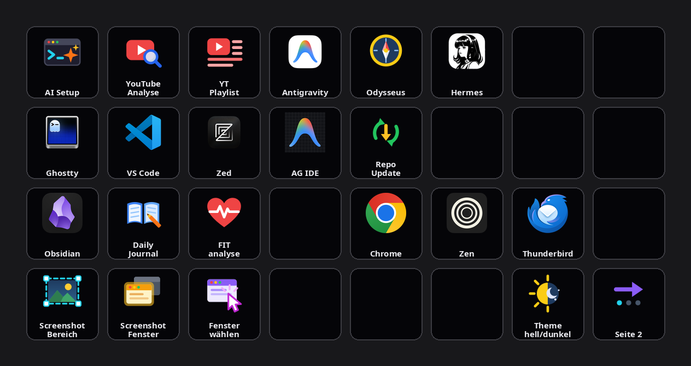

Die Recherche- und Analyse-Pipeline dieses Blogs lebt im Terminal — Skills, Subagenten, Cron-Routinen. Was ihr lange fehlte, war eine Bedienoberfläche, die keinen Kontextwechsel kostet: ein Griff, ein Druck, die Pipeline läuft. Diese Rolle spielt ein Stream Deck XL unter CachyOS. Nach einigen Monaten organischen Wachstums war aus dem Deck allerdings eine Knopf-Sammlung geworden — Zeit für einen Umbau: kontextbezogenes Layout, eigene Icons, und ein paar Lektionen darüber, was ein Button-Verschieben alles mitzieht.

<!--more-->


Ein Stream Deck XL (32 Tasten) unter streamdeck-linux-gui wird zur physischen Oberfläche der Claude-Code-Pipeline. Buttons fallen in zwei Klassen: einfache App-Starter und KI-Wrapper mit Sofort-Feedback, Live-Icon und Pflicht-Protokoll. Der Umbau ordnet alle Tasten nach Nutzungskontext (KI-Läufe, Entwicklung, Wissen + Web, Screenshots + System), ersetzt Themen-Navigation durch Pagination und gibt jedem Aktions-Button ein selbst gebautes Flat-SVG — vom Agenten gerendert, visuell geprüft und nachgebessert. Die eigentliche Lektion: Ein Button ist nie nur ein JSON-Eintrag; wer ihn verschiebt, muss die Helfer-Skripte mitziehen, die seine Position kennen.


## Ausgangslage: zwei Klassen von Buttons

Das Deck läuft unter [streamdeck-linux-gui](https://github.com/streamdeck-linux-gui/streamdeck-linux-gui); die gesamte Konfiguration liegt in einer JSON-Datei (`~/.streamdeck_ui.json`), die sich per Skript editieren und über einen Unix-Socket sogar live verändern lässt. Von Anfang an galt eine Trennung in zwei Button-Klassen.

**Einfache Buttons** starten eine App oder schicken einen Hotkey. Das Feedback ist das sich öffnende Fenster — mehr braucht es nicht, der Befehl steht direkt in der JSON.

**KI-Buttons** stoßen längere Läufe an, etwa die [zwölfstufige YouTube-Analyse](/blog/youtube-skill-evolution/) oder eine FIT-Trainingsauswertung per `claude -p`. Hier ist ein Wrapper-Skript Pflicht, denn ohne sichtbare Reaktion drückt man den Button zweimal — und startet den teuren Lauf doppelt. Jeder Wrapper folgt demselben Muster: sofortige Benachrichtigung beim Druck, ein roter Punkt als Live-Icon-Overlay solange der Lauf arbeitet, ein `trap`-Reset, damit das Icon auch bei einem Crash zurückkommt, und ein Protokoll-Eintrag im Obsidian-Journal. Für die lange YouTube-Pipeline ersetzt ein Qt-Statusfenster mit Fortschrittsring die flüchtigen Notifications.

## Der Anlass: eine Tastatur ohne Print-Taste

Auslöser des Umbaus war banal: Die Tastatur hat keine Print-Taste, Screenshots unter KDE laufen über Spectacle. Also bekam das Deck drei Screenshot-Buttons — und weil Spectacle eine saubere CLI hat, sind es einfache Buttons ohne Wrapper:

```bash
spectacle -r        # Rechteckauswahl aufziehen
spectacle -a        # aktives Fenster, sofort
spectacle -u -w     # wartet auf Mausklick, nimmt das angeklickte Fenster
```

Die dritte Variante ist die interessanteste: `-u -w` kombiniert „Fenster unter dem Mauszeiger" mit „Aufnahme bei Klick" — man drückt die Deck-Taste, klickt das gewünschte Fenster an, fertig. Da der Tastendruck am Deck den Fokus nicht verändert, fotografiert `-a` dagegen genau das Fenster, in dem man gerade arbeitet.

## Icons: rendern, ansehen, nachbessern

Aus den drei Screenshot-Buttons wurde ein Icon-System. Die Regel, auf die der Umbau sich festlegte: **Apps behalten ihre Original-Logos** (Wiedererkennung schlägt Einheitlichkeit), **Aktions-Buttons bekommen selbst gebaute Flat-SVGs** — kräftige Farben, einfache Formen, 96 × 96, farbcodiert nach Funktion.

Zwölf dieser SVGs entstanden am selben Tag in zwei Durchgängen — erst die drei Screenshot-Icons, abends der Rest —, und der Workflow dahinter ist der eigentlich erzählenswerte Teil: Der Agent schreibt das SVG, rendert es mit CairoSVG — derselben Bibliothek, die auch streamdeck-linux-gui zum Anzeigen benutzt — auf schwarzem Hintergrund in ein Vorschaubild und *sieht sich das Ergebnis an*. Beim orangefarbenen Fenster-Icon fiel so auf, dass ein halbtransparenter Glow-Rand auf Schwarz bräunlich-matschig wirkt; eine Korrektur später war er goldgelb. Visuelle Selbstkontrolle statt Blindflug — dieselbe Verifikations-Schleife, die sich schon in der [Pipeline-Härtung](/blog/pipeline-haerten-tooling/) bewährt hat, nur eben für Pixel statt für Token.

## Das Kontext-Layout

Der Kern des Umbaus war die Anordnung. Vorher: historisch gewachsen, neue Buttons landeten auf dem nächsten freien Platz. Nachher: vier Reihen, vier Nutzungskontexte.



- **Reihe 1 — KI:** die Claude-Läufe (AI Setup, YouTube-Analyse, YT-Playlist) neben den KI-Apps (Antigravity, Odysseus-Stack, Hermes).
- **Reihe 2 — Entwicklung:** Terminal und Editoren (Ghostty, VS Code, Zed, Antigravity IDE) plus Repo-Update für alle Projekte.
- **Reihe 3 — Wissen + Web:** der Obsidian-Kontext als Block (Vault, Daily Journal, FIT-Analyse), daneben Browser und Mail.
- **Reihe 4 — Screenshots + System:** die drei Spectacle-Modi, Theme-Umschalter, Pagination.

Neben den Reihen zählen die Spalten: AI Setup liegt über Ghostty (beides Terminal-Arbeit), Antigravity über der Antigravity IDE. Wer den Zeigefinger auf einer Taste hat, findet Verwandtes direkt daneben oder darunter — das ist die ganze Idee. Nicht Werkzeug-Kategorie, sondern Arbeits-Kontext.

Zwei Dinge flogen raus: ein Open-WebUI-Toggle, dessen Docker-Container längst abgebaut war, und der Firefox-Button zugunsten der tatsächlich genutzten Browser. Und die zweite Seite (Lichtsteuerung über Philips Hue) ist nicht mehr über einen Themen-Button „Licht" erreichbar, sondern über generische Pagination unten rechts — auf beiden Seiten dieselbe Position, derselbe Pfeil. Der Seitenwechsel-Button behält dabei einen Nebeneffekt des alten Licht-Buttons: Er frischt beim Wechsel die Status-Icons der Lampen auf, damit die Seite nie veralteten Zustand zeigt.

## Ein Button ist nie nur ein JSON-Eintrag

Die unbequeme Wahrheit des Umbaus: Sechs der verschobenen Buttons sind KI-Wrapper, und deren Infrastruktur kennt Positionen. Das Skript, das den roten Running-Punkt setzt, adressiert Tasten über Page- und Button-Nummer — wer den YouTube-Button von Position 16 auf Position 1 verschiebt, ohne dieses Mapping nachzuziehen, bekommt den Laufindikator fortan auf einer leeren Taste angezeigt. Dasselbe gilt für die Icon-Rückstellung nach dem Lauf: Sie muss auf die *neuen* SVGs zeigen, sonst stellt der erste abgeschlossene Lauf klammheimlich das alte Icon wieder her.

Ein Review-Durchgang in frischem Kontext — ein Subagent, der die Arbeit ohne den Gesprächsverlauf sieht, wie ein Fremder — fand anschließend genau die Sorte Rest, die man selbst übersieht: Das entfernte Open-WebUI hinterließ tote Verweise in drei Helfer-Skripten, darunter ein Wrapper, der einen inzwischen gelöschten Icon-Branch aufrief. Nichts davon war akut kaputt, weil kein Button die Pfade mehr auslöste — aber genau solche Leichen sind es, die sechs Monate später bei der nächsten Änderung als Phantom-Fehler zurückkommen. Aufgeräumt wurde im Anschluss, nach kurzer Rückfrage, was vom toten Skript übrig bleiben soll (nichts).

## Was bleibt

Das Deck ist kein Gadget-Selbstzweck, sondern senkt die Aktivierungsenergie der Pipeline auf einen Tastendruck: Video-URL kopieren, Taste drücken, Notiz erscheint im Vault. Trainingsdaten auswerten — eine Taste. Der Umbau hat daran nichts verändert und trotzdem alles: Ein Layout, das dem Arbeitskontext folgt, macht aus zweiunddreißig Tasten ein Interface. Und die Regel, die hängen bleibt, ist dieselbe wie bei jeder Automatisierung: Jede Fähigkeit hat Infrastruktur, die man mitpflegen muss — beim Stream Deck sind es eben Button-Koordinaten statt Token-Budgets.
