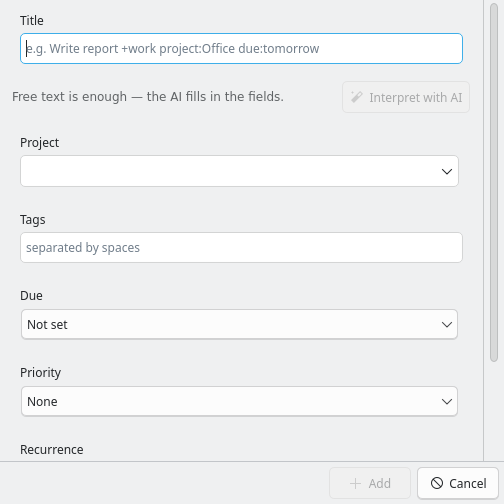

[Vergissmeinnicht](/projects/vergissmeinnicht/) ist meine macOS-Oberfläche für Taskwarrior. Das Dumme ist nur: Die meiste Zeit sitze ich gar nicht vor einem Mac, sondern vor einem Linux-Rechner mit KDE Plasma.

<!--more-->

Also gibt es die Blume jetzt zweimal. [Vergissmeinnicht KDE](https://github.com/hnsstrk/vergissmeinnicht-kde) folgt demselben Bauplan wie die macOS-App — ein Rust-Kern mit eigener TaskChampion-Replica, Sync gegen den eigenen Server, native Oberfläche obendrauf. Nur die Haut ist neu: Kirigami und QML statt SwiftUI, die Brücke schlägt cxx-qt statt UniFFI.

## Was drinsteckt

Die Sidebar bringt die üblichen Perspektiven mit — Eingang, Heute, Überfällig, Bald fällig, Wartend, Alle — plus Projekte als aufklappbaren Baum und Tags, jeweils mit Live-Zählern. Punktierte Projekte wie `Arbeit.Unterprojekt` verhalten sich dabei genau wie in Taskwarrior: Wer den Vater auswählt, sieht die Kinder mit.

Die Volltextsuche (`Strg+F`) durchsucht den kompletten Bestand und versteht Operatoren wie `project:`, `tag:` und `status:` — auf Deutsch wie auf Englisch. Freitext ist tippfehlertolerant: „pruefen" findet „prüfen", „strasse" die „Straße". Wer eine Suche öfter braucht, speichert sie in die Sidebar.

Die Schnelleingabe (`Strg+N`) nimmt Terminal-Tokens direkt im Titel entgegen — `+tag project:foo due:tomorrow priority:H` — und zeigt live an, was sie verstanden hat. Wer lieber diktiert statt kodiert, drückt `Strg+J`: Dann interpretiert eine KI den Freitext und füllt die Felder aus. Standardmäßig läuft das über ein lokales Ollama, wahlweise über OpenRouter oder einen eigenen Endpunkt. Angelegt wird erst, wenn ich bestätige. Gemessen habe ich auch das: Ein mittelgroßes Modell erledigt die Interpretation in rund zwanzig Sekunden zuverlässig; die Denker-Modelle brauchten bis zu drei Minuten und ließen das Projektfeld trotzdem halb leer.

Der Rest liest sich wie eine Taskwarrior-Wunschliste: Abhängigkeiten mit eigenen Blocked- und Blocking-Ansichten, wiederkehrende Aufgaben, Bulk-Bearbeitung über Mehrfachauswahl, Drag & Drop auf Projekte und Tags, Undo, Start/Stop. Sortiert wird nach der Dringlichkeits-Formel der `task`-CLI — derselben, auf die Ziffer genau. Vor jedem Sync entsteht automatisch ein Backup. Eine Aufräum-Aktion entsorgt alte erledigte Aufgaben — sie nennt vorher die exakte Zahl und löscht nie mehr als bestätigt.

## Friedliche Koexistenz

Die heikelste Frage bei einem Taskwarrior-Client ist nicht die Oberfläche, sondern die Nachbarschaft: Was passiert, wenn App und `task`-CLI denselben Sync-Server benutzen? Besonders wiederkehrende Aufgaben sind da empfindlich — nur einer darf die Recurrence-Engine stellen, sonst vermehren sich die Aufgaben wie Karnickel.

Deshalb schreibt die App die Recurrence-Felder der CLI nie an. Ein End-to-End-Test lässt beide gegen denselben Server laufen, bis die Stände in beide Richtungen konvergieren. Erst seit dieser Test grün ist, traue ich der Sache.

## Was noch kommt

Auf dem Plan steht als Nächstes das Diktat: Whisper soll die Schnelleingabe um Spracherfassung ergänzen, damit der Weg vom Gedanken zur Aufgabe noch kürzer wird. Auch die KI-Integration hat weitere Ausbaustufen vor sich — die Interpretation der Eingabe war nur die erste.

Entstanden ist das Ganze übrigens im Schnellverfahren: neun Releases an einem einzigen Tag, gebaut von einer autonomen Claude-Code-Session — vor gesperrtem Bildschirm. Mangels Maus und Monitor schrieb sie sich kurzerhand eigene Prüfwerkzeuge, von durchgespielten Oberflächen-Tests bis zu Screenshots ohne Compositor. Aber das ist eine eigene Geschichte.

Vergissmeinnicht KDE steht unter MIT auf GitHub, aktuell in v0.3.2; den Überblick gibt die [Projektseite](/projects/vergissmeinnicht-kde/). Damit wächst die Blume jetzt auf beiden Schreibtischen — und ich habe keine Ausrede mehr, auf irgendeinem Rechner keine Aufgabenliste zu haben.
