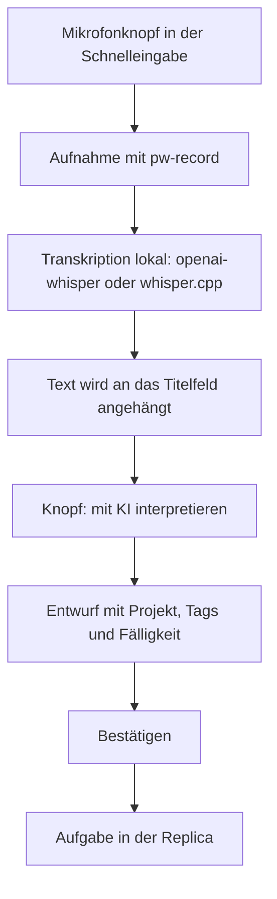

Vergissmeinnicht gibt es zweimal, einmal [für den Mac](/blog/vergissmeinnicht/) und einmal [für KDE Plasma](/blog/vergissmeinnicht-kde/). Seit der Nacht zum 3. Oktober tragen beide die Versionsnummer 0.4.0. Dahinter stecken zwei verschiedene Programmstände, und abgesprochen war das nicht.

<!--more-->

Wer hier Versionsnummern liest, braucht deshalb zuerst eine Tabelle. Es sind zwei Repositories mit zwei Zählungen, die sich nur zufällig getroffen haben.

| Fassung | Stand Anfang August | Seitdem | Was dazukam |
|---|---|---|---|
| KDE Plasma | 0.3.2 | 0.4.0 am 23.08. | Diktat, getrennte KI-Interpretation, Build-Kennung |
| macOS | 0.3.0 | 0.3.1 am 29.09., 0.4.0 am 03.10. | Absturz-Fix, Abhängigkeitsbaum, Sortierung nach Dringlichkeit |

Den Baum gibt es also nur auf dem Mac und das Diktat nur unter KDE. Die gleiche Nummer sagt über den Inhalt nichts.

## Das Diktat

Im August hatte ich versprochen, dass als Nächstes das Diktat kommt. Am 12.08. war es da: In der Schnelleingabe sitzt ein Mikrofonknopf, die Aufnahme wird lokal transkribiert, und der Text landet im Titelfeld.



Der Pfeil zwischen Titelfeld und KI war in der ersten Fassung kein Knopf. Das Transkript lief automatisch in die Interpretation. Gehalten hat das ein paar Stunden: Noch am selben Abend habe ich es mir anders gewünscht, und seitdem schreibt das Diktat nur noch ins Feld.

Aus dem Feedback dieses einen Abends wurden sechzehn Issues. Die wichtigsten Entscheidungen daraus:

| Frage | Entscheidung | Grund |
|---|---|---|
| Diktat und KI in einem Schritt? | Getrennt, die Interpretation läuft erst auf Knopfdruck | Meine Entscheidung nach dem ersten Abend mit der automatischen Fassung |
| Wo wird das Diktat eingestellt? | Eigene Kategorie „Diktat“ in den Einstellungen | Man kommt an die Spracherkennung, ohne an einem API-Schlüssel vorbeizuscrollen |
| Knopf zeigen, wenn die Kette nicht bereitsteht? | Gesperrt statt versteckt, der Grund steht im Tooltip | Das Diktat braucht kein Sprachmodell, war ohne KI-Konfiguration aber unsichtbar |
| Darf die KI Felder überschreiben? | Nur die, zu denen sie etwas sagt | Ein Modell, das zu einem Feld schweigt, hat darüber nichts entschieden |
| Welcher Stand läuft gerade? | Jeder Build nennt Commit und Datum | An einem Tag mit mehreren Installationen war die Version allein nichts wert |

Die zwei Spracherkennungen sind fest eingebaut, aber als Entweder-oder: `openai-whisper` aus dem Suchpfad oder ein selbst angegebenes `whisper-cli` mit Modelldatei. Einen Rückfall vom einen auf das andere gibt es nicht.

Vier Tage später wollte ich wissen, auf welchem Rechenwerk das eigentlich läuft. In der Projektdoku stand: auf der CPU. Das stimmt auch — nur ist es keine Eigenschaft der App. Vergissmeinnicht übergibt Whisper gar keine Gerätewahl, Whisper sucht sich selbst eine Grafikkarte, und auf meinem Linux-Rechner ist schlicht die PyTorch-Variante ohne GPU-Unterstützung installiert. Die Grafikkarte daneben hat also frei, weil ich das falsche Paket habe.

Zwei Wege würden das ändern. Umgesetzt ist keiner.

## Der Wächter

Zum selben Abend gehört die unangenehmste Stelle dieses Berichts. Ich hatte festgestellt, dass nach jeder Installation die Adresse meines Sync-Servers aus der Konfiguration verschwindet. Doch die Installation war unschuldig.

Schuld waren die Testläufe der App. Vergissmeinnicht KDE prüft seine Oberfläche mit eingebauten Testhaken, die ohne Bildschirm laufen. Drei dieser Haken leerten Einstellungen wie die Sync-Adresse und stellten sie nicht verlässlich wieder her. Die Arbeitsregeln verlangten für solche Läufe ein Wegwerf-Verzeichnis für die Daten. Von der Konfiguration stand dort nichts, also lief jeder Test gegen meine echte.

Das war der erste Verlust: Weg waren die Sync-Adresse, der Modellname und die Whisper-Pfade. Der zweite kam bei der Fehlersuche. Ausgerechnet ein Lauf, der den Fehler mit dem alten Verhalten nachstellen sollte, hat noch mehr von meiner Einrichtung gelöscht, und das war nicht wiederherstellbar.

Seitdem steht ganz vorn im Programm ein Wächter:

```rust
fn verweigere_testlauf_auf_echten_daten() {
    let testlauf = std::env::args().skip(1).any(|a| a.starts_with("--test-"));
    if !testlauf {
        return;
    }
    let Some(home) = dirs::home_dir() else {
        return;
    };
    let config_echt = dirs::config_dir().is_none_or(|d| d == home.join(".config"));
    let daten_echt = dirs::data_dir().is_none_or(|d| d == home.join(".local").join("share"));
    if config_echt || daten_echt {
        eprintln!("TESTGUARD-FAIL: --test-* verweigert …");
        std::process::exit(2);
    }
}
```

Jeder Lauf mit `--test-` bricht ab, solange nicht beide Pfade von den Standardorten wegzeigen. Die Haken stellen außerdem wieder her, was sie verändern.

Der Wächter stand am selben Abend. Gut eine Stunde später kam der dritte Verlust: Meine Konfiguration wurde erneut überschrieben.

Die Ursache dafür ist bis heute nicht geklärt. Es gibt drei Verdachtsspuren: ein Hilfsprogramm, das eine Demo-Konfiguration schreibt und kein Testlauf ist, also am Wächter vorbeigeht; die laufende App selbst; und ein parallel laufender älterer Build.

Was ich daraus mitnehme, ist wenig schmeichelhaft: Die erste Untersuchung hat bei der ersten überzeugenden Erklärung aufgehört. Die Testhaken waren schuldig, nur eben nicht allein.

Acht Tage später fiel beim Aufräumen noch auf, dass die Arbeitsregeln weiterhin nur das eine Verzeichnis verlangten. Wer sich an die Regel gehalten hätte, wäre am eigenen Wächter gescheitert.

## Aufräumen

Am 20.08. sind die Agenten-Rollen aus dem KDE-Projekt verschwunden. Fünf Definitionen waren es zuletzt — Entwickler, Prüfer, Rechercheur, Redakteur, UX-Experte —, zusammen 290 Zeilen. Was sie an Sachwissen trugen, steht jetzt in der einen Anweisungsdatei, die dadurch von 81 auf 137 Zeilen gewachsen ist. Eine Ersparnis ist das trotzdem: Jeder Aufruf eines solchen Agenten kostete 1.500 bis 2.500 Token, und das mehrfach pro Sitzung. Beim Schwesterprojekt Denkzettel hatte derselbe Rückbau neun Tage vorher angefangen, nachzulesen in [Papierkrieg](/blog/denkzettel-prozess-rueckbau/).

Am selben Tag wurde das Projekt durchgehend englisch — mit einer Ausnahme. Die Quellsprache der Oberfläche bleibt Deutsch, das Englische entsteht als Übersetzung mit 300 Zeichenketten. Beim Durchsehen fiel ein Hinweistext auf, der englischsprachigen Nutzern den Suchoperator `projekt:` empfahl. Der funktioniert sogar. Auf Englisch heißt er nur anders.

Drei Tage später kam das Plugin ponytail dazu, das einem KI-Agenten vor jeder Zeile Code die Frage stellt, ob sie überhaupt nötig ist. Gemessen kostet es rund 1.300 Token je Sitzungsstart. Wichtiger war, was beim Einbinden herauskam: Die Version stand seit dem 12.08. auf 0.4.0, im Changelog gab es dazu aber keinen Abschnitt.

Der Release-Workflow schneidet die Notizen mit `awk` aus dem Changelog. Findet `awk` nichts, schreibt es eine leere Datei und meldet Erfolg. Ein Tag `v0.4.0` hätte also eine Veröffentlichung mit leerem Text erzeugt. Dagegen kam eine Prüfung in den Workflow, und die hatte beim ersten Versuch selbst ein Loch (hier verkürzt):

```diff
- [ -s release-notes.md ] || exit 1
+ grep -q '[^[:space:]]' release-notes.md || exit 1
```

`[ -s ]` fragt nur, ob die Datei größer als null Byte ist. Ein vorhandener, aber leerer Abschnitt liefert eine Leerzeile, also ein Byte, und wäre durchgerutscht. Gefunden hat das ein zweiter Durchgang in frischem Kontext — nicht ich.

Am Abend des 23.08. ging die 0.4.0 für KDE dann wirklich hinaus. Das Paket habe ich danach heruntergeladen und ausgepackt, statt der grünen Meldung zu glauben: fünfzehn Einträge, die deutsche README dabei, Release-Notizen mit 353 Zeilen.

## Der Mac meldet sich

Auf der Mac-Seite war seit Anfang Juli nichts passiert. Dann kam macOS 27, und am 29.09. stürzte Vergissmeinnicht dreimal ab, jedes Mal beim Öffnen von „Heute“.

Die Vorschau über der Aufgabenliste hatte ihre eigene Höhe gemessen und sich danach selbst die Größe gesetzt. Jede Höhenänderung verschob die Mindestgröße der Spalte, die wiederum die Höhe änderte. Unter dem Vorgängersystem lief das ohne Absturz. Das neue AppKit zählt mit und bricht ab: nach 376 Durchläufen, erlaubt sind 374.

Der Ersatz kommt ohne Messung und ohne Zustand aus:

```swift
struct CappedHeightLayout: Layout {
    let maxHeight: CGFloat

    func sizeThatFits(proposal: ProposedViewSize, subviews: Subviews, cache: inout ()) -> CGSize {
        let height = min(proposal.height ?? maxHeight, maxHeight)
        return subviews.first?.sizeThatFits(ProposedViewSize(width: proposal.width, height: height)) ?? .zero
    }

    func placeSubviews(in bounds: CGRect, proposal: ProposedViewSize, subviews: Subviews, cache: inout ()) {
        subviews.first?.place(at: bounds.origin, proposal: ProposedViewSize(bounds.size))
    }
}
```

Das Layout bietet dem Inhalt höchstens 320 Punkt an und übernimmt, was der Inhalt davon braucht. Der erste Versuch war kürzer, ein schlichtes `.frame(maxHeight:)`. Damit stürzte nichts mehr ab, dafür dehnte sich die kompakte Monatsleiste auf volle 320 Punkt.

Die 0.3.1 war danach schnell veröffentlicht, zusammen mit einem Update der Bibliothek `rustls`. Nur auf meinem eigenen Rechner ließ sie sich nicht bauen. Der Rust-Compiler aus Homebrew, Version 1.98.1, fand im Release-Profil keine einzige Makro-Bibliothek mehr — aber nur, wenn zusätzlich `MACOSX_DEPLOYMENT_TARGET=14.0` gesetzt war. Debug ging. Release ohne die Variable ging auch. Dieselbe Version in der offiziellen Fassung baute in der CI ohne Murren.

Im Mai hatte ich über `rustup` geschrieben — aus anderem Anlass —, der Aufwand stehe nicht im Verhältnis zum Nutzen. Jetzt stand er im Verhältnis. Homebrews Rust ist deinstalliert und hat beim Gehen noch 1,6 Gigabyte LLVM mitgenommen.

## Der Baum

Die 0.4.0 für den Mac entstand in einer Nacht, in rund drei Stunden, gebaut von einem Agenten als Teamleiter mit Zuarbeitern für Entwurf, SwiftUI, die Rust-Brücke, Übersetzung und Tests.

Im Mai war noch offen, wie Unteraufgaben aussehen sollen: eine eigene Konvention oder Taskwarriors `depends`. Es ist `depends` geworden. Die Baumansicht ist reine Darstellung, geschrieben wird dabei nichts. Oben steht die Voraussetzung, eingerückt darunter alles, was auf sie wartet.

So herum war es nicht von Anfang an. Erst als ich Abhängigkeiten per Drag & Drop anlegen wollte — B auf A ziehen, dann hängt B von A ab —, wurde klar, dass der Baum andersherum stehen muss, damit Ziehen und Anzeigen dasselbe meinen.

Für die Optik gab es drei Runden. Linien wie im Terminal, `├` und `└`, flogen zuerst raus. Die zweite Fassung hatte farbige Balken am Rand jeder Gruppe, und die Balken hatten Lücken: Sie hingen am Hintergrund des Zeileninhalts, der 14 Punkt hoch ist, in einer Zeile von 24 Punkt. Jetzt hängt der Balken am Hintergrund der Zeile und läuft durch.

Dazu kam die Sortierung nach Dringlichkeit, gerechnet mit Taskwarriors Standardkoeffizienten. Wer die in seiner `.taskrc` verstellt hat, bekommt auf dem Mac trotzdem die Standardwerte. Die Sandbox lässt die App an diese Datei nicht heran.

## Was schiefging

Einiges steht schon oben. Der Rest in Kürze:

- Ein Dateirechte-Test war lokal grün und in der CI rot. Der Container läuft als root, und root lässt sich von `chmod 555` nichts verbieten.
- Der KI-Teil der Oberflächentests ist in der CI seit seiner Einführung nie gelaufen. Seit dem 12.08. prüft sie 123 Punkte je Push statt 82 und bricht ab, wenn der KI-Teil übersprungen wird.
- Beim Fernsteuern der Mac-App per Skript ging ungefragt das Detailfenster einer echten Aufgabe auf. Es wurde ohne Eingabe wieder geschlossen. Die Screenshots mit meinen echten Aufgaben sind gelöscht.
- Die Mac-App synchronisiert bei jedem Start, auch wenn „Nur manuell“ eingestellt ist. Das ist als Fehler erfasst und offen.

Der letzte Punkt hat eine Folge, die man diesem Beitrag ansieht: Er hat kein Bild vom Baum. Für einen Screenshot müsste die App mit einem Demo-Datensatz starten — und würde ihn beim Start auf meinen echten Sync-Server schieben und meine echten Aufgaben in die Demo holen. Das geht nur mit gezogenem Netzwerkstecker.

## Stand

Stand Oktober 2026 stehen beide Fassungen bei 0.4.0, die für KDE im [Repository vergissmeinnicht-kde](https://github.com/hnsstrk/vergissmeinnicht-kde), die für den Mac unter [vergissmeinnicht](https://github.com/hnsstrk/vergissmeinnicht).

Unter KDE ist die erste Stufe der KI-Integration fertig, also Freitext oder Diktat zu einem Aufgaben-Entwurf. Triage, Tagesplaner und Chat stehen noch aus, ebenso die Hilfe, die erklären soll, was dabei den Rechner verlässt. Auf dem Mac fehlt der Screenshot und die Entscheidung über den Sync beim Start.

Und das Ticket zum dritten Verlust vom 12.08. ist weiter offen. Es hat seit jenem Abend keinen einzigen Kommentar bekommen. Alles noch einmal einzutragen, bevor die Ursache feststeht, wäre mutig …
