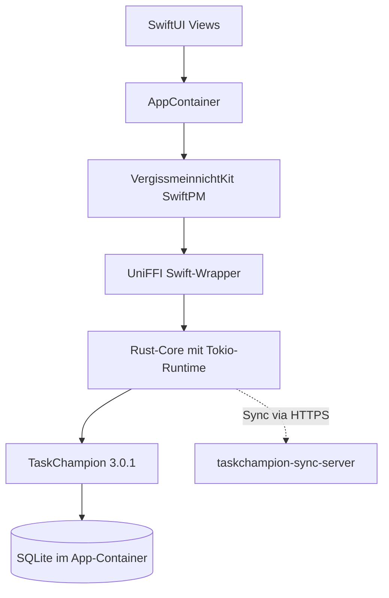

**Vergissmeinnicht** ist eine native macOS-App für Taskwarrior 3.x. Sie verzichtet auf den klassischen Weg, die `task`-CLI per Subprocess aufzurufen, und bindet stattdessen die Rust-Bibliothek **TaskChampion** direkt in den App-Prozess ein. Die Brücke zwischen Rust und SwiftUI baut UniFFI, die Datenhaltung liegt im sandbox-eigenen App-Container, der Sync läuft gegen einen selbst gehosteten TaskChampion-Server.

<!--more-->


Vergissmeinnicht ist eine sandbox-konforme macOS-App für Taskwarrior 3.x. Das Frontend ist SwiftUI, der Core in Rust mit TaskChampion 3.0.1, die FFI-Schicht generiert UniFFI 0.29. Der Artikel beschreibt die Architektur, die zentralen Entscheidungen, die Konsequenzen der Sandbox und die wichtigsten Bug-Klassen, die im Lauf der Entwicklung aufgetaucht sind.


## Warum Taskwarrior

Taskwarrior ist seit langem die Konstante hinter meinem Aufgabenmanagement. Drei Eigenschaften begründen das.

**Open Source.** Das Datenmodell ist offen, die Bibliothek liegt auf GitHub, der Sync-Server ist self-hostbar. Es gibt keine Lock-in-Diskussion, keine Frage nach Datensouveränität, keinen Account bei einem kommerziellen Anbieter.

**KI-tauglicher Workflow.** Die CLI eignet sich hervorragend als Schnittstelle für KI-Assistenten. Aufgaben anlegen, filtern, modifizieren — alles lässt sich in einer einzigen Zeile ausdrücken und damit als Tool für jede LLM-basierte Pipeline einbinden. Was bei einer GUI mit ihren Klick-Pfaden umständlich wäre, ist auf der CLI eine triviale Komposition.

**Vollständiger Funktionsumfang.** Projekte, Tags, Prioritäten, Due-Dates, Wartezeiten, wiederkehrende Aufgaben, Annotations, Filterausdrücke, Hooks — das, was man von einer ernsthaften Aufgabenverwaltung erwartet, ist vorhanden. Das Datenmodell trägt einen produktiven Alltag, ohne Workarounds.

Auf einem Linux-Desktop läuft Taskwarrior bei mir ausschließlich in der CLI. Das funktioniert. Auf einem Mac ergibt sich aber eine andere Situation.

## Warum eine eigene App auf dem Mac

Drei Punkte begründen die Entscheidung, eine eigene App zu bauen statt einer der existierenden Lösungen zu folgen.

**Bestehende GUI-Projekte sind meist verwaist.** Wer im Taskwarrior-Ökosystem nach einer modernen, gepflegten Desktop-Oberfläche sucht, findet vor allem Repositories ohne Commits seit Jahren, Forks die nie zurückgemerged wurden, oder Web-Frontends, die das CLI per HTTP wrappen. Eine native macOS-App, die mit Taskwarrior 3.x funktioniert und aktiv gepflegt wird, existiert nicht.

**Bulk-Edits sind das eigentliche Argument für eine GUI.** Eine einzelne Aufgabe anzulegen oder als erledigt zu markieren, geht auf der CLI schneller als jede GUI das je könnte. Sobald aber zwanzig Aufgaben gleichzeitig ein anderes Projekt zugewiesen bekommen sollen, fünf Tasks per Drag & Drop ein gemeinsames Tag erhalten, oder ein Filterergebnis mit Cmd-Klick selektiert und in einem Schritt verschoben werden soll — genau dort entfaltet eine GUI ihren spezifischen Wert. Vergissmeinnicht ist explizit darauf zugeschnitten.

**macOS-native Erwartungen einlösen.** Menubar-Quick-Capture mit Hotkey, eine Sidebar mit Perspektiven, eine Toolbar im Mail-Stil, Multi-Selection mit Kontextmenü, lokalisierte Texte, App-Sandbox für eine spätere Verteilung über den App Store. Diese Liste ist auf dem Mac kein Luxus, sondern Grundausstattung — und genau das, was die existierenden Optionen nicht bieten.

## Die zentralen Architekturentscheidungen

Vier Entscheidungen prägen den gesamten Aufbau der App.

### TaskChampion direkt einbetten, nicht die CLI aufrufen

Der naheliegende Weg wäre, die `task`-CLI per `Process()` aus Swift heraus zu starten. Im Sandbox-Kontext einer App-Store-tauglichen Anwendung scheidet das aus: Subprocess-Aufrufe sind grundsätzlich blockiert. Selbst ohne Sandbox wäre das Parsen von CLI-Ausgaben fragil — Versionen ändern sich, Quoting bricht, Locale-Probleme tauchen unerwartet auf.

Vergissmeinnicht lädt deshalb die TaskChampion-Bibliothek direkt in den eigenen Prozess. Eine `Replica<SqliteStorage>` liegt in der App und bietet alle Operationen als gewöhnliche Funktionsaufrufe: `add_task`, `mark_done`, `sync`. Keine Pipes, keine Prozesse, keine String-Parser dazwischen.

### Eigene Replica im App-Container

TaskChampion ist auf CRDT-basierten Sync ausgelegt. Mehrere Replicas synchronisieren sich gegen einen Server, der Konflikte deterministisch auflöst. Diese Eigenschaft nutzt die App konsequent: Vergissmeinnicht hält eine **eigene** Replica im sandbox-eigenen App-Container.

```text
~/Library/Containers/de.hnsstrk.vergissmeinnicht/Data/
  Library/Application Support/vergissmeinnicht/replica/
    taskchampion.sqlite3
    taskchampion.sqlite3-wal
    taskchampion.sqlite3-shm
```

Eine parallele Task-CLI auf demselben Rechner behält ihre Replica unter `~/.task/`. Beide gleichen sich über den Sync-Server ab, statt sich denselben SQLite-Lock zu teilen. Das ist nicht nur sandbox-konform — es eliminiert auch die altbekannte Frage, welcher Prozess gerade die Datenbank halten darf.


Ohne Sync-Server funktioniert die App genauso. Die Replica im App-Container ist eigenständig. Sync wird erst dann interessant, wenn ein zweites Gerät — oder eine parallele Task-CLI auf demselben Rechner — dazukommt.


### Hooks bewusst weggelassen

Taskwarrior-CLI kennt ein Hook-System: Skripte, die vor und nach bestimmten Operationen laufen — für Notifications, Validierung, Auto-Tagging. Die TaskChampion-Bibliothek liefert dieses System nicht mit, weil sie als Bibliothek keinen prozesseigenen Trigger-Punkt hat.

Vergissmeinnicht baut das Hook-System bewusst nicht nach. Ein Plugin-Mechanismus innerhalb einer Sandbox-App wäre eine eigene Disziplin gewesen — sicherheitskritisch, komplex, und in der Gesamtbilanz zweifelhaft. Stattdessen löst die App die klassischen Hook-Anwendungsfälle nativ in Swift:

| Klassischer CLI-Hook | Native Entsprechung in der App |
|---|---|
| Notification beim Anlegen einer Aufgabe | `UNUserNotificationCenter` |
| Validierung vor dem Commit | Prüfung im Add-Pfad vor `commit_operation()` |
| Auto-Tagging | App-Logik vor dem Commit |
| Sync-Trigger nach `task add` | Expliziter `sync()`-Call mit Statusanzeige |

Wer das CLI-Hook-Ökosystem braucht, ist mit der CLI besser bedient. Vergissmeinnicht zielt auf einen anderen Anwendungsfall — siehe oben.

### Recurring light statt vollständig

TaskChampion speichert wiederkehrende Aufgaben über die Attribute `recur` und `due`, generiert aber keine neuen Instanzen automatisch. Eine vollständige Recurring-Logik mit Parent-Mask-Beziehung und einer Pattern-Sprache (`Mo,Mi,Fr`, `until 2026-12-31`) wäre eine eigene kleine DSL gewesen — mit Edge-Cases um Zeitzonen, übersprungene Instanzen und Stop-Daten.

Die App implementiert stattdessen eine schlanke Variante: Wird eine wiederkehrende Aufgabe abgeschlossen, klont die App eine neue Pending-Instanz mit `due + Intervall`. Unterstützt sind `daily`, `weekly`, `monthly`, `yearly` plus `Nd`, `Nw`, `Nm`, `Ny`. Komplexere Muster wandern auf den Backlog. Für den überwiegenden Teil typischer Anwendungsfälle reicht das.

## Der Tech-Stack

| Schicht | Technologie | Version |
|---|---|---|
| UI | SwiftUI + AppKit (MenuBarExtra) | Swift 6.0 |
| Build | Xcode 16 + SwiftPM | macOS 14+ Deployment |
| FFI-Bridge | UniFFI | 0.29 |
| Core | Rust mit Tokio-Runtime | Edition 2021, MSRV 1.78 |
| Task-Modell | TaskChampion | 3.0.1 |
| Speicher | SQLite (über TaskChampion `storage-sqlite`) | bundled |
| Sync | TaskChampion-Sync-Server (self-hosted) | HTTPS |
| Secrets | macOS Keychain | `kSecAttrAccessibleWhenUnlockedThisDeviceOnly` |
| Lokalisierung | String Catalog (`Localizable.xcstrings`) | DE-Quelle, EN-Übersetzung |
| Distribution | GitHub Releases (`.app`-Zip) | arm64-only |

Der Datenfluss zwischen den Schichten ist eine gerade Linie:



### Warum UniFFI und nicht handgeschriebenes C-FFI

Eine handgeschriebene C-Brücke wäre der Standardweg gewesen: Rust exportiert `extern "C"`-Funktionen, Swift importiert sie über einen Bridging-Header. Bei einer Handvoll Calls vertretbar. Sobald die API Records, Optionals, Fehlertypen und Listen enthält, wird der Pflegeaufwand schnell unangemessen.

UniFFI erzeugt aus einer Rust-Quelldatei sowohl die C-Brücke als auch den Swift-Wrapper. Records werden zu Swift-`struct`s, `Result`-Typen zu `throws`-Methoden, `Option<T>` zu `Optional<T>`. Eine relevante Einschränkung: Generische Typen lassen sich nicht exportieren. Die App nutzt deshalb einen konkreten Typ-Alias wie `type AppReplica = Replica<SqliteStorage>`. Das ist der einzige Aspekt, der in der Praxis spürbar wird.

### Async Rust in synchronem Swift

TaskChampion 3.0.1 ist vollständig asynchron — die SQLite-Operationen laufen über `tokio::task::spawn_blocking`. UniFFI erzeugt jedoch synchrone Swift-Methoden. Der Rust-Core hält deshalb eine gecachte `tokio::runtime::Runtime` und führt jeden Aufruf über `runtime.block_on(...)` aus:

```rust
#[uniffi::export]
impl TaskStore {
    pub fn add_task(&self, description: String, project: Option<String>)
        -> Result<String, VmError>
    {
        let mut replica = self.replica.lock().unwrap();
        self.runtime.block_on(async {
            let task = replica
                .new_task(taskchampion::Status::Pending, description)
                .await?;
            if let Some(proj) = project {
                replica.set_project(task.uuid(), Some(proj)).await?;
            }
            replica.commit_operation().await?;
            Ok(task.uuid().to_string())
        })
    }
}
```

Auf Swift-Seite kapselt `Task.detached` jeden Aufruf, damit der zentrale `Mutex<Replica>` nicht den `@MainActor` blockiert. Das Pattern hat sich als robust erwiesen. Die einzige Stelle, an der besondere Vorsicht nötig war, betrifft die Reentrancy beim Sync — dazu gleich mehr.

## Was die Sandbox-Entscheidung kostet

Die Festlegung auf eine sandbox-konforme App prägt das Projekt an Stellen, die zunächst nicht sichtbar sind.

### Backup als integraler Bestandteil

Da die Replica im App-Container liegt, ist sie für externe Tools nicht direkt erreichbar. Eine versehentliche iCloud-Synchronisierung scheidet aus, ein versehentliches `rm -rf` ebenfalls — beides ein Vorteil. Es braucht aber einen Backup-Mechanismus, der innerhalb der Sandbox funktioniert.

Die App stützt sich dafür auf SQLite-internes **VACUUM INTO**. Vor jedem Sync wird ein konsistenter Snapshot der Datenbank in einen Backup-Ordner im App-Container geschrieben. Die Rotation begrenzt die Anzahl auf zehn Snapshots.

```text
Backups/
  pre-sync-2026-05-22T08-15-00Z.sqlite3
  pre-sync-2026-05-22T12-30-00Z.sqlite3
  manual-2026-05-21T22-00-00Z.sqlite3
```

Ein eigenes Settings-Pane bietet manuelle Backup- und Restore-Aktionen. Pfade und Wiederherstellungsanleitung stehen in `docs/backup-and-restore.md`. Diese Investition wäre ohne Sandbox-Zwang vermutlich unter den Tisch gefallen — sie zahlt sich aber in jeder unerwarteten Situation aus.

### Secrets gehören in den Keychain

Die Sync-Server-URL ist nicht geheim und liegt in `UserDefaults`. Client-ID und Encryption-Secret landen im macOS-Keychain mit Access-Policy `kSecAttrAccessibleWhenUnlockedThisDeviceOnly` — nicht iCloud-synchronisiert und nicht außerhalb des entsperrten Systems lesbar. macOS-Standard, aber eine bewusste Entscheidung gegen `UserDefaults` für sensible Werte.

### Entitlements bewusst klein halten

Die Sandbox-Konfiguration besteht aus zwei Zeilen:

```xml
<key>com.apple.security.app-sandbox</key>
<true/>
<key>com.apple.security.network.client</key>
<true/>
```

Kein Dateizugriff außerhalb des Containers, keine eingehenden Verbindungen, keine IPC. Wer die App im LAN gegen einen lokalen Sync-Server betreibt, bekommt auf macOS Tahoe einmalig den Privacy-Dialog für den Local-Network-Zugriff zu sehen — eine Plattform-Eigenheit, keine Eigenart der App.

## Drei Bug-Klassen, die typisch für die Konstellation sind

### Cross-Layer State-Drift

Nach einem erfolgreichen Sync waren die Remote-Änderungen zwar in der Replica angekommen — die UI hat sie aber nicht angezeigt. Erst nach einem Filterwechsel oder einem Neustart wurden die neuen Tasks sichtbar. Ursache: Der `AppContainer` hatte keinen Refresh nach erfolgreichem `sync()` ausgelöst.

Die Lösung ist ein einzeiliger Patch — `await refresh()` nach dem Sync. Die eigentliche Lektion liegt aber tiefer: Sobald zwei Schichten denselben State pflegen wollen, entstehen Desynchronisierungen, die in Code-Reviews kaum auffallen. Die Disziplin "ein State-Holder, alle anderen halten nur abgeleiteten Zustand" ist bei einer Mischung aus Swift-Concurrency und Rust-Mutex nicht verhandelbar.

### Sync-Reentrancy

Der Sync-Button war ohne Guard implementiert. Zwei schnelle Klicks oder ein paralleler Auto-Sync starteten zwei Sync-Operationen gleichzeitig — mit unvorhersehbarem Effekt auf den `Replica`-Mutex.

```diff
 func sync(url: String, clientId: String, secret: String) async {
+    guard !isSyncing else { return }
+    isSyncing = true
+    defer { isSyncing = false }
+
     do {
         try await store.sync(url: url, clientId: clientId,
                              encryptionSecret: secret)
         await refresh()
     } catch {
         lastError = userMessage(for: error)
     }
 }
```

Drei Zeilen Guard. In einer Concurrency-Architektur mit langlaufenden Operationen ein Pattern, das überall identisch aussehen sollte.

### Compiler-Inferenz an Versionsgrenzen

Lokal lief alles, in der CI auf Xcode 16.0 / Swift 6.0.0 plötzlich nicht mehr: Der Compiler hat Method-References wie `array.sorted(by: compare)` als `throws` interpretiert, weil die Methode in einem `throws`-Kontext aufgerufen wurde. Auf neueren Swift-Versionen verschwindet das Verhalten wieder. Der stabile Fix ist eine explizite Closure:

```diff
- tasks.sorted(by: sortComparator)
+ tasks.sorted(by: { a, b in sortComparator(a, b) })
```

Nicht schön, aber unabhängig von der Compiler-Version belastbar.

### Hand-gepflegte `project.pbxproj`

Die erste Release-Version hatte kein App-Icon. `Assets.xcassets` und `Localizable.xcstrings` waren im Repository, aber nicht in der `project.pbxproj` als Resources registriert. Xcode verlangt einen Eintrag pro Datei in vier verschiedenen Sektionen (`PBXBuildFile`, `PBXFileReference`, `PBXGroup`, `PBXSourcesBuildPhase`); ein Hotfix musste die fehlenden Einträge plus `CFBundleIconName` nachtragen.

Die App pflegt die `project.pbxproj` weiterhin von Hand, statt sie mit XcodeGen zu generieren — die Datei ist nicht groß genug, um den zusätzlichen Build-Step zu rechtfertigen. Wer denselben Weg geht, sollte eine kurze Checkliste für neue Resource-Dateien anlegen.

### Rust-stdlib gegen das falsche SDK

Der Rust-Build über die Homebrew-Toolchain nutzt die vorgebaute `libstd`, die SDK-Metadaten von macOS 26 trägt — die App selbst zielt aber auf macOS 14 Sonoma als Deployment-Target. Der Linker meldet das als Warnung, der Build bleibt grün. Der saubere Fix wäre eine Rustup-Toolchain mit `-Zbuild-std`; bisher steht der Aufwand nicht im Verhältnis zum Nutzen. Die Warnung ist in `docs/building.md` dokumentiert.

## Anmerkung zur Entwicklungsgeschwindigkeit

Vom ersten Code-Commit der FFI-Spike-Phase bis zur Open-Source-Release vergingen knapp zwei Wochen. Das ist deutlich kürzer, als ein vergleichbares Projekt vor einigen Jahren gebraucht hätte — und ein anschauliches Beispiel dafür, wie sich die Iterationsgeschwindigkeit verschiebt, sobald KI-Assistenten konsequent in den Entwicklungs-Workflow integriert sind. Recherche, Code-Generierung in mehreren parallelen Wellen, externe Code-Reviews vor jedem Merge — das alles war in der Form vor wenigen Jahren nicht selbstverständlich. Es macht den Unterschied zwischen "habe ich auf dem Backlog" und "läuft seit zwei Wochen im täglichen Einsatz".

## Status und Ausblick

Die App ist als Open Source unter MIT-Lizenz auf GitHub verfügbar und produktionsreif für den Eigenbedarf. Was noch fehlt:

- **App-Store-Pipeline.** Hardened Runtime, Notarization, Code-Signing mit Developer-ID. Erfordert einen aktiven Apple-Developer-Account.
- **Universal Binary.** Aktuell arm64-only; Intel-Support wird mit dem absehbaren Ende des Intel-Mac-Supports unwichtiger, ist aber technisch trivial.
- **Recurring full.** Parent-Mask-Beziehung, komplexe Patterns (`Mo,Mi,Fr`), `until`-Stopdatum.
- **Per-Task-Reminders.** Bisher gibt es nur Summary-Notifications beim Launch; eine zeitpunktgenaue Erinnerung über `UNCalendarNotificationTrigger` ist der nächste sinnvolle Schritt.
- **Globaler Quick-Entry-Hotkey mit NLP.** Erfordert Accessibility-Permissions und einen Carbon-Event-Tap — in der Sandbox-Welt nicht trivial.
- **Subtasks und Checklisten.** Offen ist die Wahl zwischen einer UDA-basierten `parent_uuid`-Konvention und TaskChampions `depends`-Beziehung.

Das Repository liegt unter [github.com/hnsstrk/vergissmeinnicht](https://github.com/hnsstrk/vergissmeinnicht). Ein eigener TaskChampion-Sync-Server ist optional — ohne ihn läuft die App rein lokal gegen die Replica im App-Container.


Die ausgelieferten Builds sind ad-hoc-signiert und nicht notarisiert. macOS markiert sie nach dem Download als Quarantäne. Der einmalige Befehl `xattr -dr com.apple.quarantine Vergissmeinnicht.app` entfernt das Attribut. Wer das nicht möchte, baut die App lokal aus den Sourcen — die Anleitung steht in `docs/building.md`.


Interessanter als jedes einzelne Backlog-Feature ist die Frage, wie weit dieses Modell trägt. TaskChampion ist nur ein Beispiel für eine wachsende Klasse von Rust-Bibliotheken, die ihre Domain-Logik explizit als Embeddable anbieten. Die Lücke zwischen Terminal-Tool und nativer App lässt sich für viele dieser Werkzeuge auf demselben Weg schließen — direkt eingebettet, ohne Subprocess-Aufruf, mit einer schlanken FFI-Brücke als einzigem Klebstoff.
