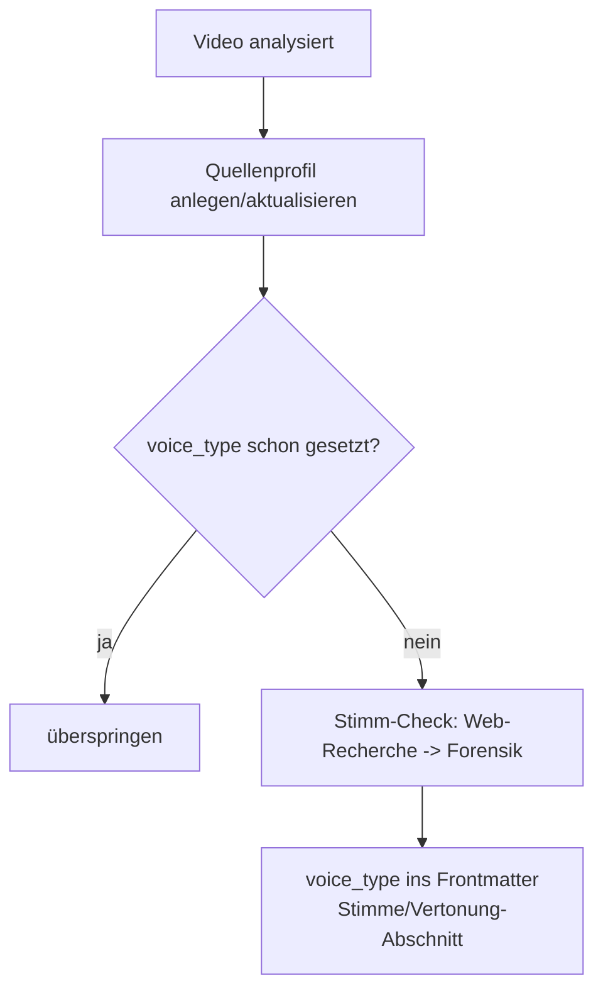

1.824 Wörter Transkript, kein einziges „um" oder „you know", ein Geräuschpegel in den Sprechpausen von −69,7 dB — sauberer, als ein Mikrofon in einem echten Raum es je liefert. Diese drei Zahlen stammen von einem kleinen AI-News-Kanal, der nachrichtenartig OpenAI-Releases kommentiert. Sie sind das akustische Fingerabdruck-Muster einer Text-to-Speech-Stimme. Die Frage, die daraus folgt: Wie viele der Kanäle in einer über Monate gewachsenen Quellensammlung werden eigentlich von einer KI vorgelesen — und woran lässt sich das belastbar festmachen?

<!--more-->


Eine bestehende YouTube-Analyse-Pipeline wurde um einen Stimm-Authentizitäts-Check erweitert. Der Check läuft zweistufig: erst Web-Recherche (existiert eine reale Person on camera?), dann akustisch-sprachliche Forensik auf einem 60-Sekunden-Ausschnitt. Vier Marker — Disfluenz-Dichte, Noise-Floor, Pausen-Regelmäßigkeit, spektraler Cutoff — ergeben ein nachvollziehbares Urteil, das als `voice_type` im Quellenprofil landet. Beweisen lässt sich eine KI-Vertonung damit nicht, aber gut begründet einschätzen.


## Warum die Stimme zählt

Der Hintergrund ist eine LLM-gepflegte Wissensdatenbank, in der jede analysierte Quelle ein Profil mit Verlässlichkeits-Bewertung bekommt — der Aufbau wurde im Beitrag [Vom Prototyp zur Pipeline](/blog/youtube-skill-evolution/) beschrieben. Bei YouTube-Kanälen ist die Frage nach der Vertonung kein kosmetisches Detail. Ein Kanal, dessen Stimme aus dem Generator kommt, ist fast immer ein Faceless-Format: kein Gesicht, kein eigener Test, keine Demo. Solche Kanäle aggregieren typischerweise Blogposts und Marketingmaterial und lesen sie mit einer generischen Stimme vor. Das senkt nicht automatisch jeden Faktenwert, aber es verschiebt die Einordnung: Ein KI-vertonter Aggregator hat keine eigene Autorität gegenüber der Primärquelle, die er zusammenfasst.

Ein naheliegender Einwand vorweg, weil er die ganze Methode prägt: Viele dieser Kanäle nennen in ihrer Beschreibung einen realen Betreiber — „Ich bin X, Software-Engineer mit acht Jahren Erfahrung", oft mit Business-Mail. Das ist eine Behauptung, kein Nachweis. Faceless-Kanäle mit TTS-Vertonung erfinden oder leihen sich regelmäßig eine Betreiber-Persona. Ein genannter Name zählt nur dann entlastend, wenn die Person nachweislich vor der Kamera spricht oder unabhängig als reale Stimme dokumentiert ist. Andernfalls entscheidet die Forensik.

## Zwei Stufen, feste Reihenfolge

Der Check ist als eigener Agent organisiert, der vor der akustischen Analyse zunächst recherchiert. Die Reihenfolge ist Absicht.

1. **Web-Recherche zuerst.** Gibt es öffentliche Diskussionen, dass dieser Kanal KI-Stimmen nutzt? Tritt die Person on camera auf? Ist es ein bekannter Creator mit dokumentierter echter Stimme? Diese Stufe klärt die einfachen Fälle billig — ein etablierter Tech-YouTuber, der seit Jahren vor der Kamera redet, braucht keine Spektralanalyse.
2. **Forensik danach.** Bleibt der Fall offen, wird ein kurzer Audioausschnitt gezogen und vermessen. Die Forensik ist der harte Beleg dort, wo die Selbstauskunft des Kanals nichts wert ist.

Getrennt davon steht ein wiederverwendbares Mess-Skript (`voice-forensics.py`, Python mit numpy), das einen Audioausschnitt und optional ein Transkript entgegennimmt und die Marker als JSON ausgibt — inklusive einer konservativen Vorklassifikation, die der Agent dann mit dem Rechercheergebnis zu einem Gesamturteil verbindet.

## Die vier Marker

Nicht jeder Marker ist gleich belastbar. Zwei tragen das Urteil, zwei liefern nur Kontext.

| Marker | Menschlich-typisch | TTS-typisch | Belastbarkeit |
|--------|--------------------|-------------|---------------|
| Disfluenz-Dichte (Füllwörter/1.000 Wörter) | ≥ 3 | < 1,5 | **stark** |
| Noise-Floor in Sprechpausen | > −55 dB | < −62 dB | **stark** |
| Pausen-Regelmäßigkeit (Variationskoeffizient) | höher, unregelmäßig | < 0,30 | schwach |
| Spektraler Cutoff | ~20 kHz | niedriger | schwach (Codec) |

Die **Disfluenz-Dichte** ist der aussagekräftigste Marker. Ein Mensch, der zehn Minuten frei spricht, produziert dutzende Füllwörter, Selbstkorrekturen und Halbsätze. Ein abgelesenes TTS-Skript hat davon praktisch keine. Gezählt werden gebundene Marker wie „um", „uh", „you know", „I mean" sowie die deutschen Pendants „ähm", „halt", „sozusagen", „quasi".

Der **Noise-Floor** misst den Geräuschpegel in den Sprechpausen. Eine echte Aufnahme trägt dort Raumton, Mikrofon-Eigenrauschen und Atemgeräusche — typisch −45 bis −55 dB. Synthetische Spuren sind dort digital still.

Die beiden schwachen Marker fließen nicht in die Punktzahl ein. Der spektrale Cutoff ist verführerisch — TTS-Modelle haben oft eine niedrigere Bandbreitengrenze — aber YouTube re-encodiert jede Spur per Opus-Codec, was den Cutoff verzerrt. Die Pausen-Regelmäßigkeit diskriminiert zwar, liegt bei TTS und Mensch aber zu dicht beieinander, um sie zu werten.

Die Scoring-Logik bleibt bewusst simpel:

```python
# Score nur aus den zwei robusten Markern; Schwellwerte an wenigen Fällen
# kalibriert — plausibel, aber nicht statistisch gesichert.
if disfluency_per_1k < 1.5:      score += 2   # sehr niedrig, Skript/TTS-typisch
elif disfluency_per_1k < 3.0:    score += 1   # niedrig
if noise_floor_db < -75:         score += 2   # praktisch digitale Stille
elif noise_floor_db < -62:       score += 1   # studio-clean

# score >= 3  -> ki-verdacht-stark
# score == 2  -> ki-verdacht
# score == 1  -> grenzfall
# score == 0  -> eher-menschlich
```

## Gegenprobe: zwei Kanäle, klare Trennung

Ein Marker-Set ist nur so gut wie seine Trennschärfe. Zur Kontrolle wurde derselbe Messlauf auf einen bekannten On-Camera-Kanal angewendet — einen großen IT-YouTuber, der seit Jahren sichtbar vor der Kamera spricht. Das Ergebnis stellt die beiden Pole nebeneinander:

| Marker | AI-News-Kanal (TTS-Verdacht) | On-Camera-Kanal (Mensch) |
|--------|------------------------------|--------------------------|
| Disfluenz-Dichte | 1,1 / 1.000 | 8,66 / 1.000 |
| Noise-Floor | −69,7 dB | −44,4 dB |
| Spektraler Cutoff | 15,6 kHz | 20,0 kHz |
| Heuristik-Urteil | ki-verdacht-stark | eher-menschlich |

Faktor acht bei den Füllwörtern, 25 dB Abstand beim Noise-Floor. Die Marker, die das Urteil tragen, trennen die Fälle deutlich — nicht knapp.

Ein zweiter Kanal lieferte den Extremfall: ein Noise-Floor von −86,3 dB. Mit einem Mikrofon in einem realen Raum ist das kaum erreichbar; das ist quasi digitale Null. Genau für solche Werte gibt es die zweite Schwellenstufe (`< −75 dB` zählt doppelt), damit ein praktisch unmöglicher Pegel stärker wiegt als ein bloß sauberer.

## Was nicht funktioniert — und die Grenzen

Die ehrlichere Hälfte. Kein Marker ist ein Beweis, und beim Aufbau tauchten mehrere Fallstricke auf.

**Auto-Subs verschlucken Füllwörter.** Der Disfluenz-Marker steht und fällt mit der Transkriptquelle. YouTube-Auto-Untertitel glätten Sprache und lassen „um" oder „uh" oft weg. Eine niedrige Dichte aus Auto-Subs ist deshalb ein Verdacht, kein Beweis — das Skript markiert dieses Caveat im Output, damit es im Urteil sichtbar bleibt.

**Ein Noise-Gate fälscht den Floor.** Wer eine echte Aufnahme stark nachbearbeitet und ein Noise-Gate setzt, drückt den Pausenpegel künstlich nach unten. Ein sauberer Floor allein beweist also nichts; erst die Kombination mit der Disfluenz-Dichte trägt.

**Das Sample kann danebenliegen.** Gemessen wird ein Ausschnitt aus der Mitte des Videos, um Intro und Outro zu meiden. Trotzdem kann er auf ein Musik- oder Sponsor-Segment fallen. Ein Indikator dafür ist eine Pausenzahl von null in 60 Sekunden — dann sind die Audio-Marker unbrauchbar und es braucht ein anderes Segment.


Bei einer Reihenuntersuchung vieler Kanäle quittiert die Untertitel-Schnittstelle von yt-dlp schnelle Abfragen mit `HTTP 429: Too Many Requests`. Ohne `--ignore-errors` reißt schon eine leere Sprachvariante den ganzen Abruf ab. Abhilfe: Originalsprache zuerst anfragen, `--sleep-requests` setzen und Fehler tolerieren.


**Die Schwellwerte sind dünn kalibriert.** Sie beruhen auf einer Handvoll Fälle. Sie trennen die getesteten Pole sauber, sind aber nicht statistisch gesichert — bei mehr Daten gehören sie nachjustiert. Das steht so auch als Kommentar im Code, direkt an den Konstanten, damit es niemand für gesichert hält.

Unterm Strich: Eine forensische 100-Prozent-Bestimmung ist nicht möglich. Was die Methode liefert, ist eine konvergierende Indizienkette. Wenn mehrere unabhängige Marker in dieselbe Richtung zeigen, ein Kanal faceless ist und die Stimme aus dutzenden ähnlicher Billig-Clips wiedererkannt wird, ist das genug für ein begründetes Urteil — nicht für einen Beweis.

## Einbau in die Pipeline

Der Check hängt an der Quellenprofil-Pflege und läuft **einmal pro Kanal**, nicht pro Video. Ein bereits geprüftes Profil wird übersprungen.



Das Urteil wird maschinenlesbar im Frontmatter des Quellenprofils abgelegt und im Fließtext begründet:

```yaml
voice_type: ki-bestaetigt   # human | ki-verdacht | ki-bestaetigt | ungeprueft
voice_checked: 2026-06-14
```

Damit ist die Vertonung filterbar — eine spätere Abfrage kann alle KI-vertonten Quellen auf einen Blick zeigen — und jede Einstufung bleibt über den Evidenz-Abschnitt nachvollziehbar.

## Einordnung

Der Mehrwert liegt weniger im einzelnen Urteil als in der Systematik: ein reproduzierbares Skript, ein Agent, der Recherche und Messung in fester Reihenfolge verbindet, und ein Datenfeld, das die Einschätzung dauerhaft festhält statt sie im Bauchgefühl zu lassen. Die Marker werden mit jedem geprüften Kanal besser kalibrierbar, und die ehrliche Benennung der Grenzen — Auto-Sub-Confounder, Noise-Gate, dünne Datenbasis — gehört zum Verfahren dazu, nicht in die Fußnote.

Offen bleibt die Frage nach dem TTS-Anbieter: Ob sich aus dem Spektrum die konkrete Stimm-Engine ableiten lässt, wäre ein nächster Schritt. Für die Quellenbewertung reicht zunächst die binäre Richtung — vorgelesen von einem Menschen oder von einer Maschine.
