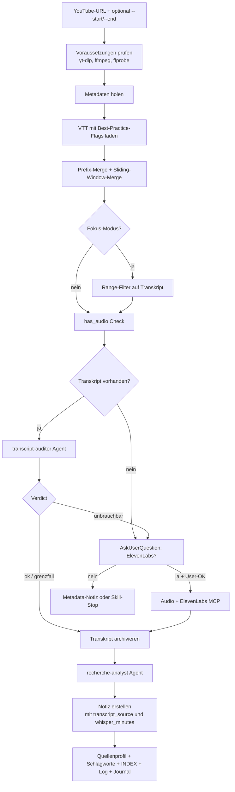
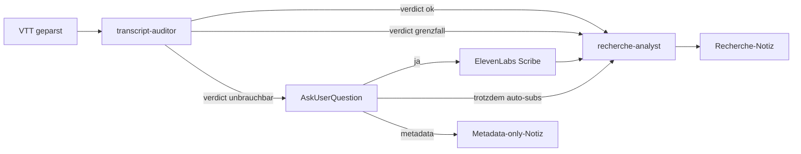

Ein 37-Minuten-Video, ein VTT-Transkript mit 19.701 Wörtern, am Ende eine Recherche-Notiz mit 7.092 Wörtern — bei identischer Inhaltsabdeckung. Der Hebel war kein neues LLM, sondern ein gehärtetes Skill-Setup, das aus dem Auto-Sub-Müll ein analysefähiges Transkript macht und parallel Quellbewertung sowie Vault-Pflege orchestriert. Dieser Artikel beschreibt, wie aus einem rudimentären YouTube-Skill eine zwölfstufige Pipeline wurde — und welche Architektur-Entscheidungen dabei aus dem Open-Source-Projekt [claude-video](https://github.com/bradautomates/claude-video) übernommen wurden.

<!--more-->

## Vorgeschichte

Die Grundidee einer LLM-gepflegten Wissensdatenbank wurde im Beitrag [Obsidian als KI-gestützte Wissensdatenbank](/blog/obsidian-llm-wiki/) ausführlich beschrieben — angelehnt an Andrej Karpathys Vorschlag, statt RAG-Pipelines lieber strukturierte Markdown-Wikis zu nutzen, die ein Sprachmodell selbst pflegt. Der dort vorgestellte YouTube-Analyse-Skill war ein erster funktionierender Prototyp: yt-dlp lädt Auto-Subs, ein simpler Parser entfernt Duplikate, ein Recherche-Agent erstellt Key Takeaways.

Das funktionierte — aber nicht gut. Drei Probleme tauchten in der Praxis auf:

1. **Token-Verschwendung durch redundante Cues.** YouTube-Auto-Subs zeigen jeden Satz mehrfach, weil das Format Rolling-Updates verwendet. Der naive Dedup-Filter erkannte nur exakte Duplikate.
2. **Englisch-zentriertes Setup.** Der Skill fragte nur englische Subs ab. Bei deutschen Videos griff er auf Auto-Subs zurück oder fand gar nichts.
3. **Keine Qualitätsbewertung.** Auch ein technisch valides VTT mit kaputten Fachbegriffen wurde verarbeitet — die Recherche-Notiz war dann inhaltlich Müll.

Im April 2026 erschien das Projekt [bradautomates/claude-video](https://github.com/bradautomates/claude-video) auf GitHub: ein Claude-Code-Skill mit dem `/watch`-Command, der Videos herunterlädt, Frames extrahiert, ein Transkript per yt-dlp oder Whisper-API erzeugt und alles an Claude übergibt. Eine Architektur, die viele der genannten Probleme bereits adressiert hatte. Der Quellcode wurde geclont und systematisch ausgewertet.

## Was bei claude-video übernommen wurde

Der Code-Audit von claude-video offenbarte 13 Best-Practice-Patterns. Die fünf wichtigsten:

| Pattern | Effekt |
|---------|--------|
| yt-dlp-Flag-Härtung (`-N 8`, mehrere Sub-Sprachen, `--ignore-errors`) | Schnellerer Download, deutsche Subs zuerst, robust gegen 429-Errors auf Sub-Varianten |
| VTT-Parser mit Prefix-Merge-Dedup | Erkennt Rolling-Duplikate, ~50 % Token-Ersparnis |
| Audio-Extraktion mp3 16 kHz mono 64 kbps | Passt in alle Whisper-API-Limits, ~480 kB/Min |
| ffprobe `has_audio`-Check | Verhindert sinnlose Whisper-Aufrufe bei stummen Screencasts |
| `parse_time()` Helper für SS, MM:SS, HH:MM:SS | Robuste Zeit-Parsing für Fokus-Modus |

Was bewusst **nicht** übernommen wurde: das komplette Python-Refactoring (das eigene Bash-Skill bleibt lesbar), die Plugin-Architektur (das Vault-Skill ist tief in den Recherche-Workflow integriert) und die Whisper-API-Standardabhängigkeit (siehe Abschnitt zur Cloud-Strategie).

Die wichtigste eigene Erweiterung: ein **Sliding-Window-Merge** im VTT-Parser. claude-video erkennt nur den Spezialfall, dass Cue B mit „A + Space" beginnt. YouTube-Auto-Subs zeigen aber häufig ein Sliding-Pattern, das anders strukturiert ist (siehe Code-Abschnitt weiter unten).

## Pipeline-Überblick

Aus den ursprünglich sieben Schritten wurden zwölf, plus ein Fokus-Modus mit Range-Filterung. Der Workflow:



Zwei Stellen sind besonders interessant: die Transcript-Auditor-Entscheidung im Schritt J und die User-OK-Schleife für ElevenLabs in K. Beide werden im Folgenden detailliert beschrieben.

## Phase 1a: yt-dlp robust machen

Die alte Version rief yt-dlp mit minimalen Flags auf:

```bash
yt-dlp --write-auto-sub --sub-lang en --skip-download \
  --sub-format vtt -o "/tmp/yt_%(id)s" "$VIDEO_URL"
```

Drei Probleme: kein paralleler Download, nur englische Subs, fixer Pfad in `/tmp` (Kollisionsrisiko bei parallelen Aufrufen).

Die gehärtete Variante:

```bash
WORK_DIR=$(mktemp -d -t yt-analyze-XXXXXX)

yt-dlp \
  -N 8 \
  --write-subs \
  --write-auto-subs \
  --sub-langs "de,de-DE,en,en-US,en-orig" \
  --sub-format vtt \
  --convert-subs vtt \
  --skip-download \
  --no-playlist \
  --ignore-errors \
  -o "$WORK_DIR/yt_%(id)s.%(ext)s" \
  "$VIDEO_URL"
```

Was sich ändert:
- `-N 8` parallelisiert den Download
- `--sub-langs` definiert eine Präferenzkette (zuerst Deutsch, dann englische Varianten)
- `--write-subs` bevorzugt manuelle Subs vor Auto-Subs
- `--ignore-errors` verhindert, dass eine 429 auf einer Sub-Variante den ganzen Lauf killt
- `mktemp -d` erzeugt ein kollisionssicheres Working-Directory

Beim Test mit einem deutschen Sicherheitspolitik-Podcast lieferte yt-dlp mit der gehärteten Konfiguration eine 353-KB-VTT-Datei manueller deutscher Subs. Die alte Version hätte die deutsche Variante komplett verpasst.

## Phase 1c: Der Sliding-Window-Merge

Bei der ersten produktiven Analyse zeigte sich, dass selbst der Prefix-Merge von claude-video nicht ausreicht. Ein typischer Auszug aus dem Roh-Transkript:

```
[00:02] Herzlich willkommen zu einer weiteren Sitzung des Sicherheitsrats. Ich freue
[00:04] Sitzung des Sicherheitsrats. Ich freue mich, dass Timon Radike wieder dabei
[00:06] mich, dass Timon Radike wieder dabei ist. Hallo Timon, ein wunderschön un
```

Der Prefix-Merge erkennt nur den Fall, dass B mit `A + " "` beginnt. Hier liegt aber ein Suffix-Overlap vor: das Ende von A (`Sitzung des Sicherheitsrats. Ich freue`) ist ein Präfix von B. Die naive Prefix-Logik mergt diese Cues nicht.

Die Lösung ist ein zusätzlicher Algorithmus, der den längsten Suffix von A findet, der gleichzeitig Präfix von B ist:

```python
def find_overlap(a_text, b_text, min_words=5):
    """Längster Suffix von a, der Präfix von b ist (in Wörtern). 0 wenn kein Treffer."""
    a_words = a_text.split()
    b_words = b_text.split()
    max_overlap = min(len(a_words), len(b_words))
    for k in range(max_overlap, min_words - 1, -1):
        if a_words[-k:] == b_words[:k]:
            return k
    return 0


# Kombinierter Merge: Identisch + Prefix + Sliding-Window
merged = []
for seg in segments:
    if not merged:
        merged.append(seg); continue
    last = merged[-1]

    # 1. Identisch
    if seg['text'] == last['text']:
        last['end'] = seg['end']
        continue

    # 2. Prefix-Merge (B startswith A + ' ')
    if seg['text'].startswith(last['text'] + ' '):
        last['text'] = seg['text']
        last['end'] = seg['end']
        continue

    # 3. Sliding-Window-Merge (Suffix von A == Präfix von B)
    overlap_words = find_overlap(last['text'], seg['text'], min_words=5)
    if overlap_words > 0:
        new_part = ' '.join(seg['text'].split()[overlap_words:])
        if new_part:
            last['text'] = last['text'] + ' ' + new_part
        last['end'] = seg['end']
        continue

    # 4. Keine Überlappung — neuer Cue
    merged.append(seg)
```

Die Schwelle `min_words=5` schützt vor False-Positives bei wiederkehrenden kurzen Phrasen wie „und dann" oder „ja genau". Bei längeren Refrains kann der Algorithmus fälschlich mergen — diesen Edge-Case erkennt der spätere transcript-auditor-Agent über seinen Wiederholungs-Anteil-Check.

### Validierungs-Zahlen

Auf das genannte Sicherheitsrat-Video angewendet:

| Stufe | Segmente | Wörter | Reduktion |
|-------|----------|--------|-----------|
| Roh | 2.236 | 19.701 | — |
| Nur Prefix-Merge | 1.118 | 13.129 | 50 % |
| **Prefix + Sliding-Window** | **177** | **7.092** | **73 %** |

Stichproben an drei Stellen (Anfang, Mitte, Ende) zeigen saubere Sprecher-Wechsel-Erkennung und keine inhaltlichen Lücken. Die zusätzliche Reduktion durch den Sliding-Window-Merge allein liegt bei 46 % — auf das bereits prefix-gemergte Transkript.

## Phase 1b: Qualitätsbewertung mit dem transcript-auditor

Selbst ein perfekt deduplizierter Transkript kann inhaltlich Müll sein, wenn die Auto-Subs Erkennungsfehler enthalten. Beispiel aus einem fiktiven Tech-Tutorial:

```
[00:00] So heute mein bist hier ich zeige Cuh-bah-net-tess
[00:08] nicht ist Doktor Compose das wir gehen durch
```

Eine Recherche-Notiz auf solcher Basis wäre wertlos. Die Lösung ist ein zusätzlicher Workflow-Agent: der **transcript-auditor**.

### Architektur des Agent-Teams



Der transcript-auditor ist ein spezialisierter Sonnet-Agent mit einer einzigen Aufgabe: das Transkript nach einer Sechs-Punkt-Heuristik bewerten und ein strukturiertes Verdict liefern. Die sechs Checks:

1. **Kohärenz** — sind die Sätze grammatikalisch sinnvoll?
2. **Thematische Erkennbarkeit** — lässt sich ein Thema ableiten?
3. **Fachbegriffe** — sind technische Begriffe korrekt geschrieben?
4. **Phonetischer Müll** — gibt es nicht-existente Wörter?
5. **Wiederholungs-Anteil** — auch nach Dedup noch viel Redundanz?
6. **Lücken-Muster** — lange Stellen ohne Cues trotz Audio?

Der Output ist strikt formatiert, damit das aufrufende Skill ihn parsen kann:

```markdown
## Transcript-Audit

**Verdict:** ok | unbrauchbar | grenzfall

**Begründung:** [1–3 Sätze, konkret]

**Beobachtete Indikatoren:**
- [Check N: Befund]

**Auszug (erste 200 Zeichen):**
"[wörtlicher Auszug aus dem Transcript-Anfang]"

**Empfehlung an den User:**
[1–2 Sätze]
```

Die Maxime im Zweifelsfall: **zugunsten der Captions entscheiden**. ElevenLabs kostet Quota, Auto-Subs sind kostenlos. Der Auditor-Agent sagt nur dann `unbrauchbar`, wenn das Transkript das Hauptthema aktiv verschleiert.

### Praxisbeispiel — Verdict ok

Beim Sicherheitsrat-Video lieferte der Auditor folgendes Verdict:

> **Verdict:** ok
>
> **Begründung:** Das Transcript ist trotz des Sliding-Window-Patterns nach dem Prefix-Merge-Dedup durchgehend grammatikalisch kohärent und thematisch glasklar (Bewertung der neuen deutschen Militärstrategie/Zeitenwende, Kritik an Umsetzungstempo, Pistorius-Wahrnehmung). Eigennamen (Carlo Masala, Timon Radike, Pistorius, Joshua Krebs, Cyber Innovation Hub) und Fachvokabular sind sauber erkannt — nur vereinzelte Mini-Glitches.
>
> **Empfehlung an den User:** Auto-Subs sind brauchbar — direkt mit der Recherche-Analyse fortfahren. Quota-Schonung; ein paar Eigennamen-Glitches ggf. beim Schreiben der Notiz manuell verifizieren.

Die Pipeline lief direkt zum recherche-analyst weiter — kein ElevenLabs-Aufruf nötig, Quota-Verbrauch null.

## Cloud-Fallback mit Disziplin: ElevenLabs Scribe

Wenn der Auditor `unbrauchbar` sagt oder gar kein VTT vorhanden ist, kommt ElevenLabs Scribe ins Spiel — aber nur mit expliziter User-Bestätigung. Der Hintergrund: Der Starter-Plan enthält **4 Stunden 30 Minuten** Speech-to-Text-Quota pro Monat, geteilt mit dem allgemeinen `speech-to-text`-Skill. Ein einziger 90-Minuten-Podcast verbraucht ein Drittel des Monats-Budgets.

Daher die Regel: **Niemals automatischer ElevenLabs-Aufruf.** Der Skill stellt eine `AskUserQuestion` mit konkreter Quota-Schätzung:

```
Auto-Subs vorhanden, aber Qualität wirkt unbrauchbar.

Beobachtungen vom transcript-auditor:
- Check 3 (Fachbegriffe): "Cuh-bah-net-tess", "Doktor Compose" statt "Kubernetes", "Docker Compose"
- Check 4 (Phonetischer Müll): ~15 % nicht-existierende Wörter

Audio via ElevenLabs Scribe für besseres Transcript transkribieren?
Geschätzter Quota-Verbrauch: ~24 Min von 4.5h/Monat (8.9 %).

Optionen:
- ja                    → ElevenLabs verwenden
- trotzdem auto-subs    → Mit den schlechten Subs fortfahren
- metadata              → Nur Metadaten-Notiz
- abbrechen             → Skill stoppt
```

Bei `ja` extrahiert der Skill Audio mit den Best-Practice-Flags von claude-video — mp3 mono 16 kHz 64 kbps, ergibt ~480 kB pro Minute:

```bash
ffmpeg -hide_banner -loglevel error -y \
  -i "$AUDIO_RAW" \
  -vn -acodec libmp3lame -ar 16000 -ac 1 -b:a 64k \
  "$WORK_DIR/yt_audio_compact.mp3"
```

Die so erzeugte Datei geht an den ElevenLabs-MCP-Skill, der das Transkript mit Timestamps zurückliefert. Das Format wird identisch zu Auto-Subs aufbereitet (`[MM:SS] Text`), sodass die nachfolgenden Schritte denselben Code nutzen können. Im Frontmatter der Recherche-Notiz wird der Quellenwechsel dokumentiert:

```yaml
transcript_source: "elevenlabs-scribe"
whisper_minutes: 24
```

Im `Recherche/log.md` taucht der Eintrag mit Backend und Verbrauch auf, sodass eine spätere Aggregation den realen Quota-Druck zeigt.

### Re-Evaluierungs-Trigger

Falls die ElevenLabs-Nutzung intensiver wird, sind alternative Lösungen vorbereitet — aber bewusst nicht installiert. Die Trigger für den Wechsel:

- Quota-Verbrauch über 80 % in zwei aufeinanderfolgenden Monaten
- Wiederholtes Overage in drei Monaten
- Privacy-Bedenken bei einzelnen Videos
- Längere Offline-Phasen

Optionen für den Wechsel: Plan-Upgrade auf Creator (~22 €/Monat, 63 h Quota — 14× mehr) oder lokale Lösung mit MLX-Whisper auf Apple Silicon. Beide Pfade sind im Projekt dokumentiert; die Voraussetzungen für MLX-Whisper auf einem M4 Pro mit 48 GB RAM wurden vorab geprüft. Die Installation ist ein Einzeiler:

```bash
uv tool install mlx-whisper
huggingface-cli download mlx-community/whisper-large-v3-mlx
```

Aber bei moderater Nutzung reicht das ElevenLabs-Quota — der Test mit dem Sicherheitsrat-Video brauchte null Minuten Cloud-Transkription.

## Phase 2: Fokus-Modus für lange Videos

Ein 90-Minuten-Talk komplett zu analysieren, wenn nur 5 Minuten relevant sind, ist Token-Verschwendung. Der Fokus-Modus akzeptiert die optionalen Flags `--start TIME` und `--end TIME` mit flexiblen Formaten:

| Eingabeformat | Bedeutung |
|---------------|-----------|
| `90` | 90 Sekunden |
| `1:30` | 1 Minute 30 Sekunden |
| `00:01:30` | 1 Minute 30 Sekunden mit Stunden-Präfix |

Der `parse_time`-Helper konvertiert alle drei Varianten in Sekunden. Anschließend werden die Cues nach dem Range gefiltert und — falls ElevenLabs gebraucht wird — auch nur der relevante Audio-Bereich heruntergeladen:

```bash
yt-dlp -x --audio-format mp3 --audio-quality 5 \
  --download-sections "*${RANGE_START}-${RANGE_END}" \
  --force-keyframes-at-cuts \
  -o "$WORK_DIR/yt_%(id)s.%(ext)s" \
  --no-playlist \
  "$VIDEO_URL"
```

Der Vorteil ist doppelt: weniger Tokens für die Analyse durch das LLM und proportional weniger ElevenLabs-Quota-Verbrauch. Aus einem 30-Minuten-Range eines 90-Minuten-Videos wird ein 33-%-Quota-Anteil statt 100 %.

In der finalen Recherche-Notiz wird der Fokus dokumentiert:

```yaml
transcript_source: "auto-subs"
whisper_minutes: 0
fokus_range: "12:30-18:00"
```

Wer die Notiz später liest, sieht sofort, dass nur ein Teil des Videos analysiert wurde.

## Token-Ökonomie konkret

Token-Optimierung bleibt abstrakt, solange keine Zahlen daneben stehen. Bei einem typischen 37-Minuten-Video in der Größenordnung des genannten Tests:

| Version | Tokens Transkript | Kosten Opus 4.7 (Input) |
|---------|-------------------|-------------------------|
| Alte Pipeline (nur Prefix-Dedup) | ~30.000 | ~0,43 € |
| Neue Pipeline (mit Sliding-Window) | ~10.000 | ~0,14 € |
| **Differenz** | **−67 %** | **−0,29 € pro Video** |

Bei einer wöchentlichen Nutzung sind das ~15 € Ersparnis pro Jahr — zugegeben kein Game-Changer, aber bei intensiverer Nutzung skaliert das. Der eigentliche Gewinn liegt nicht beim Geld, sondern beim Context-Window: 30.000 Transkript-Tokens belegen einen Großteil des Aufmerksamkeits-Budgets, das dann beim Recherche-Analysten fehlt. Saubere Transkripte ergeben präzisere Notizen.

## Was bewusst nicht implementiert wurde

Zwei Erweiterungen aus dem claude-video-Vorbild blieben außen vor:

### Visueller Modus (Frame-Extraktion)

claude-video extrahiert mit ffmpeg JPEGs aus dem Video, die Claude als Bilder im Kontext lesen kann. Das ist mächtig für Coding-Tutorials, GUI-Walkthroughs oder Diagramm-Erklärungen — aber teuer:

- 80 Frames bei 512 Pixel Breite ≈ 50–80k Image-Tokens
- 80 Frames bei 1024 Pixel Breite (lesbarer Code) ≈ 200–320k Image-Tokens
- Bei einem 30-Minuten-Talk auf Opus 4.7 sind das **bis zu 4,56 €** für einen einzigen Run

Frames sind 5–40× teurer als Audio-Transkription. Bei den meisten YouTube-Inhalten — Talking-Heads, Vorträge, Podcasts — bringen sie keinen Mehrwert. Der visuelle Modus bleibt deshalb ein dokumentiertes Konzept mit klaren Defaults (Frames opt-in, Auflösung 512 px Standard, Pre-Flight-Token-Warnung über 100k), wird aber erst aktiviert, wenn aus realer Nutzung ein konkreter Bedarf entsteht.

### Lokale Vision-Modelle

Ein interessanter Mittelweg wäre, Frames lokal über Ollama-Vision-Modelle (`qwen2.5vl:7b`, `llama3.2-vision:11b`) zu Text-Beschreibungen zu kondensieren und nur den Text an Claude zu schicken. Aus ~1.000 Image-Tokens pro Frame würden ~500 Text-Tokens — eine Halbierung ohne Frame-Anzahl-Reduktion.

Die Trade-Offs sind klar: niedrigere Vision-Qualität, längere Latenz, Modell-Setup nötig. Das Konzept liegt als „Phase 5" in der Projektübersicht, mit Hardware-Bedarfsabschätzung und Modell-Empfehlung. Aktiviert wird es nur, falls Phase 3 jemals umgesetzt wird **und** die Frame-Token-Kosten dann tatsächlich ins Gewicht fallen.

Diese Zurückhaltung ist eine bewusste Architekturentscheidung. Jeder zusätzliche Pipeline-Schritt erhöht die Wartungslast — und Wartungsaufwand für selten genutzte Features ist verlorene Zeit.

## Architektur-Vergleich auf einen Blick

| Aspekt | Alte Version | Neue Version |
|--------|--------------|--------------|
| Sub-Sprachen | Nur Englisch | DE first, fünf Varianten |
| VTT-Dedup | `seen = set()` | Prefix-Merge + Sliding-Window |
| Token-Reduktion | ~10 % | **73 %** |
| Wort-Schwellwert | < 100 → Abbruch | Kein Schwellwert (Shorts ok) |
| Audio-Spur-Check | — | ffprobe `has_audio` |
| Whisper-Fallback | Keiner | ElevenLabs MCP, nur mit User-OK |
| Quality-Bewertung | — | transcript-auditor Agent |
| Working-Dir | Feste `/tmp/`-Pfade | `mktemp -d` (kollisionssicher) |
| Error-Handling | Pipe-Failures | SystemExit mit Installations-Hilfe |
| Frontmatter | Standard | Plus `transcript_source`, `whisper_minutes`, `fokus_range` |
| Skill-Schritte | 7 | 12 + Argumente-Sektion |
| Agents | 1 | 2 (Auditor + Analyst) |

Der größte Hebel war nicht ein einzelner Schritt, sondern die Summe vieler kleiner Verbesserungen — vor allem an Stellen, die in der Erstversion gar nicht thematisiert wurden (Quality-Bewertung, Quota-Disziplin, Multi-Sprach-Support).

## Fazit

Aus einem rudimentären Skill wurde durch systematischen Code-Audit eines Open-Source-Projekts und gezielte eigene Erweiterungen eine zwölfstufige Pipeline. Drei Lehren bleiben:

**Erstens — Open Source als Lernquelle.** Der Quellcode-Audit von [bradautomates/claude-video](https://github.com/bradautomates/claude-video) hat in zwei Stunden mehr Patterns geliefert als wochenlanges eigenes Experimentieren. 13 dokumentierte Best Practices, davon 6 direkt übernommen, 4 angepasst, 3 bewusst verworfen.

**Zweitens — eigene Probleme erkennen.** Der Sliding-Window-Merge ist im claude-video-Code nicht enthalten, weil englische YouTube-Auto-Subs anders strukturiert sind. Erst die Praxis mit deutschen Videos hat das Problem aufgedeckt — und die zusätzliche 46-Prozent-Token-Ersparnis möglich gemacht.

**Drittens — Disziplin bei Erweiterungen.** Frame-Analyse und lokale Vision-Modelle wären beeindruckend zu zeigen, aber sie würden eine spürbare Wartungslast erzeugen für ein Feature, das vermutlich nie regelmäßig gebraucht wird. Architektur-Entscheidungen bedeuten auch, Dinge bewusst nicht zu bauen.

Wer den vollständigen Skill-Code sehen möchte, findet ihn im persönlichen Obsidian-Vault unter `.claude/skills/youtube-analyze/SKILL.md` — die Datei ist Teil der Vault-Synchronisation zwischen MacBook und einem Linux-Desktop und wird via Insync zwischen den Maschinen gespiegelt. Eine Veröffentlichung als eigenständiges Skill-Repository steht nicht an: Die Pipeline ist tief in den Vault-Workflow integriert (Quellenprofile, Schlagwort-Verwaltung, Recherche-Log) und außerhalb dieses Kontexts wenig nützlich. Wer einen Plug-and-Play-Skill sucht, ist mit dem Original [claude-video](https://github.com/bradautomates/claude-video) besser bedient.

## Quellen

- [bradautomates/claude-video](https://github.com/bradautomates/claude-video) — Inspiration für Architektur und Best Practices
- [Obsidian als KI-gestützte Wissensdatenbank](/blog/obsidian-llm-wiki/) — Vorgängerbeitrag mit der Erstversion des Skills
- [yt-dlp Dokumentation](https://github.com/yt-dlp/yt-dlp/blob/master/README.md) — Subtitle-Optionen, Download-Sections
- [WebVTT W3C-Spezifikation](https://www.w3.org/TR/webvtt1/) — Format-Definition
- [ElevenLabs Scribe Pricing](https://elevenlabs.io/pricing/api) — Quota- und Overage-Daten
