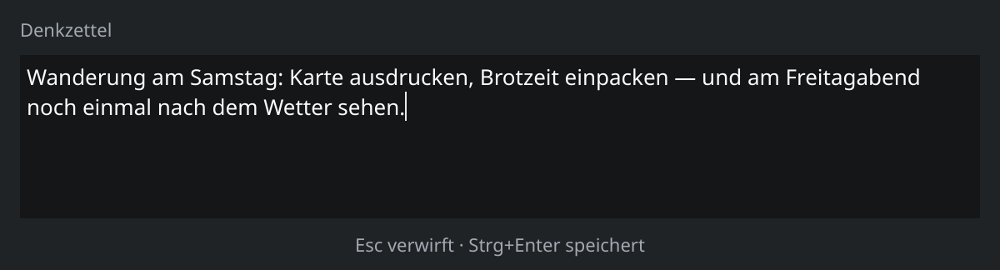

Ein Notizzettel für KDE Plasma, der aufgeht, wenn man ihn braucht, und verschwindet, wenn man fertig ist.

**KDE Plasma 6 · MIT · v0.2.0 · aktiv entwickelt**



## Worum es geht

Wer beim Arbeiten ständig kurze Gedanken hat, die woanders hingehören — eine Idee, eine offene Frage, ein Kommandozeilen-Fund —, verliert sie oft, bis eine Datei angelegt, ein Name vergeben und ein Ordner gefunden ist. Denkzettel schiebt sich dazwischen: `Meta+N` öffnet ein Erfassungsfenster, `Strg+Enter` speichert, `Esc` verwirft. Kein Dateiname, kein Speichern-Dialog, keine Frage, wohin damit. Was sich später als aufhebenswert erweist, wandert von Hand in dauerhafte Notizen.

## Was die App kann

**Erfassen mit einem Tastendruck.** Globales Kürzel öffnet ein schwebendes Textfeld ohne Fensterrahmen-Ballast; Speichern und Verwerfen sind je ein Tastendruck.

**Bibliothek nach Tagen.** Alle Notizen gruppiert wie ein Posteingang, mit Rückfrage vor dem Verwerfen ungespeicherter Änderungen beim Bearbeiten.

**Volltextsuche mit Toleranz.** SQLite FTS5 verzeiht Umlaute und akzeptiert Wortanfänge — „bucher" findet „Bücher", „grafieren" findet „fotografieren".

**Theme-Integration.** Erfassungsfenster und Symbole übernehmen Rundung, Kontur und Schatten des aktiven Plasma-Themes; ein Wechsel des Farbschemas wirkt sofort. Ohne installiertes Theme bleibt eine schlichte Fläche benutzbar.

**Hintergrunddienst.** Sitzt im Systemabschnitt der Kontrollleiste, startet mit der Sitzung, bietet eine D-Bus-Schnittstelle (`org.denkzettel.Daemon`) für Skripte.

**Alles lokal.** Eine einzelne SQLite-Datei unter `~/.local/share/denkzettel/denkzettel.db` — nichts verlässt den Rechner.


## Technik

Qt 6 Widgets und libplasma für die Oberfläche, C++ und CMake ≥ 3.20 mit ECM für den Bau, SQLite mit der FTS5-Erweiterung für Suche und Ablage. Globale Kürzel laufen über KGlobalAccel, die Fernsteuerung über die eigene D-Bus-Schnittstelle. Tests laufen mit QTest im Offscreen-Modus, ergänzt um fünf Bildläufer für die Screenshot-Regression; clang-tidy und clazy stehen in der Standardkonfiguration auf null Befunden. Eine GitHub-Actions-Pipeline in einem Arch-Container prüft jeden Push und jeden Pull Request — ohne grafische Sitzung, also ohne die Bildläufer.

## Besonderheit

Der Code entsteht nicht von Hand, sondern durch ein Team von Claude-Code-Agenten in festen Rollen — Product Owner, Entwicklung, UI/UX, Scrum Master —, während der Nutzer als Kunde des Teams Ziele, Prioritäten und Abnahme setzt. Jede Story wird vor dem Ziehen von zwei unabhängigen Bearbeitern vermessen, erst danach gilt sie als ziehbar. Sprint-Protokolle, Prüfberichte und die Arbeitsvereinbarung liegen offen im Repository unter `docs/scrum/`, die bindende Spezifikation in `SPEC.md`. Acht Sprints und 293 Commits in der ersten Woche.

## Installation

Fertige Pakete gibt es noch nicht — der Bau erfolgt aus dem Quelltext:

```
cmake -B build -S . -DCMAKE_INSTALL_PREFIX=/usr
cmake --build build
sudo cmake --install build
```

Das Präfix `/usr` ist nicht kosmetisch: Der Kürzeldienst von Plasma findet die Aktion nur, wenn die Desktop-Datei systemweit liegt. Danach `denkzetteld` starten oder einmal neu anmelden. Auf der Liste für künftige Versionen stehen Sprachnotizen mit Transkription, KI-gestützte Sortierung und Export nach Obsidian und Taskwarrior.
