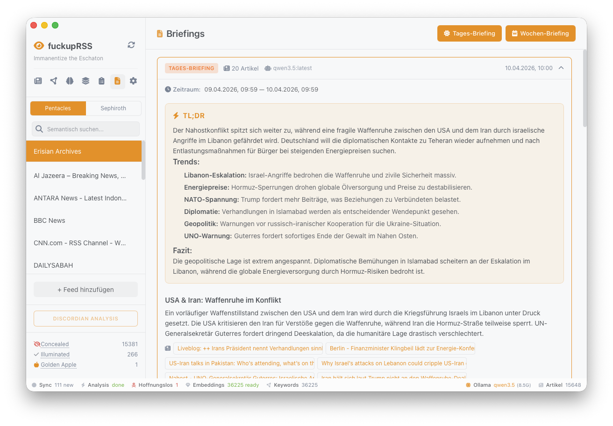
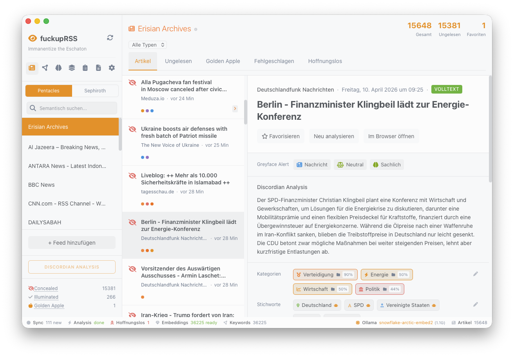
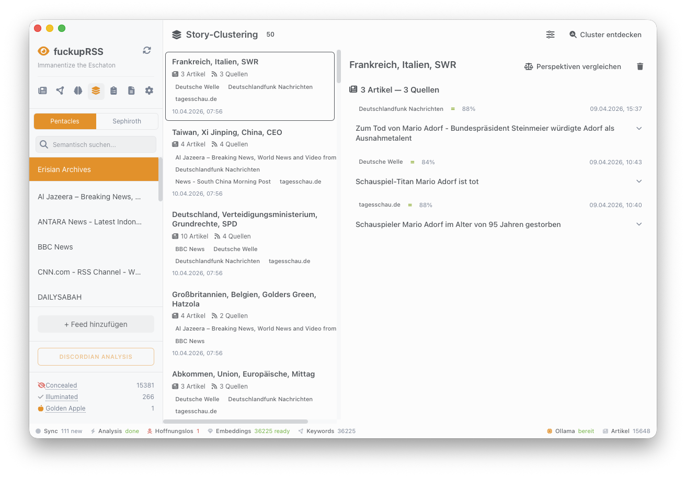
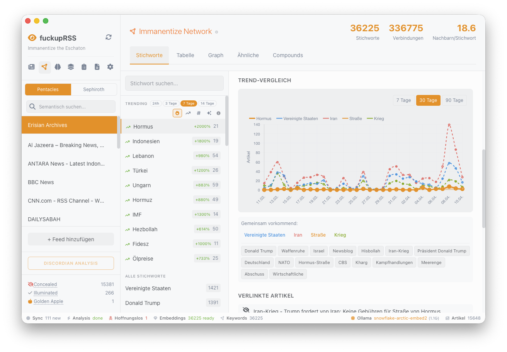

Desktop-App, die RSS-Feeds über eine mehrstufige lokale KI-Pipeline verarbeitet und täglich ein strukturiertes Briefing der relevantesten Themen erzeugt.

**Desktop · Linux, macOS · Phase 4 abgeschlossen · im täglichen Einsatz**

## Worum es geht

RSS funktioniert gut als Datenquelle — aber schlecht als Filter. Wer viele Feeds abonniert, verbringt mehr Zeit damit, Artikel wegzuklicken als zu lesen. fuckupRSS setzt eine KI-Analyse-Pipeline dazwischen: Jeder neue Artikel wird vollautomatisch extrahiert, zusammengefasst, auf politische Tendenz bewertet, vektorisiert und in Story-Cluster eingeordnet. Am Ende steht ein tägliches Briefing. Kein Cloud-Dienst, keine API-Keys, keine geteilten Daten — alles läuft lokal über Ollama.

Der Name ist eine Referenz auf den **F.U.C.K.U.P.**-Computer aus der *Illuminatus!*-Trilogie von Robert Shea und Robert Anton Wilson — ein System, das alle Verschwörungstheorien der Welt verarbeitet und verknüpft. Die Analogie zu einem Programm, das täglich hunderte Artikel aus dutzenden Quellen analysiert, lag nahe.

## Was die App kann

**Discordian Analysis.** Jeder Artikel durchläuft einen konsolidierten LLM-Call: Zusammenfassung, politische Tendenz (−2 bis +2), Sachlichkeitsscore, Keywords, Kategorie, Artikeltyp und Named Entities kommen in einem einzigen strukturierten JSON-Objekt zurück. Structured Outputs über das Ollama-JSON-Schema garantieren schema-konforme Ausgaben ohne spekulatives Parsing.

**Story Clustering.** Berichten zwölf Quellen über dasselbe Ereignis, werden alle zwölf Artikel als Cluster erkannt — per Union-Find-Algorithmus auf Basis von Kosinus-Ähnlichkeit (Schwellwert 0,78). Das ermöglicht Perspektivenvergleiche: Welche Aspekte betont welche Quelle, was lässt sie weg?

**Immanentize Network.** Keywords erhalten eigene Embeddings; das System erkennt automatisch Synonyme und verwandte Begriffe. "USA" und "Vereinigte Staaten" werden als verwandt behandelt, Trending-Themen über Zeitreihen identifiziert.

**Tages-Briefing.** Ein Hybrid-Score aus Trending-Keywords, Story-Cluster-Größe und Sachlichkeit wählt die relevantesten Artikel aus; Diversitäts-Postprocessing verhindert, dass ein Thema alle Plätze belegt. Die Briefing-Generierung kann optional ein Reasoning-Modell (DeepSeek-R1) nutzen, das Zusammenhänge zwischen Artikeln erkennt und Widersprüche herausarbeitet.

## Illuminatus!-Terminologie

Die Terminologie aus der *Illuminatus!*-Trilogie zieht sich konsequent durch Datenmodell und UI — nicht nur als Gag, sondern weil eindeutige Bezeichnungen Verwechslungen mit generischen Begriffen vermeiden.

| Begriff | Bedeutung |
|---------|-----------|
| **Fnord** | Artikel |
| **Pentacle** | Feed-Quelle |
| **Sephiroth** | Kategorie |
| **Greyface Alert** | Bias-Warnung |

## Technik

Das Backend ist in Rust geschrieben, das Frontend in Svelte 5 mit dem Runes-System. Als Desktop-Framework dient Tauri 2; Frontend und Backend kommunizieren über typsichere IPC-Commands. Die gesamte Datenhaltung liegt in einer einzigen SQLite-Datei mit `sqlite-vec`-Erweiterung für Vektorsuche — kein separater Datenbankserver. Lokale Inferenz läuft über Ollama (Ministral 3 für Textanalyse, Snowflake Arctic Embed für Embeddings); optional sind OpenAI-kompatible APIs und andere Backends anschließbar. Das Projekt umfasst über 625 automatisierte Tests und eine CI-Pipeline mit Security-Scans.

## Bezug

Das Repository liegt noch auf einer privaten Gitea-Instanz. Ein Release ist geplant.

## Hintergrund

Die Architektur — Pipeline-Stufen, Modellwahl, VRAM-Management, Union-Find — ist im Detail beschrieben: [Ein RSS-Reader mit lokaler KI-Pipeline]()
