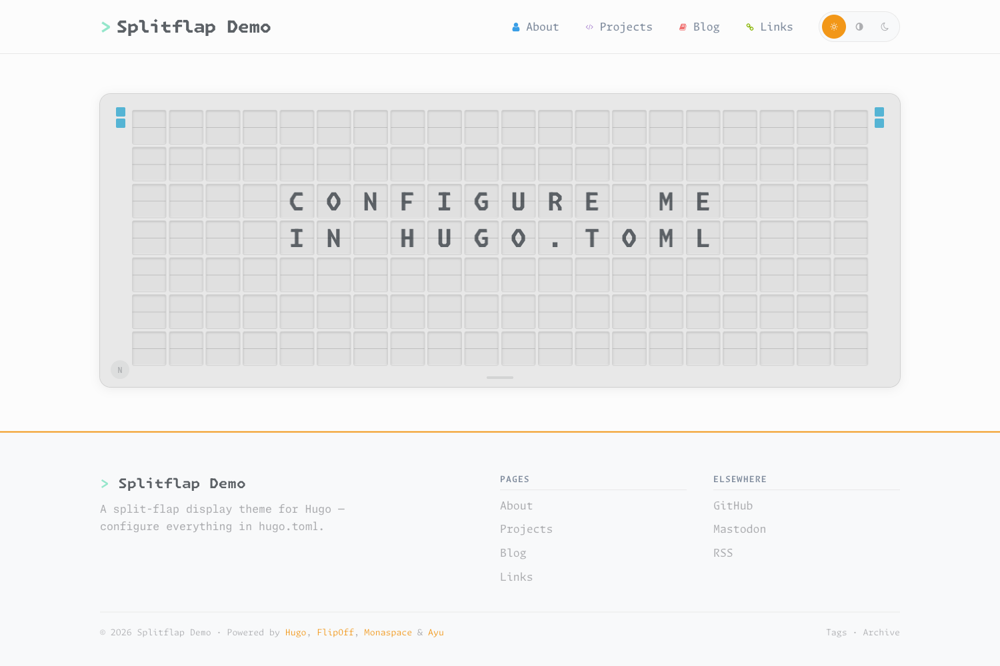

Hugo-Theme, das eine animierte Split-Flap-Anzeigetafel als Landingpage mit klassischen redaktionellen Layouts verbindet — und genau diese Website antreibt.

**Hugo-Theme · MIT · v0.4.5 · aktiv entwickelt**

## Worum es geht

Splitflap entstand aus dem Wunsch, eine persönliche Seite nicht wie ein Template von der Stange aussehen zu lassen. Das Herzstück ist ein mechanisch anmutendes Split-Flap-Display — die klappernde Fallblatt-Optik alter Bahnhofs- und Flughafentafeln — als Hero-Element der Startseite. Basis dafür war das MIT-lizenzierte Vanilla-Projekt FlipOff, das zu einem eigenständigen, vollwertigen Hugo-Theme ausgebaut wurde: Aus dem reinen Display-Effekt wurde ein komplettes System für Blog, Projekte, Links und eine Über-mich-Seite.

## Das Display

Das Board animiert Nachrichten mit einem Scramble-Effekt, rotiert durch mehrere Botschaften und reagiert auf Tastatureingaben. Die Logik ist sauber in einzelne JavaScript-Module aufgeteilt: `Board.js` verwaltet das Raster, `Tile.js` die einzelne Klappkachel, `MessageRotator.js` das Timing der Rotation und `KeyboardController.js` die Eingabe. Eine separate Instanz treibt die 404-Seite an. Der Code kommt ohne externe Abhängigkeiten aus und respektiert `prefers-reduced-motion`, schaltet die Animation also ab, wenn das System reduzierte Bewegung anfordert.

## Drei Themes

Splitflap bringt drei vollständige Farbthemen auf Basis des Ayu-Farbsystems mit: **Light**, **Mirage** und **Dark**. Der Wechsel läuft zur Laufzeit über ein `data-theme`-Attribut, wird in `localStorage` persistiert und richtet sich beim ersten Besuch nach der System-Präferenz. Sämtliche Farbwerte — UI, Syntax-Highlighting und Diagramme — stammen aus zentralen Tokens; harte Hex-Werte gibt es nicht. Alle drei Themes wurden auf WCAG-AA-Kontrast geprüft.

## Typografie und Icons

Für die Schrift kommt die Monaspace-Superfamilie zum Einsatz, lokal als Variable Fonts gebündelt und ohne CDN-Abhängigkeit. Icons werden nicht als SVG eingebunden, sondern als Nerd-Font-Glyphen — jede Monaspace-Variante hat eine eigene gepatchte Icon-Version, die per `unicode-range` automatisch geladen wird. So passen die Icons immer zur umgebenden Schrift.

## Redaktionelle Layouts

Über das Display hinaus liefert das Theme alles für einen klassischen Auftritt: einen Blog mit Archiv und Pagination, Projekt- und Links-Seiten sowie eine Über-mich-Seite. Shortcodes für Inhaltsverzeichnis, Callouts und TL;DR-Boxen ergänzen den Markdown-Workflow. Mermaid-Diagramme werden selbst gehostet und nur auf Seiten geladen, die tatsächlich ein Diagramm enthalten; beim Theme-Wechsel rendern sie live im neuen Farbschema neu.

## Technik

Splitflap setzt auf Hugo extended (ab Version 0.158.0) und unterstützt sowohl Hugo Modules als auch die Einbindung als Git-Submodule. Das JavaScript ist durchgängig in Vanilla geschrieben, das CSS modular nach Aufgabe getrennt (Layout, Board, Kacheln, Responsive, Syntax). Das Theme ist auf Härtung ausgelegt: eine CSP-freundliche Asset-Pipeline mit Subresource-Integrity-Hashes, `rel="noopener noreferrer"` auf allen externen Links, strikte Mermaid-Sicherheitsstufe und JSON-LD für strukturierte Daten. Die Oberfläche ist zweisprachig (Deutsch und Englisch) angelegt.

## Installation

Das Theme lässt sich als Hugo Module oder als Git-Submodule unter `themes/splitflap/` einbinden. Eine vollständig kommentierte `exampleSite/` zeigt Konfiguration und Beispiel-Content für alle Layouts. Konfiguriert wird über Hugo-Params — unter anderem die Board-Nachrichten, das Standard-Theme beim ersten Besuch sowie Avatar, Autor und Social-Links.
