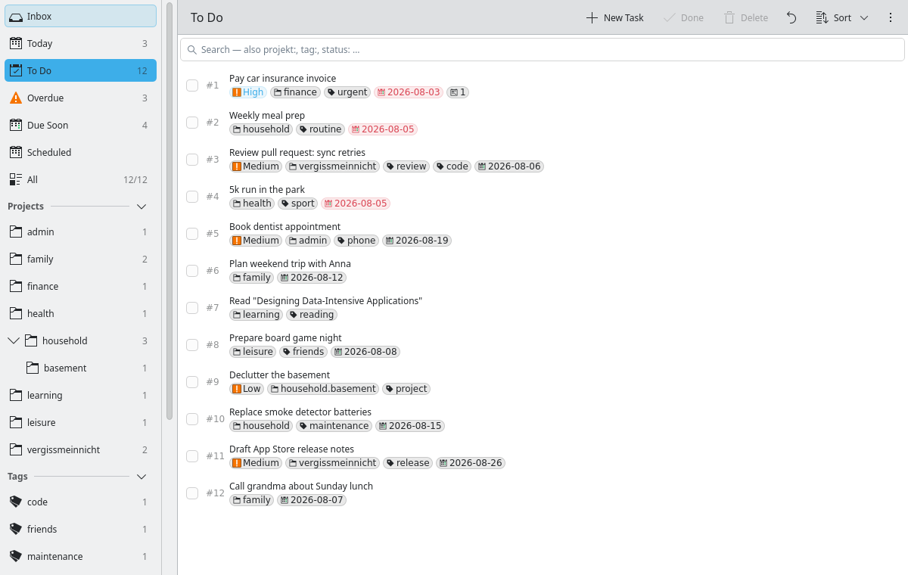

Ein nativer KDE-Plasma-Client für Taskwarrior 3.x.

**KDE Plasma 6 · MIT · v0.3.2 · aktiv entwickelt**



## Worum es geht

Der Linux-Port der [macOS-App gleichen Namens]() — derselbe Rust-Kern, dieselbe Replica-plus-Sync-Architektur, aber eine eigene, native Oberfläche für Plasma statt SwiftUI. Statt die `task`-CLI per Subprocess aufzurufen, bindet die App TaskChampion über cxx-qt direkt in den eigenen Prozess ein. Der Sync läuft optional gegen einen self-hostbaren TaskChampion-Server — App und CLI gleichen sich über denselben Server ab, ohne sich die Datenhaltung zu teilen.

## Was die App kann

**Perspektiven mit Sidebar.** Eingang, Heute, Zu erledigen, Überfällig, Bald fällig, Geplant, Wartend, Alle — dazu ein einklappbarer Projektbaum mit gepunkteter Hierarchie (`Arbeit.Unterprojekt`) und Live-Zählern je Zeile.

**Volltextsuche mit Operatoren.** `projekt:`, `tag:`, `status:`, UND-Verknüpfung, Phrasensuche und Tippfehler-Toleranz für deutsche Rechtschreibvarianten (`pruefen` findet `prüfen`, `strasse` findet `Straße`).

**QuickCapture mit optionaler KI.** Terminal-artige Token-Syntax (`+tag project:foo due:tomorrow priority:H`) mit Live-Vorschau; wahlweise interpretiert ein Sprachmodell den Freitext und füllt die Felder — lokal über Ollama, über OpenRouter oder einen OpenAI-kompatiblen Endpunkt. Angelegt wird erst nach der regulären Bestätigung.

**Abhängigkeiten und Wiederholung.** Report-Ansichten für blockierte, blockierende und freie Tasks, ein Abhängigkeits-Editor im Detaildialog, wiederkehrende Aufgaben nach CLI-Semantik — Vorlagen der `task`-CLI werden respektiert, nie dupliziert.

**Bulk-Operationen und Drag & Drop.** Mehrfachauswahl mit Kontextmenü für Erledigt, Löschen, Projekt, Tag, Priorität, Fälligkeit, Snooze.

**Automatische Backups und Aufräumen.** SQLite-Snapshot per `VACUUM INTO` vor jedem Sync, Rotation auf zehn Stände. Eine Wartungsfunktion löscht erledigte Tasks ab wählbarem Alter — mit vorherigem Backup und einem einzigen Undo-Schritt.

**Lokalisierung DE/EN.** Über ki18n und gettext, mit manuellem Sprach-Override in den Einstellungen.

## Technik

Kirigami 6 und QML für die Oberfläche, Rust für den Kern — verbunden über cxx-qt 0.9. Datenmodell und CRDT-Sync übernimmt TaskChampion 3.x; die Replica liegt unter `~/.local/share/vergissmeinnicht/replica/` und bleibt von der Datenhaltung der `task`-CLI vollständig getrennt. Sync-Credentials liegen im Secret Service (KWallet). 66 Rust-Tests, ein Flow-Test mit 22 End-zu-Ende-Prüfungen, Clippy mit `-D warnings`. Die Koexistenz mit `task` 3.4.2 auf einem gemeinsamen Sync-Server ist end-to-end verifiziert: CLI-Recurrence-Vorlagen werden respektiert, nie dupliziert.

## Installation

Release-Tarballs (dynamisch gelinkt, x86_64, auf Arch Linux gebaut) liegen auf der [Releases-Seite](https://github.com/hnsstrk/vergissmeinnicht-kde/releases) und brauchen Qt 6, Kirigami 6, Kirigami Addons, ki18n und qqc2-desktop-style zur Laufzeit. Auf allem außer einer aktuellen Rolling-Release-Distribution ist der Bau aus dem Quelltext der empfohlene Weg:

```
pacman -S --needed rust qt6-base qt6-declarative kirigami kirigami-addons \
    ki18n qqc2-desktop-style breeze-icons gettext
cargo build --release
```

Ein eigener TaskChampion-Sync-Server ist optional. Taskwarrior-Hooks sind bewusst außen vor — sie sind ein Feature der `task`-CLI, nicht der TaskChampion-Bibliothek. Äquivalente wie Erinnerungen und Validierung sind nativ umgesetzt, wie schon in der macOS-App.
