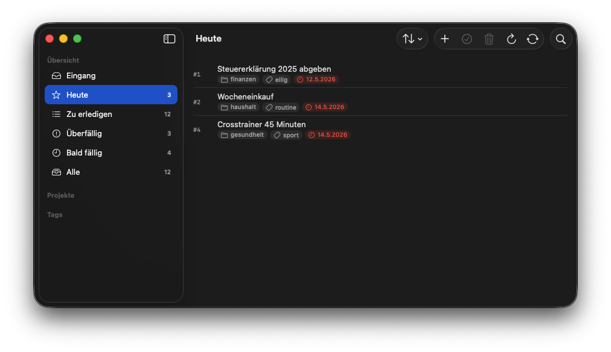

Eine native macOS-Oberfläche für Taskwarrior 3.x.

**macOS 14+ · MIT · v0.3.0 · aktiv entwickelt**

## Worum es geht

Wer Taskwarrior auf dem Mac nutzen will, hatte bisher die Wahl zwischen der CLI und einer Handvoll verwaister GUI-Projekte. Vergissmeinnicht schließt diese Lücke. Statt die `task`-CLI per Subprocess aufzurufen, bindet die App die Rust-Bibliothek TaskChampion direkt in den eigenen Prozess ein — sandbox-konform, App-Store-tauglich, ohne externe Abhängigkeiten zur Laufzeit. Der Sync läuft optional gegen einen self-hostbaren TaskChampion-Server.

## Was die App kann

**Perspektiven mit Sidebar.** Eingang, Heute, Überfällig, Bald fällig, Wartend, Alle — plus dynamische Filter für jedes Projekt und jedes Tag.

**QuickCapture.** Per `Cmd+N` oder aus der Menubar. Inline-Syntax für Tags, Projekte, Fälligkeit, Priorität: `Steuer abgeben +finanzen project:home due:friday priority:H`.

**Bulk-Operationen.** Multi-Selection mit Kontextmenü für Done, Delete, Tag, Due, Priority, Projektwechsel — der eigentliche Mehrwert gegenüber der CLI bei vielen Tasks auf einmal.

**Detailspalte im Mail-Stil.** Optionale dritte Spalte neben der Task-Liste zeigt den ausgewählten Task inline statt nur im separaten Detail-Fenster — Umschaltung über Toolbar, Menü oder ⌥⌘0, breiter als zuvor als Default. Bei Multi-Selection erlaubt sie Bulk-Editing von Projekt, Tags, Fälligkeit, Termin und Priorität nach der macOS-„Multiple Values"-Konvention.

**Drag & Drop.** Tasks auf Projekte, Tags oder den Eingang ziehen.

**Volltextsuche mit Operatoren.** `projekt:`, `tag:`, `status:`, AND-Tokenisierung, persistente Saved Searches als Sidebar-Einträge.

**Notifications, Snooze, wiederkehrende Aufgaben.** Summary für überfällige Tasks beim Launch, temporäres Ausblenden, schlanke Recurring-Logik für die häufigsten Muster.

**Lokalisierung DE/EN.** String Catalog mit manuellem Sprach-Override in den Einstellungen.

**Automatische Backups.** SQLite-Snapshot per `VACUUM INTO` vor jedem Sync, Rotation auf zehn Stände.

## Technik

SwiftUI auf Rust-Core, verbunden über UniFFI 0.29. Datenmodell und CRDT-Sync übernimmt TaskChampion 3.0.1, die Persistenz läuft über SQLite im sandbox-eigenen App-Container. Sync-Credentials liegen im macOS-Keychain. Die Sandbox-Konfiguration beschränkt sich auf zwei Entitlements (`app-sandbox`, `network.client`) — kein Subprocess-Zugriff, kein Dateizugriff außerhalb des Containers.

## Installation

Die fertigen Builds gibt es als arm64-`.app`-Zip in den [GitHub-Releases](https://github.com/hnsstrk/vergissmeinnicht/releases). Da die Binaries ad-hoc-signiert und nicht notarisiert sind, verlangt Gatekeeper nach dem Entpacken den einmaligen Befehl `xattr -dr com.apple.quarantine Vergissmeinnicht.app`. Wer das vermeiden möchte, baut die App lokal aus den Sourcen — die Anleitung steht in `docs/building.md` im Repository.

Ein eigener TaskChampion-Sync-Server ist optional. Ohne ihn läuft die App lokal gegen die Replica im App-Container.

## Hintergrund

Die ausführliche Architektur-Beschreibung, die Stolpersteine im Detail und die Bug-Klassen, die für die Kombination aus async Rust und SwiftUI typisch sind, stehen im Blog-Artikel [Vergissmeinnicht — eine native macOS-Oberfläche für Taskwarrior]().
