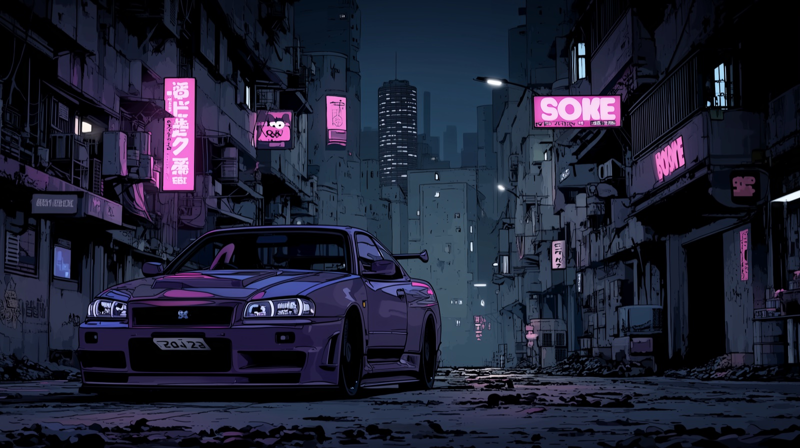
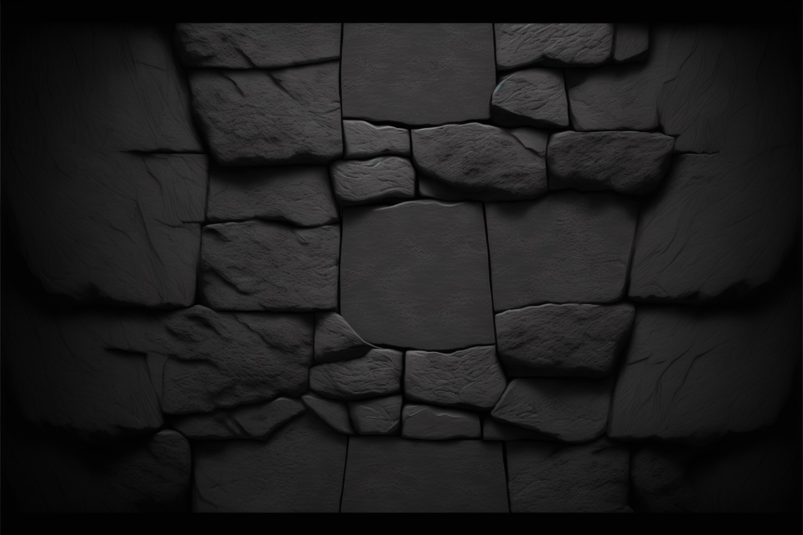
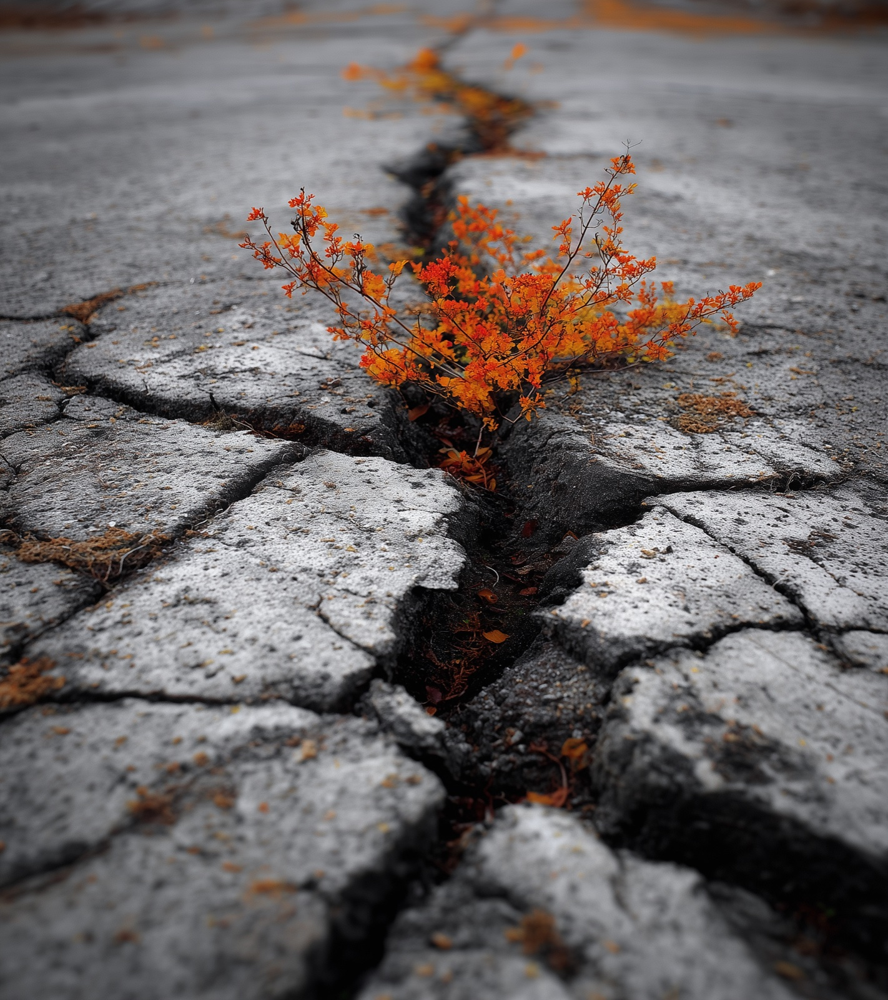
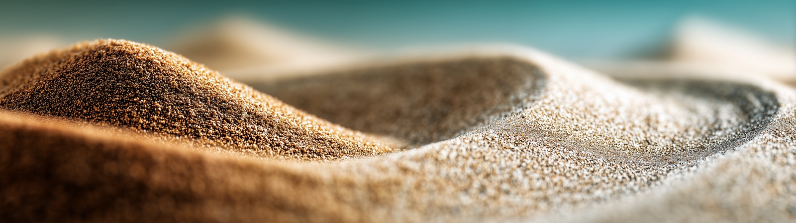

**[Midjourney](https://www.midjourney.com/@hnsstrk) · CC BY 4.0 · laufend ergänzt**

Eine Sammlung von Hintergrundbildern, generiert mit Midjourney. Die Bilder entstehen ohne konkreten Verwendungszweck — als gestalterisches Experiment mit KI-Bildgeneratoren. Die Themen reichen von minimalistischen Slate-Texturen über Naturmakros bis zu cinematischen Tokyo-Night- und Everforest-Serien. Frei verfügbar für private und kommerzielle Nutzung.

## Formate

Drei Seitenverhältnisse decken gängige Monitor-Setups ab — von Standarddisplays bis zu Ultra-Wide- und Dual-Monitor-Konfigurationen.

### 16:9 — Standardmonitore

Das verbreitetste Format. Reicht von ruhigen, monochromen Texturen bis zu kontrastreichen Szenen.

### 16:18 — Dual-Monitor übereinander

Hochformat für vertikal gestapelte Monitore — bei normaler Wandmontage zwei 16:9-Displays übereinander.

### 32:9 — Ultra-Wide oder Dual-Monitor nebeneinander

Extra-breit für 32:9-Panels oder zwei nebeneinander platzierte 16:9-Monitore.

Die Bilder sind im Repository nach Seitenverhältnis in separate Verzeichnisse sortiert (`16x9/`, `16x18/`, `32x9/`) und können direkt heruntergeladen werden. Tiefergehende Serien — etwa Everforest, Tokyo Night, Porsche oder Solarized — liegen als Unterordner innerhalb des jeweiligen Formats.

## Lizenz

CC BY 4.0 — Namensnennung erwünscht, aber nicht erzwungen.

## Download

[GitHub Repository](https://github.com/hnsstrk/wallpapers) · [Midjourney-Profil](https://www.midjourney.com/@hnsstrk)
